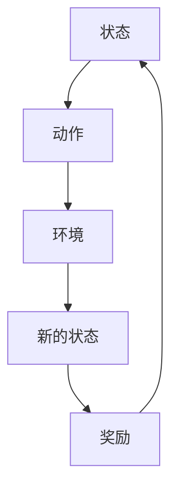
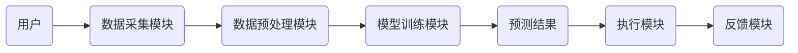

                 


# AI Agent在企业风险预测与情景模拟中的应用

> 关键词：AI Agent，企业风险管理，风险预测，情景模拟，人工智能，机器学习

> 摘要：本文探讨了AI Agent在企业风险预测与情景模拟中的应用，分析了其核心原理、系统架构，并通过实际案例展示了其在企业风险管理中的优势与挑战。文章详细介绍了AI Agent的基本概念、算法原理、系统设计以及项目实现，为读者提供了全面的视角。

---

## 第一部分: 背景介绍

### 第1章: 问题背景与核心概念

#### 1.1 问题背景
- **企业风险管理的传统挑战**：传统方法依赖人工分析，效率低、覆盖范围有限，难以应对复杂多变的市场环境。
- **AI Agent的潜力**：AI Agent能够实时分析数据、自主决策，为企业风险管理提供高效解决方案。
- **风险预测与情景模拟的结合**：通过AI Agent，企业可以预测潜在风险，并模拟不同情景下的应对策略。

#### 1.2 问题描述
- **传统风险预测的局限性**：数据依赖性强，难以处理非结构化数据，缺乏实时性。
- **情景模拟的重要性**：帮助企业提前规划，降低不确定性带来的风险。
- **AI Agent的核心作用**：通过自主学习和实时反馈，优化风险预测和情景模拟。

#### 1.3 解决方案
- **AI Agent的优势**：自动化、智能化、实时性强。
- **基于AI Agent的风险预测模型**：结合机器学习和大数据分析，提高预测准确性。
- **情景模拟的智能化路径**：通过AI Agent模拟多种场景，优化决策。

#### 1.4 边界与外延
- **应用边界**：适用于数据驱动的决策场景，不适用于完全依赖人类判断的领域。
- **相关领域的区别**：与传统数据分析、人工决策的区别。
- **核心要素**：数据源、模型算法、执行单元。

---

## 第二部分: AI Agent的核心概念与原理

### 第2章: 核心概念与原理

#### 2.1 核心概念
- **AI Agent的定义与分类**：基于规则和基于模型的AI Agent。
- **基于规则的AI Agent**：通过预设规则进行决策，适用于简单场景。
- **基于模型的AI Agent**：利用机器学习模型进行预测和决策，适用于复杂场景。

#### 2.2 核心原理
- **感知、决策、执行**：AI Agent通过感知环境、做出决策并执行动作。
- **对比分析表**：列出基于规则和基于模型的AI Agent的优缺点。

#### 2.3 实体关系图
```mermaid
er
    actor: 用户
    entity: 风险数据
    entity: 预测模型
    entity: 决策结果
    entity: 执行反馈
    relation: 用户提供风险数据
    relation: 预测模型处理数据
    relation: 决策结果反馈给用户
    relation: 执行反馈优化模型
```

---

## 第三部分: 算法原理

### 第3章: 常见算法与实现

#### 3.1 强化学习算法
- **Q-learning算法流程图**

- **Python代码示例**
```python
class AI-Agent:
    def __init__(self):
        self.q_table = {}

    def learn(self, state, action, reward):
        if state not in self.q_table:
            self.q_table[state] = {}
        if action not in self.q_table[state]:
            self.q_table[state][action] = 0
        self.q_table[state][action] += reward
```

#### 3.2 监督学习与无监督学习
- **监督学习**：用于有标签的数据训练。
- **无监督学习**：用于无标签的数据聚类。
- **数学公式**
  - 强化学习：$$ Q(s, a) = Q(s, a) + \alpha (r + \gamma \max Q(s', a')) $$
  - 监督学习：$$ y = \theta x + \beta $$

---

## 第四部分: 系统分析与架构设计

### 第4章: 系统架构与实现

#### 4.1 系统架构设计


#### 4.2 功能模块
- **数据采集模块**：从企业系统中获取相关数据。
- **数据预处理模块**：清洗和转换数据，确保模型输入。
- **模型训练模块**：训练AI Agent的预测模型。
- **预测结果模块**：输出风险预测和情景模拟结果。
- **执行模块**：根据预测结果执行相应的策略。
- **反馈模块**：收集执行结果，优化模型。

---

## 第五部分: 项目实战

### 第5章: 项目实现与案例分析

#### 5.1 项目背景
- **企业风险管理现状**：数据分散、分析效率低。
- **项目目标**：利用AI Agent优化风险预测和情景模拟。

#### 5.2 核心代码实现
```python
import numpy as np
import pandas as pd

class RiskPredictor:
    def __init__(self):
        self.model = self.build_model()

    def build_model(self):
        # 构建机器学习模型
        return model

    def train(self, data):
        # 训练模型
        self.model.fit(data)

    def predict(self, input_data):
        # 预测风险
        return self.model.predict(input_data)
```

#### 5.3 案例分析
- **实际案例**：某企业利用AI Agent预测市场波动，优化投资策略。
- **效果对比**：AI Agent预测准确率显著提高，减少损失。

---

## 第六部分: 最佳实践与小结

### 第6章: 最佳实践

#### 6.1 小结
- AI Agent在企业风险管理中的优势明显，但需要结合具体场景选择合适的技术。

#### 6.2 注意事项
- 数据质量至关重要，需确保数据的完整性和准确性。
- 模型的可解释性需要重视，便于后续优化和调整。

#### 6.3 拓展阅读
- 推荐学习强化学习和机器学习的相关书籍，深入理解AI Agent的原理。

---

## 作者信息

作者：AI天才研究院/AI Genius Institute & 禅与计算机程序设计艺术 /Zen And The Art of Computer Programming

---

这篇文章系统地介绍了AI Agent在企业风险预测与情景模拟中的应用，从理论到实践，为读者提供了全面的视角。通过详细的分析和实例，展示了AI Agent如何帮助企业优化风险管理流程，降低潜在风险，提升决策效率。

