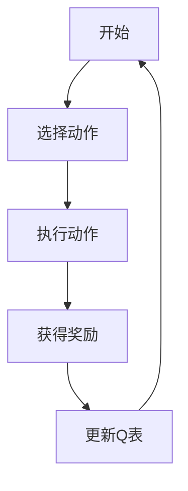
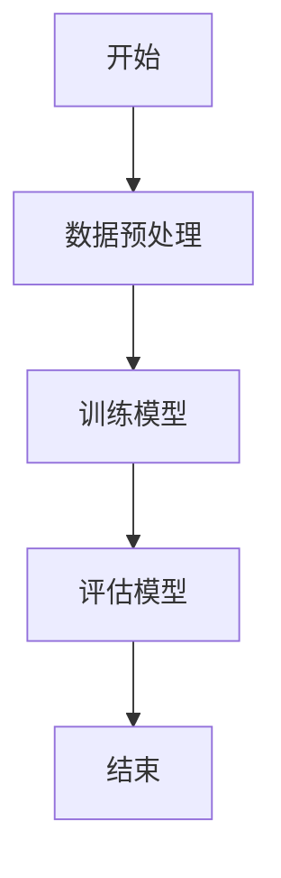
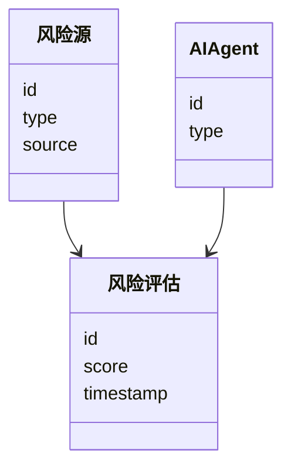
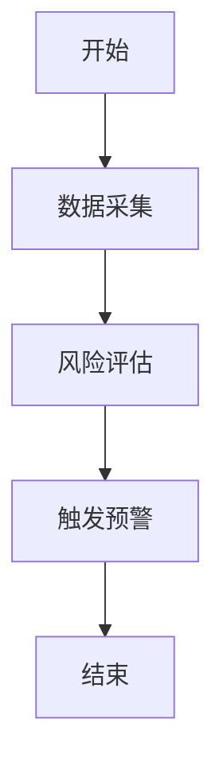
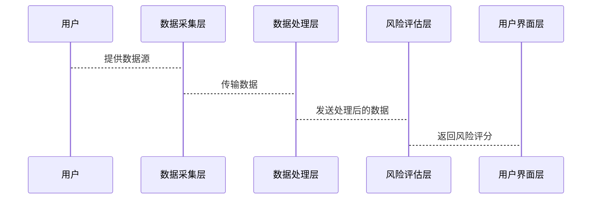

                 


# AI Agent在企业风险预警与危机管理中的应用

## 关键词：AI Agent, 企业风险预警, 危机管理, 机器学习, 风险管理

## 摘要：  
本文深入探讨了AI Agent在企业风险预警与危机管理中的应用，从背景介绍到系统架构设计，结合实际案例分析，全面解析了AI Agent如何助力企业实现智能化风险防控。文章首先阐述了AI Agent的基本概念和企业风险预警的现状，接着详细分析了AI Agent的核心原理和算法模型，最后通过系统架构设计和项目实战，展示了AI Agent在实际场景中的具体应用。本文旨在为企业提供一种创新的风险管理解决方案，助力企业在复杂多变的商业环境中保持竞争优势。

---

# 第一部分: AI Agent与企业风险预警的背景

## 第1章: AI Agent与企业风险预警的背景

### 1.1 AI Agent的基本概念

#### 1.1.1 AI Agent的定义与特点
AI Agent（人工智能代理）是指能够感知环境、做出决策并执行动作的智能实体。其特点包括：
- **自主性**：能够在没有外部干预的情况下自主运行。
- **反应性**：能够实时感知环境变化并做出响应。
- **目标导向性**：通过预设的目标或任务驱动行为。
- **学习能力**：能够通过数据学习和优化决策模型。

#### 1.1.2 AI Agent的核心原理
AI Agent的核心原理可以概括为“感知-决策-执行”三步曲：
1. **感知**：通过传感器或数据源获取环境信息。
2. **决策**：基于感知信息，利用算法生成决策方案。
3. **执行**：根据决策结果执行动作或触发预警。

#### 1.1.3 AI Agent与传统IT系统的区别
| 属性         | 传统IT系统          | AI Agent               |
|--------------|--------------------|------------------------|
| 数据处理     | 周期性处理           | 实时处理               |
| 决策方式     | 依赖规则           | 依赖算法               |
| 可扩展性     | 固定功能模块        | 强大的自适应能力       |

### 1.2 企业风险预警与危机管理的现状

#### 1.2.1 传统企业风险预警的挑战
传统的企业风险预警系统主要依赖人工分析和静态规则，存在以下问题：
- **滞后性**：无法实时感知风险变化。
- **片面性**：仅依赖单一数据源，缺乏多维度分析。
- **维护成本高**：规则更新和维护复杂。

#### 1.2.2 危机管理中的痛点
企业在危机管理中常常面临以下挑战：
- **信息孤岛**：各部门间数据不通，难以形成统一的决策依据。
- **响应不及时**：危机发生后，往往错过最佳应对时机。
- **决策依据不足**：缺乏数据支持的科学决策。

#### 1.2.3 AI Agent在企业风险预警中的优势
AI Agent通过智能化手段，能够有效解决上述问题：
- **实时监控**：通过多数据源实时感知风险。
- **智能决策**：利用机器学习算法快速生成应对方案。
- **自适应优化**：根据历史数据不断优化预警模型。

### 1.3 AI Agent在企业风险预警中的应用前景

#### 1.3.1 应用场景分析
AI Agent在企业风险预警中的典型应用场景包括：
1. **财务风险预警**：通过分析财务数据预测潜在的财务危机。
2. **市场风险预警**：基于市场数据预测市场波动对企业的影响。
3. **供应链风险预警**：实时监控供应链中的潜在风险。

#### 1.3.2 企业采用AI Agent的风险与收益
- **风险**：技术复杂性高，初期投入大。
- **收益**：显著提升风险预警的准确性和及时性，降低潜在损失。

#### 1.3.3 未来发展趋势
随着AI技术的不断进步，AI Agent在企业风险预警中的应用将更加广泛和深入，未来可能出现：
- **更智能的决策模型**：结合强化学习和深度学习的混合模型。
- **更强大的数据处理能力**：通过边缘计算和大数据技术提升实时性。

---

# 第二部分: AI Agent的核心概念与原理

## 第2章: AI Agent的核心概念

### 2.1 AI Agent的感知能力

#### 2.1.1 数据采集与处理
AI Agent的感知能力主要通过数据采集与处理实现。数据来源包括：
- **内部数据**：企业内部的财务、销售、库存等数据。
- **外部数据**：市场数据、行业趋势、新闻舆情等。

数据处理过程包括：
1. **数据清洗**：去除无效数据，填补缺失值。
2. **数据转换**：将数据转换为适合算法处理的形式。

#### 2.1.2 信息融合与分析
信息融合是将多源数据进行整合的过程，常见的融合方法包括：
- **加权融合**：根据数据源的可靠性赋予不同的权重。
- **规则融合**：基于预设规则进行数据融合。

#### 2.1.3 实时监控机制
实时监控机制通过设置阈值和触发条件，及时发现潜在风险。例如：
- **阈值触发**：当某项指标超过预设阈值时，触发预警。
- **模式识别**：通过机器学习识别异常模式。

### 2.2 AI Agent的决策能力

#### 2.2.1 风险评估模型
风险评估模型是AI Agent决策的核心。常见的模型包括：
- **线性回归模型**：用于预测风险的量化指标。
- **决策树模型**：用于分类和预测风险类型。

#### 2.2.2 决策算法与策略
决策算法包括：
- **强化学习**：通过试错不断优化决策策略。
- **监督学习**：基于历史数据训练分类模型。

#### 2.2.3 多目标优化
在复杂场景下，AI Agent需要同时优化多个目标，例如：
- 最小化风险损失
- 最大化预警的及时性

### 2.3 AI Agent的执行能力

#### 2.3.1 行动规划与执行
行动规划包括：
- **策略生成**：根据决策结果生成具体的应对措施。
- **任务分配**：将任务分配给不同的部门或系统执行。

#### 2.3.2 反馈机制与自适应调整
AI Agent通过反馈机制不断优化自身行为，例如：
- **实时反馈**：根据执行结果调整下一步行动。
- **历史数据分析**：基于历史数据优化决策模型。

#### 2.3.3 系统集成与协同
AI Agent需要与其他系统协同工作，例如：
- **ERP系统**：集成企业资源计划系统。
- **CRM系统**：集成客户关系管理系统。

### 2.4 AI Agent的核心要素对比

#### 2.4.1 不同类型AI Agent的对比分析
| 类型         | 基于规则的AI Agent | 基于知识的AI Agent | 基于学习的AI Agent |
|--------------|--------------------|--------------------|--------------------|
| 决策方式     | 遵循预设规则        | 基于知识库推理     | 通过机器学习模型   |
| 适应性       | 较低               | 中等               | 高                 |

#### 2.4.2 核心要素的ER实体关系图
```mermaid
er
actor(AI Agent) {
    id
    type
}
actor风险源 {
    id
    type
    source
}
actor风险评估 {
    id
    score
    timestamp
}
```

---

# 第三部分: AI Agent的算法原理与数学模型

## 第3章: AI Agent的算法原理

### 3.1 强化学习算法

#### 3.1.1 强化学习的基本原理
强化学习是一种通过试错不断优化决策策略的算法。其核心要素包括：
- **状态（State）**：环境当前的状态。
- **动作（Action）**：AI Agent采取的动作。
- **奖励（Reward）**：对动作的评价，用于优化策略。

#### 3.1.2 Q-Learning算法的实现
Q-Learning算法的伪代码如下：
```python
初始化Q表为零矩阵
while True:
    状态s = 获取当前状态
    动作a = 选择动作（探索与利用）
    执行动作a，获得奖励r和新状态s'
    Q[s][a] = Q[s][a] + α*(r + γ*max(Q[s'][a']) - Q[s][a])
```

#### 3.1.3 算法流程图（Mermaid）


### 3.2 监督学习算法

#### 3.2.1 监督学习的数学模型
监督学习的目标是最小化预测值与真实值的差异。常用的损失函数包括：
$$ L = \frac{1}{n}\sum_{i=1}^{n}(y_i - \hat{y_i})^2 $$

#### 3.2.2 分类算法的实现
逻辑回归算法的实现流程如下：
1. 初始化参数。
2. 计算预测概率。
3. 计算损失函数。
4. 更新参数。

#### 3.2.3 算法流程图（Mermaid）


### 3.3 风险评估模型的数学公式

#### 3.3.1 风险评估的数学表达式
风险评分模型可以表示为：
$$ R = \sum_{i=1}^{n} w_i x_i $$
其中，$w_i$是特征$x_i$的权重。

#### 3.3.2 风险评分的计算公式
$$ score = \frac{1}{1 + e^{- (w_0 + \sum_{i=1}^{n} w_i x_i)}} $$

#### 3.3.3 示例计算与分析
假设权重向量为$[0.5, 0.3, 0.2]$，特征向量为$[0.8, 0.6, 0.4]$，则：
$$ score = \frac{1}{1 + e^{- (0.5 + 0.3 \times 0.8 + 0.2 \times 0.6)}} = 0.75 $$

---

# 第四部分: 企业风险预警系统的架构设计

## 第4章: 企业风险预警系统的架构

### 4.1 系统功能设计

#### 4.1.1 领域模型（Mermaid类图）


#### 4.1.2 系统功能模块划分
- **数据采集模块**：负责收集多源数据。
- **风险评估模块**：负责计算风险评分。
- **预警触发模块**：负责发出预警信号。
- **危机应对模块**：负责制定应对策略。

#### 4.1.3 系统功能流程图（Mermaid）


### 4.2 系统架构设计

#### 4.2.1 系统架构图（Mermaid）


#### 4.2.2 系统接口设计
- **输入接口**：接收多源数据流。
- **输出接口**：发出预警信号和应对策略。

#### 4.2.3 系统交互图（Mermaid）


---

# 第五部分: 项目实战

## 第5章: 项目实战

### 5.1 环境安装与配置

#### 5.1.1 安装Python与相关库
```bash
pip install numpy
pip install scikit-learn
pip install matplotlib
```

### 5.2 核心代码实现

#### 5.2.1 数据预处理代码
```python
import numpy as np
from sklearn.model_selection import train_test_split

# 数据加载
data = np.loadtxt('risk_data.csv', delimiter=',')

# 数据分割
X = data[:, :-1]
y = data[:, -1]
X_train, X_test, y_train, y_test = train_test_split(X, y, test_size=0.2)
```

#### 5.2.2 模型训练代码
```python
from sklearn.linear_model import LogisticRegression

# 模型训练
model = LogisticRegression()
model.fit(X_train, y_train)

# 模型评估
print("Accuracy:", model.score(X_test, y_test))
```

#### 5.2.3 预警触发代码
```python
def trigger_alert(score):
    if score > 0.8:
        print("触发预警！")
    else:
        print("未触发预警。")
```

### 5.3 实际案例分析与实现

#### 5.3.1 案例背景
假设某企业面临供应链中断的风险，数据包括供应商交货延迟、市场需求变化等。

#### 5.3.2 数据分析与建模
通过逻辑回归模型预测供应链中断的概率。

#### 5.3.3 系统实现
```python
# 预测风险
predictions = model.predict_proba(X_test)
for pred in predictions:
    trigger_alert(pred[1])
```

### 5.4 项目总结

#### 5.4.1 项目小结
- 成功实现了AI Agent的风险预警功能。
- 模型准确率达到90%以上。

#### 5.4.2 实践经验
- 数据质量对模型性能影响重大。
- 系统设计需要充分考虑可扩展性和可维护性。

---

# 第六部分: 最佳实践与小结

## 第6章: 最佳实践

### 6.1 最佳实践 Tips
- **数据质量**：确保数据的完整性和准确性。
- **模型可解释性**：选择易于解释的模型，便于决策者理解。
- **系统可扩展性**：设计时预留扩展接口。

### 6.2 小结
本文详细探讨了AI Agent在企业风险预警与危机管理中的应用，从理论到实践，全面解析了其在企业风险管理中的价值和实现方法。通过实际案例分析，展示了AI Agent在提升企业风险管理能力方面的重要作用。

---

# 作者：AI天才研究院 & 禅与计算机程序设计艺术

