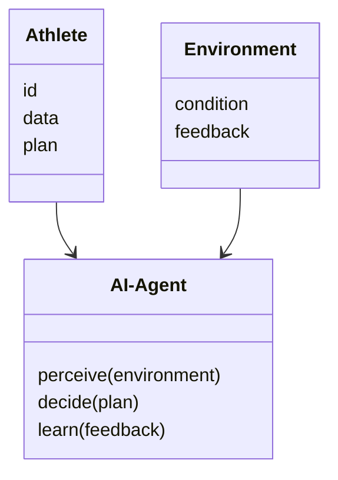
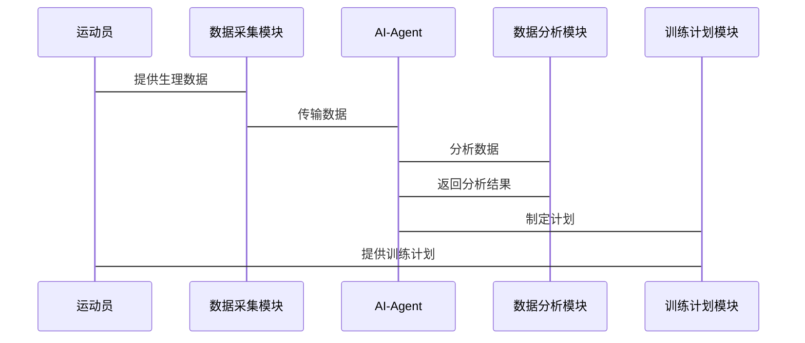

                 


# AI Agent在体育训练中的应用：个性化训练计划制定

> 关键词：AI Agent, 个性化训练计划, 强化学习, 体育训练, 数据驱动优化

> 摘要：本文详细探讨了AI Agent在体育训练中的应用，特别是如何通过数据驱动的方式制定个性化训练计划。文章从背景介绍、核心原理、系统设计到项目实战，全面分析了AI Agent在体育训练中的潜力和实现路径。

---

# 第一部分: AI Agent在体育训练中的应用背景

## 第1章: AI Agent与个性化训练计划概述

### 1.1 问题背景
#### 1.1.1 传统体育训练的局限性
传统体育训练依赖于教练的经验和主观判断，存在以下问题：
- 训练计划缺乏个性化，难以满足不同运动员的需求。
- 数据采集和分析效率低下，难以实时调整训练计划。
- 缺乏科学的数据支持，训练效果难以量化和优化。

#### 1.1.2 现代运动员的训练需求
现代运动员需要更高的训练效率和科学性：
- 根据个人特点制定差异化训练计划。
- 实时监控身体状态和训练效果。
- 动态调整训练强度和内容。

#### 1.1.3 AI技术在体育领域的潜力
AI技术可以提供以下优势：
- 数据采集和分析的自动化。
- 基于大数据的个性化决策支持。
- 实时反馈和动态调整能力。

### 1.2 问题描述
#### 1.2.1 个性化训练计划的核心要素
个性化训练计划需要考虑以下因素：
- 运动员的体能水平、技术特点和伤病史。
- 训练目标（如力量、速度、耐力等）的优先级。
- 训练负荷的科学分配和实时调整。

#### 1.2.2 运动员状态的动态变化
运动员状态会受到多种因素影响：
- 身体状态（疲劳、伤病等）。
- 心理状态（压力、动力等）。
- 环境条件（气候、场地等）。

#### 1.2.3 训练计划的实时调整需求
训练计划需要根据实时数据动态调整：
- 实时监控运动员的生理指标（心率、体温等）。
- 根据训练效果调整训练强度和内容。
- 在训练过程中实时反馈优化建议。

### 1.3 问题解决
#### 1.3.1 AI Agent在个性化训练中的角色
AI Agent可以作为智能助手：
- 数据采集与分析。
- 训练计划的制定与优化。
- 实时反馈与动态调整。

#### 1.3.2 数据驱动的训练计划优化
通过数据驱动的方法：
- 建立运动员的个性化模型。
- 根据实时数据优化训练计划。

#### 1.3.3 多目标优化的实现路径
个性化训练计划需要在多个目标之间进行平衡：
- 提高体能。
- 减少伤病风险。
- 提高训练效率。

### 1.4 边界与外延
#### 1.4.1 AI Agent的应用范围
AI Agent适用于以下场景：
- 个性化训练计划的制定。
- 实时训练监控与反馈。
- 数据分析与效果评估。

#### 1.4.2 个性化训练计划的边界条件
需要考虑以下限制：
- 数据采集的准确性和完整性。
- AI模型的泛化能力。
- 个性化训练计划的可执行性。

#### 1.4.3 相关领域的外延扩展
AI技术在体育领域的其他应用：
- 运动表现分析。
- 伤病预测与康复。
- 竞技策略优化。

### 1.5 核心概念
#### 1.5.1 AI Agent的基本属性
AI Agent具有以下特点：
- 智能性：能够感知环境并做出决策。
- 自主性：能够在没有人工干预的情况下运行。
- 可交互性：能够与人类或其他系统进行交互。

#### 1.5.2 个性化训练计划的构成要素
个性化训练计划包括以下部分：
- 训练目标。
- 训练内容。
- 训练强度。
- 训练频率。

#### 1.5.3 核心概念之间的关系
AI Agent通过数据驱动的方式，帮助制定和优化个性化训练计划，实现动态调整和实时反馈。

---

# 第二部分: AI Agent的核心原理与个性化训练计划的关系

## 第2章: AI Agent的核心原理

### 2.1 AI Agent的基本原理
#### 2.1.1 AI Agent的定义与分类
AI Agent可以分为以下几类：
- 基于规则的Agent。
- 基于强化学习的Agent。
- 基于协作的多智能体Agent。

#### 2.1.2 基于强化学习的决策机制
强化学习的核心要素：
- 状态（State）：环境的当前情况。
- 行动（Action）：Agent的决策。
- 奖励（Reward）：对决策的反馈。
- 策略（Policy）：决策的规则。

#### 2.1.3 多智能体协作的实现方式
多智能体协作的关键点：
- 信息共享与协调。
- 分工与合作。
- 协调机制的设计。

### 2.2 个性化训练计划的制定逻辑
#### 2.2.1 数据采集与特征提取
数据采集的关键步骤：
- 运动员的生理数据（心率、血压等）。
- 运动表现数据（速度、力量等）。
- 环境数据（温度、湿度等）。

#### 2.2.2 训练目标的分解与优先级排序
训练目标的分解：
- 主要目标（如提高耐力）。
- 次要目标（如增强核心力量）。

优先级排序的方法：
- 根据训练效果的重要性排序。
- 根据训练时间的限制排序。

#### 2.2.3 训练计划的动态调整策略
动态调整的关键点：
- 根据实时数据调整训练强度。
- 根据训练效果优化训练内容。
- 根据运动员状态调整训练计划。

### 2.3 AI Agent与个性化训练计划的关系
#### 2.3.1 数据驱动的闭环优化
数据驱动的优化过程：
1. 数据采集。
2. 数据分析。
3. 训练计划优化。
4. 实时反馈。

#### 2.3.2 多目标优化的实现路径
多目标优化的关键点：
- 确定目标的权重。
- 建立优化模型。
- 迭代优化。

#### 2.3.3 动态调整的实时反馈机制
实时反馈的实现方式：
- 数据采集与实时分析。
- AI Agent根据反馈调整训练计划。

---

## 第3章: 核心概念的对比分析

### 3.1 AI Agent与传统训练计划的对比
#### 3.1.1 传统训练计划的特点
传统训练计划的特点：
- 依赖教练经验。
- 缺乏数据支持。
- 调整周期长。

#### 3.1.2 AI Agent的优势
AI Agent的优势：
- 数据驱动的科学性。
- 实时调整的灵活性。
- 高度个性化的优化能力。

#### 3.1.3 两者的结合方式
结合方式：
- 传统经验与AI技术的结合。
- 人机协作的优化模式。

---

### 3.2 不同个性化训练计划方法的对比

#### 3.2.1 基于规则的传统方法
基于规则的方法：
- 根据经验制定规则。
- 缺乏灵活性和科学性。

#### 3.2.2 基于机器学习的优化方法
基于机器学习的方法：
- 数据驱动的优化。
- 自适应调整的能力。

#### 3.2.3 基于强化学习的动态调整方法
基于强化学习的方法：
- 实时反馈与动态调整。
- 高效的优化能力。

---

## 第4章: 算法原理与实现细节

### 4.1 算法原理
#### 4.1.1 强化学习算法的流程
强化学习的流程：
1. 状态感知。
2. 行动决策。
3. 奖励反馈。
4. 策略优化。

#### 4.1.2 多智能体协作的实现
多智能体协作的关键技术：
- 信息共享与协调。
- 分工与合作。
- 协调机制的设计。

### 4.2 算法实现
#### 4.2.1 强化学习算法的代码实现
```python
class AI-Agent:
    def __init__(self):
        self.state = None
        self.policy = self.default_policy()

    def perceive(self, environment):
        self.state = environment.get_state()

    def decide(self):
        action = self.policy(self.state)
        return action

    def learn(self, reward):
        self.policy.update(reward)
```

#### 4.2.2 多智能体协作的实现
多智能体协作的实现：
- 使用分布式架构。
- 设计高效的通信机制。

### 4.3 数学模型与公式
#### 4.3.1 强化学习的核心公式
强化学习的数学模型：
$$ Q(s, a) = Q(s, a) + \alpha (r + \gamma Q(s', a') - Q(s, a)) $$

#### 4.3.2 多智能体协作的优化目标
多智能体协作的优化目标：
$$ \max_{\theta} \sum_{i=1}^{n} Q_i(s_i, a_i) $$

---

## 第5章: 系统分析与架构设计

### 5.1 问题场景介绍
问题场景：
- 运动员需要个性化的训练计划。
- 训练计划需要实时调整。
- 数据需要实时采集和分析。

### 5.2 项目介绍
项目目标：
- 开发一个基于AI Agent的个性化训练计划系统。

### 5.3 系统功能设计
#### 5.3.1 领域模型类图
领域模型类图：


#### 5.3.2 系统架构设计
系统架构设计：


### 5.4 系统接口设计
系统接口：
- 数据采集接口。
- 训练计划接口。
- 反馈接口。

### 5.5 系统交互设计
系统交互流程：


---

## 第6章: 项目实战

### 6.1 环境安装
环境安装：
- 安装Python和相关库（如TensorFlow、Keras）。
- 安装数据采集设备。

### 6.2 系统核心实现
系统核心实现：
- 数据采集模块。
- 数据分析模块。
- AI-Agent模块。

### 6.3 代码实现
代码实现：
```python
import numpy as np
import tensorflow as tf

class AI-Agent:
    def __init__(self):
        self.model = self.build_model()

    def build_model(self):
        model = tf.keras.Sequential([
            tf.keras.layers.Dense(64, activation='relu'),
            tf.keras.layers.Dense(1, activation='sigmoid')
        ])
        model.compile(optimizer='adam', loss='binary_crossentropy')
        return model

    def perceive(self, data):
        self.model.predict(data)

    def decide(self, data):
        prediction = self.model.predict(data)
        return prediction
```

### 6.4 实际案例分析
实际案例分析：
- 数据采集与分析。
- AI-Agent的决策过程。
- 训练计划的动态调整。

---

## 第7章: 最佳实践与小结

### 7.1 小结
小结：
- AI Agent在体育训练中的潜力巨大。
- 数据驱动的个性化训练计划是未来的趋势。

### 7.2 注意事项
注意事项：
- 数据的准确性和完整性。
- AI模型的泛化能力。
- 系统的实时性和稳定性。

### 7.3 拓展阅读
拓展阅读：
- 强化学习的最新研究。
- 多智能体协作的前沿技术。
- 体育训练的其他AI应用。

---

# 作者：AI天才研究院 & 禅与计算机程序设计艺术

