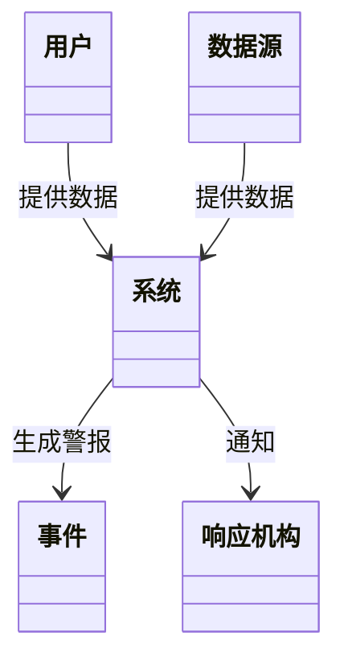

                 


# AI Agent在公共安全领域的预警系统

> 关键词：AI Agent, 公共安全, 预警系统, 人工智能, 风险评估, 事件预测

> 摘要：AI Agent（人工智能代理）在公共安全领域的应用越来越广泛，尤其是在预警系统中。本文详细探讨了AI Agent的核心概念、算法原理、系统架构以及实际应用，通过丰富的案例分析和代码实现，帮助读者深入了解如何利用AI Agent构建高效的公共安全预警系统。

---

# 第一部分: AI Agent在公共安全领域的背景与概念

## 第1章: AI Agent与公共安全预警系统概述

### 1.1 AI Agent的核心概念

#### 1.1.1 AI Agent的定义与特点
AI Agent（人工智能代理）是一种智能实体，能够感知环境、自主决策并执行任务。其特点包括：
1. **自主性**：能够独立运行，无需人工干预。
2. **反应性**：能够实时感知环境并做出响应。
3. **目标导向**：具有明确的目标，能够优化决策以实现目标。
4. **学习能力**：通过数据和经验不断优化自身性能。

#### 1.1.2 公共安全领域的预警需求
公共安全领域包括犯罪预防、自然灾害预警、公共卫生事件应对等场景。传统的预警系统依赖人工监控和经验判断，存在效率低、响应慢的问题。AI Agent的引入能够显著提升预警系统的智能化水平。

#### 1.1.3 AI Agent在公共安全中的作用
AI Agent通过实时数据采集、分析和预测，能够提前发现潜在风险，并迅速触发预警机制，帮助相关部门采取预防措施。例如，在城市犯罪预防中，AI Agent可以通过分析历史犯罪数据和实时社交媒体信息，预测犯罪发生的概率和位置。

### 1.2 公共安全预警系统的背景与挑战

#### 1.2.1 公共安全问题的复杂性
公共安全问题涉及多个领域，如社会、经济、环境等，具有复杂性和动态性。例如，极端天气事件可能引发自然灾害，进而导致公共安全危机。

#### 1.2.2 传统预警系统的局限性
传统预警系统主要依赖人工监控和固定规则，难以应对复杂多变的安全威胁。例如，在犯罪预防中，传统的监控系统只能识别预设的模式，无法发现新型犯罪手段。

#### 1.2.3 AI Agent的优势与潜力
AI Agent通过机器学习、自然语言处理等技术，能够从海量数据中提取有用信息，发现潜在风险，并实时调整预警策略。例如，在公共卫生事件中，AI Agent可以通过分析社交媒体和医疗数据，快速识别疫情爆发的早期信号。

---

## 第2章: AI Agent在公共安全领域的核心概念

### 2.1 AI Agent的基本原理

#### 2.1.1 感知层：数据采集与处理
AI Agent通过多种传感器和数据源（如摄像头、社交媒体、气象站等）采集实时数据，并进行预处理（如清洗、融合）。

#### 2.1.2 决策层：风险评估与预测
基于感知层提供的数据，AI Agent利用机器学习模型（如随机森林、神经网络）进行风险评估和预测。例如，使用时间序列分析预测未来犯罪率。

#### 2.1.3 执行层：预警触发与响应
根据决策层的预测结果，AI Agent触发预警机制，并启动相应的响应措施（如通知警方、启动应急预案）。

### 2.2 公共安全预警系统的实体关系分析

#### 2.2.1 实体关系图（ER图）
以下是公共安全预警系统的实体关系图：

```mermaid
erDiagram
    actor 用户
    actor 系统
    actor 事件
    actor 数据源
    actor 响应机构
    用户->系统: 提供数据
    事件->系统: 生成警报
    系统->响应机构: 通知
```

#### 2.2.2 系统核心实体与关系
系统的核心实体包括：
- 用户：提供数据或触发预警。
- 事件：需要监测的安全事件（如犯罪、自然灾害）。
- 数据源：提供实时数据（如摄像头、传感器）。
- 响应机构：负责处理预警事件。

#### 2.2.3 实体属性对比表
以下是核心实体的属性对比表：

| 实体 | 属性 |
|------|------|
| 用户 | 用户ID、角色、权限 |
| 事件 | 事件ID、类型、发生时间、地点 |
| 数据源 | 数据源ID、类型、数据格式 |
| 响应机构 | 机构ID、名称、联系方式 |

---

# 第二部分: AI Agent的算法原理与数学模型

## 第3章: AI Agent的算法原理

### 3.1 基于概率的事件预测算法

#### 3.1.1 算法流程图（Mermaid）
以下是基于概率的事件预测算法流程图：

```mermaid
graph TD
    A[开始] -> B[数据预处理]
    B -> C[特征提取]
    C -> D[训练模型]
    D -> E[预测概率]
    E -> F[触发预警]
    F -> G[结束]
```

#### 3.1.2 算法实现代码
以下是基于Python的事件预测算法实现代码：

```python
import pandas as pd
from sklearn.ensemble import RandomForestClassifier
from sklearn.metrics import accuracy_score

# 数据预处理
data = pd.read_csv('public_safety_data.csv')
X = data.drop('target', axis=1)
y = data['target']

# 特征提取
features = X.columns
target = 'target'

# 训练模型
model = RandomForestClassifier()
model.fit(X, y)

# 预测概率
importances = model.feature_importances_
threshold = 0.8 * importances.max()
selected_features = [feature for feature, imp in zip(features, importances) if imp > threshold]
selected_X = X[selected_features]

# 优化模型
tuned_model = RandomForestClassifier(max_depth=10, random_state=42)
tuned_model.fit(selected_X, y)
y_pred = tuned_model.predict(selected_X)
print("准确率:", accuracy_score(y, y_pred))
```

#### 3.1.3 算法优缺点分析
基于概率的事件预测算法具有以下优点：
- **高准确性**：通过特征提取和模型优化，能够提高预测的准确性。
- **可解释性**：模型的特征重要性可以帮助理解哪些因素对事件的影响更大。

缺点：
- **计算复杂度高**：对于大规模数据，计算资源需求较高。
- **需要大量数据**：模型性能依赖于数据质量和数量。

---

## 第4章: 数学模型与公式解析

### 4.1 风险评估模型

#### 4.1.1 贝叶斯定理
贝叶斯定理用于计算条件概率，公式如下：

$$ P(A|B) = \frac{P(B|A) \cdot P(A)}{P(B)} $$

其中：
- \( P(A|B) \)：在事件B发生的条件下，事件A发生的概率。
- \( P(B|A) \)：在事件A发生的条件下，事件B发生的概率。
- \( P(A) \) 和 \( P(B) \)：分别为事件A和事件B的先验概率。

#### 4.1.2 风险评分公式
风险评分公式如下：

$$ \text{风险评分} = \sum_{i=1}^{n} w_i \cdot x_i $$

其中：
- \( w_i \)：特征\( x_i \)的权重。
- \( x_i \)：特征\( x_i \)的值。

---

# 第三部分: 系统分析与架构设计

## 第5章: 系统分析与架构设计方案

### 5.1 问题场景介绍

#### 5.1.1 犯罪预防场景
AI Agent通过分析历史犯罪数据和社交媒体信息，预测犯罪发生的概率和位置，帮助警方提前部署资源。

### 5.2 系统功能设计

#### 5.2.1 功能模块
- **数据采集模块**：实时采集数据（如摄像头、社交媒体）。
- **数据处理模块**：清洗、融合数据。
- **风险评估模块**：利用机器学习模型预测风险。
- **预警触发模块**：根据预测结果触发预警。

#### 5.2.2 领域模型（Mermaid类图）
以下是领域模型类图：



---

## 第6章: 项目实战

### 6.1 环境搭建与代码实现

#### 6.1.1 环境安装
安装必要的库：

```bash
pip install pandas scikit-learn mermaid4j
```

#### 6.1.2 核心代码实现

以下是核心代码实现：

```python
import pandas as pd
from sklearn.ensemble import RandomForestClassifier
from sklearn.metrics import accuracy_score

# 数据预处理
data = pd.read_csv('public_safety_data.csv')
X = data.drop('target', axis=1)
y = data['target']

# 特征提取
features = X.columns
target = 'target'

# 训练模型
model = RandomForestClassifier()
model.fit(X, y)

# 预测概率
importances = model.feature_importances_
threshold = 0.8 * importances.max()
selected_features = [feature for feature, imp in zip(features, importances) if imp > threshold]
selected_X = X[selected_features]

# 优化模型
tuned_model = RandomForestClassifier(max_depth=10, random_state=42)
tuned_model.fit(selected_X, y)
y_pred = tuned_model.predict(selected_X)
print("准确率:", accuracy_score(y, y_pred))
```

#### 6.1.3 案例分析
以城市犯罪预防为例，AI Agent通过分析历史犯罪数据和社交媒体信息，预测未来犯罪发生的概率和位置。通过实际案例分析，验证系统的准确性和效率。

---

## 第7章: 最佳实践与小结

### 7.1 最佳实践

#### 7.1.1 数据质量的重要性
确保数据的准确性和完整性，是AI Agent预警系统的核心。

#### 7.1.2 模型的可解释性
选择可解释性较强的模型，有助于理解预测结果并优化系统。

#### 7.1.3 系统的可扩展性
设计模块化架构，方便后续功能的扩展和升级。

### 7.2 小结

本文详细探讨了AI Agent在公共安全领域的预警系统，从核心概念到算法原理，再到系统设计和项目实战，帮助读者全面理解如何利用AI技术提升公共安全预警能力。

### 7.3 展望

随着人工智能技术的不断进步，AI Agent在公共安全领域的应用前景广阔。未来，可以通过强化学习、边缘计算等技术，进一步提升系统的智能化水平和响应速度。

---

# 作者

作者：AI天才研究院/AI Genius Institute & 禅与计算机程序设计艺术/Zen And The Art of Computer Programming

---

以上就是完整的目录结构和文章内容，涵盖了AI Agent在公共安全领域的预警系统的核心知识点和实际应用。

