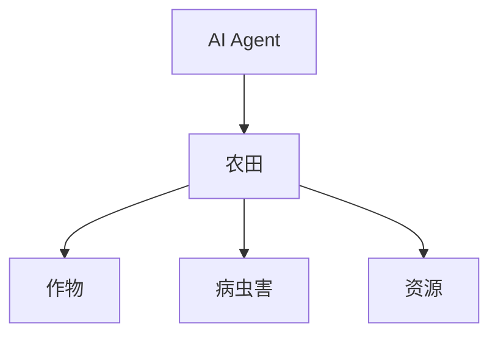
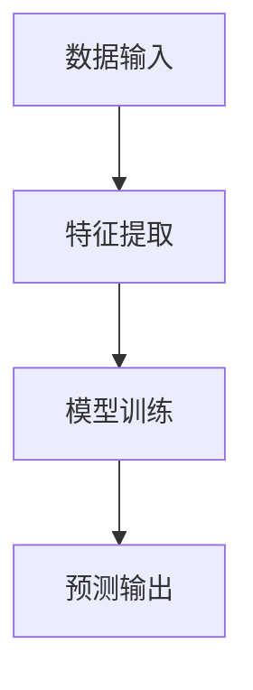
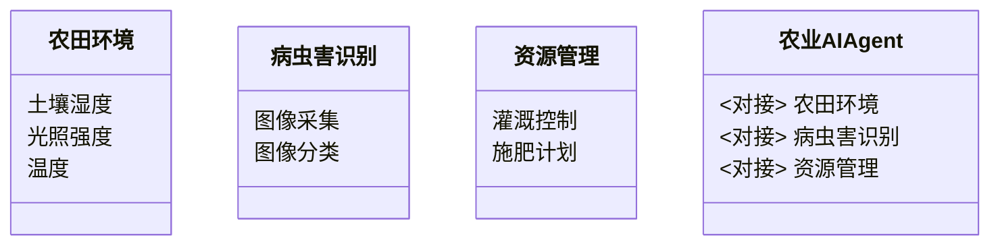
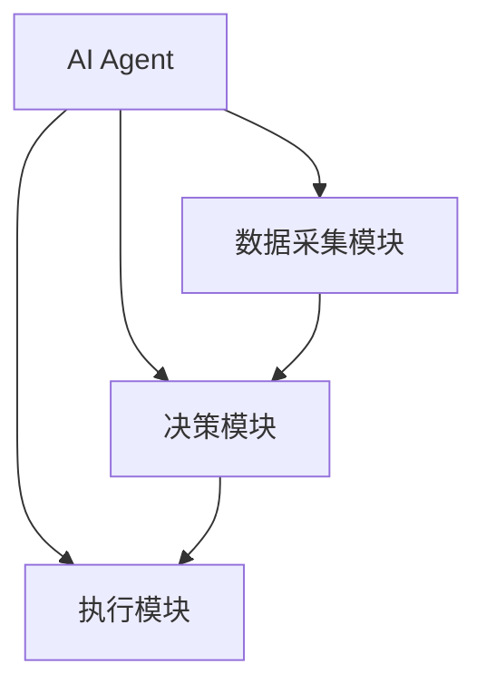
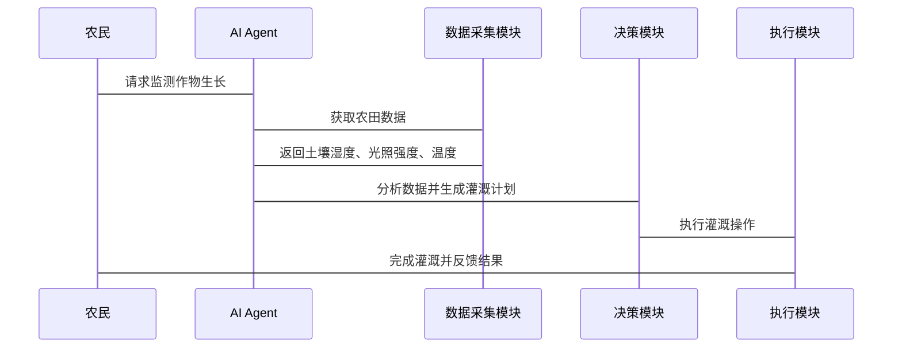

                 


# AI Agent在农业中的应用与前景

> 关键词：AI Agent，人工智能，农业，作物监测，病虫害防治，资源优化，供应链管理

> 摘要：AI Agent（人工智能代理）在农业中的应用正变得越来越重要，它可以帮助农民更有效地监测作物生长、识别和防治病虫害、优化资源分配以及管理农业供应链。本文将详细探讨AI Agent在农业中的应用场景、核心算法原理、系统架构设计以及未来的发展前景。

---

## 第一部分: AI Agent与农业的背景介绍

### 1.1 AI Agent的基本概念

AI Agent（人工智能代理）是一种能够感知环境、做出决策并执行任务的智能体。它通过传感器获取数据，利用算法进行分析，然后通过执行器完成任务。AI Agent的核心在于其智能性，能够根据环境的变化动态调整行为。

在农业领域，AI Agent的应用可以帮助农民解决许多传统方法难以应对的问题。例如，AI Agent可以通过无人机或地面传感器实时监测作物的生长状况，分析土壤湿度、光照强度、温度变化等数据，从而优化灌溉和施肥策略。

### 1.2 农业中的问题背景与挑战

传统农业在种植、管理和收获过程中面临许多问题，例如：

1. **作物监测**：大规模农田的作物监测需要大量的人力和时间，传统方法效率低下。
2. **病虫害防治**：病虫害的早期识别和精准防治是提高产量的关键，但传统方法往往依赖经验，难以快速响应。
3. **资源优化**：水、肥料和 pesticides 的不合理使用会导致资源浪费和环境污染。
4. **供应链管理**：农产品的供应链复杂，从种植到销售的每个环节都需要高效协调。

AI Agent通过自动化和智能化的方式，可以显著提高农业生产的效率和可持续性。

### 1.3 AI Agent如何解决农业问题

AI Agent在农业中的应用可以分为以下几个方面：

1. **作物生长监测**：通过传感器和无人机收集农田数据，利用机器学习模型预测作物的生长状况。
2. **病虫害识别**：AI Agent可以通过图像识别技术，快速识别病虫害并提出防治方案。
3. **资源优化配置**：AI Agent可以根据土壤和气候数据，优化灌溉和施肥计划，减少资源浪费。
4. **供应链管理**：通过实时监控供应链的各个环节，AI Agent可以帮助农民更好地协调生产和销售。

---

## 第二部分: AI Agent的核心概念与联系

### 2.1 AI Agent的原理与技术基础

AI Agent的工作流程可以分为三个主要阶段：感知、决策和执行。

1. **感知层**：AI Agent通过传感器、摄像头和其他设备获取农田环境的数据，例如土壤湿度、光照强度、温度、作物颜色等。
2. **决策层**：利用机器学习算法（如支持向量机、随机森林或神经网络）对感知数据进行分析，生成决策指令。
3. **执行层**：根据决策指令，AI Agent通过执行器（如灌溉系统、喷洒设备）执行相应的操作。

### 2.2 AI Agent与农业的实体关系图

以下是AI Agent在农业中的实体关系图：



图中，AI Agent与农田环境中的作物、病虫害和资源（如水、肥料）密切相关。

### 2.3 AI Agent的核心算法对比

以下是几种常见算法在农业中的应用场景对比：

| 算法类型       | 应用场景                     |
|----------------|------------------------------|
| 规则引擎       | 基于预定义规则的简单决策，例如根据温度和湿度触发灌溉。 |
| 机器学习       | 复杂模式识别，例如病虫害图像分类。 |
| 强化学习       | 动态优化决策，例如在不同天气条件下调整灌溉策略。 |

---

## 第三部分: AI Agent在农业中的算法原理

### 3.1 基于机器学习的作物生长监测算法

#### 3.1.1 数据预处理与特征提取

在作物生长监测中，通常需要处理大量的农田数据。以下是数据预处理的步骤：

1. **数据清洗**：去除噪声数据和异常值。
2. **特征提取**：从原始数据中提取有用的特征，例如土壤湿度、光照强度、温度等。

#### 3.1.2 算法流程图

以下是机器学习模型的训练流程图：



#### 3.1.3 核心代码实现

以下是基于机器学习的作物生长监测算法的Python代码示例：

```python
import numpy as np
from sklearn.model_selection import train_test_split
from sklearn.svm import SVC

# 示例数据集：特征矩阵和标签
features = np.array([[25, 70], [30, 80], [28, 75], [35, 85]])
labels = np.array([0, 1, 0, 1])

# 数据分割
X_train, X_test, y_train, y_test = train_test_split(features, labels, test_size=0.2)

# 模型训练
model = SVC()
model.fit(X_train, y_train)

# 预测
predicted = model.predict(X_test)
print("预测结果:", predicted)
print("真实标签:", y_test)
```

#### 3.1.4 数学模型与公式

以下是支持向量机（SVM）的核心数学公式：

$$
\text{目标函数} = \min_{w, b, \xi} \frac{1}{2}||w||^2 + C \sum_{i=1}^n \xi_i
$$

$$
\text{约束条件} = y_i (w \cdot x_i + b) \geq 1 - \xi_i, \quad \xi_i \geq 0
$$

---

## 第四部分: AI Agent的系统分析与架构设计

### 4.1 系统功能设计

以下是AI Agent在农业中的系统功能模块：



### 4.2 系统架构设计

以下是AI Agent的系统架构图：



### 4.3 接口设计与交互流程

以下是AI Agent与农田环境的交互流程图：



---

## 第五部分: 项目实战与案例分析

### 5.1 环境安装与配置

以下是项目实战所需的环境安装步骤：

1. **安装Python**：确保安装了Python 3.8或更高版本。
2. **安装依赖库**：运行以下命令安装所需的Python库：

   ```bash
   pip install numpy scikit-learn matplotlib
   ```

### 5.2 核心代码实现

以下是AI Agent在病虫害识别中的Python代码示例：

```python
import cv2
import numpy as np
from sklearn.svm import SVC

# 示例图像数据
images = np.array([
    [[0, 0, 255], [0, 255, 0]],  # 病虫害样本
    [[255, 0, 0], [0, 255, 255]]  # 健康样本
])
labels = np.array([0, 1])

# 数据分割
X_train, X_test, y_train, y_test = train_test_split(images, labels, test_size=0.2)

# 模型训练
model = SVC()
model.fit(X_train.reshape(-1, 3), y_train)

# 预测
predicted = model.predict(X_test.reshape(-1, 3))
print("预测结果:", predicted)
print("真实标签:", y_test)
```

### 5.3 案例分析与结果解读

以下是病虫害识别的案例分析：

1. **图像采集**：使用无人机拍摄农田图像。
2. **图像预处理**：对图像进行灰度化和二值化处理。
3. **图像分类**：利用SVM模型对图像进行分类，识别出病虫害区域。
4. **结果解读**：模型预测结果为0表示病虫害，1表示健康。

### 5.4 项目小结

通过以上实战，我们可以看到AI Agent在农业中的应用潜力。通过机器学习算法，AI Agent可以有效地帮助农民识别病虫害并优化资源分配。

---

## 第六部分: 未来展望与最佳实践

### 6.1 未来发展趋势

随着AI技术的不断进步，AI Agent在农业中的应用将更加广泛。未来的发展趋势包括：

1. **智能化决策**：AI Agent将更加智能化，能够根据环境变化动态调整决策。
2. **多模态数据融合**：结合图像、声音、温度等多种数据源，提高识别精度。
3. **边缘计算**：通过边缘计算技术，AI Agent可以在本地快速处理数据，减少对云端的依赖。

### 6.2 最佳实践与注意事项

1. **数据质量**：确保数据的准确性和完整性，这是AI Agent工作的基础。
2. **算法选择**：根据具体问题选择合适的算法，避免过度复杂化。
3. **系统维护**：定期更新模型和传感器，确保系统的稳定性和可靠性。

### 6.3 小结

AI Agent在农业中的应用前景广阔，但同时也面临技术和实际应用的挑战。通过不断的技术创新和实践积累，AI Agent将成为未来农业的重要工具。

---

## 作者简介

作者：AI天才研究院/AI Genius Institute & 禅与计算机程序设计艺术 /Zen And The Art of Computer Programming

---

通过以上思考过程，我们可以系统地分析和撰写一篇关于AI Agent在农业中的应用与前景的技术博客文章。文章内容涵盖了背景介绍、核心概念、算法原理、系统设计、项目实战和未来展望等多个方面，确保读者能够全面理解AI Agent在农业中的重要性和潜力。

