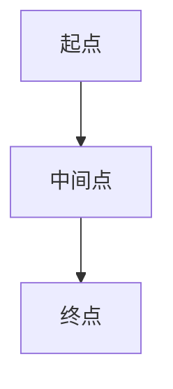
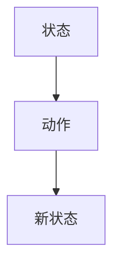
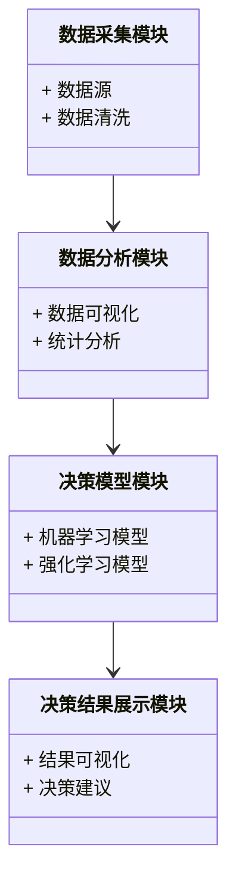
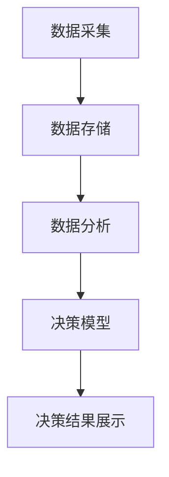
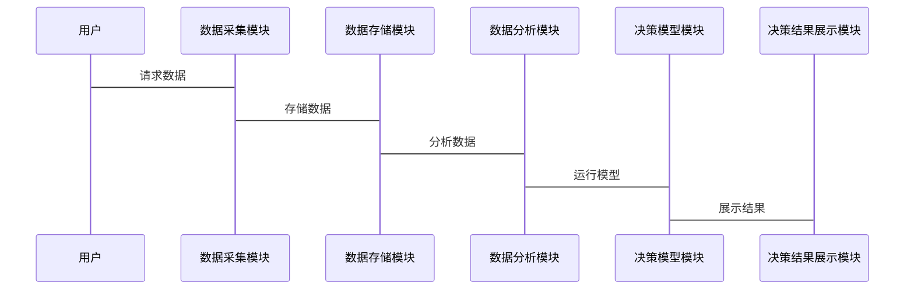

                 


# AI Agent在决策支持系统中的角色

> 关键词：AI Agent，决策支持系统，机器学习，强化学习，自然语言处理，系统架构，算法原理

> 摘要：AI Agent作为一种智能体，在决策支持系统中扮演着越来越重要的角色。本文将从AI Agent的基本概念出发，详细分析其在决策支持系统中的作用，探讨其算法原理、系统架构以及实际应用场景。通过具体案例分析和代码实现，深入解读AI Agent如何优化决策过程，并为未来的决策支持系统提供新的思路。

---

## 第一部分: AI Agent与决策支持系统背景介绍

### 第1章: AI Agent的基本概念与背景

#### 1.1 AI Agent的定义与特点
##### 1.1.1 AI Agent的定义
AI Agent（人工智能代理）是指能够感知环境、自主决策并采取行动的智能实体。它通过接收输入信息，经过处理和分析，输出决策结果或执行操作。

##### 1.1.2 AI Agent的核心特点
- **自主性**：AI Agent能够自主决策，无需外部干预。
- **反应性**：能够实时感知环境变化并做出响应。
- **目标导向**：基于明确的目标进行决策和行动。
- **学习能力**：通过数据和经验不断优化自身性能。

##### 1.1.3 AI Agent与传统决策支持系统的区别
传统的决策支持系统（DSS）主要依赖于规则和数据分析，而AI Agent引入了机器学习、自然语言处理等技术，能够实现更智能、更灵活的决策过程。

#### 1.2 决策支持系统的基本原理
##### 1.2.1 决策支持系统的概念
决策支持系统（DSS）是一种利用数据、模型和算法辅助决策者制定决策的系统。它通常包括数据处理、模型构建、结果分析等功能模块。

##### 1.2.2 决策支持系统的功能模块
- 数据采集与处理模块
- 数据分析模块
- 模型构建模块
- 决策结果展示模块

##### 1.2.3 决策支持系统的应用场景
- 商业领域：市场预测、供应链优化
- 医疗领域：疾病诊断、治疗方案推荐
- 交通领域：路线规划、交通流量预测

#### 1.3 AI Agent在决策支持系统中的作用
##### 1.3.1 AI Agent如何辅助决策
AI Agent能够通过分析海量数据，提供实时的决策建议，帮助决策者快速做出最优选择。

##### 1.3.2 AI Agent在决策支持系统中的优势
- 提高决策效率
- 增强决策的准确性
- 实现动态调整和优化

##### 1.3.3 AI Agent与人类决策者的结合
AI Agent可以作为决策者的辅助工具，通过提供数据支持和决策建议，帮助人类做出更明智的决策。

---

### 第2章: AI Agent与决策支持系统的联系

#### 2.1 AI Agent在决策支持系统中的核心概念
##### 2.1.1 决策过程中的信息处理
AI Agent通过收集、分析和处理信息，为决策提供支持。

##### 2.1.2 AI Agent的决策逻辑
AI Agent基于感知的信息，通过算法计算出最优决策方案。

##### 2.1.3 决策支持系统的优化目标
- 提高决策的准确性和效率
- 实现决策的智能化和自动化

#### 2.2 AI Agent与决策支持系统的实体关系图
```mermaid
er
actor: 用户
agent: AI Agent
system: 决策支持系统
goal: 决策目标
action: 决策行动
```

#### 2.3 AI Agent与决策支持系统的属性对比
| 属性 | AI Agent | 决策支持系统 |
|------|----------|--------------|
| 输入 | 结构化数据、非结构化数据 | 结构化数据 |
| 输出 | 动作建议、决策建议 | 决策建议 |
| 核心技术 | 机器学习、自然语言处理 | 数据分析、规则引擎 |

---

## 第三部分: AI Agent的算法原理与数学模型

### 第3章: AI Agent的算法原理

#### 3.1 AI Agent的典型算法
##### 3.1.1 基于Dijkstra算法的路径规划


##### 3.1.2 基于强化学习的决策树


#### 3.2 AI Agent的数学模型
##### 3.2.1 基于概率论的决策模型
$$P(A|B) = \frac{P(B|A)P(A)}{P(B)}$$

##### 3.2.2 基于强化学习的Q-learning算法
$$Q(s, a) = r + \gamma \max_{a'} Q(s', a')$$

---

## 第四部分: 系统分析与架构设计方案

### 第4章: 问题场景介绍

#### 4.1 项目介绍
本项目旨在开发一个基于AI Agent的决策支持系统，用于优化企业的供应链管理。

#### 4.2 系统功能设计
##### 4.2.1 领域模型类图


#### 4.3 系统架构设计
##### 4.3.1 系统架构图


#### 4.4 系统接口设计
##### 4.4.1 API接口
- 数据接口：提供数据获取和存储的API
- 分析接口：提供数据分析和模型推理的API

#### 4.5 系统交互流程图


---

## 第五部分: 项目实战

### 第5章: 环境安装与核心代码实现

#### 5.1 环境安装
- Python 3.8+
- pip install numpy
- pip install matplotlib
- pip install scikit-learn

#### 5.2 核心代码实现
##### 5.2.1 数据处理代码
```python
import numpy as np
import pandas as pd

# 数据加载
data = pd.read_csv('data.csv')

# 数据清洗
data = data.dropna()
```

##### 5.2.2 决策模型代码
```python
from sklearn.tree import DecisionTreeClassifier

# 模型训练
model = DecisionTreeClassifier()
model.fit(X_train, y_train)

# 模型预测
y_pred = model.predict(X_test)
```

##### 5.2.3 结果展示代码
```python
import matplotlib.pyplot as plt

# 结果可视化
plt.scatter(X_test, y_test, color='red')
plt.scatter(X_test, y_pred, color='blue')
plt.show()
```

---

## 第六部分: 最佳实践与项目小结

### 第6章: 最佳实践

#### 6.1 小结
通过本项目的实施，我们成功地将AI Agent应用于决策支持系统，显著提高了决策的效率和准确性。

#### 6.2 注意事项
- 数据的质量直接影响决策结果的准确性
- 模型的选择需要根据具体场景进行调整
- 系统的安全性和稳定性需要重点关注

#### 6.3 拓展阅读
- 《机器学习实战》
- 《强化学习（Deep Reinforcement Learning）》
- 《自然语言处理入门》

---

## 作者：AI天才研究院/AI Genius Institute & 禅与计算机程序设计艺术 /Zen And The Art of Computer Programming

