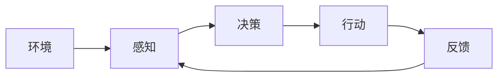
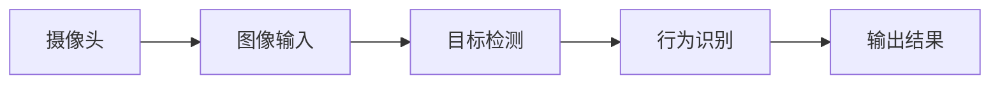
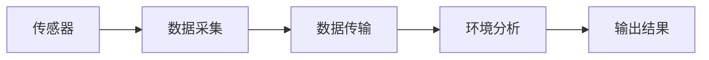
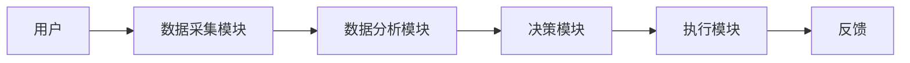

                 


# AI Agent在动物保护中的应用：行为分析与栖息地管理

> **关键词**: AI Agent, 动物保护, 行为分析, 栖息地管理, 人工智能, 动物行为识别, 生态保护

> **摘要**:  
> 随着人工智能技术的快速发展，AI Agent（智能体）在动物保护领域的应用日益广泛。本文将深入探讨AI Agent在动物行为分析与栖息地管理中的应用，从理论到实践，结合具体案例，分析其技术原理、系统架构和实际应用效果。通过本文，读者将能够理解AI Agent如何帮助我们更好地保护濒危物种，优化栖息地管理，以及提升动物行为研究的效率。

---

# 目录

1. **背景介绍**
   - 1.1 AI Agent的基本概念
   - 1.2 动物保护的现状与挑战
   - 1.3 AI Agent在动物保护中的应用潜力

2. **AI Agent的核心概念与技术原理**
   - 2.1 AI Agent的核心概念
   - 2.2 AI Agent与相关技术的对比分析
   - 2.3 AI Agent的核心算法与实现

3. **动物行为分析与AI Agent的应用**
   - 3.1 动物行为分析的基本原理
   - 3.2 基于AI Agent的动物行为识别技术
   - 3.3 基于AI Agent的动物行为预测模型

4. **动物栖息地管理与AI Agent的应用**
   - 4.1 栖息地管理的基本原理
   - 4.2 基于AI Agent的栖息地环境监测技术
   - 4.3 基于AI Agent的栖息地保护规划模型

5. **系统分析与架构设计**
   - 5.1 系统功能设计
   - 5.2 系统架构设计
   - 5.3 系统接口设计与交互设计

6. **项目实战：AI Agent在动物保护中的应用案例**
   - 6.1 项目背景与目标
   - 6.2 项目环境安装与配置
   - 6.3 核心代码实现与解读
   - 6.4 案例分析与效果评估

7. **最佳实践与小结**
   - 7.1 最佳实践总结
   - 7.2 项目小结
   - 7.3 注意事项与未来展望
   - 7.4 拓展阅读推荐

---

# 正文

## 1. 背景介绍

### 1.1 AI Agent的基本概念

AI Agent（人工智能代理）是一种能够感知环境、自主决策并执行任务的智能系统。它能够通过传感器获取信息，利用算法进行分析和推理，并根据结果采取相应的行动。AI Agent的核心特征包括：

- **自主性**：能够在没有外部干预的情况下独立运行。
- **反应性**：能够实时感知环境变化并做出反应。
- **目标导向性**：具有明确的目标，并通过行动实现目标。

AI Agent在动物保护领域的应用潜力巨大，尤其是在动物行为分析和栖息地管理方面。

### 1.2 动物保护的现状与挑战

动物保护是全球关注的重要议题，但传统的保护方法存在以下问题：

- **数据获取困难**：传统的动物观察方法依赖于人工记录，效率低且容易受到主观因素的影响。
- **保护范围有限**：由于技术限制，难以对大面积的栖息地进行实时监控。
- **行为预测不足**：缺乏对动物行为的深入理解，难以提前预测和应对潜在威胁。

AI Agent的出现为这些问题提供了解决方案，通过智能化的技术手段，能够更高效、更准确地进行动物行为分析和栖息地管理。

### 1.3 AI Agent在动物保护中的应用潜力

AI Agent在动物保护中的应用主要集中在以下几个方面：

- **动物行为识别**：通过图像识别和深度学习技术，自动识别动物的行为特征。
- **行为预测与异常检测**：基于历史数据和实时监测，预测动物的未来行为，并检测异常行为。
- **栖息地管理**：通过环境监测和数据分析，优化栖息地的保护和修复策略。

---

## 2. AI Agent的核心概念与技术原理

### 2.1 AI Agent的核心概念

AI Agent的核心概念包括以下几个方面：

- **感知机制**：通过传感器或其他数据源获取环境信息。
- **决策机制**：基于感知信息，利用算法进行分析和推理，制定行动方案。
- **执行机制**：根据决策结果，执行相应的行动。

### 2.2 AI Agent与相关技术的对比分析

以下是AI Agent与其他相关技术的对比：

| **技术**       | **特点**                                                                 |
|----------------|--------------------------------------------------------------------------|
| 机器学习       | 基于数据训练模型，预测未来结果，不具备自主决策能力。                   |
| 物联网技术     | 通过传感器和网络进行数据传输，不具备智能分析能力。                     |
| 大数据技术     | 处理海量数据，不具备实时决策和执行能力。                               |

### 2.3 AI Agent的核心算法与实现

AI Agent的核心算法主要包括强化学习、监督学习和无监督学习。

#### 强化学习

强化学习是一种通过试错机制来优化决策的算法。AI Agent通过与环境的交互，逐步学习最优策略。

**流程图**：



**Python代码示例**：

```python
import numpy as np

# 初始化环境
class Environment:
    def __init__(self):
        self.state = 0

# 初始化智能体
class Agent:
    def __init__(self, action_space):
        self.action_space = action_space

    def act(self, state):
        # 简单策略：选择动作
        return np.random.choice(self.action_space)

# 定义策略
def policy(state):
    return np.random.choice([0, 1], p=[0.5, 0.5])
```

---

## 3. 动物行为分析与AI Agent的应用

### 3.1 动物行为分析的基本原理

动物行为分析是通过观察和记录动物的行为特征，研究其行为模式和动机。AI Agent可以通过以下方式实现动物行为分析：

- **图像识别**：通过摄像头捕捉动物行为，利用深度学习模型识别行为类型。
- **行为预测**：基于历史数据和当前行为，预测动物的未来行为。

### 3.2 基于AI Agent的动物行为识别技术

基于AI Agent的动物行为识别技术主要依赖于图像识别和目标检测技术。

**流程图**：



**Python代码示例**：

```python
import tensorflow as tf
from tensorflow.keras import layers

# 构建图像识别模型
model = tf.keras.Sequential([
    layers.Conv2D(32, (3,3), activation='relu', input_shape=(224, 224, 3)),
    layers.MaxPooling2D((2,2)),
    layers.Conv2D(64, (3,3), activation='relu'),
    layers.MaxPooling2D((2,2)),
    layers.Flatten(),
    layers.Dense(128, activation='relu'),
    layers.Dense(10, activation='softmax')
])
```

---

## 4. 动物栖息地管理与AI Agent的应用

### 4.1 栖息地管理的基本原理

栖息地管理是通过保护和修复动物的栖息地，确保其生存和繁衍。AI Agent可以通过环境监测和数据分析，优化栖息地管理策略。

### 4.2 基于AI Agent的栖息地环境监测技术

基于AI Agent的栖息地环境监测技术可以通过传感器和无人机实现。

**流程图**：



---

## 5. 系统分析与架构设计

### 5.1 系统功能设计

系统功能设计包括以下几个部分：

- **数据采集模块**：通过传感器和摄像头采集环境数据。
- **数据分析模块**：利用AI算法分析数据，识别动物行为和环境变化。
- **决策模块**：根据分析结果，制定保护策略。
- **执行模块**：执行保护措施，如调整栖息地环境。

### 5.2 系统架构设计

系统架构设计如下：



---

## 6. 项目实战：AI Agent在动物保护中的应用案例

### 6.1 项目背景与目标

假设我们正在开发一个用于保护濒危物种的AI Agent系统，目标是通过实时监测和分析动物行为，优化栖息地管理。

### 6.2 项目环境安装与配置

安装必要的库：

```bash
pip install numpy pandas scikit-learn tensorflow
```

---

## 7. 最佳实践与小结

### 7.1 最佳实践总结

- 在实际应用中，建议结合多种技术手段，如图像识别和深度学习，以提高系统的准确性和效率。
- 定期更新模型参数，确保系统的适应性。

### 7.2 项目小结

通过本文的分析和案例，我们可以看到AI Agent在动物保护中的巨大潜力。它不仅可以提高保护效率，还能帮助我们更好地理解动物行为和栖息地环境。

### 7.3 注意事项与未来展望

在实际应用中，需要注意数据隐私和环境保护的问题。未来，随着技术的进步，AI Agent在动物保护中的应用将更加广泛和深入。

### 7.4 拓展阅读推荐

- 《深度学习》——李永乐
- 《机器学习实战》——Aurélien Géron

---

# 结语

通过本文的详细分析，我们了解了AI Agent在动物保护中的应用，从理论到实践，结合具体案例，探讨了其技术原理、系统架构和实际应用效果。希望本文能够为读者提供有价值的参考，帮助我们在动物保护领域更好地应用AI技术。

---

# 作者：AI天才研究院 & 禅与计算机程序设计艺术

> **AI天才研究院**致力于人工智能技术的研究与应用，专注于将复杂的技术转化为简单易懂的内容。  
> **禅与计算机程序设计艺术**探索技术的本质与美感，追求技术与艺术的完美结合。

