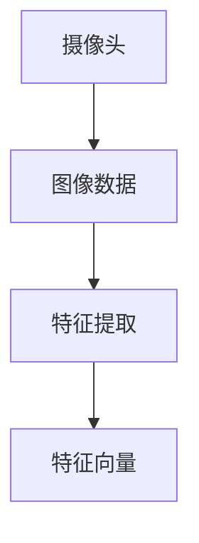
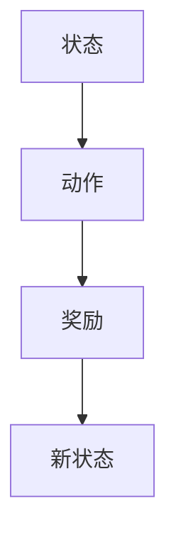
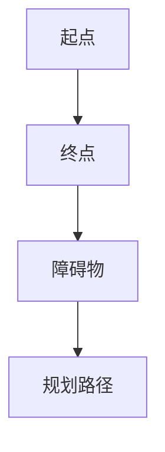
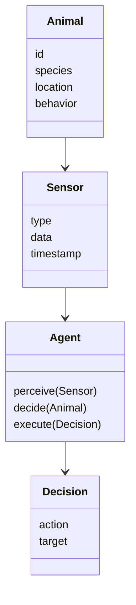
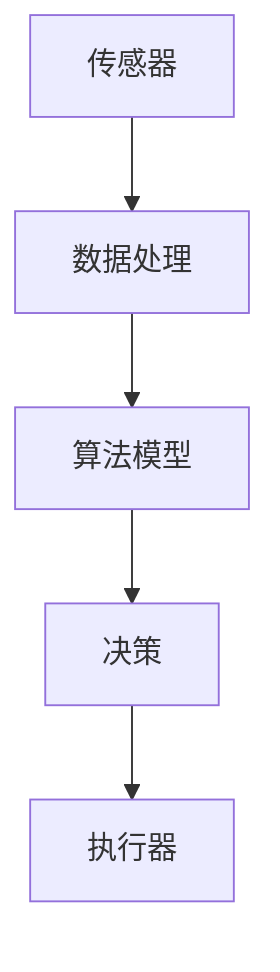

                 


# AI Agent在动物保护中的监测与追踪

## 关键词：AI Agent, 动物保护, 监测与追踪, 人工智能, 生态保护

## 摘要：AI Agent（人工智能代理）在动物保护中的监测与追踪应用是当前科技与生态结合的前沿领域。通过AI Agent的感知、决策与执行能力，可以实现对濒危动物的实时监测、行为分析和精准保护。本文将从AI Agent的核心原理出发，结合实际应用场景，详细探讨其在动物保护中的技术实现、系统架构与优化策略，为生态学家和科技开发者提供理论支持与实践指导。

---

# 第一部分: AI Agent在动物保护中的背景与核心概念

## 第1章: AI Agent与动物保护概述

### 1.1 AI Agent的基本概念

#### 1.1.1 AI Agent的定义与特点

AI Agent（人工智能代理）是指具有感知环境、做出决策并执行动作的智能实体。它能够通过传感器获取数据，利用算法进行分析，并根据结果采取行动。AI Agent的特点包括自主性、反应性、目标导向和协作性。

- 自主性：AI Agent可以在没有人工干预的情况下独立运行。
- 反应性：能够实时感知环境变化并做出响应。
- 目标导向：通过设定目标来优化行为。
- 协作性：能够与其他AI Agent或人类协同工作。

#### 1.1.2 AI Agent的核心功能与优势

AI Agent的核心功能包括数据采集、分析、决策和执行。其优势在于能够处理复杂环境中的不确定性问题，提供实时、精准的解决方案。

- 数据采集：通过传感器、摄像头等设备获取动物的活动数据。
- 数据分析：利用机器学习算法对数据进行分类、聚类和预测。
- 决策制定：基于分析结果做出最优决策。
- 行动执行：通过执行器或软件接口实现决策的落地。

#### 1.1.3 动物保护的现状与挑战

动物保护领域面临的主要挑战包括：

- **监测难度**：许多濒危动物生活在复杂或偏远的环境中，传统的监测手段效率低且成本高。
- **数据不足**：缺乏足够的数据支持保护决策。
- **人为干扰**：保护措施可能对动物造成额外压力。

AI Agent的应用可以有效解决这些问题，通过智能化的监测与追踪技术，提升保护工作的效率和精准度。

---

### 1.2 动物保护中的监测与追踪需求

#### 1.2.1 动物保护的主要挑战

动物保护的核心需求包括：

- 实时监测动物的活动轨迹。
- 识别动物的行为模式。
- 预测潜在的生态风险。

#### 1.2.2 监测与追踪技术的现状

目前常用的监测技术包括 GPS 追踪、摄像头监控等，但这些方法存在以下问题：

- 数据量大，处理复杂。
- 无法实时分析，难以应对突发情况。
- 需要大量人工干预。

#### 1.2.3 AI Agent在动物保护中的应用前景

AI Agent可以通过以下方式提升动物保护工作的效率：

- **实时监测**：通过传感器和摄像头实时采集数据，并通过AI算法进行分析。
- **行为识别**：利用图像识别技术自动识别动物的行为模式。
- **预测与预警**：基于历史数据预测动物可能的迁移路径，并提前做出预警。

---

## 第2章: AI Agent的核心概念与技术原理

### 2.1 AI Agent的核心概念

#### 2.1.1 感知与数据采集

AI Agent的感知能力是其工作的基础。通过多种传感器（如摄像头、麦克风、GPS 等）采集动物的活动数据。

- 数据来源：摄像头图像、声音信号、地理位置信息等。
- 数据预处理：去噪、标准化、特征提取。

#### 2.1.2 决策与行为规划

AI Agent需要根据感知到的信息做出决策，并制定行为计划。

- 决策算法：基于规则的决策树、基于模型的强化学习。
- 行为规划：路径规划、任务分配。

#### 2.1.3 执行与反馈机制

AI Agent通过执行器（如无人机、智能设备）执行决策，并通过反馈机制不断优化行为。

- 执行器：无人机、智能摄像头。
- 反馈机制：实时调整决策以适应环境变化。

### 2.2 AI Agent的关键技术

#### 2.2.1 传感器与数据采集技术

传感器是AI Agent感知环境的关键工具。常用的传感器包括：

- 视觉传感器：摄像头、RGB-D 摄像头。
- 听觉传感器：麦克风阵列。
- 位置传感器：GPS、惯性测量单元（IMU）。

#### 2.2.2 数据处理与分析技术

数据处理技术包括：

- 数据清洗：去除噪声数据。
- 数据融合：将多源数据进行整合。
- 数据分析：使用机器学习算法进行分类、聚类。

#### 2.2.3 人工智能算法与模型训练

AI Agent的核心是算法。常用的算法包括：

- 监督学习：分类、回归。
- 无监督学习：聚类、降维。
- 强化学习：路径规划、决策优化。

---

## 第3章: AI Agent的核心原理与算法分析

### 3.1 AI Agent的感知机制

#### 3.1.1 数据采集与特征提取

数据采集是AI Agent工作的第一步。例如，在动物监测中，可以使用摄像头采集动物的图像数据，并通过特征提取技术（如深度学习）提取动物的特征信息。



#### 3.1.2 数据预处理与特征工程

数据预处理是确保算法效果的关键步骤。例如，可以使用以下Python代码对图像数据进行预处理：

```python
import cv2
import numpy as np

# 读取图像
image = cv2.imread("animal.jpg")

# 转换为灰度图像
gray_image = cv2.cvtColor(image, cv2.COLOR_BGR2GRAY)

# 展示图像
cv2.imshow("Gray Image", gray_image)
cv2.waitKey(0)
cv2.destroyAllWindows()
```

---

### 3.2 AI Agent的决策机制

#### 3.2.1 基于强化学习的决策模型

强化学习是一种常用的决策算法。例如，可以使用Q-learning算法训练AI Agent在动物监测中的决策能力。



数学模型如下：

$$ Q(s, a) = Q(s, a) + \alpha (r + \max Q(s', a') - Q(s, a)) $$

其中，\( s \) 是状态，\( a \) 是动作，\( r \) 是奖励，\( \alpha \) 是学习率。

---

### 3.3 AI Agent的行为规划与执行

#### 3.3.1 行为规划算法

行为规划是AI Agent的核心任务之一。例如，可以使用A*算法进行路径规划。



---

## 第4章: AI Agent在动物保护中的系统架构与实现

### 4.1 系统功能设计

#### 4.1.1 领域模型设计

以下是动物保护系统的领域模型：



---

### 4.2 系统架构设计

以下是AI Agent在动物保护中的系统架构图：



---

## 第5章: 项目实战与优化

### 5.1 项目环境安装

安装所需的Python库：

```bash
pip install numpy
pip install matplotlib
pip install scikit-learn
pip install opencv-python
```

### 5.2 核心代码实现

以下是AI Agent的实现代码：

```python
import cv2
import numpy as np
from sklearn.cluster import KMeans

# 数据预处理
def preprocess_image(image):
    gray = cv2.cvtColor(image, cv2.COLOR_BGR2GRAY)
    return gray

# 行为识别
def recognize_behavior(image):
    # 使用K-means算法进行聚类
    data = image.reshape(-1)
    model = KMeans(n_clusters=2)
    model.fit(data.reshape(-1,1))
    return "行为1" if model.labels_[0] == 0 else "行为2"

# 主函数
def main():
    cap = cv2.VideoCapture(0)
    while cap.isOpened():
        ret, frame = cap.read()
        if not ret:
            break
        gray = preprocess_image(frame)
        cv2.imshow("Gray Image", gray)
        behavior = recognize_behavior(gray)
        print(f"识别到行为：{behavior}")
        if cv2.waitKey(1) & 0xFF == ord('q'):
            break
    cap.release()
    cv2.destroyAllWindows()

if __name__ == "__main__":
    main()
```

### 5.3 案例分析与优化

通过对实际案例的分析，可以发现以下优化点：

- **算法优化**：使用更高效的算法（如深度学习模型）替代传统的聚类算法。
- **硬件优化**：使用更高分辨率的传感器以提高监测精度。
- **系统优化**：通过边缘计算减少数据传输延迟。

---

## 第6章: 最佳实践与总结

### 6.1 小结

AI Agent在动物保护中的应用前景广阔。通过智能化的监测与追踪技术，可以显著提升保护工作的效率和精准度。

### 6.2 注意事项

- 确保系统的实时性和可靠性。
- 注意数据隐私和动物福利问题。
- 定期更新算法模型以适应环境变化。

### 6.3 拓展阅读

- 《人工智能在生态保护中的应用》
- 《强化学习算法及其在机器人中的应用》

---

# 作者：AI天才研究院/AI Genius Institute & 禅与计算机程序设计艺术 /Zen And The Art of Computer Programming

