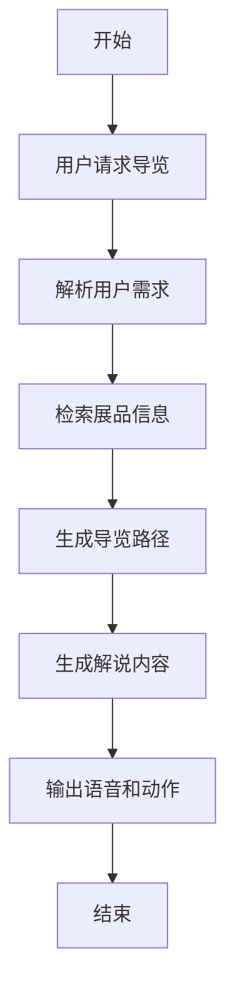
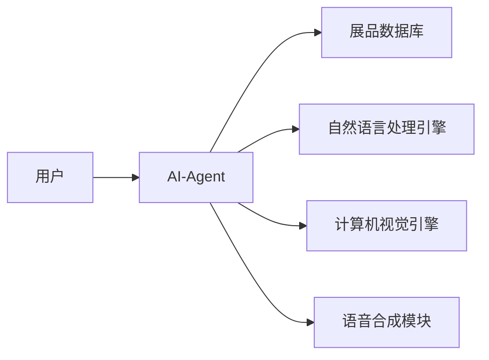

                 


# AI Agent在博物馆中的应用：智能导览与展品解说

> 关键词：AI Agent, 博物馆, 智能导览, 展品解说, 人工智能, 系统架构

> 摘要：本文探讨了AI Agent在博物馆中的应用，特别是智能导览和展品解说。文章详细介绍了AI Agent的核心原理，分析了其在博物馆环境中的系统架构，并通过实际案例展示了如何实现智能导览服务。文章还提供了技术实现的详细代码示例和系统设计图，帮助读者理解AI Agent在博物馆中的实际应用。

---

## 第一部分: AI Agent在博物馆中的应用概述

### 第1章: 背景介绍

#### 1.1 问题背景
- 博物馆作为重要的文化机构，每年吸引大量游客参观。传统的导览服务依赖于人工讲解员，存在成本高、效率低、个性化不足等问题。
- 随着人工智能技术的发展，AI Agent（智能代理）被引入博物馆导览领域，以提供更加智能化、个性化和高效的导览服务。

#### 1.2 问题描述
- 用户需求多样化：不同游客对展品的兴趣点不同，需要个性化的导览服务。
- 展品信息复杂：博物馆展品数量多，信息丰富，如何高效组织和检索信息是关键。
- 导览服务的实时性：用户希望导览服务能够实时响应，提供最新的展品信息和动态。

#### 1.3 问题解决
- 引入AI Agent，通过自然语言处理、计算机视觉和机器学习等技术，实现智能导览和展品解说。
- AI Agent能够实时感知用户需求，快速检索展品信息，并以自然流畅的方式进行讲解。

#### 1.4 边界与外延
- AI Agent的功能边界：主要集中在导览和解说服务，不涉及博物馆的其他管理系统。
- 与其他系统的接口：与博物馆展品数据库、用户交互界面、以及其他辅助系统（如预约系统）进行集成。
- 应用范围的扩展性：AI Agent不仅适用于博物馆，还可以扩展到其他类似场景，如企业展厅、景区导览等。

---

### 第2章: 核心概念与联系

#### 2.1 AI Agent的核心原理
- **感知层**：通过自然语言处理和计算机视觉技术，感知用户的需求和展品信息。
- **决策层**：基于用户需求和展品信息，生成最优的导览路径和解说内容。
- **执行层**：通过语音合成和动作控制，实现与用户的交互和导览设备的控制。

#### 2.2 核心概念对比
| 核心概念       | 基于规则的AI Agent | 基于学习的AI Agent |
|----------------|--------------------|--------------------|
| **优点**       | 实现简单，成本低 | 学习能力强，适应性高 |
| **缺点**       | 需要手动编写规则 | 对数据依赖性强 |
| **适用场景**   | 规则明确的简单任务 | 复杂、动态的场景 |

#### 2.3 实体关系图
```mermaid
erd
    理论
    理论->实体: 博物馆
    实体
    实体->用户: 用户
    实体->展品: 展品
    实体->AI Agent: AI Agent
    用户-->展品: 查看
    用户-->AI Agent: 请求导览
    AI Agent-->展品: 获取信息
```

---

### 第3章: 算法原理

#### 3.1 感知层
- **自然语言处理**：用于理解和解析用户的查询请求。
- **目标检测**：通过计算机视觉技术识别展品的图像特征。

#### 3.2 决策层
- **路径规划**：基于展品的位置信息，生成最优导览路径。
- **展品优先级排序**：根据用户兴趣和展品的重要性，确定讲解顺序。

#### 3.3 执行层
- **语音合成**：将解说内容转化为自然的语音输出。
- **动作规划**：控制导览设备（如机器人或电子屏幕）进行展示。

#### 3.4 算法流程图


---

### 第4章: 系统分析与架构设计

#### 4.1 系统功能设计
- **用户识别**：通过二维码或人脸识别技术确认用户身份。
- **展品信息检索**：基于用户兴趣和展品标签，快速检索相关信息。
- **导览路径规划**：结合展品分布和用户需求，生成最优路径。
- **解说内容生成**：根据展品信息和用户需求，生成个性化的解说内容。
- **交互反馈**：实时收集用户反馈，优化导览服务。

#### 4.2 系统架构图


---

### 第5章: 项目实战

#### 5.1 环境安装
- **Python 3.8+**
- 安装依赖：`numpy`, `tensorflow`, `pytorch`, `transformers`

#### 5.2 核心代码实现
```python
# 展品信息检索模块
class ExhibitInfoRetrieval:
    def __init__(self, exhibit_db):
        self.exhibit_db = exhibit_db

    def retrieve_info(self, exhibit_id):
        return self.exhibit_db.get(exhibit_id)

# 解说内容生成模块
class TourGuide:
    def __init__(self, nlp_engine, cv_engine):
        self.nlp_engine = nlp_engine
        self.cv_engine = cv_engine

    def generate_tour(self, user_query, exhibit_ids):
        # 解析用户需求
        user_interests = self.nlp_engine.analyze(user_query)
        # 生成导览路径
        path = self.generate_path(exhibit_ids, user_interests)
        # 生成解说内容
        tour_content = self.generate_tour_content(path, user_interests)
        return tour_content

    def generate_path(self, exhibit_ids, interests):
        # 简单的路径规划算法，可根据具体需求扩展
        return exhibit_ids
```

#### 5.3 案例分析
- **用户查询**：用户输入“我对印象派画作感兴趣”。
- **系统响应**：
  1. 分析用户兴趣，检索相关展品信息。
  2. 生成导览路径，优先推荐印象派代表作品。
  3. 生成个性化的解说内容，并通过语音合成模块输出。

---

### 第6章: 最佳实践

#### 6.1 小结
- AI Agent在博物馆中的应用显著提升了导览服务的效率和用户体验。
- 通过自然语言处理、计算机视觉和机器学习等技术，实现了智能化的导览和解说。

#### 6.2 注意事项
- 数据隐私保护：确保用户数据和展品信息的安全性。
- 系统稳定性：确保AI Agent在复杂环境下的稳定运行。
- 设备兼容性：支持多种导览设备和交互方式。

#### 6.3 拓展阅读
- 《深度学习入门：基于Python的实践》
- 《自然语言处理实战：基于TensorFlow和Keras》

---

## 作者

作者：AI天才研究院 & 禅与计算机程序设计艺术

