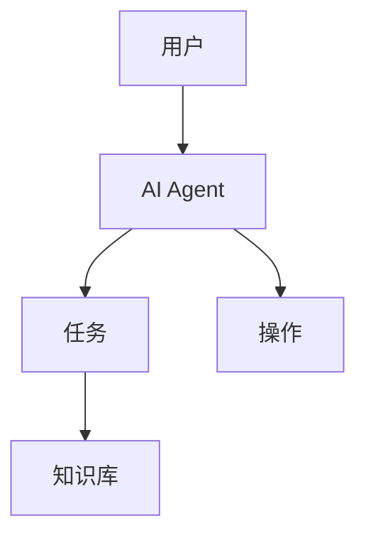
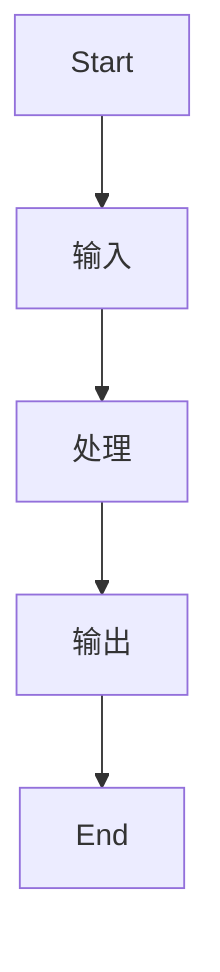
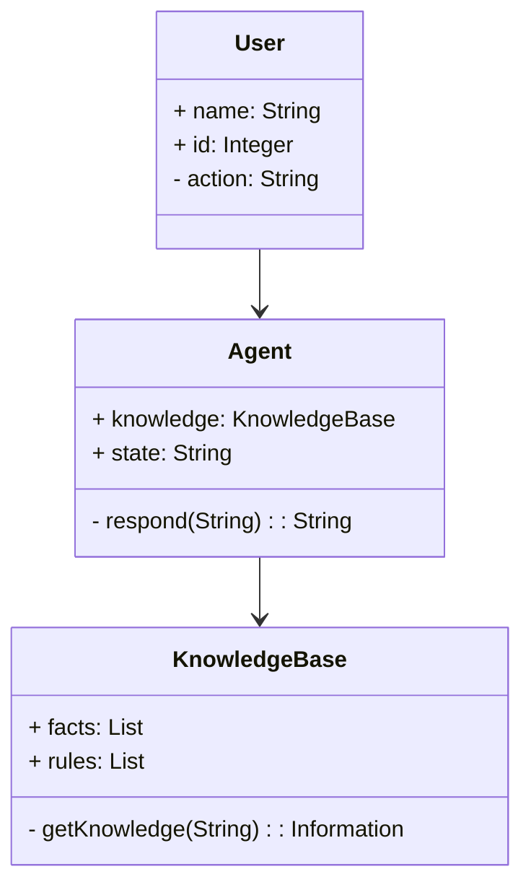

                 


# AI Agent在各行业中的应用场景

> 关键词：AI Agent, 人工智能, 应用场景, 机器学习, 自然语言处理

> 摘要：本文深入探讨了AI Agent在不同行业中的应用场景，分析了其核心技术、算法原理、系统架构，并通过具体案例展示了AI Agent的实际应用，最后总结了最佳实践和未来发展方向。

---

## 第一章: AI Agent 的背景与核心概念

### 1.1 AI Agent 的基本概念

#### 1.1.1 什么是 AI Agent
AI Agent（人工智能代理）是一种能够感知环境、执行任务并做出决策的智能体。它通过接收输入、处理信息、执行操作来实现特定目标，可以在多种场景中与人类或系统交互。

#### 1.1.2 AI Agent 的核心特征
- **自主性**：能够在没有外部干预的情况下独立运行。
- **反应性**：能够实时感知环境并做出响应。
- **目标导向**：根据预设目标执行任务。
- **学习能力**：通过数据和经验不断优化性能。

#### 1.1.3 AI Agent 的分类与应用场景
AI Agent可以分为**基于规则**、**基于知识**和**基于学习**三类。应用场景包括企业自动化、智能客服、金融投资等。

### 1.2 AI Agent 的技术基础

#### 1.2.1 自然语言处理（NLP）
NLP使AI Agent能够理解和生成人类语言，如情感分析、机器翻译和问答系统。

#### 1.2.2 机器学习（ML）
ML为AI Agent提供数据驱动的决策能力，包括分类、回归和聚类。

#### 1.2.3 知识图谱与推理
知识图谱帮助AI Agent构建领域知识，推理技术使其能够进行逻辑推理。

---

## 第二章: AI Agent 的核心技术与联系

### 2.1 AI Agent 的核心原理

#### 2.1.1 知识表示与推理
知识表示通常使用图结构，推理基于逻辑规则或概率模型。

#### 2.1.2 语义理解与生成
通过NLP技术理解上下文，并生成自然语言回复。

#### 2.1.3 多轮对话与记忆
记忆机制帮助AI Agent保持上下文，多轮对话使其更自然。

### 2.2 AI Agent 的核心概念对比

#### 2.2.1 传统AI与AI Agent 的区别
传统AI处理特定任务，AI Agent具备自主性和目标导向。

#### 2.2.2 单一任务与多任务 AI Agent 的对比
单一任务专注于特定任务，多任务具备广泛适应性。

#### 2.2.3 基于规则与基于学习的 AI Agent 的差异
基于规则依赖预定义规则，基于学习通过数据训练获得能力。

### 2.3 AI Agent 的 ER 实体关系图


### 2.4 AI Agent 的算法流程图


---

## 第三章: AI Agent 的算法原理与数学模型

### 3.1 基于规则的 AI Agent 算法

#### 3.1.1 规则定义与匹配
通过预定义规则匹配输入，输出对应操作。

#### 3.1.2 规则库的构建与管理
使用数据库或知识库存储规则，动态更新和优化。

#### 3.1.3 基于规则的推理过程
$$ P(A|B) = \frac{P(B|A)P(A)}{P(B)} $$

### 3.2 基于学习的 AI Agent 算法

#### 3.2.1 基于深度学习的模型
使用神经网络进行特征提取和分类。

#### 3.2.2 基于强化学习的模型
通过奖励机制优化决策策略。

#### 3.2.3 基于迁移学习的模型
利用已有知识快速适应新任务。

---

## 第四章: AI Agent 的系统架构设计

### 4.1 系统架构介绍

#### 4.1.1 功能模块划分
- **输入处理模块**：接收用户输入。
- **推理引擎**：执行逻辑推理。
- **输出生成模块**：生成自然语言回复。

#### 4.1.2 数据流分析
从输入到输出的数据流动过程。

#### 4.1.3 交互流程设计
用户与AI Agent的对话流程。

### 4.2 系统架构图


---

## 第五章: AI Agent 的项目实战

### 5.1 项目背景

#### 5.1.1 项目介绍
一个模拟股票交易的AI Agent系统。

#### 5.1.2 项目目标
实现股票数据监控和自动交易。

### 5.2 系统实现

#### 5.2.1 环境安装
安装Python、TensorFlow和Keras库。

#### 5.2.2 核心代码实现
```python
class AIAgent:
    def __init__(self):
        self.knowledge = {}

    def perceive(self, input_data):
        return self.reason(input_data)

    def reason(self, input_data):
        # 基于知识库推理
        pass

    def act(self, decision):
        # 执行操作
        pass

    def learn(self, feedback):
        # 更新知识库
        pass
```

#### 5.2.3 功能解读与案例分析
通过股票数据训练AI Agent进行预测和交易。

### 5.3 项目总结

#### 5.3.1 成果展示
成功实现了股票交易AI Agent。

#### 5.3.2 经验总结
数据质量和模型选择对性能影响巨大。

---

## 第六章: AI Agent 的最佳实践与未来展望

### 6.1 最佳实践 tips

#### 6.1.1 数据质量的重要性
高质量数据是模型性能的基础。

#### 6.1.2 模型选择的策略
根据任务需求选择合适模型。

#### 6.1.3 持续优化的路径
定期更新模型和优化算法。

### 6.2 小结

AI Agent在各行业中的应用前景广阔，随着技术进步，其能力将更加智能化。

### 6.3 未来展望

AI Agent将深度融合行业知识，具备更强的自主学习和决策能力。

---

## 作者：AI天才研究院 & 禅与计算机程序设计艺术

---

**附录：**  
- **参考文献**：列出使用的资料和文献。  
- **术语表**：解释文章中使用的专业术语。  
- **代码仓库**：提供项目代码的GitHub链接。  

---

通过以上内容，读者可以全面了解AI Agent的技术细节和应用场景，为实际应用提供理论和实践指导。

