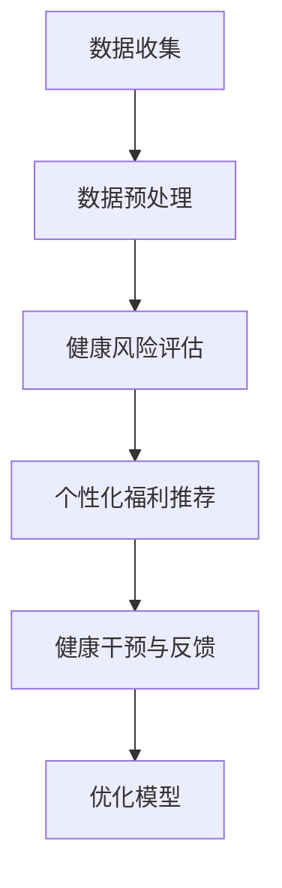
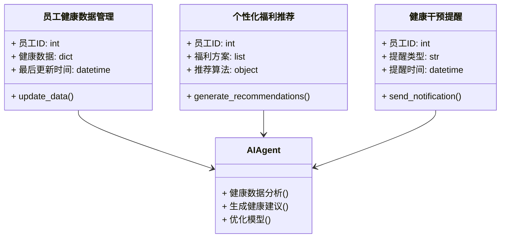
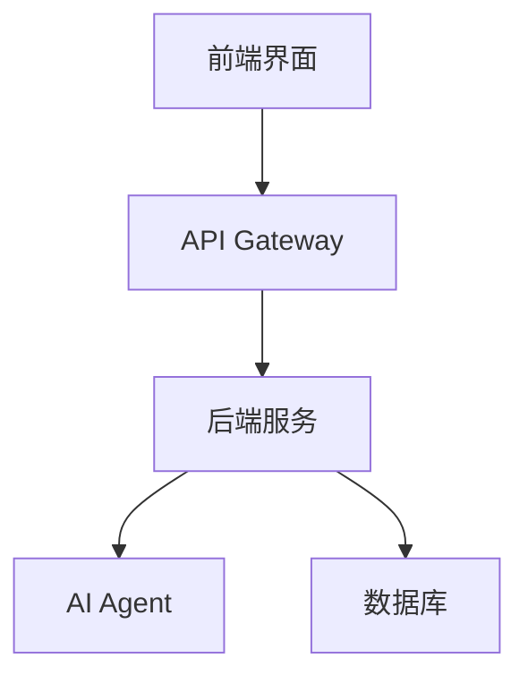
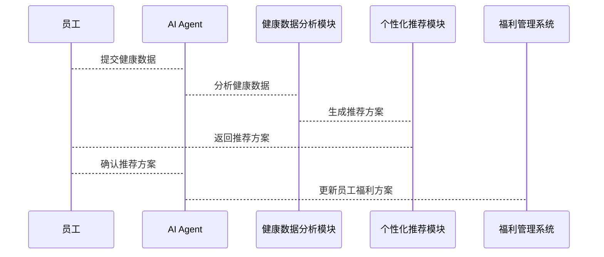

                 


# 第四部分: 算法原理讲解

## 4.1 算法流程

AI Agent在员工健康与福利管理中的算法流程可以分解为以下几个步骤：

1. **数据收集**：从员工健康记录、行为数据、环境数据等多源数据中收集相关信息。
2. **数据预处理**：清洗数据，去除噪声，进行数据标准化和特征提取。
3. **健康风险评估**：利用机器学习模型预测员工的健康风险，如慢性病风险、心理健康问题等。
4. **个性化福利推荐**：基于员工的健康状况和偏好，推荐适合的福利方案，如健康保险、健身计划等。
5. **健康干预与反馈**：通过智能提醒和个性化建议，帮助员工采取健康行动，并收集反馈以优化模型。

以下是一个简单的健康风险评估算法流程图：



## 4.2 代码实现

以下是一个简单的Python代码示例，用于基于规则的健康建议生成：

```python
import pandas as pd
import numpy as np

# 示例数据集：员工健康数据
data = {
    '员工ID': [1, 2, 3, 4, 5],
    'BMI': [22, 28, 25, 32, 20],
    '血压': [120, 140, 130, 150, 110],
    '胆固醇': [200, 220, 180, 240, 190],
    '吸烟习惯': ['是', '否', '否', '是', '否']
}

df = pd.DataFrame(data)

# 健康风险评估函数
def assess_health(r):
    risk = 0
    if r['BMI'] > 30:
        risk += 1
    if r['血压'] > 140:
        risk += 1
    if r['胆固醇'] > 200:
        risk += 1
    if r['吸烟习惯'] == '是':
        risk += 2
    return risk

# 生成健康建议
def generate_recommendation(risk_level):
    if risk_level == 0:
        return "保持健康的生活方式，定期体检。"
    elif risk_level == 1:
        return "注意饮食，适量运动。"
    elif risk_level == 2:
        return "监测血压和胆固醇水平，减少吸烟。"
    else:
        return "立即咨询医生，进行全面健康检查。"

# 应用健康评估和生成建议
df['健康风险'] = df.apply(assess_health, axis=1)
df['健康建议'] = df['健康风险'].apply(generate_recommendation)

print(df)
```

## 4.3 数学模型

健康风险评估可以使用概率论模型，例如逻辑回归。以下是一个简单的健康风险评估模型示例：

$$ P(\text{健康风险} | X) = \frac{e^{\beta_0 + \beta_1 X_1 + \beta_2 X_2 + \dots + \beta_n X_n}}{1 + e^{\beta_0 + \beta_1 X_1 + \beta_2 X_2 + \dots + \beta_n X_n}} $$

其中，\(X_i\) 是输入特征，\(\beta_i\) 是模型参数，通过训练数据进行估计。

例如，假设员工的BMI为30，血压为150，胆固醇为220，吸烟习惯为“是”，我们可以计算出其健康风险的概率。

---

# 第五部分: 系统分析与架构设计方案

## 5.1 问题场景介绍

在现代企业中，员工健康与福利管理涉及多个方面，包括健康数据管理、个性化福利推荐、健康干预提醒等。传统的管理模式依赖人工操作，效率低下且难以满足个性化需求。AI Agent可以通过自动化和智能化的方式，提升管理效率和员工体验。

## 5.2 项目介绍

本项目旨在开发一个基于AI Agent的员工健康与福利管理系统，通过收集和分析员工的健康数据，提供个性化的健康建议和福利推荐，帮助员工改善健康状况，同时降低企业的管理成本。

## 5.3 系统功能设计

以下是系统的功能模块设计：



## 5.4 系统架构设计

以下是系统的架构设计图：



## 5.5 系统接口设计

系统主要接口包括：

1. 数据接口：从数据库中获取员工健康数据。
2. 推荐接口：根据员工健康数据生成个性化福利推荐。
3. 提醒接口：发送健康干预提醒。

## 5.6 系统交互设计

以下是一个典型的系统交互流程图：



---

# 第六部分: 项目实战

## 6.1 环境安装

为了运行本项目，您需要安装以下Python库：

```bash
pip install pandas numpy scikit-learn matplotlib
```

## 6.2 核心代码实现

以下是项目的核心代码实现：

```python
import pandas as pd
from sklearn.model_selection import train_test_split
from sklearn.linear_model import LogisticRegression
from sklearn.metrics import accuracy_score

# 示例数据集：员工健康数据
data = {
    'BMI': [22, 28, 25, 32, 20],
    '血压': [120, 140, 130, 150, 110],
    '胆固醇': [200, 220, 180, 240, 190],
    '吸烟习惯': ['是', '否', '否', '是', '否'],
    '健康风险': [0, 1, 0, 2, 0]
}

df = pd.DataFrame(data)

# 数据预处理
# 将分类变量转换为数值
df['吸烟习惯'] = df['吸烟习惯'].map({'是': 1, '否': 0})

# 划分训练集和测试集
X = df[['BMI', '血压', '胆固醇', '吸烟习惯']]
y = df['健康风险']
X_train, X_test, y_train, y_test = train_test_split(X, y, test_size=0.2, random_state=42)

# 训练逻辑回归模型
model = LogisticRegression()
model.fit(X_train, y_train)

# 预测和评估
y_pred = model.predict(X_test)
print("模型准确率:", accuracy_score(y_test, y_pred))

# 生成健康建议
def generate_health_advice(predicted_risk):
    advice = {
        0: "保持健康的生活方式，定期体检。",
        1: "注意饮食，适量运动。",
        2: "监测血压和胆固醇水平，减少吸烟。",
        3: "立即咨询医生，进行全面健康检查。"
    }
    return advice[predicted_risk]

# 应用模型生成健康建议
predicted_risks = model.predict(X)
df['健康建议'] = predicted_risks.apply(generate_health_advice)

print(df)
```

## 6.3 实际案例分析

以一名BMI为30，血压为150，胆固醇为220，吸烟习惯为“是”的员工为例，模型预测其健康风险为2，对应的健康建议为“监测血压和胆固醇水平，减少吸烟。”

---

# 第七部分: 最佳实践与未来展望

## 7.1 小结

AI Agent在员工健康与福利管理中的应用前景广阔。通过智能化的数据分析和个性化推荐，AI Agent能够显著提升员工健康管理和福利管理的效率和效果。

## 7.2 注意事项

1. **数据隐私保护**：在处理员工健康数据时，必须严格遵守数据隐私法规，确保数据安全。
2. **模型的可解释性**：复杂的AI模型可能会导致决策过程不透明，因此需要确保模型的可解释性。
3. **持续优化**：定期更新模型和算法，以适应员工健康需求的变化。

## 7.3 拓展阅读

- 《机器学习实战》
- 《深度学习》
- 《人工智能：一种现代方法》

---

# 总结

AI Agent在员工健康与福利管理中的应用前景非常光明。通过智能化的数据分析和个性化推荐，AI Agent能够显著提升员工健康管理和福利管理的效率和效果。然而，实现这一目标需要克服数据隐私保护、模型可解释性等挑战。未来，随着技术的不断进步，AI Agent将在这一领域发挥越来越重要的作用。

作者：AI天才研究院/AI Genius Institute & 禅与计算机程序设计艺术 /Zen And The Art of Computer Programming

