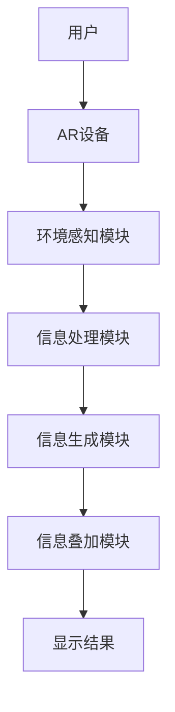
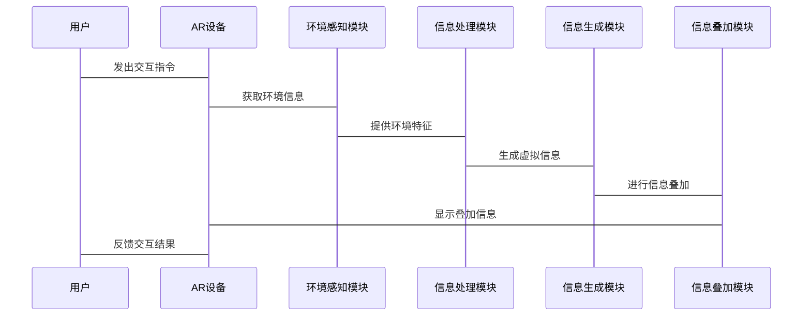

                 


# AI Agent在增强现实中的应用：实时信息叠加与交互

> 关键词：AI Agent, 增强现实, 实时信息叠加, 交互设计, 计算机视觉, 自然语言处理

> 摘要：  
> 本文深入探讨了AI Agent在增强现实（AR）中的应用，重点关注实时信息叠加与交互技术。通过分析AI Agent的核心功能，结合增强现实的技术特点，阐述了AI Agent如何在AR环境中实现信息的实时处理、叠加与交互。本文从背景、原理、算法、系统架构到项目实战，全面解析了AI Agent在AR中的应用场景、技术实现与未来发展方向，为读者提供了一条系统的学习和实践路径。

---

## 第一部分: AI Agent与增强现实的背景与基础

### 第1章: AI Agent与增强现实概述

#### 1.1 增强现实的基本概念
增强现实（Augmented Reality，AR）是一种将数字信息叠加在真实物理世界上的技术，通过计算机视觉、图形学和传感器技术，实现虚拟内容与现实环境的无缝融合。AR的核心目标是为用户提供更加丰富的视觉体验，使其能够与虚拟对象进行交互。

**特点：**
- **实时性**：AR需要在实时环境中叠加虚拟信息。
- **交互性**：用户可以通过手势、语音或视觉等方式与AR内容进行交互。
- **沉浸性**：AR通过叠加虚拟元素，增强用户的沉浸感。

**应用场景：**
- **教育**：如虚拟解剖、历史重现。
- **医疗**：如手术模拟、患者信息实时显示。
- **游戏**：如AR游戏《Pokémon Go》。
- **工业**：如设备维修指导、工厂布局优化。

#### 1.2 AI Agent的基本概念
AI Agent（人工智能代理）是一种能够感知环境、自主决策并执行任务的智能实体。AI Agent的核心能力包括：
- **感知**：通过传感器或数据源获取环境信息。
- **推理**：基于感知信息进行逻辑推理。
- **决策**：根据推理结果做出最优选择。
- **执行**：通过执行机构或接口与环境交互。

**特点：**
- **自主性**：AI Agent能够独立完成任务。
- **反应性**：能够实时感知并响应环境变化。
- **学习性**：能够通过经验改进自身性能。

**应用场景：**
- **智能助手**：如Siri、Google Assistant。
- **推荐系统**：基于用户行为推荐个性化内容。
- **自动驾驶**：通过环境感知和决策实现自主驾驶。

#### 1.3 AI Agent与增强现实的结合
AI Agent与增强现实的结合，使得AR系统能够更加智能化。AI Agent可以实时处理环境信息，分析用户需求，并通过AR技术将信息叠加到用户视野中。

**作用：**
- **信息处理**：AI Agent能够快速分析环境数据，提取有用信息。
- **用户交互**：通过AI Agent实现更自然的用户交互方式。
- **任务执行**：AI Agent可以协助用户完成复杂任务，如导航、信息查询等。

**结合方式：**
- **基于视觉的交互**：AI Agent通过计算机视觉技术识别环境中的物体或场景。
- **基于语音的交互**：AI Agent通过自然语言处理技术理解用户的语音指令。
- **基于手势的交互**：AI Agent通过手势识别技术感知用户的动作。

---

### 第2章: 增强现实中的实时信息叠加

#### 2.1 实时信息叠加的基本原理
实时信息叠加是指将虚拟信息实时叠加到用户视野中，使其与物理环境融为一体。其实现过程包括以下几个步骤：
1. **环境感知**：通过摄像头、传感器等设备获取物理环境信息。
2. **信息处理**：对环境信息进行分析，提取关键特征。
3. **信息生成**：根据用户需求生成相应的虚拟信息。
4. **信息叠加**：将虚拟信息叠加到物理环境中，并通过AR设备呈现给用户。

#### 2.2 AI Agent在实时信息叠加中的作用
AI Agent在实时信息叠加中扮演了关键角色，主要体现在以下几个方面：
- **信息处理**：AI Agent能够快速分析环境信息，提取有用特征。
- **信息生成**：AI Agent可以根据用户需求生成个性化的虚拟信息。
- **信息管理**：AI Agent可以动态调整信息的显示位置和内容，以适应用户需求。

#### 2.3 AI Agent与实时信息叠加的结合
AI Agent与实时信息叠加的结合，使得AR系统能够更加智能化和个性化。AI Agent可以通过以下方式实现信息的动态管理：
- **动态调整信息位置**：根据用户的视角和动作，实时调整信息的显示位置。
- **动态更新信息内容**：根据环境变化或用户需求，实时更新信息内容。
- **智能推荐信息**：基于用户的兴趣和行为，推荐相关的信息内容。

---

### 第3章: 增强现实中的交互技术

#### 3.1 增强现实中的交互方式
在增强现实系统中，用户可以通过多种方式与系统进行交互，主要包括以下几种：
- **手势交互**：用户通过手势动作与系统进行交互。
- **语音交互**：用户通过语音指令与系统进行交互。
- **视觉交互**：用户通过注视或眼神与系统进行交互。

#### 3.2 AI Agent在交互中的应用
AI Agent在增强现实中的交互中扮演了重要角色，主要体现在以下几个方面：
- **智能交互**：AI Agent可以通过自然语言处理技术理解用户的意图，并通过计算机视觉技术识别用户的手势或动作。
- **个性化交互**：AI Agent可以根据用户的个性化需求，提供定制化的交互方式。
- **动态适应**：AI Agent可以根据环境变化或用户需求，动态调整交互方式。

---

## 第四部分: 系统架构与算法实现

### 第4章: 系统架构设计

#### 4.1 系统功能设计
- **环境感知模块**：通过摄像头、传感器等设备获取物理环境信息。
- **信息处理模块**：对环境信息进行分析，提取有用特征。
- **信息生成模块**：根据用户需求生成相应的虚拟信息。
- **信息叠加模块**：将虚拟信息叠加到物理环境中，并通过AR设备呈现给用户。

#### 4.2 系统架构图


#### 4.3 接口设计
- **用户接口**：通过AR设备与用户进行交互。
- **系统接口**：与其他系统或服务进行通信。

#### 4.4 交互流程图


---

### 第5章: 算法原理与实现

#### 5.1 图像识别与目标检测
- **图像识别**：通过深度学习模型（如CNN）识别图像中的物体或场景。
- **目标检测**：通过YOLO、Faster R-CNN等算法检测图像中的目标。

#### 5.2 语音识别与自然语言处理
- **语音识别**：通过Kaldi、Google Speech API等技术将语音转换为文本。
- **自然语言处理**：通过词袋模型、TF-IDF等技术理解文本内容。

#### 5.3 实时信息叠加算法
- **图像融合**：将虚拟信息与物理环境图像进行融合，常用的方法包括Alpha混合、遮罩融合等。
- **几何变换**：根据用户的视角和位置，对虚拟信息进行几何变换，以实现真实感。

---

## 第五部分: 项目实战与优化

### 第6章: 项目实战

#### 6.1 环境安装
- **开发工具**：安装PyCharm、VS Code等开发工具。
- **深度学习框架**：安装TensorFlow、Keras等深度学习框架。
- **AR开发框架**：安装OpenCV、ARKit、ARCore等AR开发框架。

#### 6.2 核心代码实现
- **图像识别**：
  ```python
  import cv2
  def detect_objects(image):
      # 这里可以使用预训练的模型进行目标检测
      pass
  ```
- **信息叠加**：
  ```python
  def overlay_info(image, overlay):
      # 这里可以将虚拟信息与物理环境图像进行融合
      pass
  ```

#### 6.3 项目小结
通过项目实战，我们可以看到AI Agent在增强现实中的应用潜力。通过结合图像识别、自然语言处理等技术，可以实现更加智能化的实时信息叠加与交互。

---

### 第7章: 最佳实践与注意事项

#### 7.1 小结
- AI Agent在增强现实中的应用前景广阔，可以通过结合多种技术实现智能化的实时信息叠加与交互。
- 在实际应用中，需要注意系统的实时性、准确性和用户隐私保护。

#### 7.2 注意事项
- **实时性**：确保系统的实时性，避免信息延迟。
- **准确性**：保证信息处理的准确性，避免错误信息的叠加。
- **用户体验**：注重用户体验，设计自然、直观的交互方式。

#### 7.3 拓展阅读
- 推荐阅读《增强现实技术与应用》、《人工智能与机器学习》等书籍，深入学习相关技术。

---

## 作者信息

作者：AI天才研究院/AI Genius Institute & 禅与计算机程序设计艺术 /Zen And The Art of Computer Programming

