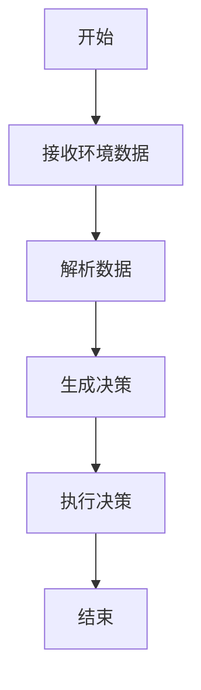

                 


# AI Agent在太空探索中的自主决策系统

> 关键词：AI Agent，自主决策系统，太空探索，算法原理，系统架构

> 摘要：本文探讨AI Agent在太空探索中的应用，重点分析自主决策系统的原理、算法实现和系统架构设计。通过实际案例，详细讲解AI Agent如何在复杂太空环境中做出决策，并提供系统的数学模型和代码实现。

---

## 第1章: 问题背景与概念解析

### 1.1 问题背景
#### 1.1.1 太空探索的挑战
太空探索面临极端环境和复杂任务，如远距离通信延迟、不可预测的障碍和资源限制，需要智能系统实时决策。

#### 1.1.2 AI Agent在太空探索中的必要性
AI Agent能处理不确定性，实时做出最优决策，适用于火星探测器和深空探测任务。

#### 1.1.3 当前技术的局限性与AI Agent的解决方案
传统依赖地面控制的方式效率低，AI Agent提供自主决策能力，减少依赖。

### 1.2 问题描述
#### 1.2.1 太空探索中的决策问题
涉及路径规划、资源管理、故障处理等复杂决策。

#### 1.2.2 AI Agent在复杂环境中的应用需求
需要在资源受限、通信延迟的环境中自主决策。

#### 1.2.3 自主决策系统的定义与目标
系统能在不确定环境中自主感知、推理、规划和执行。

### 1.3 问题解决
#### 1.3.1 AI Agent的核心功能
感知、推理、规划、执行，实现自主决策。

#### 1.3.2 自主决策系统的实现路径
传感器数据处理、决策模型构建、执行反馈闭环。

#### 1.3.3 技术实现的关键点
实时数据处理、高效算法、鲁棒性设计。

### 1.4 边界与外延
#### 1.4.1 AI Agent的适用范围
适用于无人探测器、深空任务，不适用于需要人类监督的任务。

#### 1.4.2 系统边界与功能限制
决策范围受限，无法处理超出设计范围的问题。

#### 1.4.3 太空探索中的相关技术领域
涉及机器人技术、通信技术、能源技术。

### 1.5 核心概念与组成
#### 1.5.1 AI Agent的基本组成
感知模块、推理模块、规划模块、执行模块。

#### 1.5.2 自主决策系统的结构
传感器、决策引擎、执行机构。

#### 1.5.3 相关技术的协同作用
机器学习、自然语言处理、计算机视觉协同工作。

---

## 第2章: AI Agent的核心原理

### 2.1 AI Agent的定义与特点
AI Agent是智能体，具备主动性、反应性、学习能力和适应性，与传统自动化不同。

### 2.2 自主决策系统的原理
通过感知环境、分析问题、制定计划、执行决策并反馈结果。

### 2.3 AI Agent与自主决策系统的联系
AI Agent是决策系统的核心，提供感知和推理能力，决策系统负责执行。

---

## 第3章: 核心概念的对比分析

### 3.1 AI Agent与传统自动化的对比
| 属性         | AI Agent       | 传统自动化    |
|--------------|----------------|--------------|
| 决策能力     | 自主学习       | 预定义规则    |
| 环境适应     | 强             | 弱            |
| 应用场景     | 复杂动态环境    | 稳定环境      |

### 3.2 自主决策系统与人工决策的对比
| 属性         | 自主决策系统    | 人工决策      |
|--------------|----------------|--------------|
| 决策主体     | AI Agent       | 人类          |
| 决策速度     | 快             | 可能较慢      |
| 决策精度     | 高             | 取决于经验    |

### 3.3 AI Agent与机器学习模型的对比
AI Agent具备自主性和适应性，而机器学习模型需要外部输入。

---

## 第4章: 实体关系与架构设计

### 4.1 实体关系分析
AI Agent与环境、任务、资源实体交互，通过传感器获取数据，通过执行机构作用于环境。

### 4.2 系统架构设计
模块化设计，包括感知层、决策层、执行层，各层通过接口通信。

### 4.3 ER实体关系图
- 实体：AI Agent、环境、任务。
- 关系：AI Agent感知环境，根据任务执行决策。

---

## 第5章: 算法原理与数学模型

### 5.1 算法流程图


### 5.2 Python实现代码
```python
import numpy as np

def decide_action(sensor_data):
    # 解析数据
    state = parse_sensor_data(sensor_data)
    # 生成决策
    action = policy_network.predict(state)
    return action

def parse_sensor_data(data):
    # 示例解析函数
    return np.array(data).reshape(-1, 10)
```

### 5.3 数学模型
$$ P(a|s) = \text{softmax}(Q(s,a)) $$
其中，$s$是状态，$a$是动作，$Q$是评估函数。

---

## 第6章: 系统分析与架构设计

### 6.1 问题场景介绍
以火星探测器为例，描述其在火星表面的自主导航任务。

### 6.2 系统功能设计
领域模型类图展示各模块关系，如感知模块、决策模块、执行模块。

### 6.3 系统架构设计
架构图展示分层结构，各层模块交互关系。

### 6.4 系统接口设计
定义传感器接口、决策接口、执行接口。

### 6.5 系统交互序列图
展示从传感器数据接收，到决策生成，再到执行的交互流程。

---

## 第7章: 项目实战

### 7.1 环境安装
安装Python、TensorFlow、ROS等工具。

### 7.2 核心代码实现
实现AI Agent的感知、决策、执行模块，提供代码示例。

### 7.3 案例分析与解读
分析AI Agent在火星探测中的实际应用，如导航避障。

### 7.4 项目总结
总结项目成果，AI Agent在太空探索中的潜力。

---

## 第8章: 最佳实践与小结

### 8.1 最佳实践 tips
确保算法高效，数据准确，系统鲁棒。

### 8.2 小结
AI Agent在太空探索中发挥重要作用，提升任务成功率。

### 8.3 注意事项
数据质量和算法选择影响决策效果，需谨慎处理。

### 8.4 拓展阅读
推荐相关书籍和论文，深入学习AI Agent技术。

---

作者：AI天才研究院

