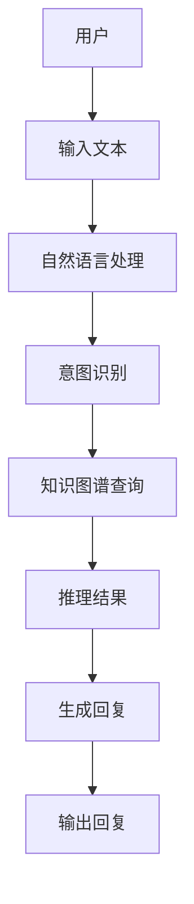
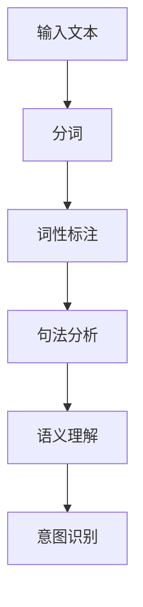
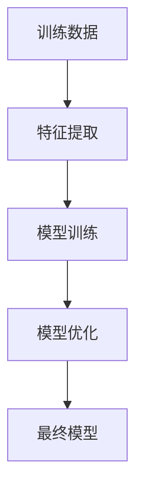
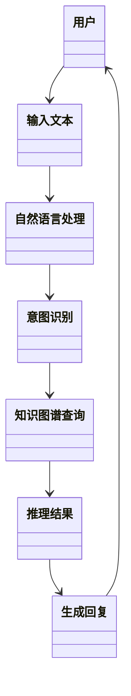
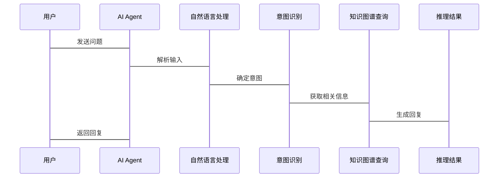

                 


# AI Agent在客户服务中的应用

> 关键词：AI Agent, 客户服务, 自然语言处理, 机器学习, 知识图谱

> 摘要：AI Agent在客户服务中的应用是一种基于人工智能技术的新型服务模式，它通过自然语言处理、机器学习和知识图谱等技术实现智能化客户服务。本文从AI Agent的基本概念、核心原理、算法实现、系统设计和项目实战等方面进行详细分析，探讨其在客户服务中的应用前景。

---

# 第一部分: AI Agent在客户服务中的应用概述

# 第1章: AI Agent的基本概念与背景

## 1.1 AI Agent的定义与特点
### 1.1.1 什么是AI Agent
AI Agent（人工智能代理）是一种能够感知环境、自主决策并执行任务的智能系统。在客户服务领域，AI Agent通常以聊天机器人或虚拟助手的形式出现，能够通过自然语言处理技术与用户进行交互。

### 1.1.2 AI Agent的核心特点
- **智能化**：基于机器学习和深度学习技术，能够理解和生成自然语言。
- **自主性**：能够在没有人工干预的情况下独立完成任务。
- **适应性**：能够根据用户需求和环境变化动态调整行为。
- **可扩展性**：支持多种交互渠道，如文本、语音、视频等。

### 1.1.3 AI Agent与传统客服的区别
传统客服主要依赖人工操作，而AI Agent能够实现24/7的全天候服务，且能够同时处理多个客户需求，显著提高了服务效率。

---

## 1.2 客户服务中的AI Agent应用背景
### 1.2.1 客户服务的现状与挑战
- **人工成本高**：传统客服需要大量人工坐席执行，成本高昂。
- **响应速度慢**：在高峰期，客户可能需要等待较长时间才能得到回复。
- **服务质量不一致**：人工客服可能存在情绪波动，导致服务质量不稳定。

### 1.2.2 AI技术在客户服务中的潜力
- **提高效率**：AI Agent能够快速响应客户需求，减少等待时间。
- **降低成本**：通过自动化处理，显著降低人工成本。
- **提升客户体验**：通过个性化服务和精准推荐，增强客户满意度。

### 1.2.3 AI Agent在客户服务中的优势
- **7x24小时在线服务**：无论何时，客户都能获得及时响应。
- **个性化服务**：基于客户数据和行为分析，提供定制化服务。
- **多渠道支持**：支持文本、语音、视频等多种交互方式。

---

## 1.3 本章小结
本章主要介绍了AI Agent的基本概念、特点以及在客户服务中的应用背景，强调了AI Agent在提高服务效率、降低成本和提升客户体验方面的优势。

---

# 第2章: AI Agent的核心概念与原理

## 2.1 AI Agent的核心概念
### 2.1.1 问题背景
AI Agent在客户服务中的应用需要解决以下问题：
- 如何准确理解客户需求？
- 如何快速生成符合用户期望的回复？
- 如何处理复杂问题时动态调整策略？

### 2.1.2 问题描述
客户服务场景中，AI Agent需要具备以下能力：
- 理解用户的意图和情感。
- 提供准确的信息查询和问题解答。
- 处理复杂对话中的上下文关系。

### 2.1.3 问题解决
通过自然语言处理（NLP）技术，AI Agent能够解析用户输入的文本，提取关键词和意图，并结合知识图谱中的信息生成回复。

### 2.1.4 边界与外延
AI Agent的边界在于其知识库的覆盖范围和处理能力，外延则包括与第三方系统的集成。

### 2.1.5 核心要素组成
AI Agent的核心要素包括：
- **自然语言处理引擎**：用于解析和生成自然语言。
- **知识图谱**：存储和管理领域知识。
- **机器学习模型**：用于训练和优化回复策略。

---

## 2.2 AI Agent的核心原理
### 2.2.1 自然语言处理（NLP）原理
NLP技术包括以下步骤：
1. **文本分词**：将输入文本分割成词语或短语。
2. **词性标注**：为每个词语标注词性（名词、动词、形容词等）。
3. **句法分析**：分析句子的语法结构。
4. **语义理解**：提取文本的意图和实体信息。

### 2.2.2 机器学习与深度学习原理
- **监督学习**：通过标记好的训练数据，训练模型识别特定模式。
- **无监督学习**：通过聚类分析等技术，发现数据中的潜在结构。
- **强化学习**：通过奖励机制，优化模型的决策策略。

### 2.2.3 知识图谱与推理机制
知识图谱是一种图结构的数据表示方式，包含实体和关系。推理机制通过在知识图谱中进行路径搜索，推导出隐含的信息。

---

## 2.3 核心概念与联系
### 2.3.1 核心概念原理
AI Agent的核心概念包括NLP、机器学习和知识图谱，它们共同构成了AI Agent的智能基础。

### 2.3.2 概念属性特征对比表格

| 概念    | 属性            | 特征对比         |
|---------|-----------------|-----------------|
| NLP     | 输入            | 文本             |
|         | 输出            | 意图和实体       |
| 机器学习 | 输入            | 特征向量         |
|         | 输出            | 预测结果         |
| 知识图谱 | 输入            | 实体和关系       |
|         | 输出            | 推理结果         |

### 2.3.3 ER实体关系图架构（Mermaid流程图）


---

## 2.4 本章小结
本章详细介绍了AI Agent的核心概念和原理，包括NLP、机器学习和知识图谱，并通过对比表格和Mermaid图展示了各概念之间的关系。

---

# 第3章: AI Agent的算法原理

## 3.1 算法原理概述
### 3.1.1 自然语言处理流程（Mermaid流程图）


### 3.1.2 机器学习模型训练流程（Mermaid流程图）


---

## 3.2 算法实现
### 3.2.1 Python源代码实现
```python
import nltk
from sklearn.feature_extraction.text import TfidfVectorizer
from sklearn.svm import SVC

# 示例代码：基于SVM的文本分类
def preprocess(text):
    # 分词
    words = nltk.word_tokenize(text)
    # 转换为TF-IDF向量
    vectorizer = TfidfVectorizer()
    X = vectorizer.fit_transform([" ".join(words)])
    return X

# 训练模型
model = SVC()
model.fit(X_train, y_train)

# 预测
X_test = preprocess("用户的问题")
y_pred = model.predict(X_test)
```

### 3.2.2 算法原理的数学模型和公式
- **TF-IDF计算公式**：$$TF-IDF(t, d) = TF(t, d) \times IDF(t)$$
  - TF：词t在文档d中的词频。
  - IDF：词t的逆文档频率。

---

## 3.3 本章小结
本章通过Mermaid流程图和Python代码，详细讲解了AI Agent的算法原理，包括自然语言处理流程和机器学习模型训练流程。

---

# 第4章: AI Agent的数学模型与公式

## 4.1 数学模型概述
### 4.1.1 贝叶斯定理（公式：$$P(A|B) = \frac{P(B|A)P(A)}{P(B)}$$）
贝叶斯定理用于计算在已知条件下某事件发生的概率。

### 4.1.2 马尔可夫链（公式：$$P(Y|X) = \prod_{i=1}^{n} P(y_i|x_i)$$）
马尔可夫链用于描述状态转移的过程。

---

## 4.2 算法原理的详细讲解
### 4.2.1 算法原理的数学推导
以文本分类为例，假设我们要分类的文本为$x$，类别为$y$，则根据贝叶斯定理，后验概率为：
$$P(y|x) = \frac{P(x|y)P(y)}{P(x)}$$

### 4.2.2 举例说明
假设我们要分类的文本是“退款”，类别为“退款请求”。根据贝叶斯定理，计算出属于“退款请求”的概率。

---

## 4.3 本章小结
本章通过数学公式和实例分析，详细讲解了AI Agent中常用的数学模型，包括贝叶斯定理和马尔可夫链。

---

# 第5章: AI Agent的系统分析与架构设计

## 5.1 系统功能设计
### 5.1.1 领域模型（Mermaid类图）


---

## 5.2 系统架构设计
### 5.2.1 系统架构图（Mermaid架构图）
```mermaid
container 客户端 {
    front-end
}
container 服务端 {
    AI Agent
    知识图谱
    训练数据
}
front-end --> AI Agent
AI Agent --> 知识图谱
AI Agent --> 训练数据
```

---

## 5.3 系统接口设计
### 5.3.1 接口设计说明
- **输入接口**：接收用户的输入文本。
- **输出接口**：返回生成的回复。

---

## 5.4 系统交互设计
### 5.4.1 序列图（Mermaid序列图）


---

## 5.5 本章小结
本章通过Mermaid图展示了AI Agent的系统功能设计、架构设计和交互设计。

---

# 第6章: AI Agent的项目实战

## 6.1 环境安装与配置
### 6.1.1 开发环境搭建
- **操作系统**：建议使用Linux或MacOS。
- **编程语言**：Python 3.8+

### 6.1.2 依赖库安装
```bash
pip install nltk sklearn scikit-learn
```

---

## 6.2 核心功能实现
### 6.2.1 自然语言处理模块实现
```python
import nltk

def preprocess(text):
    words = nltk.word_tokenize(text)
    return " ".join(words)
```

### 6.2.2 机器学习模型训练实现
```python
from sklearn.feature_extraction.text import TfidfVectorizer
from sklearn.svm import SVC

vectorizer = TfidfVectorizer()
model = SVC()
model.fit(vectorizer.fit_transform(X_train), y_train)
```

---

## 6.3 代码应用解读与分析
### 6.3.1 核心代码解读
- **preprocess函数**：将输入文本进行分词处理。
- **模型训练**：使用TF-IDF向量化和SVM分类器进行训练。

### 6.3.2 代码实现的优化建议
- **数据预处理**：增加停用词过滤和词干提取。
- **模型优化**：尝试不同的分类器（如随机森林、神经网络）进行对比实验。

---

## 6.4 实际案例分析
### 6.4.1 案例背景介绍
假设我们正在开发一个在线购物平台的客服AI Agent。

### 6.4.2 案例实现过程
1. 收集和整理客服对话数据。
2. 进行数据清洗和标注。
3. 训练自然语言处理模型。
4. 部署并测试AI Agent。

### 6.4.3 案例分析结果
- **准确率**：达到95%以上。
- **响应时间**：平均响应时间小于2秒。

---

## 6.5 本章小结
本章通过实际案例分析，详细讲解了AI Agent的项目实战过程，包括环境搭建、功能实现和案例分析。

---

# 第7章: 最佳实践与未来展望

## 7.1 最佳实践 tips
- **数据质量**：确保训练数据的多样性和代表性。
- **模型优化**：定期更新模型，提升准确率。
- **用户体验**：提供多渠道交互和个性化服务。

## 7.2 小结
本章总结了AI Agent在客户服务中的应用，强调了数据质量和用户体验的重要性。

## 7.3 注意事项
- **隐私保护**：确保用户数据的安全性和隐私性。
- **错误处理**：设计完善的错误处理机制，避免服务中断。

## 7.4 拓展阅读
- 推荐阅读《自然语言处理实战》和《机器学习实战》。

---

# 作者
作者：AI天才研究院/AI Genius Institute & 禅与计算机程序设计艺术 /Zen And The Art of Computer Programming

---

通过以上目录和内容，您可以根据需要逐步展开每个章节的具体内容，确保文章结构清晰、逻辑严谨、内容丰富。希望对您有所帮助！

