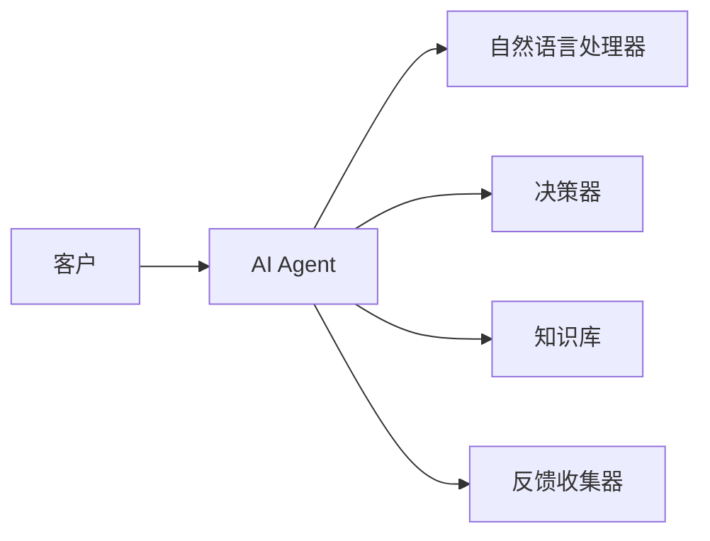
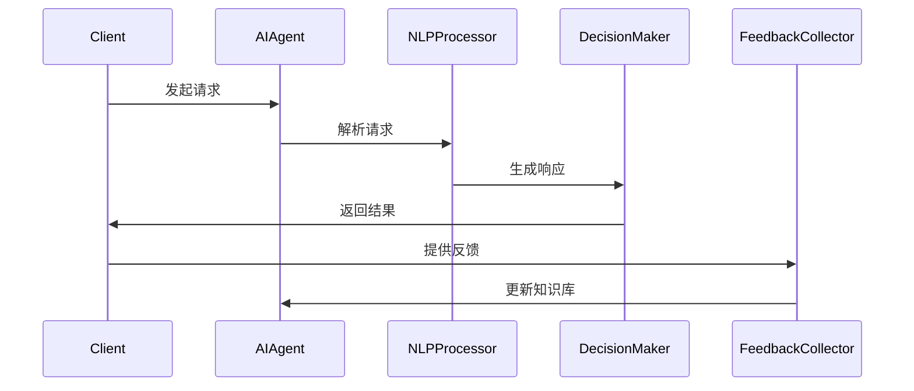

                 


# AI Agent在客户服务中的应用：提升响应速度与质量

> **关键词**：AI Agent，客户服务，响应速度，服务质量，人工智能，自然语言处理，强化学习

> **摘要**：随着人工智能技术的快速发展，AI Agent（人工智能代理）在客户服务中的应用越来越广泛。本文将从AI Agent的基本概念出发，详细探讨其在客户服务中的核心原理、应用场景、系统架构设计以及实际项目案例。通过分析AI Agent如何提升客户服务的响应速度与质量，本文将为读者提供一个全面且深入的技术视角，帮助读者理解如何利用AI技术优化客户服务流程。

---

## 目录大纲

### 第一章：AI Agent与客户服务的背景介绍

#### 1.1 问题背景
- 1.1.1 客户服务的传统模式与挑战
- 1.1.2 AI Agent的出现与意义
- 1.1.3 提升响应速度与质量的核心问题

#### 1.2 问题描述
- 1.2.1 客户服务中的常见问题
- 1.2.2 AI Agent在问题解决中的作用
- 1.2.3 客户体验与企业效率的双重目标

#### 1.3 问题解决
- 1.3.1 AI Agent的核心解决方案
- 1.3.2 技术与业务的结合点
- 1.3.3 AI Agent在客户服务中的具体应用场景

#### 1.4 边界与外延
- 1.4.1 AI Agent的适用范围
- 1.4.2 与传统客服系统的区别
- 1.4.3 与其他AI技术的关联

#### 1.5 概念结构与核心要素
- 1.5.1 AI Agent的基本组成
- 1.5.2 核心要素的定义与作用
- 1.5.3 概念结构的可视化

---

### 第二章：AI Agent的核心概念与原理

#### 2.1 核心概念原理
- 2.1.1 AI Agent的定义与分类
- 2.1.2 多智能体系统的基本原理
- 2.1.3 基于规则与基于模型的AI Agent对比

#### 2.2 核心概念属性特征对比
- 2.2.1 基于规则的AI Agent特点
- 2.2.2 基于模型的AI Agent特点
- 2.2.3 两种类型在客户服务中的应用对比

#### 2.3 ER实体关系图
```mermaid
graph T
    AIAgent[AI Agent] --> KnowledgeBase[知识库]
    AIAgent --> NLPProcessor[自然语言处理器]
    AIAgent --> DecisionMaker[决策器]
    KnowledgeBase --> TrainingData[训练数据]
    NLPProcessor --> InputText[输入文本]
    DecisionMaker --> ActionPlan[行动计划]
```

---

### 第三章：AI Agent的算法原理

#### 3.1 自然语言处理算法
- 3.1.1 NLP算法的核心流程
- 3.1.2 基于深度学习的NLP模型（如BERT、GPT）
- 3.1.3 NLP算法在客户服务中的应用
- 3.1.4 Python代码示例
  ```python
  import transformers
  model = transformers.AutoModelForMaskedLM.from_pretrained('bert-base-uncased')
  tokenizer = transformers.AutoTokenizer.from_pretrained('bert-base-uncased')
  encoded_input = tokenizer.encode("I want to book a flight to Paris.", add_special_tokens=True)
  input_ids = torch.tensor([encoded_input])
  outputs = model(input_ids)
  ```
- 3.1.5 算法的数学模型与公式
  - 表达式1：$$P(w_i|w_{i-1}, w_{i-2}, ...)$$
  - 表达式2：$$\text{Embedding}(x) = \sum_{i=1}^{n} w_i x_i$$

#### 3.2 强化学习算法
- 3.2.1 强化学习的基本原理
- 3.2.2 在客户服务中的应用
- 3.2.3 强化学习算法的实现流程
- 3.2.4 Python代码示例
  ```python
  import numpy as np
  class Agent:
      def __init__(self, state_space, action_space):
          self.state_space = state_space
          self.action_space = action_space
          self.Q = np.zeros((state_space, action_space))
      
      def act(self, state):
          return np.argmax(self.Q[state])
      
      def update(self, state, action, reward):
          self.Q[state][action] += reward
  ```

---

### 第四章：AI Agent的系统分析与架构设计

#### 4.1 问题场景介绍
- 4.1.1 客户咨询与投诉处理
- 4.1.2 多渠道客服支持（如电话、邮件、在线聊天）

#### 4.2 系统功能设计
- 4.2.1 知识库管理模块
- 4.2.2 对话管理模块
- 4.2.3 反馈与优化模块

#### 4.3 系统架构设计


#### 4.4 系统接口设计
- 4.4.1 输入接口：客户输入（文本、语音）
- 4.4.2 输出接口：系统响应（文本、语音、动作）

#### 4.5 系统交互流程图


---

### 第五章：AI Agent在客户服务中的项目实战

#### 5.1 环境安装与配置
- 5.1.1 Python环境的搭建
- 5.1.2 安装必要的库（如transformers、numpy）
- 5.1.3 开发环境的配置

#### 5.2 系统核心实现
- 5.2.1 知识库的构建与管理
- 5.2.2 对话管理的实现
- 5.2.3 反馈机制的实现

#### 5.3 代码实现与解读
- 5.3.1 核心代码示例
  ```python
  def process_customer_query(query):
      encoded_input = tokenizer.encode(query, add_special_tokens=True)
      input_ids = torch.tensor([encoded_input])
      outputs = model(input_ids)
      return generate_response(outputs)
  ```

#### 5.4 实际案例分析
- 5.4.1 某电商平台的客服系统升级案例
- 5.4.2 系统实施的效果对比

#### 5.5 项目小结
- 5.5.1 成功经验总结
- 5.5.2 实施过程中遇到的问题与解决方案

---

### 第六章：AI Agent在客户服务中的最佳实践

#### 6.1 小结
- 6.1.1 AI Agent的核心优势
- 6.1.2 技术实现的关键点

#### 6.2 注意事项
- 6.2.1 数据质量的重要性
- 6.2.2 系统的可扩展性与可维护性
- 6.2.3 用户隐私与数据安全

#### 6.3 拓展阅读
- 6.3.1 推荐的技术书籍与论文
- 6.3.2 相关技术博客与资源

---

### 作者：AI天才研究院 & 禅与计算机程序设计艺术

