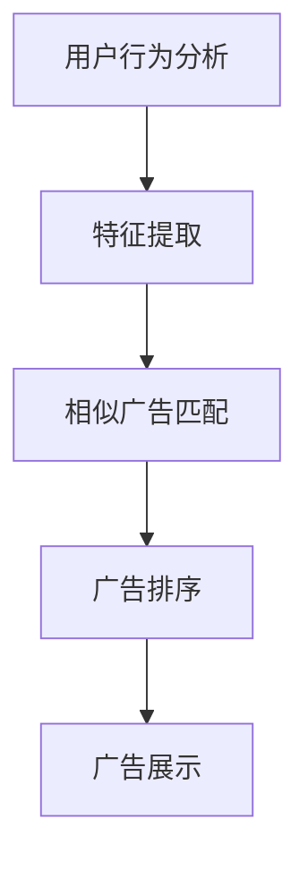
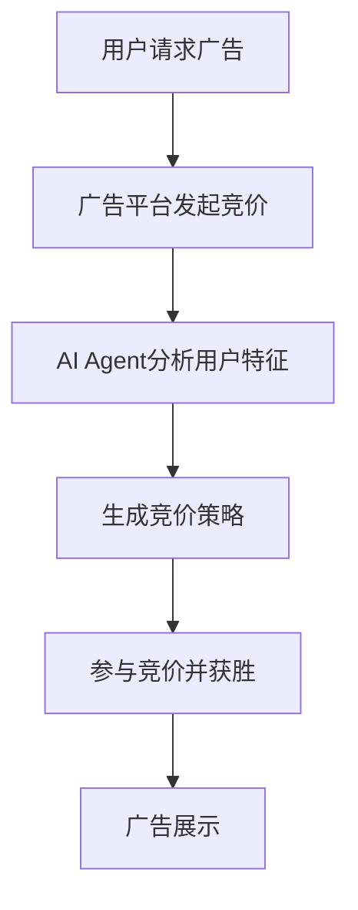

                 


# AI Agent在广告投放中的应用：精准定位与效果优化

## 关键词：AI Agent，广告投放，精准定位，效果优化，算法原理，实时竞价，系统架构

## 摘要：  
本文详细探讨了AI Agent在广告投放中的应用，从背景、核心概念到算法原理、系统架构，再到项目实战和总结展望，全面解析了AI Agent如何通过智能化决策提升广告投放的精准度和效果优化。通过具体案例分析和数学模型推导，深入浅出地展示了AI Agent在广告投放中的实际应用场景和未来发展方向。

---

# 第一部分: AI Agent在广告投放中的背景与概念

# 第1章: AI Agent与广告投放的背景介绍

## 1.1 AI Agent的基本概念

### 1.1.1 AI Agent的定义  
AI Agent（人工智能代理）是一种能够感知环境、自主决策并采取行动的智能实体。在广告投放中，AI Agent通过分析用户行为、广告数据和市场趋势，动态优化广告投放策略。

### 1.1.2 AI Agent的核心特征  
- **自主性**：能够独立决策，无需人工干预。  
- **反应性**：实时感知环境变化并快速响应。  
- **学习性**：通过数据反馈不断优化自身算法。  

### 1.1.3 AI Agent与传统广告投放的区别  
传统广告投放依赖人工设定规则，而AI Agent能够通过机器学习算法实时调整策略，实现更精准的定位和优化。

---

## 1.2 广告投放的现状与问题

### 1.2.1 传统广告投放的局限性  
- **精准度低**：难以覆盖所有目标受众。  
- **效率低下**：人工操作耗时且成本高。  
- **动态变化难以应对**：市场环境和用户行为的变化难以及时响应。  

### 1.2.2 数据驱动广告投放的挑战  
- **数据量大**：需要处理海量数据。  
- **数据质量**：数据清洗和特征提取难度大。  
- **模型复杂性**：复杂的算法需要高性能计算支持。  

### 1.2.3 AI Agent在广告投放中的优势  
- **精准定位**：通过用户行为分析实现个性化推荐。  
- **实时优化**：动态调整广告策略以应对市场变化。  
- **高效决策**：减少人工干预，提高投放效率。  

---

## 1.3 AI Agent在广告投放中的应用前景

### 1.3.1 AI Agent的核心应用场景  
- **个性化推荐**：根据用户行为推荐广告内容。  
- **实时竞价**：在广告 auction 中实时出价优化 ROI。  
- **效果预测**：通过历史数据预测广告效果并优化预算分配。  

### 1.3.2 AI Agent对广告投放效率的提升  
- **自动化操作**：减少人工干预，降低运营成本。  
- **数据驱动决策**：通过实时数据分析实现精准投放。  
- **动态调整策略**：快速响应市场变化，提升广告效果。  

### 1.3.3 AI Agent在精准定位中的潜力  
- **深度学习**：通过神经网络模型分析用户行为和广告内容。  
- **强化学习**：通过试错优化广告投放策略。  
- **推荐系统**：基于协同过滤和内容推荐实现精准定位。  

---

## 1.4 本章小结  
本章介绍了AI Agent的基本概念、广告投放的现状与问题，以及AI Agent在广告投放中的应用前景。通过对比传统广告投放与AI Agent的优势，展示了AI Agent在提升广告投放效率和精准度方面的巨大潜力。

---

# 第二部分: AI Agent的核心概念与原理

# 第2章: AI Agent的核心概念与联系

## 2.1 AI Agent的核心原理

### 2.1.1 AI Agent的决策机制  
AI Agent通过感知环境、分析数据、制定策略并执行行动来实现广告投放的优化。  

### 2.1.2 AI Agent的学习算法  
AI Agent采用监督学习、无监督学习和强化学习等多种算法，通过不断学习优化广告投放策略。  

### 2.1.3 AI Agent的实时响应能力  
AI Agent能够实时分析用户行为和市场变化，快速调整广告投放策略，确保最佳效果。  

---

## 2.2 AI Agent的特征对比

### 2.2.1 AI Agent与传统广告投放系统的对比  
| 特性             | AI Agent                          | 传统广告投放系统                   |
|------------------|-----------------------------------|------------------------------------|
| 决策方式         | 基于机器学习算法动态调整策略    | 预先设定规则，难以实时优化         |
| 数据处理能力     | 高效处理海量数据并实时反馈      | 数据处理能力有限，反馈滞后         |
| 精准度           | 高，能够实现个性化推荐           | 低，难以精准定位目标受众           |

### 2.2.2 不同AI Agent算法的特征分析  
| 算法类型         | 特点                             | 应用场景                         |
|------------------|----------------------------------|----------------------------------|
| 监督学习         | 需要标记数据，适合分类任务       | 广告点击率预测                   |
| 无监督学习       | 适用于数据聚类和特征提取         | 用户行为分析                     |
| 强化学习         | 通过试错优化策略                 | 实时竞价广告投放                 |

### 2.2.3 AI Agent的性能指标与评价标准  
- **点击率（CTR）**：广告被点击的比例，反映广告的吸引力。  
- **转化率（CVR）**：广告点击后转化为实际行动的比例。  
- **广告相关性（AR）**：广告内容与用户需求的匹配程度。  
- **广告收益（Revenue）**：广告投放带来的实际收益。  

---

## 2.3 AI Agent的ER实体关系图  

以下是AI Agent在广告投放中的实体关系图：

```mermaid
er
actor: 用户
agent: AI Agent
advertising_platform: 广告平台
campaign: 广告活动
target: 目标受众
```

- **用户（actor）**：广告投放的目标受众，具有特定的行为特征和需求。  
- **AI Agent（agent）**：负责分析用户行为并制定广告投放策略。  
- **广告平台（advertising_platform）**：广告投放的载体，提供广告展示和数据反馈。  
- **广告活动（campaign）**：具体的广告投放任务，包括目标、预算和投放策略。  
- **目标受众（target）**：广告投放的核心目标人群。  

---

## 2.4 本章小结  
本章详细介绍了AI Agent的核心原理、特征对比以及实体关系图。通过对AI Agent与传统广告投放系统的对比，展示了AI Agent在广告投放中的独特优势和潜力。

---

# 第三部分: AI Agent的算法原理与数学模型

# 第3章: AI Agent的算法原理

## 3.1 推荐算法的核心流程  

以下是推荐算法的核心流程图：



---

## 3.2 AI Agent的实时竞价机制  

实时竞价（RTB）是AI Agent在广告投放中的重要应用之一。以下是实时竞价的流程图：



---

## 3.3 AI Agent的数学模型与公式  

### 3.3.1 点击率（CTR）预测模型  
CTR预测是广告投放中的核心任务之一，常用逻辑回归模型进行预测。其数学公式如下：  

$$ P(y=1|x) = \frac{1}{1 + e^{-\beta x}} $$  

其中，$x$ 是广告特征向量，$\beta$ 是模型参数。  

### 3.3.2 广告排序模型  
广告排序的目标是根据用户的兴趣和广告的相关性对广告进行排序。常用的排序学习模型（如FM、FTRL）可以通过以下公式实现：  

$$ \text{排序得分} = \sum_{i=1}^{n} w_i x_i $$  

其中，$w_i$ 是广告特征$x_i$的权重。  

### 3.3.3 实时竞价模型  
在实时竞价中，AI Agent需要根据广告的预估收益和预算分配进行动态定价。其定价公式如下：  

$$ \text{出价} = \text{预估收益} \times \text{预算权重} $$  

---

## 3.4 本章小结  
本章通过流程图和数学公式，详细讲解了AI Agent在推荐算法和实时竞价中的工作原理。通过CTR预测、广告排序和实时竞价模型的分析，展示了AI Agent在广告投放中的技术实现细节。

---

# 第四部分: AI Agent的系统分析与架构设计

# 第4章: AI Agent的系统分析与架构设计

## 4.1 广告投放系统的整体架构  

以下是广告投放系统的整体架构图：

```mermaid
classDiagram
class 用户行为分析模块 {
    + 用户点击数据
    + 用户浏览数据
    + 用户搜索记录
}
class 特征提取模块 {
    + 用户画像
    + 广告特征
    + 上下文信息
}
class 广告推荐模块 {
    + CTR预测
    + 广告排序
    + 推荐列表生成
}
class 广告投放模块 {
    + 实时竞价
    + 广告展示
    + 数据反馈收集
}
用户行为分析模块 --> 特征提取模块 --> 广告推荐模块 --> 广告投放模块
```

---

## 4.2 系统功能设计  

### 4.2.1 用户行为分析模块  
该模块负责收集和分析用户的点击、浏览和搜索数据，生成用户画像和行为特征。  

### 4.2.2 特征提取模块  
该模块将用户行为数据和广告数据进行特征提取，生成用于广告推荐和竞价的特征向量。  

### 4.2.3 广告推荐模块  
该模块基于特征向量进行CTR预测和广告排序，生成推荐的广告列表。  

### 4.2.4 广告投放模块  
该模块负责实时竞价、广告展示和数据反馈收集，不断优化广告投放策略。  

---

## 4.3 系统架构设计  

以下是系统架构图：


---

## 4.4 本章小结  
本章通过系统分析和架构设计，展示了AI Agent在广告投放中的整体架构和功能模块。通过模块化设计和分层架构，确保了系统的高效性和可扩展性。

---

# 第五部分: AI Agent的项目实战

# 第5章: AI Agent的项目实战

## 5.1 环境安装与配置  

### 5.1.1 环境要求  
- Python 3.7+  
- TensorFlow或PyTorch  
- 数据库（MySQL或MongoDB）  
- 云服务（AWS、阿里云等）  

### 5.1.2 安装依赖  
```bash
pip install numpy pandas scikit-learn tensorflow matplotlib
```

---

## 5.2 系统核心实现  

### 5.2.1 用户行为分析模块  
以下是用户行为分析模块的代码示例：  

```python
import pandas as pd
from sklearn.preprocessing import StandardScaler

# 加载数据
user_behavior = pd.read_csv('user_behavior.csv')

# 特征提取
features = ['click', 'view', 'search']
user_behavior['user_id'] = user_behavior['user_id'].astype(str)

# 标准化处理
scaler = StandardScaler()
scaled_features = scaler.fit_transform(user_behavior[features])
```

---

### 5.2.2 广告推荐模块  
以下是广告推荐模块的代码示例：  

```python
import tensorflow as tf
from tensorflow.keras import layers

# 定义模型
model = tf.keras.Sequential()
model.add(layers.Dense(64, activation='relu', input_shape=(input_dim,)))
model.add(layers.Dense(1, activation='sigmoid'))

# 编译模型
model.compile(optimizer='adam', loss='binary_crossentropy', metrics=['accuracy'])

# 训练模型
model.fit(x_train, y_train, epochs=10, batch_size=32)
```

---

### 5.2.3 广告投放模块  
以下是广告投放模块的代码示例：  

```python
import numpy as np

# 实时竞价函数
def bid_strategy(predictedCTR, budget):
    return predictedCTR * budget

# 参与竞价
bids = []
for ad in ads:
    predictedCTR = model.predict(ad['features'])
    bid = bid_strategy(predictedCTR, ad['budget'])
    bids.append(bid)

# 竞价结果
winning_bid = max(bids)
```

---

## 5.3 实际案例分析  

### 5.3.1 案例背景  
某电商平台希望通过AI Agent优化其广告投放策略，提升转化率和广告收益。  

### 5.3.2 实施步骤  
1. 数据收集与预处理：收集用户行为数据和广告点击数据。  
2. 特征提取：生成用户画像和广告特征向量。  
3. 模型训练：训练CTR预测模型和广告排序模型。  
4. 实时竞价：在广告 auction 中实时出价并优化预算分配。  
5. 效果分析：通过A/B测试优化广告投放策略。  

---

## 5.4 本章小结  
本章通过具体的项目实战，展示了AI Agent在广告投放中的环境配置、核心实现和实际案例分析。通过代码示例和案例解读，帮助读者更好地理解和应用AI Agent技术。

---

# 第六部分: 总结与展望

# 第6章: 总结与展望

## 6.1 本章总结  

通过本文的详细讲解，我们了解了AI Agent在广告投放中的背景、核心概念、算法原理、系统架构和项目实战。AI Agent通过智能化决策和实时优化，显著提升了广告投放的精准度和效果。

---

## 6.2 未来展望  

随着AI技术的不断发展，AI Agent在广告投放中的应用将更加广泛和深入。未来的研究方向包括：  
1. **强化学习优化**：通过强化学习进一步提升广告投放策略的动态调整能力。  
2. **多模态数据融合**：结合文本、图像和视频等多种数据源，实现更精准的广告推荐。  
3. **隐私保护与合规性**：在数据使用过程中加强隐私保护，确保符合相关法律法规。  
4. **边缘计算应用**：通过边缘计算实现广告投放的实时性和低延迟。  

---

## 6.3 最佳实践 Tips  

1. 在实际应用中，建议结合具体业务场景选择合适的AI Agent算法。  
2. 数据清洗和特征工程是广告投放成功的关键，需要投入足够的时间和资源。  
3. 定期监控和优化广告投放策略，确保广告效果的持续提升。  

---

## 6.4 本章小结  

本章总结了AI Agent在广告投放中的应用，并展望了未来的发展方向。通过本文的讲解，读者可以更好地理解AI Agent的技术本质和实际应用价值。

---

# 作者：AI天才研究院/AI Genius Institute & 禅与计算机程序设计艺术 /Zen And The Art of Computer Programming

