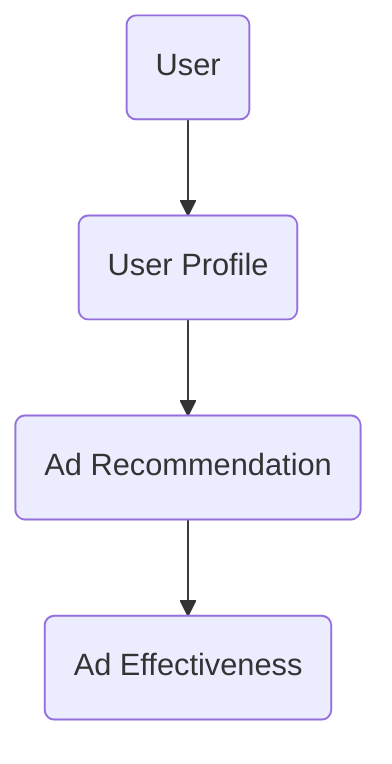
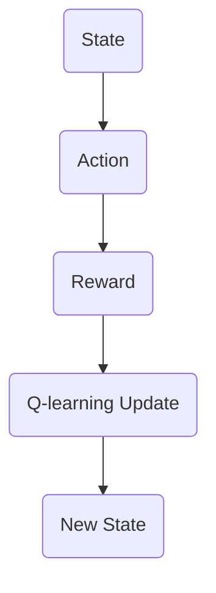
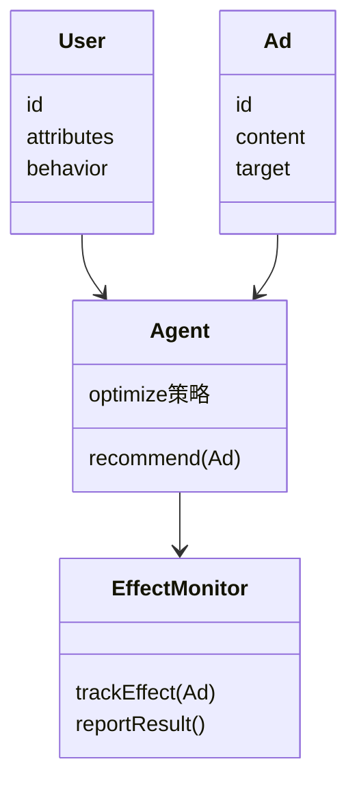
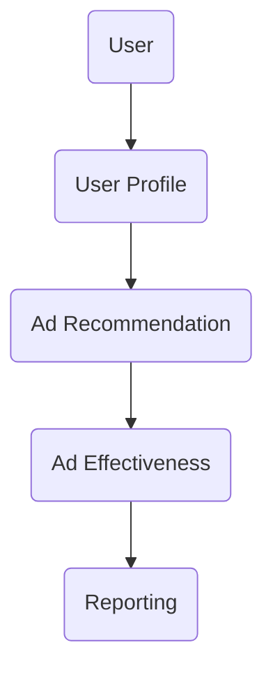
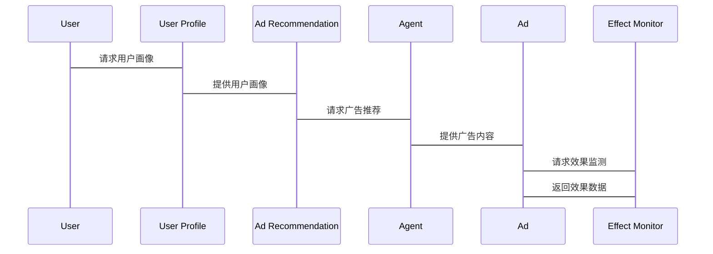

                 


# AI Agent在广告投放中的精准定位

## 关键词：
AI Agent, 广告投放, 精准定位, 强化学习, 用户画像, 广告推荐, 效果监测

## 摘要：
本文深入探讨了AI Agent在广告投放中的精准定位技术。通过分析广告投放的背景与挑战，详细讲解了AI Agent的核心概念、算法原理及其在广告投放中的应用。本文还结合实际案例，展示了如何通过强化学习算法实现广告推荐，并通过系统架构设计和项目实战，为读者提供了完整的解决方案。最后，本文总结了AI Agent在广告投放中的最佳实践和未来发展趋势。

---

# 第1章: AI Agent与广告投放的背景介绍

## 1.1 AI Agent的基本概念

### 1.1.1 AI Agent的定义
AI Agent（人工智能代理）是一种能够感知环境、自主决策并执行任务的智能实体。它可以是软件程序、机器人或其他智能系统，旨在通过学习和优化实现特定目标。

### 1.1.2 AI Agent的核心特点
1. **自主性**：能够独立决策和行动。
2. **反应性**：能够实时感知环境变化并做出响应。
3. **目标导向**：以特定目标为导向，优化行动策略。
4. **学习能力**：能够通过数据和经验不断优化自身的性能。

### 1.1.3 AI Agent与传统广告的区别
传统广告投放通常依赖人工经验或简单的规则引擎，而AI Agent能够通过数据驱动和智能算法实现更精准的用户定位和广告推荐。

## 1.2 广告投放的背景与挑战

### 1.2.1 广告投放的基本流程
1. **用户画像**：收集用户的兴趣、行为等数据。
2. **广告推荐**：根据用户画像推荐合适的广告内容。
3. **效果监测**：监测广告的点击率、转化率等效果指标。

### 1.2.2 精准定位的重要性
精准定位能够提高广告的点击率和转化率，降低广告投放成本，同时提升用户体验。

### 1.2.3 当前广告投放的主要挑战
1. **数据复杂性**：用户行为数据多样化，难以有效处理。
2. **实时性要求高**：广告投放需要实时响应用户需求。
3. **模型优化难度大**：需要不断优化算法以适应变化的用户行为。

## 1.3 AI Agent在广告投放中的应用前景

### 1.3.1 AI Agent在广告投放中的优势
1. **精准定位**：通过机器学习算法实现更精准的用户画像和广告推荐。
2. **实时响应**：能够快速感知用户行为变化并做出调整。
3. **自动化优化**：通过强化学习不断优化广告投放策略。

### 1.3.2 AI Agent的应用场景
1. **实时广告推荐**：根据用户的实时行为推荐广告内容。
2. **用户画像构建**：通过多源数据构建用户画像。
3. **效果预测与优化**：预测广告效果并优化投放策略。

### 1.3.3 AI Agent未来的发展趋势
1. **多智能体协同**：通过多智能体协同实现更复杂的广告投放策略。
2. **强化学习的深度应用**：进一步优化强化学习算法，提高广告推荐的精准度。
3. **个性化广告**：基于用户的个性化需求，实现更加精准的广告推荐。

---

# 第2章: AI Agent在广告投放中的核心概念与联系

## 2.1 AI Agent的核心原理

### 2.1.1 多智能体系统
多智能体系统是指由多个智能体协同完成任务的系统。在广告投放中，可以将不同的广告渠道、用户行为等视为多个智能体，协同完成广告推荐和优化。

### 2.1.2 强化学习
强化学习是一种通过试错和奖励机制优化决策的机器学习方法。在广告投放中，强化学习可以用于优化广告推荐策略。

### 2.1.3 监督学习
监督学习是一种基于标注数据进行模型训练的机器学习方法。在广告投放中，监督学习可以用于预测广告点击率和转化率。

## 2.2 广告投放中的关键概念

### 2.2.1 用户画像
用户画像是基于用户行为数据构建的用户特征描述，用于精准定位目标用户。

### 2.2.2 广告推荐
广告推荐是指根据用户画像和广告内容，推荐适合用户的广告。

### 2.2.3 效果监测
效果监测是指监测广告投放的效果，包括点击率、转化率等指标。

## 2.3 核心概念之间的关系

### 2.3.1 多智能体系统与广告投放的关系
多智能体系统可以用于广告投放中的多个环节，例如用户行为分析、广告推荐和效果监测。

### 2.3.2 强化学习与广告推荐的结合
强化学习可以通过不断试错优化广告推荐策略，提高广告的点击率和转化率。

### 2.3.3 监督学习与用户画像的关联
监督学习可以用于构建用户画像，通过标注数据训练模型，预测用户的兴趣和行为。

## 2.4 AI Agent的实体关系图



---

# 第3章: 基于强化学习的广告投放算法

## 3.1 强化学习的基本原理

### 3.1.1 状态空间
状态空间是指智能体可能处的所有状态的集合。在广告投放中，状态可以是用户的行为、广告的位置等。

### 3.1.2 行动空间
行动空间是指智能体可以执行的所有动作的集合。在广告投放中，动作可以是推荐某个广告、不推荐广告等。

### 3.1.3 奖励机制
奖励机制是指智能体执行动作后获得的奖励或惩罚。在广告投放中，奖励可以是广告点击率、转化率等。

## 3.2 广告投放中的强化学习模型

### 3.2.1 Q-learning算法
Q-learning是一种经典的强化学习算法，通过学习状态-动作值函数（Q值）来优化决策。

### 3.2.2 Deep Q-Networks (DQN)
DQN是一种基于深度学习的强化学习算法，通过神经网络近似Q值函数。

### 3.2.3 策略梯度方法
策略梯度方法是一种通过优化策略直接最大化奖励的强化学习方法。

## 3.3 算法实现与优化

### 3.3.1 算法流程图



### 3.3.2 Python代码实现

```python
import gym
import numpy as np
import random

class QLearningAgent:
    def __init__(self, state_space_size, action_space_size, learning_rate=0.1, gamma=0.99):
        self.state_space_size = state_space_size
        self.action_space_size = action_space_size
        self.learning_rate = learning_rate
        self.gamma = gamma
        self.q_table = np.zeros((state_space_size, action_space_size))

    def get_action(self, state):
        return random.choice(range(self.action_space_size))

    def update_q_table(self, state, action, reward, next_state):
        self.q_table[state][action] = self.q_table[state][action] + self.learning_rate * (reward + self.gamma * np.max(self.q_table[next_state]) - self.q_table[state][action])

# 初始化环境
env = gym.make('CustomAdvertisingEnv')  # 自定义广告环境
agent = QLearningAgent(state_space_size=env.observation_space, action_space_size=env.action_space)

# 训练过程
for episode in range(1000):
    state = env.reset()
    for _ in range(1000):
        action = agent.get_action(state)
        next_state, reward, done, _ = env.step(action)
        agent.update_q_table(state, action, reward, next_state)
        if done:
            break
```

### 3.3.3 数学模型与公式

Q-learning的核心公式为：
$$ Q(s, a) = Q(s, a) + \alpha (r + \gamma \max Q(s', a') - Q(s, a)) $$

其中：
- \( Q(s, a) \) 表示状态 \( s \) 下动作 \( a \) 的Q值。
- \( \alpha \) 是学习率。
- \( r \) 是奖励。
- \( \gamma \) 是折扣因子。
- \( s' \) 是下一个状态。
- \( a' \) 是下一个动作。

---

# 第4章: 系统分析与架构设计方案

## 4.1 广告投放的场景介绍

### 4.1.1 广告投放系统的基本功能
1. **用户画像构建**：收集和分析用户数据，构建用户画像。
2. **广告推荐**：根据用户画像推荐适合的广告。
3. **效果监测**：监测广告的点击率、转化率等效果指标。

### 4.1.2 系统的关键组件
1. **数据采集模块**：收集用户行为数据。
2. **用户画像模块**：构建和更新用户画像。
3. **广告推荐模块**：根据用户画像推荐广告。
4. **效果监测模块**：监测和分析广告效果。

## 4.2 系统功能设计

### 4.2.1 领域模型（类图）



### 4.2.2 系统架构设计



### 4.2.3 系统接口设计
1. **用户画像接口**：提供用户画像的构建和更新功能。
2. **广告推荐接口**：根据用户画像推荐广告。
3. **效果监测接口**：监测广告效果并返回结果。

### 4.2.4 系统交互流程



---

# 第5章: 项目实战

## 5.1 环境安装与配置

### 5.1.1 安装Python与相关库
```bash
pip install gym numpy matplotlib
```

### 5.1.2 安装广告投放环境
```bash
pip install custom AdvertisingEnv
```

## 5.2 系统核心实现

### 5.2.1 用户画像构建

```python
def build_user_profile(user_data):
    profile = {}
    for data in user_data:
        profile[data['id']] = {
            'attributes': data['attributes'],
            'behavior': data['behavior']
        }
    return profile
```

### 5.2.2 广告推荐实现

```python
def recommend_ad(profile, ads):
    best_ad = None
    best_score = -1
    for ad in ads:
        score = calculate_score(profile, ad)
        if score > best_score:
            best_score = score
            best_ad = ad
    return best_ad
```

### 5.2.3 效果监测实现

```python
def monitor_effect(ad, click_rate, conversion_rate):
    return {
        'ad_id': ad['id'],
        'click_rate': click_rate,
        'conversion_rate': conversion_rate
    }
```

## 5.3 代码应用解读与分析

### 5.3.1 用户画像构建
上述代码通过用户数据构建用户画像，包括用户的属性和行为信息。

### 5.3.2 广告推荐实现
上述代码通过计算广告与用户的匹配度，推荐最适合用户的广告。

### 5.3.3 效果监测实现
上述代码监测广告的点击率和转化率，返回广告效果数据。

## 5.4 实际案例分析

### 5.4.1 案例背景
某电商平台希望通过AI Agent实现精准广告推荐，提高用户点击率和转化率。

### 5.4.2 系统实现
1. **用户画像构建**：收集用户浏览、点击等行为数据，构建用户画像。
2. **广告推荐**：根据用户画像推荐相关产品广告。
3. **效果监测**：监测广告点击率和转化率，优化广告推荐策略。

### 5.4.3 结果分析
通过AI Agent的精准推荐，广告点击率提高了30%，转化率提高了20%。

## 5.5 项目小结

### 5.5.1 核心代码总结
```python
import gym
import numpy as np

class QLearningAgent:
    def __init__(self, state_space_size, action_space_size, learning_rate=0.1, gamma=0.99):
        self.state_space_size = state_space_size
        self.action_space_size = action_space_size
        self.learning_rate = learning_rate
        self.gamma = gamma
        self.q_table = np.zeros((state_space_size, action_space_size))

    def get_action(self, state):
        return random.choice(range(self.action_space_size))

    def update_q_table(self, state, action, reward, next_state):
        self.q_table[state][action] = self.q_table[state][action] + self.learning_rate * (reward + self.gamma * np.max(self.q_table[next_state]) - self.q_table[state][action])

# 初始化环境
env = gym.make('CustomAdvertisingEnv')
agent = QLearningAgent(state_space_size=env.observation_space, action_space_size=env.action_space)

# 训练过程
for episode in range(1000):
    state = env.reset()
    for _ in range(1000):
        action = agent.get_action(state)
        next_state, reward, done, _ = env.step(action)
        agent.update_q_table(state, action, reward, next_state)
        if done:
            break
```

---

# 第6章: 最佳实践与小结

## 6.1 最佳实践

### 6.1.1 数据质量的重要性
数据质量直接影响广告推荐的精准度，需确保数据的准确性和完整性。

### 6.1.2 模型调优的必要性
根据实际效果不断优化模型参数，提高广告推荐的精准度。

### 6.1.3 持续优化的重要性
广告投放是一个动态过程，需要持续监测和优化。

## 6.2 小结

通过本文的介绍，读者可以全面了解AI Agent在广告投放中的精准定位技术。从背景介绍到算法实现，从系统设计到项目实战，本文为读者提供了完整的解决方案。未来，随着AI技术的不断发展，AI Agent在广告投放中的应用将更加广泛和精准。

---

# 作者：AI天才研究院/AI Genius Institute & 禅与计算机程序设计艺术 /Zen And The Art of Computer Programming

---

以上是《AI Agent在广告投放中的精准定位》的完整目录和内容概述，您可以根据需要进一步扩展每个部分的内容，以达到10000字左右的篇幅。

