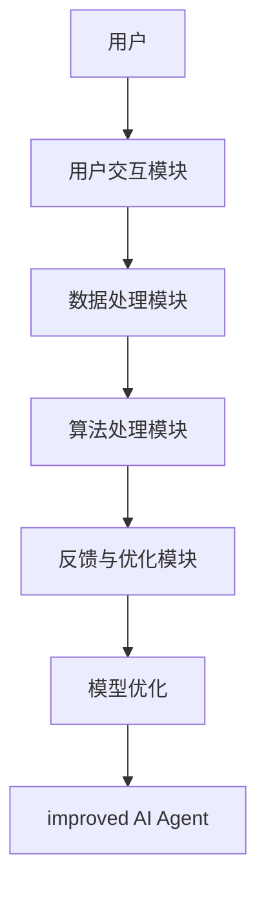
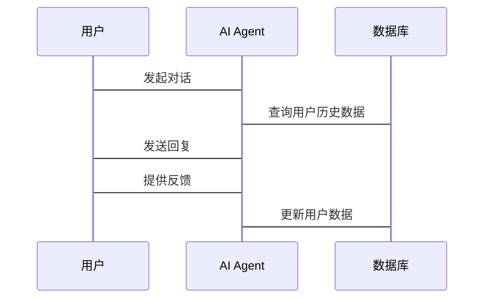

                 


# AI Agent在心理健康咨询中的应用

---

## 关键词：
AI Agent, 心理健康咨询, 自然语言处理, 个性化推荐, 系统架构

---

## 摘要：
本文探讨了AI Agent在心理健康咨询中的应用，分析了AI Agent与心理健康咨询的核心概念及其结合方式。文章从背景、技术基础、算法原理、系统架构、项目实战等多方面展开，详细阐述了AI Agent在心理健康咨询中的优势与挑战，并通过实际案例展示了其在数字化心理健康服务中的潜力。

---

## 第一部分: AI Agent与心理健康咨询的背景与概念

### 第1章: AI Agent的基本概念与技术基础

#### 1.1 AI Agent的定义与特点
- **AI Agent的定义**：AI Agent（智能体）是指能够感知环境并采取行动以实现目标的智能实体。它可以是一个软件程序，也可以是一个物理设备。
- **AI Agent的核心特点**：
  - **自主性**：能够独立决策和行动。
  - **反应性**：能够实时感知环境并做出反应。
  - **目标导向性**：所有行动均以实现特定目标为导向。
  - **学习能力**：通过数据和经验不断优化自身行为。

#### 1.2 心理健康咨询的现状与挑战
- **心理健康问题的普遍性**：现代社会中，心理健康问题（如焦虑、抑郁、压力等）日益普遍，且呈现年轻化趋势。
- **传统心理咨询的局限性**：
  - **资源有限**：专业心理咨询师数量有限，难以满足海量需求。
  - **时间限制**：心理咨询师的工作时间有限，无法提供全天候服务。
  - **隐私问题**：面对面心理咨询可能带来隐私泄露风险。
- **数字化心理健康服务的发展趋势**：随着技术进步，数字化心理健康服务逐渐普及，AI Agent在其中扮演重要角色。

### 第2章: AI Agent在心理健康咨询中的应用背景

#### 2.1 心理健康咨询的数字化转型
- **数字化心理健康服务的兴起**：互联网和移动设备的普及，使得心理健康服务可以随时随地进行。
- **AI技术在心理健康领域的潜力**：
  - **24/7可用性**：AI Agent可以全天候为用户提供心理健康支持。
  - **个性化服务**：通过数据分析，AI Agent可以为用户提供个性化的心理健康建议。
  - **数据驱动的精准咨询**：AI Agent可以通过分析用户的历史数据，提供更精准的心理健康服务。

---

## 第二部分: AI Agent与心理健康咨询的核心概念

### 第3章: 心理健康咨询的核心概念与模型

#### 3.1 心理健康问题的分类与诊断
- **常见心理健康问题的分类**：
  - **焦虑症**：如广泛性焦虑症、社交焦虑症等。
  - **抑郁症**：如重大 depressive disorder。
  - **压力相关问题**：如职业压力、学业压力等。
- **心理健康诊断的标准与流程**：
  - **标准化诊断工具**：如GAD-7量表、PHQ-9量表等。
  - **诊断流程**：通过问卷调查、面谈等方式收集信息，结合专业标准进行诊断。

#### 3.2 心理咨询的核心模型与方法
- **认知行为疗法（CBT）**：通过改变患者的不良思维模式和行为习惯，帮助其缓解心理问题。
- **情绪管理与压力缓解方法**：
  - **放松训练**：如深呼吸、冥想等。
  - **正念疗法**：通过关注当下，减少负面情绪的干扰。

### 第4章: AI Agent与心理健康咨询的核心概念联系

#### 4.1 AI Agent在心理健康咨询中的角色定位
- **辅助咨询师的角色**：
  - **数据收集与分析**：AI Agent可以通过收集用户的语言、行为数据，辅助心理咨询师进行诊断和制定治疗方案。
  - **个性化建议生成**：基于数据，AI Agent可以为用户提供个性化的心理健康建议。
- **用户直接使用的交互界面**：
  - **24/7可用性**：用户可以随时随地通过AI Agent获得心理健康支持。
  - **隐私保护**：用户可以通过AI Agent匿名分享自己的心理状态，保护隐私。

#### 4.2 心理健康咨询的核心要素与AI Agent的结合
- **自然语言处理在对话中的应用**：
  - **情感分析**：通过分析用户的语言，识别其情感状态。
  - **意图识别**：识别用户的真实需求，提供针对性的建议。
- **个性化推荐算法的实现**：
  - **基于用户行为的推荐**：根据用户的对话历史和行为模式，推荐相关的内容。
  - **基于内容的推荐**：根据用户的问题类型，推荐相关的心理健康知识。

### 第5章: AI Agent在心理健康咨询中的核心算法与数学模型

#### 5.1 自然语言处理模型
- **Transformer模型的工作原理**：
  - **自注意力机制**：通过计算输入序列中每个词与其他词的相关性，生成上下文相关的表示。
  - **位置编码**：为每个词添加位置信息，帮助模型理解词序。
- **BERT模型在对话中的应用**：
  - **预训练目标**：通过大规模的无监督学习，学习语言的上下文关系。
  - **微调任务**：针对特定任务（如对话生成）进行微调，提升性能。
- **GPT系列模型的对话生成机制**：
  - **生成式模型**：基于上下文生成连贯的对话内容。
  - **概率生成**：通过计算每个可能的下一个词的概率，选择最可能的词生成对话。

#### 5.2 个性化推荐算法
- **基于用户行为的推荐算法**：
  - **协同过滤**：通过分析用户的相似性，推荐相似用户喜欢的内容。
  - **基于内容的推荐**：根据用户的偏好，推荐相关的内容。
- **基于内容的推荐算法**：
  - **文本相似度计算**：通过计算用户问题与知识库中问题的相似度，推荐相关的内容。
  - **向量空间模型**：将文本表示为向量，通过计算向量的相似度，推荐相关的内容。
- **混合推荐算法的实现**：
  - **混合推荐模型**：结合基于用户行为和基于内容的推荐算法，提升推荐的准确性和多样性。

#### 5.3 数学模型与公式
- **概率计算公式**：
  $$ P(A|B) = \frac{P(B|A)P(A)}{P(B)} $$
  - **条件概率公式**：计算事件A在事件B发生的条件下的概率。
- **损失函数的定义**：
  $$ \text{Loss} = -\frac{1}{N}\sum_{i=1}^{N} y_i \log(p_i) + (1 - y_i) \log(1 - p_i) $$
  - **二分类任务的损失函数**：通过交叉熵损失函数，衡量模型预测值与真实值的差异。

---

## 第三部分: AI Agent的心理健康咨询系统架构与实现

### 第6章: 系统架构设计

#### 6.1 系统功能模块设计
- **用户交互模块**：
  - **对话界面**：用户通过文字或语音与AI Agent进行交互。
  - **情感分析模块**：分析用户的情感状态，识别用户的情绪。
- **数据处理模块**：
  - **数据采集**：收集用户的行为数据、语言数据等。
  - **数据存储**：将用户数据存储到数据库中，便于后续分析。
- **算法处理模块**：
  - **自然语言处理**：对用户输入进行语义分析，生成相应的回复。
  - **个性化推荐**：根据用户数据，生成个性化建议。
- **反馈与优化模块**：
  - **用户反馈收集**：收集用户对AI Agent的反馈，用于优化模型。
  - **模型优化**：根据反馈，调整模型参数，提升服务质量。

#### 6.2 系统架构图


#### 6.3 系统交互序列图


---

## 第四部分: 项目实战

### 第7章: 项目实现与分析

#### 7.1 环境配置
- **Python版本**：3.8以上
- **依赖库安装**：
  - `transformers`：用于加载预训练的自然语言处理模型。
  - `scikit-learn`：用于实现机器学习算法。
  - `flask`：用于搭建Web接口。

#### 7.2 核心代码实现
```python
from transformers import pipeline

# 初始化情感分析模型
sentiment_pipeline = pipeline("sentiment-analysis")

# 初始化对话生成模型
chat_pipeline = pipeline("conversational")

# 情感分析示例
text = "I feel so stressed lately."
result = sentiment_pipeline(text)
print(result)  # 输出情感分析结果

# 对话生成示例
response = chat_pipeline("How can I help you today?", max_length=50)
print(response)
```

#### 7.3 实际案例分析
- **案例背景**：用户因工作压力过大，出现焦虑症状。
- **AI Agent的处理流程**：
  1. **识别用户情绪**：通过情感分析，识别用户处于焦虑状态。
  2. **生成对话回复**：根据用户的问题，生成相应的安慰和建议。
  3. **个性化推荐**：推荐相关的心理健康知识和放松技巧。

---

## 第五部分: 总结与展望

### 第8章: 总结与最佳实践

#### 8.1 最佳实践 tips
- **数据隐私保护**：在处理用户数据时，必须严格遵守数据隐私保护法规。
- **模型的可解释性**：确保AI Agent的决策过程具有可解释性，避免“黑箱”问题。
- **持续优化**：定期收集用户反馈，优化模型性能。

#### 8.2 小结
- AI Agent在心理健康咨询中的应用，不仅提高了服务的效率，还为用户提供了更加便捷和个性化的心理健康支持。
- 通过AI技术的不断进步，心理健康服务将更加智能化、精准化。

#### 8.3 注意事项
- **技术局限性**：AI Agent目前仍无法完全替代专业心理咨询师，特别是在复杂的心理问题上。
- **伦理问题**：在使用AI Agent时，必须注意数据隐私和伦理问题，确保用户权益。

#### 8.4 拓展阅读
- **推荐书籍**：《人工智能：一种现代的方法》
- **推荐论文**：《A survey on deep learning for mental health》

---

## 作者：AI天才研究院 & 禅与计算机程序设计艺术

---

**注**：以上内容为《AI Agent在心理健康咨询中的应用》的技术博客文章的完整目录大纲和部分章节内容。每个章节的具体内容需要根据实际需求进一步扩展和完善。

