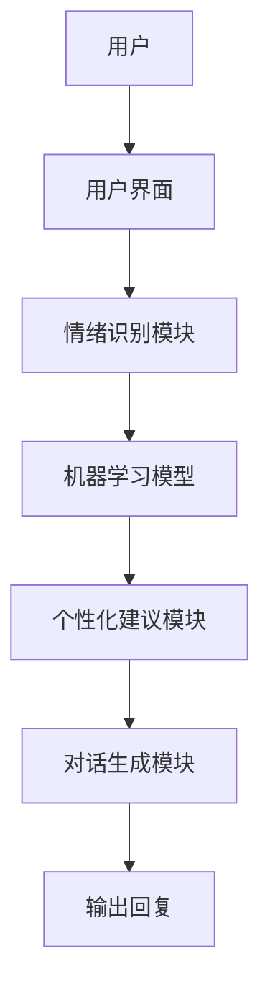

                 


```markdown
# AI Agent在心理健康咨询中的应用与局限

> 关键词：AI Agent, 心理健康咨询, 自然语言处理, 机器学习, 情绪识别

> 摘要：本文探讨了AI Agent在心理健康咨询中的应用，分析了其核心技术与工作原理，并结合实际案例展示了其在情绪识别、对话生成和个性化建议等方面的优势。同时，也深入讨论了AI Agent在实际应用中的局限性，包括技术限制、伦理问题和用户信任等，并提出了改进建议。

---

## 第一部分: AI Agent与心理健康咨询的概述

### 1.1 AI Agent的基本概念

#### 1.1.1 AI Agent的定义
AI Agent（人工智能代理）是指能够感知环境并自主决策以实现特定目标的智能系统。它可以分为基于规则的代理和基于模型的代理，广泛应用于自动化任务、智能助手和推荐系统等领域。

#### 1.1.2 AI Agent的核心特征
- **自主性**：能够独立决策和执行任务。
- **反应性**：能够根据环境变化调整行为。
- **学习能力**：通过数据和反馈不断优化性能。
- **社交能力**：能够与人类或其他系统进行交互。

#### 1.1.3 AI Agent与传统心理咨询工具的对比
- **效率**：AI Agent能够快速响应，24/7可用。
- **一致性**：提供一致的咨询体验，不受情绪影响。
- **隐私**：保护用户隐私，避免人类咨询师可能带来的偏见。

### 1.2 心理健康咨询的基本原理

#### 1.2.1 心理健康咨询的定义
心理健康咨询是通过专业方法帮助个体识别和解决心理问题，改善心理状态和生活质量的过程。

#### 1.2.2 心理健康咨询的主要方法
- **认知行为疗法**：通过改变负面思维模式改善情绪。
- **情感支持疗法**：通过倾听和共情提供情感支持。
- **压力管理**：教用户应对压力的方法。

#### 1.2.3 心理健康咨询的目标
- **情绪管理**：帮助用户识别和调节情绪。
- **问题解决**：提供应对策略和解决方案。
- **预防干预**：早期识别潜在的心理健康问题。

### 1.3 AI Agent在心理健康咨询中的结合

#### 1.3.1 AI Agent与心理健康咨询的结合背景
随着AI技术的发展，心理健康咨询领域逐渐引入AI Agent来提高效率和可及性，特别是在资源不足的地区。

#### 1.3.2 AI Agent在心理健康咨询中的优势
- **可及性**：用户可以随时获得支持。
- **隐私保护**：数据加密确保用户隐私。
- **个性化服务**：基于用户数据提供定制化建议。

#### 1.3.3 AI Agent在心理健康咨询中的应用场景
- **情绪识别**：通过文本和语音分析用户情绪。
- **对话生成**：提供自然流畅的对话体验。
- **个性化建议**：根据用户情况推荐应对策略。

---

## 第二部分: AI Agent的核心技术与原理

### 2.1 自然语言处理技术

#### 2.1.1 自然语言处理的基本概念
自然语言处理（NLP）是研究如何让计算机理解和生成人类语言的学科，广泛应用于文本分析、机器翻译和情感分析等领域。

#### 2.1.2 常见的自然语言处理技术
- **词袋模型**：将文本表示为单词的集合。
- **TF-IDF**：计算词语在文本中的重要性。
- **情感分析**：判断文本的情感倾向。

#### 2.1.3 自然语言处理在心理健康咨询中的应用
- **情绪识别**：通过分析文本判断用户情绪状态。
- **意图识别**：识别用户的咨询需求。
- **对话生成**：基于上下文生成回复。

#### 2.1.4 情感分析的数学模型
$$ 情感得分 = \sum (w_i \times t_i) $$
其中，\(w_i\)是词权重，\(t_i\)是词的情感值。

### 2.2 机器学习与深度学习

#### 2.2.1 机器学习的基本原理
机器学习是通过数据训练模型，使其能够从经验中学习并做出预测或决策。

#### 2.2.2 深度学习的基本原理
深度学习是机器学习的一种，通过多层神经网络提取数据特征，常用于图像识别和自然语言处理。

#### 2.2.3 机器学习在心理健康咨询中的应用
- **情绪识别**：训练模型识别文本中的情感。
- **个性化建议**：基于用户数据推荐应对策略。

### 2.3 AI Agent的算法原理

#### 2.3.1 AI Agent的算法概述
AI Agent算法包括感知、推理和行动三个阶段，通过感知环境信息，推理出最佳行动方案。

#### 2.3.2 基于规则的AI Agent
基于预定义规则进行决策，适用于简单任务，如基本的情绪识别。

#### 2.3.3 基于模型的AI Agent
基于机器学习模型进行决策，适用于复杂任务，如个性化建议生成。

---

## 第三部分: AI Agent在心理健康咨询中的应用

### 3.1 情绪识别与分析

#### 3.1.1 情绪识别的基本原理
情绪识别通过分析文本或语音中的情感特征，判断用户的情绪状态。

#### 3.1.2 基于文本的情绪分析
- **文本预处理**：去除停用词，提取关键词。
- **特征提取**：提取情感相关特征。
- **分类器训练**：训练分类器识别情绪。

#### 3.1.3 基于语音的情绪分析
通过语音语调、语速和音高分析情绪，适用于电话或语音咨询场景。

### 3.2 对话生成与交互

#### 3.2.1 对话生成的基本原理
对话生成基于上下文理解，生成符合逻辑和情感的回复。

#### 3.2.2 基于规则的对话生成
根据预定义的规则生成回复，适用于简单的对话场景。

#### 3.2.3 基于模型的对话生成
使用深度学习模型生成回复，如Transformer架构，生成更自然的对话。

### 3.3 个性化心理咨询建议

#### 3.3.1 个性化咨询建议的生成
基于用户数据和咨询历史，生成个性化的建议。

#### 3.3.2 基于用户数据的个性化建议
分析用户的性格、情绪和需求，提供定制化建议。

#### 3.3.3 基于反馈的个性化优化
根据用户反馈不断优化建议，提高准确性。

---

## 第四部分: AI Agent在心理健康咨询中的局限性

### 4.1 技术局限性

#### 4.1.1 自然语言处理的局限性
- **语境理解不足**：难以处理复杂的语境。
- **文化差异**：不同文化背景下情感表达不同。

#### 4.1.2 机器学习模型的局限性
- **数据偏差**：训练数据可能有偏差，影响模型准确性。
- **可解释性差**：复杂的模型难以解释决策过程。

#### 4.1.3 数据获取与隐私保护的挑战
- **数据隐私**：用户数据的安全性问题。
- **数据多样性**：需要多样化的数据来提高模型泛化能力。

### 4.2 伦理问题

#### 4.2.1 用户隐私保护
- **数据泄露风险**：用户数据可能被滥用。
- **隐私权保护**：如何在AI代理中保护用户隐私。

#### 4.2.2 伦理决策
- **边界问题**：AI Agent在什么情况下需要寻求人类帮助？
- **责任归属**：出现问题时责任由谁承担？

#### 4.2.3 人类咨询师的角色
- **信任问题**：用户可能更信任人类咨询师而非AI代理。
- **情感支持不足**：AI代理难以提供深层次的情感支持。

### 4.3 用户信任与接受度

#### 4.3.1 用户信任的影响因素
- **技术透明度**：用户了解AI代理的工作原理。
- **历史使用体验**：用户对AI代理的使用经历。

#### 4.3.2 提高用户信任的方法
- **透明化**：向用户解释AI代理的工作原理。
- **人类监督**：结合人类咨询师的反馈优化AI代理。

---

## 第五部分: 项目实战与系统架构

### 5.1 系统架构设计

#### 5.1.1 系统功能模块
- **用户界面**：供用户与AI Agent交互。
- **情绪识别模块**：分析用户情绪。
- **对话生成模块**：生成回复。
- **个性化建议模块**：提供定制化建议。

#### 5.1.2 系统架构图


#### 5.1.3 数据流设计
- **输入数据**：用户输入的文本或语音。
- **处理流程**：情绪识别、分析、生成回复。
- **输出数据**：回复文本或语音。

### 5.2 环境搭建与实现

#### 5.2.1 环境安装
- **Python**：3.8及以上版本。
- **库依赖**：`transformers`, `scikit-learn`, `numpy`。

#### 5.2.2 核心代码实现
```python
from transformers import pipeline

# 情绪分析模型
sentiment_analyzer = pipeline("sentiment-analysis")

# 对话生成模型
chat_model = pipeline("conversational", model="facebook/m2o-chat")
```

#### 5.2.3 代码解读与分析
- **情绪分析**：使用预训练模型识别文本情感。
- **对话生成**：基于上下文生成回复。

### 5.3 案例分析与优化

#### 5.3.1 案例分析
- **用户输入**：描述压力情况。
- **系统处理**：识别情绪，生成回复。
- **优化建议**：根据反馈调整回复策略。

#### 5.3.2 项目小结
- **成功经验**：AI Agent能够有效识别情绪并提供初步建议。
- **改进建议**：结合人类咨询师的反馈进一步优化。

---

## 第六部分: 总结与展望

### 6.1 总结
AI Agent在心理健康咨询中具有巨大潜力，能够提高效率和可及性。然而，技术、伦理和隐私等问题仍需解决。

### 6.2 展望
未来，AI Agent将更加智能化，与人类咨询师协同工作，提供更全面的心理健康支持。

### 6.3 注意事项
- **技术可靠性**：确保AI Agent的准确性和稳定性。
- **用户隐私**：严格保护用户数据。
- **伦理合规**：遵守相关法律法规，确保AI Agent的使用符合伦理标准。

### 6.4 拓展阅读
- **相关书籍**：《人工智能：一种现代的方法》。
- **论文推荐**：《基于深度学习的对话系统研究》。

---

## 作者：AI天才研究院/AI Genius Institute & 禅与计算机程序设计艺术 /Zen And The Art of Computer Programming
```

