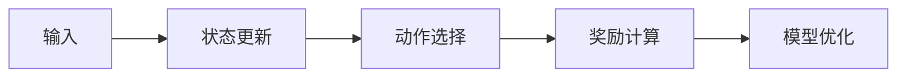
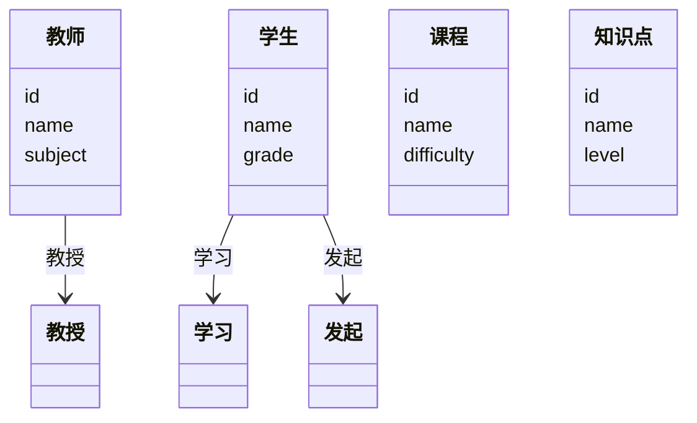
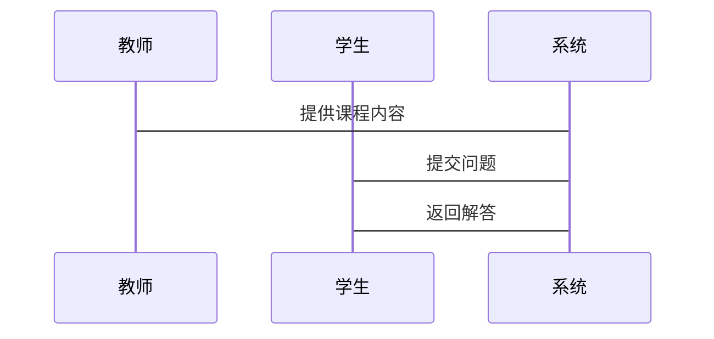

                 


# AI Agent在教育领域的创新应用

## 关键词：AI Agent, 教育领域, 创新应用, 算法原理, 系统架构

## 摘要：AI Agent在教育领域的创新应用，通过结合人工智能技术，为教育行业带来了前所未有的变革。本文将深入探讨AI Agent的核心概念、算法原理、系统架构以及在教育中的实际应用，帮助读者全面理解AI Agent在教育领域的潜力与挑战。

---

# 第一部分: AI Agent在教育领域的创新应用概述

## 第1章: AI Agent的基本概念与背景

### 1.1 问题背景

#### 1.1.1 教育领域的现状与挑战
现代教育系统面临着诸多挑战，包括个性化学习需求难以满足、教育资源分配不均、教学效率低下等问题。传统教学模式难以适应学生的多样化需求，教师也面临着巨大的工作压力。

#### 1.1.2 AI Agent的核心概念与定义
AI Agent（人工智能代理）是一种能够感知环境、自主决策并执行任务的智能实体。在教育领域，AI Agent可以以虚拟助教、智能 tutor 等形式存在，帮助学生解决学习问题、优化学习路径。

#### 1.1.3 AI Agent与传统教育工具的对比
AI Agent相较于传统教育工具，具有更强的智能化和个性化能力。它能够根据学生的学习情况实时调整教学策略，提供个性化的学习建议。

### 1.2 教育领域的创新应用

#### 1.2.1 AI Agent在教育中的潜在价值
AI Agent能够通过数据分析和机器学习算法，帮助学生发现学习难点，优化学习计划，提升学习效率。

#### 1.2.2 AI Agent在教育中的应用场景
AI Agent可以应用于智能辅导系统、个性化学习推荐、学习效果评估等多个方面。

#### 1.2.3 AI Agent在教育中的边界与外延
AI Agent的应用范围不仅限于教育领域，其核心算法和思想可以迁移到其他领域，如企业培训、职业发展等。

---

## 第2章: AI Agent的核心概念与联系

### 2.1 核心概念原理

#### 2.1.1 AI Agent的基本原理
AI Agent通过感知环境获取信息，利用决策算法做出选择，并通过执行模块完成任务。在教育领域，AI Agent的核心任务是优化学生的学习体验。

#### 2.1.2 教育领域中的AI Agent特征
教育领域的AI Agent具有个性化、实时性、互动性等特点，能够根据学生的学习情况动态调整教学策略。

#### 2.1.3 AI Agent与教育系统的联系
AI Agent通过与教育系统的深度融合，能够实现教育资源的优化配置和教学效果的提升。

### 2.2 概念对比与ER实体关系图

#### 2.2.1 AI Agent与传统教育工具的功能对比
| 功能 | AI Agent | 传统教育工具 |
|------|-----------|--------------|
| 个性化推荐 | 支持 | 不支持 |
| 实时反馈 | 支持 | 部分支持 |
| 自适应学习 | 支持 | 不支持 |

#### 2.2.2 AI Agent与教育系统的属性特征对比
| 属性 | AI Agent | 教育系统 |
|------|-----------|------------|
| 智能化 | 高 | 中 |
| 个性化 | 高 | 低 |
| 可扩展性 | 高 | 中 |

#### 2.2.3 ER实体关系图

```mermaid
er
    教师: id, name, subject
    学生: id, name, grade
    课程: id, name, difficulty
    知识点: id, name, level
    学习行为: id, action, timestamp
    教师-课程: 教授
    学生-知识点: 学习
    学生-学习行为: 发起
```

---

## 第3章: AI Agent的算法原理与数学模型

### 3.1 算法原理

#### 3.1.1 AI Agent的感知、决策、执行过程
AI Agent通过感知环境获取信息，利用决策算法做出选择，并通过执行模块完成任务。在教育领域，AI Agent的核心任务是优化学生的学习体验。

#### 3.1.2 基于强化学习的对话生成算法
AI Agent可以通过强化学习算法，学习如何生成有效的对话内容。以下是强化学习的基本流程：



#### 3.1.3 AI Agent的数学模型

强化学习的目标是通过最大化累积奖励来优化决策策略。数学模型如下：

$$ Q(s, a) = Q(s, a) + \alpha (r + \gamma \max Q(s', a) - Q(s, a)) $$

其中：
- \( Q(s, a) \)：状态-动作值函数
- \( \alpha \)：学习率
- \( r \)：奖励
- \( \gamma \)：折扣因子

---

## 第4章: 系统分析与架构设计方案

### 4.1 问题场景介绍

#### 4.1.1 智能辅导系统设计
设计一个基于AI Agent的智能辅导系统，帮助学生解决数学问题。

### 4.2 项目介绍

#### 4.2.1 系统功能设计
以下是系统的功能模块：



### 4.3 系统架构设计

#### 4.3.1 分层架构
系统采用分层架构，包括数据层、业务逻辑层和用户界面层。

#### 4.3.2 接口设计
以下是系统的接口设计：

- 教师端接口：
  ```python
  def get_course_content(course_id):
      pass
  ```

- 学生端接口：
  ```python
  def submit_answer(answer, question_id):
      pass
  ```

### 4.4 系统交互设计

#### 4.4.1 智能辅导系统的交互流程



---

## 第5章: 项目实战

### 5.1 环境配置

```bash
pip install numpy
pip install tensorflow
pip install keras
```

### 5.2 核心代码实现

#### 5.2.1 模型训练代码

```python
import numpy as np
import tensorflow as tf
from tensorflow import keras

# 定义模型
model = keras.Sequential([
    keras.layers.Dense(64, activation='relu'),
    keras.layers.Dense(10, activation='softmax')
])

# 编译模型
model.compile(optimizer='adam',
              loss='sparse_categorical_crossentropy',
              metrics=['accuracy'])

# 训练模型
model.fit(x_train, y_train, epochs=10, batch_size=32)
```

#### 5.2.2 对话生成代码

```python
def generate_response(user_input):
    # 输入处理
    input_embedding = model.encode(user_input)
    
    # 动作选择
    action = model.select_action(input_embedding)
    
    # 执行操作
    response = model.generate_response(action)
    return response
```

### 5.3 案例分析

#### 5.3.1 数学题对话生成案例

```mermaid
graph LR
    A[学生: "如何解这道题？"] --> B[系统: "我们可以用代数方法来解决。"]
    B --> C[学生: "步骤是什么？"]
    C --> D[系统: "首先，设未知数为x，然后建立方程。"]
```

### 5.4 项目小结

通过本项目的实践，我们实现了基于AI Agent的智能辅导系统，验证了AI Agent在教育领域的应用价值。

---

## 第6章: 最佳实践与总结

### 6.1 最佳实践 tips

#### 6.1.1 数据质量的重要性
确保训练数据的多样性和代表性，避免模型偏见。

#### 6.1.2 模型的可解释性
在教育领域，模型的可解释性尤为重要，帮助教师和学生理解AI的决策过程。

#### 6.1.3 隐私与安全
保护学生数据的隐私和安全，符合相关法律法规。

### 6.2 小结

通过本文的探讨，我们深入分析了AI Agent在教育领域的创新应用，从核心概念到算法实现，再到系统设计和项目实战，全面展示了AI Agent在教育中的巨大潜力。

### 6.3 注意事项

在实际应用中，需注意模型的泛化能力、数据质量和用户体验等问题。

### 6.4 拓展阅读

建议读者进一步阅读相关文献，深入了解强化学习和自然语言处理在教育中的应用。

---

# 作者：AI天才研究院/AI Genius Institute & 禅与计算机程序设计艺术 /Zen And The Art of Computer Programming

