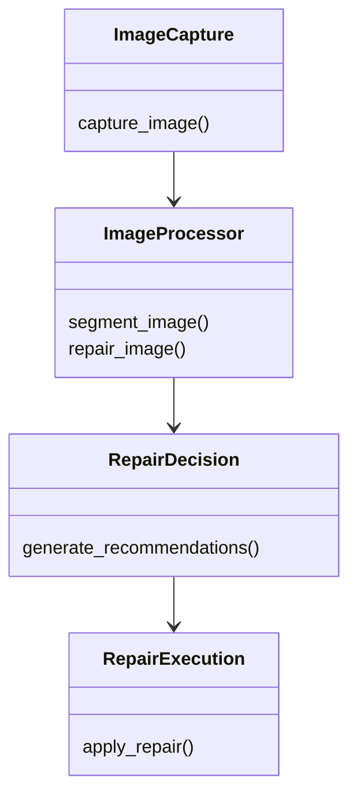

                 


# AI Agent在文物修复中的图像处理应用

> 关键词：AI Agent, 文物修复, 图像处理, 深度学习, 图像修复

> 摘要：本文探讨AI Agent在文物修复中的图像处理应用，分析其技术原理和实际效果，通过案例展示其在文化遗产保护中的潜力。

---

## 第一部分：背景介绍

### 第1章：AI Agent在文物修复中的背景与应用

#### 1.1 问题背景

- **文物修复的重要性**：文化遗产是人类历史的见证，但岁月侵蚀和人为破坏导致许多文物损坏，需要及时修复。
- **传统修复的局限性**：传统方法耗时长、成本高，修复效果受修复师经验限制，难以大规模应用。
- **AI技术的潜力**：AI技术的发展为文物修复提供了新思路，特别是图像处理技术，可辅助修复师高效完成工作。

#### 1.2 问题描述

- **图像修复的挑战**：文物图像可能有缺失、模糊或污损，修复需要精确的图像处理技术。
- **AI Agent的作用**：AI Agent通过图像识别、分割和修复，辅助修复师进行决策，提高修复效率和质量。

#### 1.3 技术背景

- **AI技术的发展**：深度学习在图像处理中的应用日益广泛，推动了AI Agent在文物保护中的应用。
- **图像处理技术**：包括图像增强、修复、分割等技术，为AI Agent提供了技术支持。

#### 1.4 研究现状

- **当前应用案例**：已有研究利用AI技术修复壁画、古籍等，效果显著。
- **研究挑战**：复杂图像修复、模型泛化能力等问题仍需解决。
- **未来趋势**：AI Agent将更智能化，与其他技术结合，提升修复效果。

---

## 第二部分：AI Agent的核心概念与原理

### 第2章：AI Agent的基本原理

#### 2.1 AI Agent的感知机制

- **图像识别与特征提取**：AI Agent通过卷积神经网络（CNN）提取图像特征，识别破损区域。
- **图像分割**：使用U-Net等模型进行像素级分割，精准定位损坏区域。

#### 2.2 AI Agent的决策机制

- **基于规则的决策**：修复策略基于预设规则，如优先修复明显破损区域。
- **深度学习模型**：训练模型预测最佳修复方案，考虑图像内容和修复效果。

#### 2.3 AI Agent的执行机制

- **自动化修复工具**：生成修复指令，指导修复师进行物理修复或数字修复。
- **数字修复技术**：利用图像 inpainting 算法填充缺失区域，恢复图像完整。

---

## 第三部分：算法原理

### 第3章：图像处理算法

#### 3.1 图像分割算法

- **算法步骤**：
  1. 预处理：调整图像亮度和对比度。
  2. 特征提取：使用CNN提取图像特征。
  3. 分割：应用U-Net模型进行像素级分割。

- **代码示例**：
  ```python
  import tensorflow as tf
  model = tf.keras.models.load_model('segmentation_model.h5')
  segmented_image = model.predict(input_image)
  ```

- **数学模型**：
  $$ P(y|x) = \frac{P(x|y)P(y)}{P(x)} $$
  其中，P(y|x)为后验概率，表示图像区域y的概率。

#### 3.2 图像修复算法

- **算法步骤**：
  1. 确定破损区域。
  2. 使用深度学习模型生成修复图像。
  3. 合并修复图像与原图。

- **代码示例**：
  ```python
  def image_inpainting(image, mask):
      # 填充缺失区域
      inpainted_image = image.copy()
      inpainted_image[mask] = model.predict(mask)
      return inpainted_image
  ```

- **数学模型**：
  $$ I_{\text{inpaint}} = I_{\text{known}} + U \times (1 - U) \times I_{\text{unknown}} $$
  其中，U为修复区域的权重。

---

## 第四部分：系统架构设计

### 第4章：系统架构与接口设计

#### 4.1 项目背景

- 文物修复系统集成AI Agent，提高修复效率和质量。

#### 4.2 系统功能设计

- **图像采集模块**：获取高分辨率文物图像。
- **图像处理模块**：进行分割和修复。
- **修复决策模块**：生成修复建议。
- **修复执行模块**：指导修复师进行修复。

#### 4.3 领域模型类图



#### 4.4 系统架构图

```mermaid
client --> ImageCapture
ImageCapture --> ImageProcessor
ImageProcessor --> RepairDecision
RepairDecision --> RepairExecution
RepairExecution --> client
```

---

## 第五部分：项目实战

### 第5章：项目实战与案例分析

#### 5.1 环境安装

- 安装Python、TensorFlow、Keras等库。

#### 5.2 核心代码实现

```python
import tensorflow as tf
import numpy as np

# 加载预训练模型
model = tf.keras.models.load_model('repair_model.h5')

# 图像预处理
def preprocess_image(image):
    image = image.resize((256, 256))
    image = image / 255.0
    return image[np.newaxis, :, :, :]

# 图像修复
def repair_image(image, mask):
    processed_image = preprocess_image(image)
    prediction = model.predict(processed_image)
    repaired_image = image.copy()
    repaired_image[mask] = prediction[0, :, :]
    return repaired_image
```

#### 5.3 案例分析

- **案例1**：修复破损的古籍页面。
- **案例2**：修复断裂的陶器碎片。

#### 5.4 修复效果对比

- 原始图像与修复图像对比，展示AI Agent的效果。

---

## 第六部分：最佳实践

### 第6章：总结与展望

#### 6.1 总结

- AI Agent在文物修复中展现了巨大潜力，提高了修复效率和质量。

#### 6.2 小结

- 项目总结：成功应用AI技术于文物修复，验证了技术可行性。
- 实践贴士：结合AI Agent与传统修复方法，优化修复流程。

#### 6.3 注意事项

- 数据质量：确保训练数据多样化，避免模型过拟合。
- 修复效果：结合修复师经验，调整AI决策权重。

#### 6.4 拓展阅读

- 推荐相关书籍和论文，深入探讨AI在文物保护中的应用。

---

## 作者：AI天才研究院

---

这篇文章详细探讨了AI Agent在文物修复中的图像处理应用，从技术背景到系统架构，再到项目实战，全面展示了AI技术在文化遗产保护中的潜力和应用前景。通过详细分析和实际案例，读者可以深入了解AI Agent如何助力文物修复，提升修复效率和质量。

