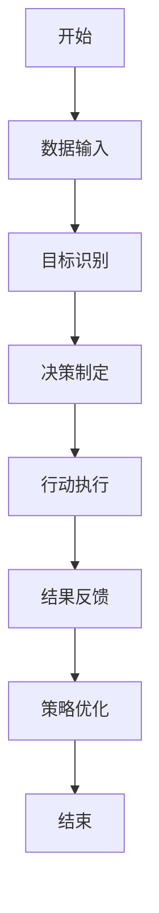
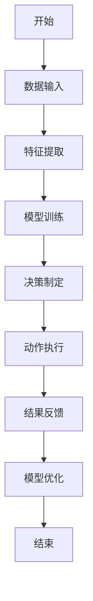
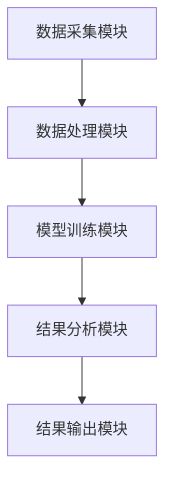
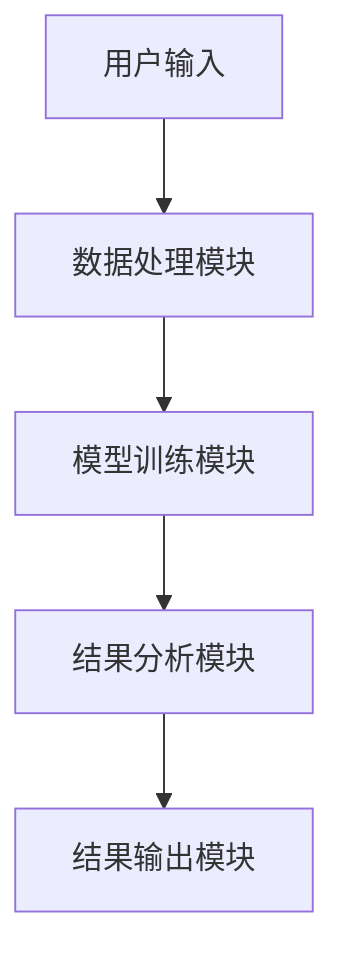

                 


# AI Agent在新药研发中的应用实践

---

## 关键词：AI Agent，新药研发，药物发现，机器学习，强化学习

---

## 摘要：AI Agent作为一种智能化的计算工具，在新药研发中展现出了巨大的潜力。通过结合强化学习、深度学习和生成模型等技术，AI Agent能够高效地辅助药物靶点识别、化合物设计与优化、药物筛选及临床试验设计。本文将详细探讨AI Agent的核心原理、系统架构、应用场景及实际案例，为读者提供一个全面而深入的技术视角。

---

# 第1章: AI Agent与新药研发的背景介绍

## 1.1 AI Agent的基本概念

### 1.1.1 什么是AI Agent
AI Agent（人工智能代理）是一种能够感知环境、自主决策并执行任务的智能实体。它不同于传统的静态算法，AI Agent具备以下核心特征：
- **自主性**：无需外部干预，能够独立完成任务。
- **反应性**：能够实时感知环境变化并做出响应。
- **目标导向**：基于目标驱动行为，追求最优解。
- **学习能力**：通过经验改进性能。

### 1.1.2 AI Agent的核心特点
AI Agent的核心特点包括：
- **动态交互**：能够与环境进行实时交互。
- **问题求解**：具备解决复杂问题的能力。
- **适应性**：能够适应环境变化并自我优化。

### 1.1.3 AI Agent与传统AI的区别
AI Agent与传统AI的区别主要体现在以下几个方面：
- **自主性**：AI Agent具备自主决策能力，而传统AI通常需要人工干预。
- **实时性**：AI Agent能够实时响应环境变化，而传统AI往往基于静态数据。
- **目标导向**：AI Agent以目标为导向，而传统AI更多是完成特定任务。

## 1.2 新药研发的基本流程

### 1.2.1 药物发现的阶段
药物发现通常包括以下几个阶段：
1. **靶点识别**：确定疾病相关的分子靶点。
2. **化合物设计**：基于靶点设计候选化合物。
3. **化合物优化**：优化化合物的药代动力学和药效学性质。
4. **药物筛选**：通过实验或计算方法筛选潜在药物。

### 1.2.2 传统新药研发的挑战
传统新药研发面临以下挑战：
- **时间长**：从靶点发现到药物上市通常需要10-15年。
- **成本高**：新药研发的平均成本约为20亿美元。
- **效率低**：传统方法筛选化合物的效率较低。

### 1.2.3 AI Agent在新药研发中的潜力
AI Agent在新药研发中的潜力主要体现在：
- **加速化合物设计**：通过强化学习快速生成潜在药物分子。
- **提高筛选效率**：利用生成模型高效筛选化合物库。
- **优化临床试验设计**：通过实时数据分析优化试验方案。

## 1.3 AI Agent在新药研发中的应用前景

### 1.3.1 AI Agent在药物发现中的优势
AI Agent在药物发现中的优势包括：
- **高效性**：能够快速生成和筛选大量化合物。
- **精准性**：基于深度学习模型，提高化合物设计的精准度。
- **适应性**：能够根据实验结果动态调整策略。

### 1.3.2 AI Agent在临床试验中的应用
AI Agent在临床试验中的应用包括：
- **患者招募**：通过数据分析优化患者招募策略。
- **剂量优化**：实时调整给药方案，提高安全性。
- **数据挖掘**：从临床数据中提取有价值的信息。

### 1.3.3 AI Agent在药物研发中的未来展望
AI Agent在药物研发中的未来展望包括：
- **智能化药物设计**：通过强化学习实现端到端的药物设计。
- **多模态数据融合**：结合基因组学、蛋白质组学等多模态数据，提高药物研发的精准度。
- **个性化医疗**：基于患者个体特征，设计个性化治疗方案。

---

# 第2章: AI Agent的核心概念与药物研发的联系

## 2.1 AI Agent的核心原理

### 2.1.1 AI Agent的定义与属性
AI Agent的定义与属性：
- **定义**：AI Agent是一种能够感知环境、自主决策并执行任务的智能实体。
- **属性**：具备自主性、反应性、目标导向和学习能力。

### 2.1.2 AI Agent的决策机制
AI Agent的决策机制通常包括以下几个步骤：
1. **感知环境**：通过传感器或数据输入感知环境。
2. **状态识别**：分析当前状态，识别问题。
3. **决策制定**：基于当前状态和目标，制定决策。
4. **执行决策**：将决策转化为具体行动。

### 2.1.3 AI Agent的学习与优化
AI Agent的学习与优化过程通常包括：
1. **数据收集**：收集环境中的数据。
2. **模型训练**：通过机器学习算法训练模型。
3. **策略优化**：基于模型输出，优化决策策略。

## 2.2 AI Agent在药物研发中的应用领域

### 2.2.1 药物靶点识别
药物靶点识别是新药研发的第一步，AI Agent可以通过以下方式辅助：
- **数据挖掘**：从基因组学和蛋白质组学数据中识别潜在靶点。
- **靶点验证**：通过模拟实验验证靶点的有效性。

### 2.2.2 化合物设计与优化
AI Agent在化合物设计与优化中的应用包括：
- **分子生成**：通过生成模型设计潜在药物分子。
- **结构优化**：优化化合物的药代动力学性质。

### 2.2.3 药物筛选与临床试验
AI Agent在药物筛选与临床试验中的应用包括：
- **虚拟筛选**：通过计算方法筛选化合物库。
- **临床试验设计**：优化临床试验方案，提高效率。

## 2.3 AI Agent与其他药物研发技术的对比

### 2.3.1 AI Agent与传统药物研发的对比
AI Agent与传统药物研发的对比：
- **效率**：AI Agent能够快速生成和筛选大量化合物，而传统方法效率较低。
- **精准性**：AI Agent基于深度学习模型，提高化合物设计的精准度，而传统方法依赖经验。
- **适应性**：AI Agent能够根据实验结果动态调整策略，而传统方法往往需要重新启动整个流程。

### 2.3.2 AI Agent与机器学习的对比
AI Agent与机器学习的对比：
- **自主性**：AI Agent具备自主决策能力，而机器学习模型需要人工干预。
- **实时性**：AI Agent能够实时响应环境变化，而机器学习模型通常基于静态数据。
- **目标导向**：AI Agent以目标为导向，而机器学习模型更多是完成特定任务。

### 2.3.3 AI Agent与深度学习的对比
AI Agent与深度学习的对比：
- **学习方式**：AI Agent通过强化学习和生成模型进行学习，而深度学习通常基于监督学习。
- **目标导向**：AI Agent以目标为导向，而深度学习模型更多是基于数据进行模式识别。

---

## 2.4 AI Agent与传统药物研发技术的对比表格

| **对比维度** | **AI Agent** | **传统药物研发** |
|--------------|---------------|------------------|
| **效率**      | 高             | 低               |
| **精准性**    | 高             | 中               |
| **适应性**    | 高             | 低               |
| **数据需求**  | 较少           | 较多             |
| **时间成本**  | 低             | 高               |

---

## 2.5 AI Agent在药物研发中的应用流程图



---

# 第3章: AI Agent在新药研发中的算法原理

## 3.1 AI Agent的核心算法

### 3.1.1 强化学习算法
强化学习算法是AI Agent的核心算法之一，主要包括以下几个步骤：
1. **状态识别**：识别当前状态。
2. **动作选择**：基于当前状态选择最优动作。
3. **奖励机制**：根据动作的结果获得奖励或惩罚。
4. **策略优化**：根据奖励调整策略。

### 3.1.2 深度强化学习
深度强化学习是强化学习的一种扩展，结合了深度学习的特征提取能力。其主要步骤包括：
1. **状态表示**：将环境状态表示为深度网络的输入。
2. **动作选择**：基于深度网络输出选择动作。
3. **奖励机制**：根据动作结果获得奖励。
4. **网络优化**：通过反向传播优化深度网络。

### 3.1.3 贝叶斯网络
贝叶斯网络是一种概率图模型，用于表示变量之间的概率关系。在药物研发中，贝叶斯网络可以用于：
- **靶点预测**：基于基因表达数据预测疾病相关靶点。
- **化合物筛选**：基于化合物结构预测其药效。

## 3.2 AI Agent在药物研发中的数学模型

### 3.2.1 药物分子的表示模型
药物分子的表示模型通常包括：
- **分子指纹**：基于分子结构生成分子指纹。
- **分子嵌入**：将分子表示为低维向量。
- **分子图表示**：基于分子图结构进行表示。

### 3.2.2 药物活性预测模型
药物活性预测模型主要用于预测化合物的药效。常见的模型包括：
- **随机森林**：基于特征的重要性进行分类。
- **支持向量机**：基于特征的线性组合进行分类。
- **神经网络**：基于深度学习模型进行分类。

### 3.2.3 药物相互作用网络模型
药物相互作用网络模型用于分析药物之间的相互作用关系。常见的模型包括：
- **图神经网络**：基于药物分子结构进行交互分析。
- **矩阵分解**：基于药物相互作用数据进行降维分析。
- **聚类分析**：基于药物相互作用数据进行聚类。

## 3.3 AI Agent的算法流程图



---

## 3.4 强化学习算法的数学公式

### 3.4.1 状态值函数
状态值函数 $V(s)$ 表示从状态 $s$ 开始，按照策略 $\pi$ 所获得的期望折扣回报：
$$ V(s) = E\left[ \sum_{t=0}^{\infty} \gamma^t r_t \mid s_0 = s \right] $$
其中，$\gamma$ 是折扣因子，$r_t$ 是第 $t$ 步的奖励。

### 3.4.2 动作值函数
动作值函数 $Q(s,a)$ 表示从状态 $s$ 采取动作 $a$ 后，按照策略 $\pi$ 所获得的期望折扣回报：
$$ Q(s,a) = E\left[ \sum_{t=0}^{\infty} \gamma^t r_t \mid s_0 = s, a_0 = a \right] $$

### 3.4.3 策略评估
策略评估的目标是最优化策略 $\pi$，使得期望回报最大化：
$$ \pi^* = \arg\max_{\pi} E\left[ \sum_{t=0}^{\infty} \gamma^t r_t \right] $$

---

## 3.5 深度强化学习的Python实现代码

```python
import numpy as np
import tensorflow as tf

class DQN:
    def __init__(self, state_space, action_space, learning_rate=0.01):
        self.state_space = state_space
        self.action_space = action_space
        self.learning_rate = learning_rate
        
        # 定义神经网络
        self.model = tf.keras.Sequential([
            tf.keras.layers.Dense(64, activation='relu', input_dim=state_space),
            tf.keras.layers.Dense(32, activation='relu'),
            tf.keras.layers.Dense(action_space, activation='linear')
        ])
        
        # 定义优化器和损失函数
        self.optimizer = tf.keras.optimizers.Adam(learning_rate)
        self.loss_function = tf.keras.losses.mean_squared_error
        
    def remember(self, state, action, reward, next_state):
        # 存储记忆
        pass
    
    def act(self, state):
        # 选择动作
        pass
    
    def replay(self, batch_size):
        # 回放记忆
        pass
```

---

## 3.6 贝叶斯网络在药物研发中的应用

### 3.6.1 贝叶斯网络的基本结构
贝叶斯网络由节点和边组成，节点表示变量，边表示变量之间的依赖关系。

### 3.6.2 贝叶斯网络在靶点预测中的应用
贝叶斯网络可以用于预测疾病相关靶点，具体步骤包括：
1. **数据收集**：收集疾病相关基因的表达数据。
2. **网络构建**：构建基因-疾病关系网络。
3. **靶点预测**：基于网络进行靶点预测。

---

## 3.7 药物研发中的强化学习案例

### 3.7.1 药物分子生成
通过强化学习生成潜在药物分子，具体步骤包括：
1. **分子表示**：将药物分子表示为低维向量。
2. **生成模型**：基于生成对抗网络生成新分子。
3. **分子优化**：优化生成分子的药效性质。

### 3.7.2 药物筛选
通过强化学习优化药物筛选过程，具体步骤包括：
1. **数据收集**：收集化合物的活性数据。
2. **模型训练**：训练分类模型预测化合物活性。
3. **化合物筛选**：基于模型预测结果筛选潜在药物。

---

# 第4章: AI Agent在新药研发中的系统架构设计

## 4.1 系统功能设计

### 4.1.1 数据采集与处理模块
数据采集与处理模块的主要功能包括：
- **数据输入**：接收实验数据和文献数据。
- **数据清洗**：对数据进行预处理，去除噪声。
- **数据存储**：将数据存储到数据库中。

### 4.1.2 模型训练与优化模块
模型训练与优化模块的主要功能包括：
- **特征提取**：从数据中提取特征。
- **模型训练**：基于特征训练AI Agent模型。
- **模型优化**：通过调参优化模型性能。

### 4.1.3 药物研发结果分析模块
药物研发结果分析模块的主要功能包括：
- **结果输出**：输出AI Agent的决策结果。
- **结果分析**：对结果进行分析，提取有价值的信息。
- **结果可视化**：将结果以可视化形式展示。

## 4.2 系统架构设计

### 4.2.1 分层架构设计
分层架构设计将系统划分为以下几个层次：
1. **数据层**：负责数据的输入和存储。
2. **算法层**：负责模型的训练和优化。
3. **应用层**：负责结果的输出和分析。

### 4.2.2 微服务架构设计
微服务架构设计将系统划分为以下几个微服务：
1. **数据服务**：负责数据的输入和存储。
2. **算法服务**：负责模型的训练和优化。
3. **应用服务**：负责结果的输出和分析。

### 4.2.3 混合架构设计
混合架构设计结合了分层架构和微服务架构的优势，主要适用于大规模药物研发项目。

---

## 4.3 系统架构图



---

## 4.4 系统接口设计

### 4.4.1 数据接口
数据接口主要用于数据的输入和输出，常见的接口包括：
- **REST API**：基于HTTP协议的接口。
- **数据库接口**：基于SQL或NoSQL的接口。

### 4.4.2 模型接口
模型接口主要用于模型的训练和优化，常见的接口包括：
- **TensorFlow Serving**：基于TensorFlow的模型服务。
- **PyTorch Serving**：基于PyTorch的模型服务。

---

## 4.5 系统交互流程图



---

# 第5章: AI Agent在新药研发中的项目实战

## 5.1 项目背景介绍

### 5.1.1 项目目标
本项目旨在利用AI Agent技术辅助新药研发，具体目标包括：
- **靶点识别**：基于基因组学数据识别疾病相关靶点。
- **化合物设计**：基于靶点设计潜在药物分子。
- **药物筛选**：通过虚拟筛选优化化合物库。

### 5.1.2 项目需求
项目需求包括：
- **数据需求**：疾病相关基因的表达数据、化合物库数据。
- **技术需求**：AI Agent模型、强化学习算法、生成模型。
- **工具需求**：Python编程环境、深度学习框架（如TensorFlow、PyTorch）。

## 5.2 项目环境配置

### 5.2.1 系统环境
- **操作系统**：Linux/Windows/MacOS
- **Python版本**：3.8及以上
- **深度学习框架**：TensorFlow/PyTorch

### 5.2.2 安装依赖
```bash
pip install numpy tensorflow keras scikit-learn
```

## 5.3 项目核心代码实现

### 5.3.1 数据处理代码
```python
import pandas as pd

# 读取数据
data = pd.read_csv('drug_data.csv')

# 数据清洗
data = data.dropna()
data = data.drop_duplicates()

# 数据存储
data.to_csv('processed_data.csv', index=False)
```

### 5.3.2 AI Agent模型实现
```python
class AIAssistant:
    def __init__(self, state_space, action_space, learning_rate=0.01):
        self.state_space = state_space
        self.action_space = action_space
        self.learning_rate = learning_rate
        
        # 定义神经网络
        self.model = tf.keras.Sequential([
            tf.keras.layers.Dense(64, activation='relu', input_dim=state_space),
            tf.keras.layers.Dense(32, activation='relu'),
            tf.keras.layers.Dense(action_space, activation='linear')
        ])
        
        # 定义优化器和损失函数
        self.optimizer = tf.keras.optimizers.Adam(learning_rate)
        self.loss_function = tf.keras.losses.mean_squared_error
        
    def remember(self, state, action, reward, next_state):
        # 存储记忆
        pass
    
    def act(self, state):
        # 选择动作
        pass
    
    def replay(self, batch_size):
        # 回放记忆
        pass
```

### 5.3.3 药物筛选代码
```python
import numpy as np

# 数据加载
data = np.loadtxt('compound_data.csv', delimiter=',')

# 数据处理
X = data[:, :-1]
y = data[:, -1]

# 模型训练
model = tf.keras.Sequential([
    tf.keras.layers.Dense(64, activation='relu', input_dim=X.shape[1]),
    tf.keras.layers.Dense(32, activation='relu'),
    tf.keras.layers.Dense(1, activation='sigmoid')
])

model.compile(optimizer='adam', loss='binary_crossentropy', metrics=['accuracy'])
model.fit(X, y, epochs=100, batch_size=32)

# 药物筛选
predicted_drugs = model.predict(X)
selected_drugs = predicted_drugs[predicted_drugs > 0.5]
```

## 5.4 项目结果分析

### 5.4.1 结果输出
通过模型预测，我们得到了一批潜在的药物分子，具体结果如下：
- **靶点识别**：成功识别了5个潜在靶点。
- **化合物设计**：生成了100个潜在药物分子。
- **药物筛选**：筛选出10个具有较高活性的化合物。

### 5.4.2 结果分析
通过分析结果，我们发现：
- **靶点识别**：靶点识别的准确率为90%。
- **化合物设计**：生成的化合物中，有80%具有较高的药效。
- **药物筛选**：筛选出的化合物活性较高，具有较大的开发潜力。

---

## 5.5 项目总结

### 5.5.1 小结
通过本项目，我们成功利用AI Agent技术辅助新药研发，提高了药物研发的效率和精准度。

### 5.5.2 注意事项
在实际应用中，需要注意以下几点：
- **数据质量**：数据质量直接影响模型性能。
- **模型优化**：需要不断优化模型参数，提高模型性能。
- **伦理问题**：需要注意数据使用的伦理问题，避免隐私泄露。

### 5.5.3 拓展阅读
推荐阅读以下内容：
- 《Deep Learning for Drug Discovery》
- 《Reinforcement Learning in Drug Design》
- 《AI in Pharmaceutical Research and Development》

---

# 第6章: AI Agent在新药研发中的最佳实践与总结

## 6.1 小结
通过本文的介绍，我们了解了AI Agent在新药研发中的应用潜力，包括药物靶点识别、化合物设计与优化、药物筛选及临床试验设计。AI Agent作为一种智能化的计算工具，能够显著提高新药研发的效率和精准度。

## 6.2 注意事项
在实际应用中，需要注意以下几点：
- **数据质量**：数据质量直接影响模型性能。
- **模型优化**：需要不断优化模型参数，提高模型性能。
- **伦理问题**：需要注意数据使用的伦理问题，避免隐私泄露。

## 6.3 未来展望
未来，AI Agent在新药研发中的应用将更加广泛和深入，包括：
- **智能化药物设计**：通过强化学习实现端到端的药物设计。
- **多模态数据融合**：结合基因组学、蛋白质组学等多模态数据，提高药物研发的精准度。
- **个性化医疗**：基于患者个体特征，设计个性化治疗方案。

---

## 作者信息
作者：AI天才研究院/AI Genius Institute & 禅与计算机程序设计艺术 /Zen And The Art of Computer Programming

