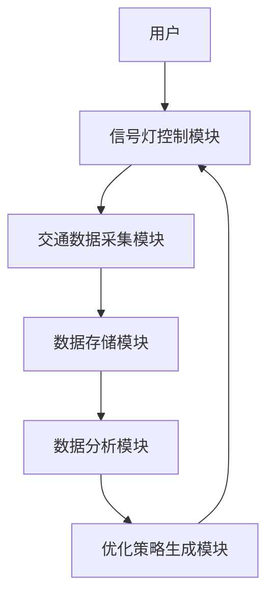

                 


# AI Agent在智慧城市中的应用前景

## 关键词：AI Agent, 智慧城市, 人工智能, 城市规划, 算法原理, 数学模型

## 摘要：随着人工智能技术的飞速发展，AI Agent（人工智能代理）在智慧城市中的应用前景广阔。本文详细探讨了AI Agent的基本概念、核心原理、算法实现及其在智慧城市中的应用场景。通过分析智慧城市中的具体问题，结合AI Agent的优势，本文展示了其在智能交通管理、环境监测、公共安全等方面的重要作用。同时，本文还详细介绍了AI Agent的数学模型和算法实现，为读者提供了理论与实践相结合的深度解析。

---

## 第一部分: AI Agent与智慧城市背景介绍

### 第1章: AI Agent与智慧城市概述

#### 1.1 AI Agent的基本概念
##### 1.1.1 AI Agent的定义与特点
AI Agent（人工智能代理）是一种能够感知环境、自主决策并执行任务的智能实体。与传统的AI系统相比，AI Agent具有更强的自主性和适应性。其主要特点包括：
- **自主性**：能够在没有外部干预的情况下独立运作。
- **反应性**：能够实时感知环境变化并做出响应。
- **智能性**：通过学习和优化提升决策能力。
- **协作性**：能够与其他AI Agent或人类协同工作。

##### 1.1.2 AI Agent的核心要素与功能
AI Agent的核心要素包括感知、决策、学习和执行。其主要功能包括数据处理、任务执行、决策优化和人机交互。

##### 1.1.3 AI Agent与传统AI的区别
传统的AI系统通常依赖于预定义的规则和数据，而AI Agent则具备更强的自主性和学习能力。AI Agent能够根据环境反馈动态调整行为，而传统AI系统则主要基于静态规则。

#### 1.2 智慧城市的概念与特征
##### 1.2.1 智慧城市的定义与内涵
智慧城市是指通过数字化技术将城市中的各个系统（如交通、能源、环境等）有机整合，以实现资源优化配置和高效管理的城市形态。其核心特征包括智能化、数据驱动和可持续性。

##### 1.2.2 智慧城市的主要组成部分
智慧城市的组成部分包括智能交通系统、智能能源管理、智能环境监测、智能公共安全等。这些系统通过数据共享和协同工作，实现城市的高效运行。

##### 1.2.3 智慧城市的发展趋势
随着物联网、大数据和人工智能技术的快速发展，智慧城市正在向更加智能化和个性化的方向发展。未来的智慧城市将更加注重用户体验和资源的可持续利用。

#### 1.3 AI Agent在智慧城市中的应用背景
##### 1.3.1 智慧城市中的问题与挑战
智慧城市的发展面临数据孤岛、资源浪费和管理复杂等问题。传统的管理方式难以应对日益复杂的城市运行环境。

##### 1.3.2 AI Agent在智慧城市中的潜在价值
AI Agent能够通过实时数据处理和自主决策，帮助城市系统实现高效管理和优化。其在智能交通、环境监测等领域具有重要应用价值。

##### 1.3.3 当前应用的现状与不足
目前，AI Agent在智慧城市中的应用还处于起步阶段，主要集中在交通管理和环境监测等领域。但其潜力尚未得到充分挖掘，仍需进一步技术创新和应用探索。

---

## 第二部分: AI Agent的核心概念与原理

### 第2章: AI Agent的核心概念与原理

#### 2.1 AI Agent的核心原理
##### 2.1.1 感知与决策机制
AI Agent通过传感器或数据接口感知环境信息，并基于这些信息进行决策。感知机制包括数据采集、特征提取和数据融合。

##### 2.1.2 学习与优化算法
AI Agent通过强化学习、监督学习等算法不断优化其决策模型。强化学习通过奖励机制实现模型优化，而监督学习则基于标签数据进行分类和回归任务。

##### 2.1.3 人机交互与反馈机制
AI Agent通过自然语言处理和图形用户界面与人类进行交互，并根据用户反馈调整其行为。

#### 2.2 AI Agent的属性特征对比
##### 2.2.1 智能性与自主性对比
智能性强调AI Agent的决策能力，而自主性则关注其独立运作的能力。

##### 2.2.2 反应性与主动性对比
反应性强调实时响应环境变化，而主动性则关注预先规划的行为。

##### 2.2.3 适应性与可扩展性对比
适应性关注AI Agent在环境变化中的调整能力，而可扩展性则关注其在规模扩大时的性能表现。

#### 2.3 AI Agent的实体关系图
```mermaid
er
actor(AI Agent) --> entity(城市数据)
actor(AI Agent) --> entity(用户需求)
actor(AI Agent) --> entity(系统反馈)
```

---

## 第三部分: AI Agent的算法原理与数学模型

### 第3章: AI Agent的算法原理

#### 3.1 强化学习算法
##### 3.1.1 Q-learning算法
Q-learning是一种经典的强化学习算法，通过维护一个Q值表来记录状态-动作对的奖励值。其核心公式为：
$$ Q(s, a) = Q(s, a) + \alpha (r + \gamma \max Q(s', a')) - Q(s, a) $$

##### 3.1.2 DQN算法
深度强化学习（DQN）通过神经网络近似Q值函数，解决了传统强化学习在高维状态空间中的计算难题。

##### 3.1.3 算法实现的Python代码示例
```python
import numpy as np

class QLearning:
    def __init__(self, state_space, action_space, alpha=0.1, gamma=0.9):
        self.state_space = state_space
        self.action_space = action_space
        self.Q = np.zeros((state_space, action_space))
        self.alpha = alpha
        self.gamma = gamma

    def choose_action(self, state):
        return np.argmax(self.Q[state, :])

    def update_Q(self, state, action, reward, next_state):
        self.Q[state, action] += self.alpha * (reward + self.gamma * np.max(self.Q[next_state, :]) - self.Q[state, action])
```

#### 3.2 监督学习算法
##### 3.2.1 分类算法
监督学习算法（如支持向量机、随机森林）常用于处理分类任务，如交通流量预测。

##### 3.2.2 回归算法
线性回归等回归算法适用于连续值预测，如空气污染指数预测。

##### 3.2.3 算法实现的Python代码示例
```python
from sklearn.linear_model import LinearRegression

# 训练模型
model = LinearRegression()
model.fit(X_train, y_train)

# 预测
y_pred = model.predict(X_test)
```

#### 3.3 聚类算法
##### 3.3.1 K-means算法
K-means算法通过将数据点划分为K个簇，实现无监督学习。其目标是最小化簇内平方误差之和。

##### 3.3.2 算法实现的Python代码示例
```python
from sklearn.cluster import KMeans

# 训练模型
model = KMeans(n_clusters=3)
model.fit(X)

# 获取簇中心
cluster_centers = model.cluster_centers_
```

---

## 第四部分: AI Agent在智慧城市中的应用

### 第4章: 智慧城市中的AI Agent应用

#### 4.1 智慧交通管理
AI Agent可以实时优化交通信号灯控制，减少交通拥堵。通过分析历史数据和实时流量，AI Agent能够预测交通瓶颈并提出优化方案。

#### 4.2 智慧环境监测
在环境监测中，AI Agent可以实时分析空气质量数据，预测污染趋势，并提出减排建议。

#### 4.3 智慧公共安全
AI Agent可以用于视频监控，实时识别异常行为，提高公共安全事件的响应速度。

---

## 第五部分: 项目实战

### 第5章: 智能交通管理案例

#### 5.1 项目背景
随着城市化进程的加快，交通拥堵问题日益严重。AI Agent可以通过实时数据分析优化交通信号灯控制，提升道路通行效率。

#### 5.2 系统设计
##### 5.2.1 系统功能模块
- 数据采集模块：收集交通流量、信号灯状态等数据。
- 数据分析模块：利用强化学习算法优化信号灯控制。
- 人机交互模块：提供可视化界面供用户监控和调整。

##### 5.2.2 系统架构设计


#### 5.3 核心代码实现
##### 5.3.1 数据采集模块
```python
import requests

def get_traffic_data():
    response = requests.get("http://localhost:8000/traffic_data")
    return response.json()
```

##### 5.3.2 数据分析模块
```python
def optimize_traffic_light(data):
    # 使用强化学习算法优化信号灯控制
    pass
```

---

## 第六部分: 最佳实践

### 第6章: 小结与展望

#### 6.1 小结
本文详细探讨了AI Agent在智慧城市中的应用前景，从理论到实践，全面分析了其在智能交通、环境监测等领域的潜力。

#### 6.2 注意事项
在实际应用中，需要注意数据隐私、系统安全和算法的可解释性问题。

#### 6.3 未来趋势
随着AI技术的不断发展，AI Agent在智慧城市中的应用将更加广泛，特别是在边缘计算和物联网领域。

#### 6.4 拓展阅读
建议读者进一步学习强化学习、分布式系统和边缘计算等相关知识。

---

## 作者

作者：AI天才研究院/AI Genius Institute & 禅与计算机程序设计艺术/Zen And The Art of Computer Programming

---

以上是《AI Agent在智慧城市中的应用前景》的技术博客文章的完整大纲和内容，涵盖了从理论到实践的各个方面，旨在为读者提供全面而深入的解析。

