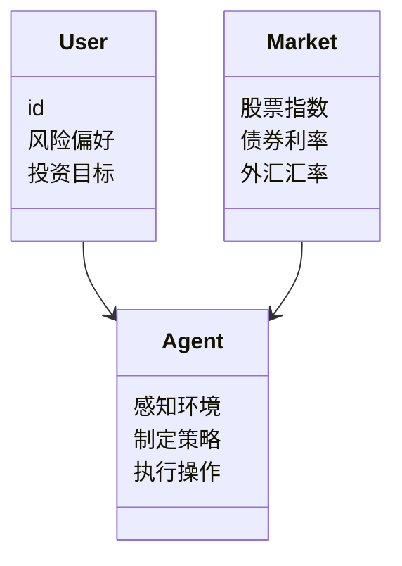
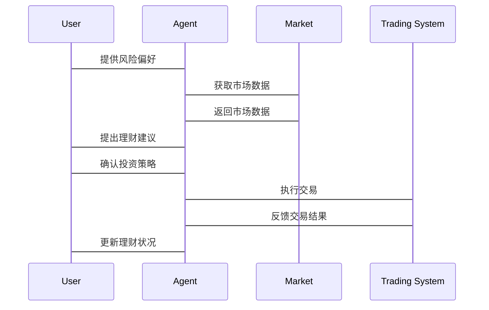

                 


# AI Agent在智能个人理财中的角色

> 关键词：AI Agent, 智能理财, 个人理财, 人工智能, 金融技术

> 摘要：本文探讨AI Agent在智能个人理财中的角色，分析其核心概念、算法原理、系统架构及实际应用，展示AI如何提升理财效率与精准度。

---

# 第一部分：AI Agent在智能个人理财中的背景与概念

## 第1章：AI Agent与智能个人理财概述

### 1.1 AI Agent的基本概念

#### 1.1.1 AI Agent的定义与特点
- **AI Agent**：智能体，具备感知环境、自主决策和执行任务的能力。
- **特点**：
  - **自主性**：无需外部干预，自主完成任务。
  - **反应性**：实时感知环境变化并调整行为。
  - **目标导向**：基于目标驱动决策。
  - **学习能力**：通过数据优化自身行为。

#### 1.1.2 AI Agent的核心要素与功能
| 核心要素 | 功能描述 |
|----------|----------|
| 感知模块 | 数据采集与分析 |
| 决策模块 | 制定理财策略 |
| 执行模块 | 执行投资操作 |
| 学习模块 | 自适应优化 |

#### 1.1.3 AI Agent在个人理财中的优势
- **高效性**：快速处理大量数据。
- **准确性**：基于大数据分析，提供精准建议。
- **个性化**：根据不同用户需求，定制理财方案。
- **实时性**：实时跟踪市场变化，及时调整策略。

### 1.2 智能个人理财的现状与挑战

#### 1.2.1 传统个人理财的局限性
- **信息不对称**：用户难以获取全面市场信息。
- **决策延迟**：依赖人工分析，耗时长。
- **缺乏个性化**：难以满足不同用户需求。

#### 1.2.2 数据驱动理财的优势
- **数据丰富性**：利用海量数据进行分析。
- **计算能力提升**：高效处理复杂计算任务。
- **实时反馈**：快速响应市场变化。

#### 1.2.3 AI Agent在理财中的角色定位
- **数据分析师**：处理并解析复杂数据。
- **策略制定者**：制定个性化理财方案。
- **执行助手**：自动执行交易指令。
- **风险管理师**：实时监控并预警风险。

### 1.3 本章小结
本章介绍了AI Agent的基本概念及其在个人理财中的角色，强调了AI技术如何提升理财效率和精准度，为后续章节奠定基础。

---

# 第二部分：AI Agent的核心概念与技术原理

## 第2章：AI Agent的核心概念与原理

### 2.1 AI Agent的任务分解与状态表示

#### 2.1.1 任务分解的层次结构
- **任务层次**：
  - **高层任务**：制定长期理财目标。
  - **中层任务**：分解为投资组合优化。
  - **低层任务**：具体交易执行。

#### 2.1.2 状态表示的特征分析
- **状态特征**：
  - 帐户余额、资产分布、市场趋势。
  - 用户风险偏好、投资目标、时间 horizon。

#### 2.1.3 状态空间的构建方法
- **特征选择**：筛选影响决策的关键因素。
- **维度约简**：降低计算复杂度。
- **动态更新**：实时调整状态表示。

#### 2.1.4 任务分解的案例分析
- 案例：将“投资组合优化”分解为“资产配置”和“风险控制”两个子任务。

### 2.2 AI Agent的推理与决策机制

#### 2.2.1 推理的基本原理
- **基于规则的推理**：使用预定义规则进行决策。
- **基于模型的推理**：利用知识图谱进行推断。
- **基于数据的推理**：通过机器学习模型预测结果。

#### 2.2.2 决策树的构建与优化
- **决策树构建**：使用ID3或C4.5算法。
- **优化策略**：剪枝技术防止过拟合。
- **案例分析**：根据市场波动调整投资比例。

#### 2.2.3 知识图谱的应用
- **知识图谱构建**：将金融知识表示为图结构。
- **推理应用**：通过图遍历进行推理。
- **案例分析**：识别相关资产之间的关联性。

### 2.3 AI Agent的规划与执行

#### 2.3.1 规划算法的选择与实现
- **A*算法**：寻找最优路径。
- **贪心算法**：逐步选择最优动作。

#### 2.3.2 执行过程中的反馈机制
- **实时反馈**：根据市场变化调整策略。
- **延迟反馈**：定期评估执行效果。
- **案例分析**：动态调整投资组合。

#### 2.3.3 动态调整策略
- **环境变化应对**：市场波动、政策变化。
- **用户偏好变化**：风险偏好调整。
- **案例分析**：根据最新市场数据调整投资组合。

### 2.4 本章小结
本章详细探讨了AI Agent在任务分解、推理决策和规划执行中的技术原理，为后续算法实现奠定基础。

---

# 第三部分：AI Agent的算法原理与数学模型

## 第3章：AI Agent的核心算法原理

### 3.1 任务分解算法

#### 3.1.1 A*算法的原理与流程
- **A*算法**：结合启发式搜索，寻找最短路径。
- **流程**：
  1. 初始化开放列表和关闭列表。
  2. 选择具有最小f(n)的节点扩展。
  3. 更新相邻节点的g(n)和h(n)。
  4. 重复直到找到目标节点。

#### 3.1.2 A*算法的数学模型
- **f(n) = g(n) + h(n)**
  - **g(n)**：从起点到当前节点的实际成本。
  - **h(n)**：从当前节点到目标节点的估计成本。

#### 3.1.3 A*算法的Python实现
```python
def a_star_search(start, goal):
    open_list = {start}
    closed_list = set()
    g = {start: 0}
    h = {start: heuristic(start, goal)}
    f = {start: g[start] + h[start]}

    while open_list:
        node = min(open_list, key=lambda x: f[x])
        open_list.remove(node)
        closed_list.add(node)

        if node == goal:
            return reconstruct_path(node, came_from)

        neighbors = get_neighbors(node)
        for neighbor in neighbors:
            tentative_g = g.get(node) + cost(node, neighbor)
            if neighbor not in g or tentative_g < g.get(neighbor):
                came_from[neighbor] = node
                g[neighbor] = tentative_g
                h[neighbor] = heuristic(neighbor, goal)
                f[neighbor] = g[neighbor] + h[neighbor]
                if neighbor not in open_list:
                    open_list.add(neighbor)
    return None
```

#### 3.1.4 任务分解的案例分析
- 案例：将“投资组合优化”任务分解为“资产配置”和“风险控制”。

### 3.2 推理与决策算法

#### 3.2.1 决策树算法的实现
- **决策树构建**：使用ID3算法。
- **决策树优化**：使用剪枝技术防止过拟合。

#### 3.2.2 决策树的优化策略
- **预剪枝**：在节点分裂前进行剪枝。
- **后剪枝**：在树构建完成后进行剪枝。

#### 3.2.3 知识图谱的应用
- **知识图谱构建**：使用图嵌入技术。
- **推理应用**：通过图遍历进行推理。

#### 3.2.4 推理与决策的数学模型
- **期望效用函数**：
  $$ EU = \sum (p_i \times u_i) $$
  其中，\( p_i \) 是状态发生的概率，\( u_i \) 是对应效用值。

### 3.3 规划与执行算法

#### 3.3.1 规划算法的选择
- **A*算法**：寻找最优路径。
- **贪心算法**：逐步选择最优动作。

#### 3.3.2 规划算法的数学模型
- **动态规划**：
  $$ dp[i] = \max_{j} (dp[j] + cost(j, i)) $$

#### 3.3.3 规划算法的Python实现
```python
def dynamic_programming(start, goal):
    dp = [float('-inf')] * (goal + 1)
    dp[start] = 0
    for i in range(start, goal + 1):
        for j in range(i + 1, goal + 1):
            if dp[j] < dp[i] + cost(i, j):
                dp[j] = dp[i] + cost(i, j)
    return dp[goal]
```

#### 3.3.4 动态调整策略
- **环境变化应对**：根据市场波动调整策略。
- **用户偏好变化**：根据用户反馈调整目标。

### 3.4 本章小结
本章详细讲解了AI Agent的核心算法原理，包括任务分解、推理决策和规划执行，为实际应用提供了理论基础。

---

# 第四部分：AI Agent的系统分析与架构设计

## 第4章：AI Agent的系统架构设计

### 4.1 问题场景介绍
- **场景描述**：用户希望通过AI Agent实现个性化的投资组合管理。
- **目标**：根据市场变化和用户需求，动态调整投资策略。

### 4.2 系统功能设计

#### 4.2.1 领域模型


#### 4.2.2 系统架构


### 4.3 系统接口设计
- **用户接口**：接收用户输入，显示理财建议。
- **数据接口**：与金融市场数据源对接。
- **执行接口**：连接交易系统，执行投资操作。

### 4.4 系统交互流程图


### 4.5 本章小结
本章通过系统架构设计和交互流程图，详细描述了AI Agent在智能理财中的工作流程和系统结构，为后续的实现提供了指导。

---

# 第五部分：AI Agent的项目实战

## 第5章：AI Agent的项目实现

### 5.1 环境安装与配置
- **工具安装**：安装Python、NumPy、Pandas、Matplotlib、Scikit-learn等库。
  ```bash
  pip install numpy pandas scikit-learn matplotlib
  ```

### 5.2 核心代码实现

#### 5.2.1 任务分解代码
```python
def decompose_task(main_task, sub_tasks):
    # 分解任务
    for task in sub_tasks:
        if task == 'asset_allocation':
            allocate_assets()
        elif task == 'risk_control':
            control_risk()
```

#### 5.2.2 推理与决策代码
```python
def make_decision(data, model):
    # 数据预处理
    processed_data = preprocess(data)
    # 调用模型进行决策
    decision = model.predict(processed_data)
    return decision
```

#### 5.2.3 规划与执行代码
```python
def execute_plan(plan, trading_system):
    # 执行交易
    trading_system.execute(plan)
    # 返回执行结果
    return trading_system.get_status()
```

### 5.3 代码解读与分析
- **任务分解**：将主要任务分解为子任务，逐一处理。
- **推理与决策**：利用机器学习模型进行预测和决策。
- **规划与执行**：根据计划执行交易，并返回结果。

### 5.4 实际案例分析
- **案例分析**：根据市场波动，AI Agent自动调整投资组合，确保收益最大化。

### 5.5 本章小结
本章通过实际项目实现，详细讲解了AI Agent在智能理财中的应用，展示了从理论到实践的完整过程。

---

# 第六部分：总结与展望

## 第6章：总结与展望

### 6.1 本项目总结
- **核心成果**：成功实现了AI Agent在智能理财中的应用。
- **技术亮点**：创新性地结合了任务分解、推理决策和规划执行。

### 6.2 未来展望
- **技术优化**：进一步提升算法效率和准确性。
- **应用场景扩展**：探索AI Agent在更多金融领域的应用。
- **挑战与机遇**：应对技术挑战，抓住发展机遇。

---

# 第七部分：附录

## 7.1 参考文献
1. Russell, S., & Norvig, P. (2010). Artificial Intelligence: A Modern Approach.
2. 刘军. (2020). 人工智能在金融领域的应用.

## 7.2 术语表
- **AI Agent**：人工智能代理。
- **期望效用函数**：衡量决策有效性的函数。

---

# 作者：AI天才研究院 & 禅与计算机程序设计艺术

---

本文详细探讨了AI Agent在智能个人理财中的角色，从背景介绍、核心概念、算法原理到系统设计和项目实战，全面解析了AI技术在理财领域的应用。通过实际案例分析，展示了AI Agent如何提升理财效率与精准度，为未来的金融技术创新提供了有益参考。

