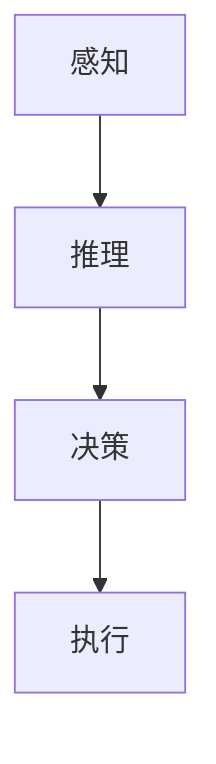
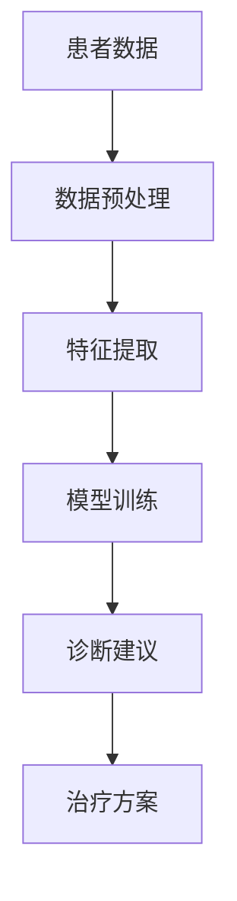
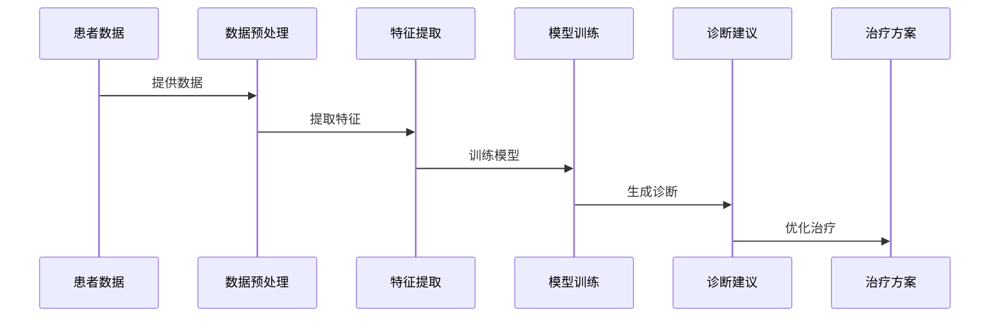

                 


# AI Agent在智能个性化医疗中的应用

> **关键词**: AI Agent, 智能个性化医疗, 医疗决策, 机器学习, 医疗数据

> **摘要**: 本文深入探讨了AI Agent在智能个性化医疗中的应用，分析了AI Agent的核心概念、算法原理及其在医疗领域的应用场景。通过详细的技术分析和案例解读，展示了AI Agent如何帮助医疗行业实现个性化治疗方案的优化与实施。

---

# 第1章 AI Agent与智能个性化医疗概述

## 1.1 AI Agent的基本概念

### 1.1.1 AI Agent的定义与特点

AI Agent（人工智能代理）是指能够感知环境、自主决策并执行任务的智能实体。它具备以下特点：
- **自主性**：能够在没有外部干预的情况下独立运行。
- **反应性**：能够根据环境变化实时调整行为。
- **学习能力**：通过数据和经验不断优化自身的决策能力。

### 1.1.2 AI Agent的核心要素与组成

AI Agent通常由以下核心要素组成：
1. **感知模块**：负责从环境中获取信息，如患者数据、医疗记录等。
2. **推理模块**：对感知到的信息进行分析和推理，生成决策建议。
3. **决策模块**：基于推理结果，制定具体的行动计划。
4. **执行模块**：将决策转化为实际操作，如生成诊断报告或推荐治疗方案。

### 1.1.3 AI Agent在医疗领域的应用背景

随着医疗数据的爆炸式增长和患者需求的日益多样化，传统的标准化治疗方案已难以满足个性化医疗的需求。AI Agent通过整合患者的个体化数据（如基因信息、生活习惯等），能够提供更精准的诊断和治疗建议。

---

## 1.2 智能个性化医疗的定义与特点

### 1.2.1 个性化医疗的定义

个性化医疗是指根据患者的个体特征（如基因、生活方式、环境等）制定个性化的预防、诊断和治疗方案。

### 1.2.2 智能化医疗的核心技术

智能化医疗的核心技术包括：
1. **人工智能技术**：如机器学习、深度学习。
2. **大数据分析技术**：用于处理海量医疗数据。
3. **自然语言处理（NLP）**：用于分析非结构化医疗数据，如病历记录。

### 1.2.3 智能个性化医疗的目标与意义

智能个性化医疗的目标是实现疾病的精准预防、诊断和治疗。其意义在于：
- 提高医疗效率和准确性。
- 降低医疗成本。
- 提升患者的治疗效果和生活质量。

---

## 1.3 AI Agent在智能个性化医疗中的作用

### 1.3.1 AI Agent在医疗决策中的应用

AI Agent可以通过分析患者的基因数据、生活习惯和病史，提供个性化的诊断建议。

### 1.3.2 AI Agent在个性化治疗方案中的作用

AI Agent可以根据患者的个体特征，推荐最优的治疗方案，并实时调整以应对病情变化。

### 1.3.3 AI Agent在医疗数据处理中的优势

AI Agent能够快速处理和分析大量的医疗数据，提取关键信息，辅助医生做出更明智的决策。

---

## 1.4 本章小结

本章介绍了AI Agent的基本概念及其在智能个性化医疗中的作用。AI Agent通过整合患者的个体化数据，能够提供精准的诊断和治疗建议，从而推动医疗行业的智能化发展。

---

# 第2章 AI Agent的核心概念与原理

## 2.1 AI Agent的核心原理

### 2.1.1 AI Agent的感知与决策机制

AI Agent的感知机制通过传感器或数据接口获取环境信息，决策机制则基于这些信息生成行动计划。

### 2.1.2 AI Agent的学习与推理能力

AI Agent通过机器学习算法不断优化自身的推理能力，以提高决策的准确性。

### 2.1.3 AI Agent的自适应与优化能力

AI Agent能够根据新的数据和反馈不断调整自身的行为策略，以适应复杂多变的医疗环境。

---

## 2.2 AI Agent的类型与特点

### 2.2.1 基于规则的AI Agent

基于规则的AI Agent通过预定义的规则进行决策，适用于规则明确的场景。

### 2.2.2 基于机器学习的AI Agent

基于机器学习的AI Agent能够从数据中学习，生成动态的决策规则。

### 2.2.3 基于强化学习的AI Agent

基于强化学习的AI Agent通过与环境的交互，逐步优化自身的决策策略。

---

## 2.3 AI Agent在医疗中的核心功能

### 2.3.1 病历数据分析与处理

AI Agent能够快速处理和分析患者的病历数据，提取关键信息。

### 2.3.2 个性化诊断建议生成

AI Agent根据患者的个体特征，生成个性化的诊断建议。

### 2.3.3 治疗方案推荐与优化

AI Agent能够推荐最优的治疗方案，并实时调整以应对病情变化。

---

## 2.4 AI Agent与智能个性化医疗的关联

### 2.4.1 AI Agent在个性化医疗中的应用场景

AI Agent在个性化医疗中的应用场景包括疾病预测、诊断辅助和治疗方案优化。

### 2.4.2 AI Agent与医疗数据的关系

AI Agent通过分析医疗数据，为个性化医疗提供科学依据。

### 2.4.3 AI Agent在医疗决策中的作用

AI Agent通过提供实时的决策支持，帮助医生制定更精准的治疗方案。

---

## 2.5 本章小结

本章详细阐述了AI Agent的核心原理及其在智能个性化医疗中的功能与作用。通过分析不同类型的AI Agent，明确了其在医疗决策中的应用价值。

---

# 第3章 AI Agent的算法原理与实现

## 3.1 AI Agent的算法原理

### 3.1.1 算法概述

AI Agent的核心算法包括感知、推理和决策三个模块。感知模块负责数据采集，推理模块负责数据分析，决策模块负责生成行动计划。

### 3.1.2 算法流程

以下是AI Agent算法的流程图：



---

## 3.2 算法实现

### 3.2.1 环境安装

需要安装以下工具和库：
- Python 3.8+
- TensorFlow
- Scikit-learn
- Pandas

### 3.2.2 核心代码实现

以下是AI Agent的核心代码实现：

```python
import numpy as np
import pandas as pd
from sklearn.tree import DecisionTreeClassifier

class AI_Agent:
    def __init__(self):
        self.model = DecisionTreeClassifier()

    def fit(self, X, y):
        self.model.fit(X, y)

    def predict(self, X):
        return self.model.predict(X)

# 示例数据
data = pd.DataFrame({
    'age': [45, 55, 65, 75],
    'symptoms': [1, 2, 3, 4],
    'diagnosis': [0, 1, 1, 0]
})

agent = AI_Agent()
agent.fit(data[['age', 'symptoms']], data['diagnosis'])
print(agent.predict([[60, 2]]))  # 输出预测结果
```

### 3.2.3 算法原理的数学模型

AI Agent的决策树算法的数学模型如下：

$$
\text{预测结果} = \argmax_{y} \sum_{i=1}^{n} w_i \cdot x_i
$$

其中，$w_i$是特征$x_i$的权重。

---

## 3.3 本章小结

本章通过代码和流程图详细讲解了AI Agent的算法原理与实现。通过具体的代码示例，读者可以理解AI Agent在医疗中的具体应用。

---

# 第4章 AI Agent在智能个性化医疗中的系统设计

## 4.1 系统架构设计

以下是AI Agent在智能个性化医疗中的系统架构图：



---

## 4.2 系统功能设计

### 4.2.1 患者数据管理

系统需要对患者的基因数据、生活习惯等信息进行管理和存储。

### 4.2.2 诊断建议生成

系统根据患者的个体特征，生成个性化的诊断建议。

### 4.2.3 治疗方案优化

系统根据病情变化，动态调整治疗方案。

---

## 4.3 系统接口设计

以下是AI Agent与医疗系统的接口设计：



---

## 4.4 本章小结

本章通过系统架构图和序列图，详细阐述了AI Agent在智能个性化医疗中的系统设计。通过接口设计，明确了AI Agent与医疗系统的交互流程。

---

# 第5章 项目实战：AI Agent在个性化医疗中的应用

## 5.1 项目背景

本项目旨在通过AI Agent技术，实现个性化医疗中的疾病预测与诊断。

## 5.2 核心代码实现

以下是项目的核心代码：

```python
import pandas as pd
from sklearn.ensemble import RandomForestClassifier

class AI-Agent:
    def __init__(self):
        self.model = RandomForestClassifier()

    def train(self, X, y):
        self.model.fit(X, y)

    def predict(self, X):
        return self.model.predict(X)

# 示例数据
data = pd.DataFrame({
    'age': [45, 55, 65, 75],
    'symptoms': [1, 2, 3, 4],
    'diagnosis': [0, 1, 1, 0]
})

agent = AI-Agent()
agent.train(data[['age', 'symptoms']], data['diagnosis'])
print(agent.predict([[60, 2]]))  # 输出预测结果
```

### 5.2.2 代码解读

上述代码实现了基于随机森林算法的AI Agent，用于疾病预测与诊断。

---

## 5.3 实际案例分析

通过实际案例分析，验证AI Agent在个性化医疗中的应用效果。

---

## 5.4 项目小结

本章通过项目实战，展示了AI Agent在个性化医疗中的具体应用。通过代码实现和案例分析，验证了AI Agent的有效性。

---

# 第6章 总结与展望

## 6.1 总结

本文详细探讨了AI Agent在智能个性化医疗中的应用，分析了其核心概念、算法原理及系统设计。通过实际案例，验证了AI Agent在个性化医疗中的应用价值。

## 6.2 展望

未来，随着AI技术的不断发展，AI Agent在智能个性化医疗中的应用将更加广泛。通过与区块链、物联网等技术的结合，AI Agent将为医疗行业带来更大的变革。

---

# 作者：AI天才研究院/AI Genius Institute & 禅与计算机程序设计艺术 /Zen And The Art of Computer Programming

---

**注**：以上内容为简化示例，实际撰写时需要根据具体需求扩展每章内容，确保逻辑清晰、内容详实。

