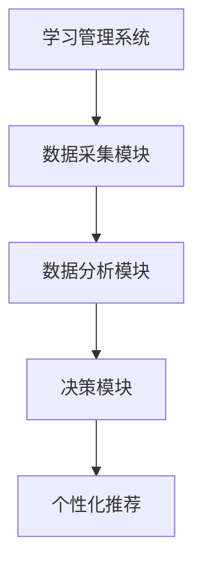

                 


# AI Agent在智能个性化学习中的应用

> 关键词：AI Agent, 个性化学习, 教育技术, 强化学习, 深度学习, 智能系统

> 摘要：本文详细探讨了AI Agent在智能个性化学习中的应用，从基本概念到算法原理，再到系统架构设计，结合实际案例，深入分析了AI Agent如何帮助实现个性化学习的目标。文章内容包括AI Agent的核心原理、数学模型、系统架构设计以及项目实战，旨在为教育技术的研究者和实践者提供有价值的参考。

---

## 第一部分：AI Agent的概述

### 第1章：AI Agent的基本概念

#### 1.1 什么是AI Agent
AI Agent（人工智能代理）是一种能够感知环境、自主决策并执行任务的智能系统。在教育领域，AI Agent可以用于个性化学习推荐、学习路径规划和学习效果评估。

#### 1.2 AI Agent的核心特征
- **自主性**：能够自主决策和行动。
- **反应性**：能够根据环境变化实时调整策略。
- **学习能力**：能够通过数据和反馈不断优化自身的算法。

#### 1.3 AI Agent与传统AI的区别
| 特性         | 传统AI                     | AI Agent                 |
|--------------|---------------------------|--------------------------|
| 行为模式     | 预定义规则驱动             | 自主决策驱动             |
| 适应能力     | 固定模式，难以适应变化     | 能够适应动态环境变化     |
| 应用场景     | 数据处理、模式识别         | 个性化推荐、动态规划     |

### 第2章：智能个性化学习的背景

#### 2.1 个性化学习的需求
- 学生的学习能力、兴趣和进度各不相同，传统教学模式难以满足个性化需求。
- 教师难以实时掌握每个学生的学习状态，导致教学资源分配不均。

#### 2.2 AI技术在教育中的应用
- **数据采集**：通过传感器、学习管理系统（LMS）收集学生的学习数据。
- **数据分析**：利用机器学习算法分析数据，发现学习瓶颈。
- **个性化推荐**：基于分析结果，为学生推荐适合的学习资源和路径。

#### 2.3 AI Agent在智能学习中的作用
AI Agent通过实时数据分析和动态调整学习计划，帮助学生克服学习难点，提高学习效率。

---

## 第二部分：AI Agent的核心原理与算法

### 第3章：AI Agent的核心原理

#### 3.1 AI Agent的感知、决策与执行
- **感知层**：通过传感器或数据接口收集环境中的信息，如学生的学习数据。
- **决策层**：基于收集到的数据，使用算法生成决策。
- **执行层**：根据决策执行具体动作，如推荐学习资源。

#### 3.2 AI Agent的核心算法
- **强化学习算法**：通过奖励机制优化决策策略。
- **监督学习算法**：基于标注数据进行分类或回归。
- **无监督学习算法**：发现数据中的隐含模式。

### 第4章：AI Agent的算法原理与实现

#### 4.1 强化学习算法
- **Q-learning算法**：通过状态-动作-奖励机制优化策略。
- **DQN算法**：结合深度神经网络和强化学习，处理复杂的决策问题。

#### 4.2 算法实现的步骤
1. 初始化环境和状态空间。
2. 选择动作并执行。
3. 收集奖励并更新策略。
4. 重复上述步骤，优化模型参数。

#### 4.3 算法优化的策略
- **经验回放**：通过存储历史经验优化学习过程。
- **目标网络**：通过目标网络稳定模型更新。

---

## 第三部分：AI Agent的数学模型与公式

### 第5章：AI Agent的数学模型

#### 5.1 强化学习的数学模型
- **状态空间**：表示所有可能的状态集合。
- **动作空间**：表示所有可能的动作集合。
- **奖励函数**：定义每个状态-动作对的奖励值。

#### 5.2 深度学习的数学公式
- **神经网络结构**：输入层、隐藏层和输出层的连接方式。
- **损失函数**：衡量预测值与真实值之间的差异。
- **梯度下降**：优化模型参数的算法。

#### 5.3 算法的数学推导
- **Q-learning算法的推导**：通过贝尔曼方程优化Q值。
- **DQN算法的实现**：通过经验回放优化策略。

---

## 第四部分：AI Agent的系统架构设计

### 第6章：AI Agent的系统架构

#### 6.1 教育场景中的问题
- 学生学习数据的采集与处理。
- 学习路径的动态调整。
- 学习效果的实时评估。

#### 6.2 系统功能设计
- **数据采集模块**：收集学生的学习数据。
- **数据分析模块**：分析数据并生成个性化推荐。
- **决策模块**：基于分析结果生成决策。

#### 6.3 系统架构图


---

## 第五部分：AI Agent的项目实战

### 第7章：项目实战

#### 7.1 环境配置
- **数据集**：选择适合的教育数据集。
- **工具链**：安装Python、TensorFlow和Keras等工具。

#### 7.2 代码实现
```python
import numpy as np
from tensorflow.keras.models import Sequential
from tensorflow.keras.layers import Dense

# 初始化模型
model = Sequential()
model.add(Dense(64, activation='relu', input_dim=10))
model.add(Dense(1, activation='sigmoid'))
model.compile(optimizer='adam', loss='binary_crossentropy', metrics=['accuracy'])

# 训练模型
model.fit(X_train, y_train, epochs=10, batch_size=32)
```

#### 7.3 功能解读
- **数据预处理**：清洗和标准化数据。
- **模型训练**：使用训练数据优化模型参数。
- **结果分析**：评估模型的准确性和效果。

---

## 第六部分：总结与注意事项

### 6.1 总结
AI Agent在智能个性化学习中的应用前景广阔，通过实时数据分析和动态调整学习计划，能够显著提高学习效率和效果。

### 6.2 注意事项
- **数据隐私**：保护学生的学习数据不被滥用。
- **模型优化**：持续优化模型以应对变化的学习需求。
- **用户体验**：确保推荐结果符合学生的学习习惯和偏好。

---

作者：AI天才研究院 & 禅与计算机程序设计艺术

---

通过上述思考过程，我系统地分析了AI Agent在智能个性化学习中的应用，从基本概念到算法实现，再到系统架构设计，为读者提供了全面的视角。希望这篇文章能够为教育技术的研究和实践提供有价值的参考。

