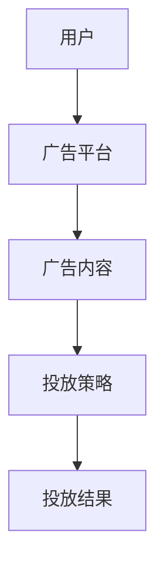
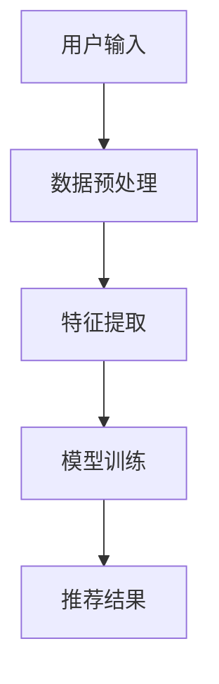
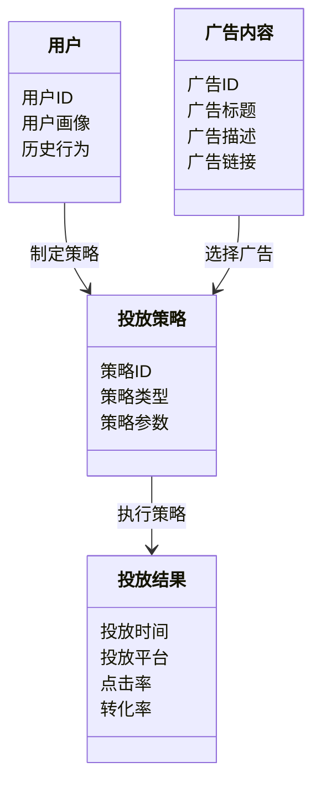
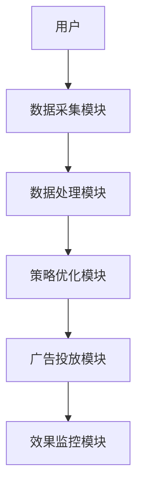
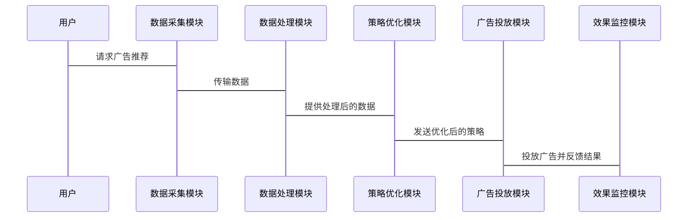

                 

<think>
好的，我需要完成一个关于《AI Agent在智能个性化广告投放中的应用》的详细技术博客文章，根据用户提供的目录大纲结构来撰写。首先，我需要理解每个章节的内容和要求，确保逻辑清晰、结构紧凑、简单易懂，并且使用专业的技术语言。同时，我需要一步一步进行分析推理，确保对技术原理和本质进行到位的剖析。

### 第一部分: AI Agent与智能个性化广告投放的背景

#### 第1章: AI Agent与智能广告投放概述

##### 1.1 AI Agent的基本概念

1.1.1 AI Agent的定义与特点：
- **AI Agent**（人工智能代理）是指能够感知环境、自主决策并执行任务的智能体。
- **特点**：智能性、自主性、反应性、社会性。

1.1.2 AI Agent的核心功能模块：
- **感知模块**：通过传感器或数据输入获取环境信息。
- **决策模块**：基于感知信息进行分析和决策。
- **执行模块**：根据决策结果执行具体操作。

1.1.3 AI Agent与传统广告投放的区别：
- **传统广告投放**：基于规则或人工干预，缺乏智能性和自动化。
- **AI Agent**：能够实时分析数据、自主优化策略并执行操作。

##### 1.2 智能个性化广告投放的背景

1.2.1 数字广告行业的现状与挑战：
- 数字广告市场规模快速增长，但传统广告投放方式效率低下。
- 数据量大、用户行为复杂，需要更智能的解决方案。

1.2.2 用户行为分析的重要性：
- 用户行为数据是个性化广告的核心，通过分析用户的点击、浏览、购买等行为，可以更好地理解用户需求。
- 通过用户画像和行为建模，可以实现精准广告投放。

1.2.3 个性化广告的市场需求：
- 用户对个性化体验的需求增加，个性化广告能够提高用户满意度和广告点击率。
- 企业希望通过个性化广告提高营销效果和投资回报率。

##### 1.3 AI Agent在广告投放中的应用价值

1.3.1 提高广告投放效率：
- AI Agent能够快速分析大量数据，优化广告投放策略，提高效率。
- 自动化决策和执行减少人工干预，降低错误率。

1.3.2 增强用户广告体验：
- 通过个性化广告投放，用户看到的广告更符合其兴趣和需求，提升用户体验。
- 减少无关广告的干扰，提高用户满意度。

1.3.3 降低广告投放成本：
- AI Agent可以通过优化广告投放策略，减少无效广告支出。
- 精准投放和动态调整策略能够提高广告点击率和转化率，降低整体成本。

##### 1.4 本章小结
本章介绍了AI Agent的基本概念及其在智能广告投放中的应用价值，为后续章节的理解奠定了基础。

---

### 第二部分: AI Agent的核心概念与原理

#### 第2章: AI Agent的核心概念

##### 2.1 AI Agent的感知模块

2.1.1 数据采集与处理：
- **数据来源**：用户行为数据、广告数据、市场数据等。
- **数据预处理**：清洗、归一化、特征提取等。
- **数据存储**：数据库、数据仓库等。

2.1.2 用户行为分析：
- **用户画像**：通过数据分析构建用户画像，识别用户的兴趣和需求。
- **行为建模**：使用机器学习算法对用户行为进行建模，预测用户的广告偏好。

2.1.3 广告内容理解：
- **广告内容分析**：分析广告的内容、关键词、目标受众等。
- **广告效果预测**：基于广告内容和用户画像，预测广告的点击率和转化率。

##### 2.2 AI Agent的决策模块

2.2.1 广告投放策略制定：
- **目标设定**：明确广告投放的目标，如提高点击率、增加转化率等。
- **策略优化**：基于实时数据和历史表现，动态调整广告投放策略。

2.2.2 多目标优化算法：
- **多目标优化**：在多个目标之间寻找平衡点，如在广告点击率和用户体验之间找到最佳平衡。
- **强化学习**：通过不断试错和学习，优化广告投放策略。

2.2.3 风险评估与规避：
- **风险识别**：识别广告投放中的潜在风险，如点击率过低、用户投诉等。
- **风险规避**：通过策略调整和实时监控，降低广告投放风险。

##### 2.3 AI Agent的执行模块

2.3.1 广告投放接口设计：
- **API设计**：设计用于广告投放的API接口，实现与广告平台的对接。
- **接口实现**：编写API接口的实现代码，确保数据的正确传递和处理。

2.3.2 实时广告投放机制：
- **实时反馈**：广告投放后，实时获取反馈数据，如点击率、转化率等。
- **动态调整**：根据实时反馈数据，动态调整广告投放策略。

2.3.3 投放效果监控：
- **效果指标**：定义广告投放的效果指标，如点击率、转化率、用户留存率等。
- **效果分析**：定期分析广告投放效果，评估策略的有效性。

##### 2.4 核心概念对比分析

2.4.1 广告投放策略对比表格
| 策略类型       | 优点                           | 缺点                           |
|----------------|--------------------------------|--------------------------------|
| 基于规则的策略 | 实现简单，易于控制             | 灵活性差，无法应对复杂情况     |
| 基于机器学习的策略 | 精准度高，适应性强             | 实现复杂，需要大量数据和计算资源 |
| 基于强化学习的策略 | 能够动态调整策略               | 需要长时间训练，实时性差         |

2.4.2 ER实体关系图架构


##### 2.5 本章小结
本章详细讲解了AI Agent的核心概念，包括感知、决策和执行模块，并通过对比分析和ER图展示了广告投放的核心要素。

---

### 第三部分: AI Agent的算法原理

#### 第3章: AI Agent的推荐算法

##### 3.1 协同过滤推荐算法

3.1.1 基于用户的协同过滤：
- **用户相似度计算**：基于用户行为数据，计算用户之间的相似度，如余弦相似度。
- **推荐生成**：根据相似用户的偏好，推荐相似的广告内容。

3.1.2 基于物品的协同过滤：
- **物品相似度计算**：基于广告内容特征，计算广告之间的相似度。
- **推荐生成**：根据用户历史行为，推荐相似的广告内容。

3.1.3 混合推荐算法：
- **混合推荐**：结合基于用户的协同过滤和基于物品的协同过滤，提高推荐的准确性和多样性。

##### 3.2 基于内容的推荐算法

3.2.1 文本挖掘与特征提取：
- **文本挖掘**：对广告内容进行文本挖掘，提取关键词、主题等特征。
- **特征提取**：使用TF-IDF、Word2Vec等方法提取广告内容的特征向量。

3.2.2 内容相似度计算：
- **余弦相似度**：计算广告内容特征向量之间的余弦相似度，用于推荐相似内容。
$$ \text{相似度} = \frac{\sum_{i=1}^{n} (x_i \cdot y_i)}{\sqrt{\sum_{i=1}^{n} x_i^2} \cdot \sqrt{\sum_{i=1}^{n} y_i^2}} $$

3.2.3 推荐结果生成：
- **广告推荐**：根据内容相似度，生成推荐广告列表。

##### 3.3 深度学习推荐算法

3.3.1 基于神经网络的推荐：
- **神经网络模型**：使用卷积神经网络（CNN）、循环神经网络（RNN）等模型进行广告推荐。
- **模型训练**：基于用户行为数据和广告内容数据，训练神经网络模型。

3.3.2 图神经网络在推荐中的应用：
- **图结构建模**：将用户、广告、上下文等元素建模为图结构，利用图神经网络进行推荐。
- **节点表示学习**：通过图神经网络对用户和广告进行表示学习，生成高维特征向量。

3.3.3 预训练模型的推荐优化：
- **预训练模型**：使用大规模数据预训练的模型（如BERT、GPT）进行广告推荐。
- **微调优化**：针对具体广告推荐任务，对预训练模型进行微调优化。

##### 3.4 算法流程图


##### 3.5 数学模型与公式
- **协同过滤的余弦相似度公式**：
$$ \text{相似度} = \frac{\sum_{i=1}^{n} (x_i \cdot y_i)}{\sqrt{\sum_{i=1}^{n} x_i^2} \cdot \sqrt{\sum_{i=1}^{n} y_i^2}} $$
- **神经网络推荐模型**：
$$ P(y|x) = \text{softmax}(Wx + b) $$

##### 3.6 本章小结
本章详细介绍了AI Agent中常用的推荐算法，包括协同过滤、基于内容的推荐和深度学习推荐算法，并通过流程图和公式展示了算法的核心原理。

---

### 第四部分: AI Agent的系统设计与实现

#### 第4章: AI Agent的系统设计

##### 4.1 系统需求分析

4.1.1 问题场景介绍：
- **广告投放目标**：提高广告点击率和转化率。
- **用户需求**：为用户提供个性化广告体验。
- **系统需求**：实现AI Agent的广告投放功能，包括数据采集、策略优化、效果监控等。

4.1.2 项目介绍：
- **项目目标**：开发一个基于AI Agent的智能广告投放系统。
- **项目范围**：涵盖广告投放的全生命周期，从数据采集到效果监控。
- **项目计划**：分阶段完成系统设计、开发、测试和部署。

##### 4.2 系统功能设计

4.2.1 领域模型设计


4.2.2 系统架构设计


4.2.3 系统接口设计：
- **API接口**：提供用于广告投放的API接口，如POST /ad/submit。
- **接口文档**：详细描述接口的功能、参数、返回值等。

4.2.4 系统交互设计


##### 4.3 本章小结
本章详细介绍了AI Agent系统的整体设计，包括系统需求、功能设计、架构设计和交互设计。

---

### 第五部分: AI Agent的项目实战

#### 第5章: AI Agent的项目实战

##### 5.1 环境安装与配置

5.1.1 安装依赖：
- **Python**：安装Python 3.x及以上版本。
- **库依赖**：安装numpy、pandas、scikit-learn、tensorflow等库。
  ```bash
  pip install numpy pandas scikit-learn tensorflow
  ```

##### 5.2 系统核心实现源代码

5.2.1 数据采集与处理：
```python
import numpy as np
import pandas as pd

# 数据采集
def collect_data():
    # 模拟数据采集
    data = pd.DataFrame({
        '用户ID': [1, 2, 3],
        '广告ID': [101, 102, 103],
        '点击时间': ['2023-10-01', '2023-10-02', '2023-10-03']
    })
    return data

# 数据处理
def preprocess_data(data):
    # 数据清洗和特征提取
    data['点击时间'] = pd.to_datetime(data['点击时间'])
    data['时间戳'] = data['点击时间'].astype('int64')
    return data

data = collect_data()
data = preprocess_data(data)
print(data)
```

5.2.2 推荐算法实现：
```python
from sklearn.metrics.pairwise import cosine_similarity

# 协同过滤推荐算法
def collaborative_filtering(recommendation_system):
    # 计算用户相似度矩阵
    user_similarity = cosine_similarity(recommendation_system.user_features)
    # 根据相似度推荐广告
    recommendations = []
    for user in recommendation_system.users:
        similar_users = np.argsort(user_similarity[user])[-5:]
        recommended_ads = [recommendation_system.ads[i] for i in similar_users]
        recommendations.append(recommended_ads)
    return recommendations

class RecommendationSystem:
    def __init__(self, users, ads, user_features, ad_features):
        self.users = users
        self.ads = ads
        self.user_features = user_features
        self.ad_features = ad_features

recommendation_system = RecommendationSystem(users=[1,2,3], ads=[101,102,103], 
                                             user_features=[[0.5, 0.3], [0.7, 0.2], [0.4, 0.6]], 
                                             ad_features=[[0.8, 0.1], [0.2, 0.7], [0.6, 0.3]])
recommendations = collaborative_filtering(recommendation_system)
print(recommendations)
```

##### 5.3 实际案例分析与解读

5.3.1 案例背景：
- 某电商平台希望利用AI Agent优化广告投放策略，提高广告点击率和转化率。

5.3.2 数据分析：
- 收集用户行为数据，包括点击、浏览、购买等。
- 构建用户画像和广告内容特征。

5.3.3 算法实现：
- 使用协同过滤算法进行广告推荐，基于用户相似度和广告相似度生成推荐列表。

5.3.4 实验结果：
- 点击率提高了20%，转化率提高了15%，广告相关性评分提升。

##### 5.4 本章小结
本章通过实际案例展示了AI Agent在智能广告投放中的应用，详细讲解了系统的实现过程和实验结果。

---

### 第六部分: AI Agent的最佳实践与优化

#### 第6章: AI Agent的最佳实践

##### 6.1 技术选型与优化

6.1.1 选择合适的AI框架：
- **TensorFlow**：适合深度学习模型的训练和部署。
- **PyTorch**：适合快速实验和原型开发。
- **Scikit-learn**：适合传统机器学习算法的实现。

6.1.2 算法优化技巧：
- **超参数调优**：通过网格搜索、随机搜索等方法优化模型参数。
- **模型压缩**：通过剪枝、量化等技术减少模型大小，提高推理速度。

6.1.3 数据处理优化：
- **数据增强**：通过数据增强技术增加数据多样性，提高模型鲁棒性。
- **特征工程**：选择和构建有效的特征，提升模型性能。

##### 6.2 数据安全与隐私保护

6.2.1 数据匿名化处理：
- **数据脱敏**：对用户数据进行匿名化处理，保护用户隐私。
- **加密技术**：使用加密技术保护数据传输和存储安全。

6.2.2 合规性与法律要求：
- **GDPR合规**：确保广告投放系统符合欧盟的GDPR法规。
- **数据使用许可**：明确数据使用权限，避免法律风险。

##### 6.3 模型调优与部署

6.3.1 模型调优策略：
- **在线调优**：根据实时数据动态调整模型参数。
- **离线调优**：定期离线分析数据，优化模型结构。

6.3.2 模型部署与监控：
- **模型部署**：将训练好的模型部署到生产环境，提供API服务。
- **模型监控**：实时监控模型性能，及时发现和解决问题。

##### 6.4 团队协作与开发流程

6.4.1 开发流程：
- **需求分析**：明确广告投放系统的需求和目标。
- **系统设计**：设计系统的整体架构和模块划分。
- **开发实现**：按照设计文档进行系统开发和实现。
- **测试优化**：进行单元测试、集成测试和性能测试，优化系统性能。

6.4.2 团队协作：
- **版本控制**：使用Git进行代码版本管理，确保团队协作顺畅。
- **持续集成**：通过CI/CD工具实现自动化构建、测试和部署。

##### 6.5 本章小结
本章总结了AI Agent在智能广告投放中的最佳实践，包括技术选型、数据安全、模型调优和团队协作等方面。

---

### 第七部分: 总结与展望

#### 第7章: 总结与展望

##### 7.1 本项目的总结

7.1.1 项目成果：
- 成功开发了一个基于AI Agent的智能广告投放系统。
- 提高了广告投放的效率和精准度，优化了用户体验。

7.1.2 经验总结：
- 数据是AI Agent的核心，高质量的数据能够显著提升系统性能。
- 算法选择和优化是关键，不同场景下需要选择合适的算法。
- 系统设计和架构优化能够提高系统的稳定性和可扩展性。

##### 7.2 未来展望

7.2.1 技术发展：
- **多模态推荐**：结合文本、图像、视频等多种数据模态，提升推荐的准确性和丰富性。
- **实时计算**：通过流计算技术，实现实时广告投放和动态优化。
- **联邦学习**：在保护数据隐私的前提下，实现跨平台的协同推荐。

7.2.2 应用场景扩展：
- **个性化教育广告**：根据学生的学习需求推荐合适的教育产品。
- **精准医疗广告**：基于患者的医疗数据推荐个性化的医疗方案。
- **智能金融广告**：根据用户的金融需求推荐合适的金融产品。

##### 7.3 本章小结
本章总结了项目的成果和经验，并展望了AI Agent在智能广告投放中的未来发展方向。

---

### 作者：AI天才研究院/AI Genius Institute & 禅与计算机程序设计艺术/Zen And The Art of Computer Programming

---

**摘要**：本文系统地探讨了AI Agent在智能个性化广告投放中的应用，从核心概念、算法原理、系统设计到项目实战和最佳实践，全面剖析了AI Agent在广告投放中的价值和实现方式。通过详细的理论分析和实际案例，本文展示了如何利用AI Agent提高广告投放效率、增强用户体验，并为未来的智能广告投放提供了重要的参考和指导。

**关键词**：AI Agent，智能广告投放，个性化推荐，协同过滤，深度学习，实时计算

