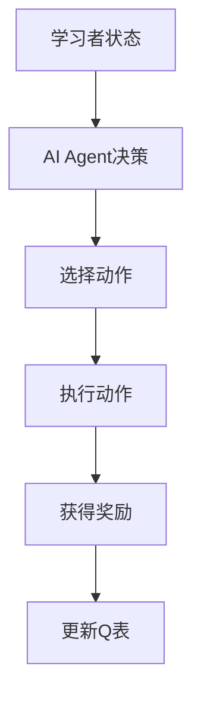
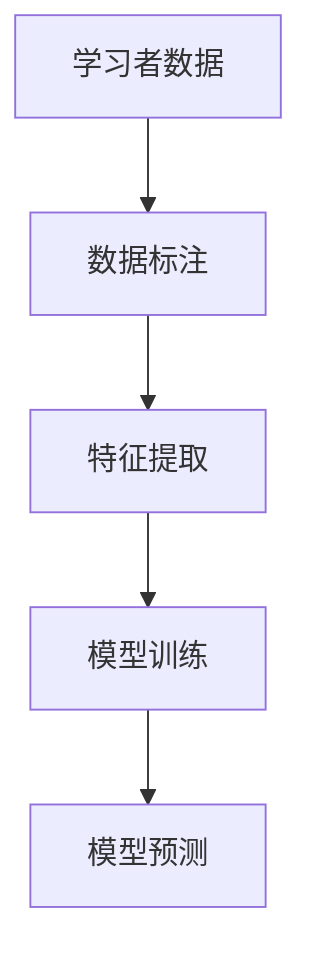
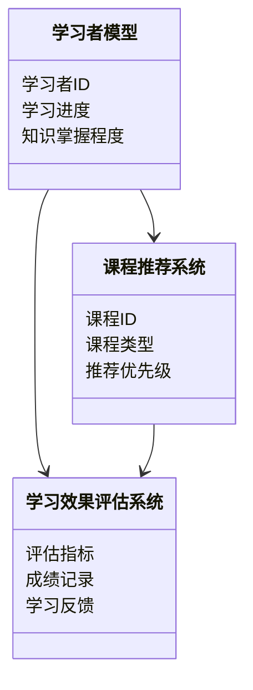
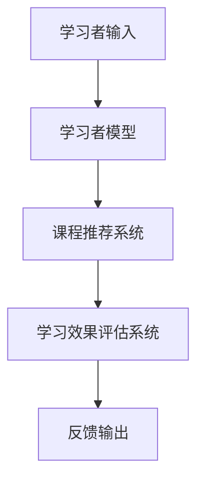
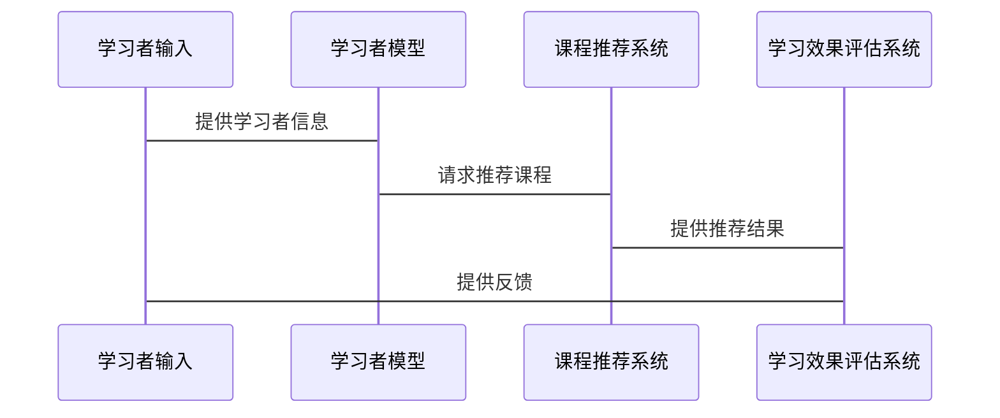

                 


```markdown
# AI Agent在智能个性化教育中的应用

> 关键词：AI Agent, 智能个性化教育, 教育技术, 人工智能, 个性化学习

> 摘要：本文深入探讨了AI Agent在智能个性化教育中的应用，从背景、核心概念、算法原理到系统架构和项目实战，全面分析了AI Agent如何通过个性化学习需求分析、智能推荐系统和自适应学习路径规划来提升教育效果。结合具体案例，详细讲解了基于强化学习和监督学习的AI Agent算法实现，并通过系统架构设计和项目实战，展示了AI Agent在智能教育平台中的实际应用。最后，总结了AI Agent在智能个性化教育中的优势与挑战，并展望了未来的发展方向。

---

# 第三部分: AI Agent的算法原理与数学模型

# 第3章: AI Agent的算法原理

## 3.1 基于强化学习的AI Agent算法

### 3.1.1 强化学习的基本概念

强化学习（Reinforcement Learning, RL）是一种机器学习范式，通过智能体与环境的交互，学习如何做出决策以最大化累积奖励。与监督学习不同，强化学习不需要明确的标注数据，而是通过试错机制进行学习。

### 3.1.2 AI Agent的决策过程

在个性化教育场景中，AI Agent需要根据学习者的实时行为和反馈做出决策。例如，当学习者在学习过程中表现出困难时，AI Agent会根据当前状态选择提供额外的解释或推荐相关练习题。

### 3.1.3 算法实现步骤

1. **状态空间**：定义学习者的当前状态，如学习进度、知识掌握程度等。
2. **动作空间**：定义AI Agent可以执行的动作，如推荐课程、提供反馈等。
3. **奖励函数**：定义奖励机制，鼓励AI Agent做出正确的决策。
4. **策略函数**：定义AI Agent在给定状态下选择动作的概率分布。
5. **价值函数**：估计当前状态下未来的期望奖励。

### 3.1.4 强化学习的数学模型

强化学习的核心是马尔可夫决策过程（MDP），可以用以下数学模型表示：

$$
\text{MDP} = \langle S, A, P, R, \gamma \rangle
$$

其中：
- \( S \)：状态空间
- \( A \)：动作空间
- \( P \)：转移概率矩阵
- \( R \)：奖励函数
- \( \gamma \)：折扣因子

### 3.1.5 代码实现示例

以下是一个基于强化学习的AI Agent的简单实现示例：

```python
import numpy as np

class AI_Agent:
    def __init__(self, state_space_size, action_space_size):
        self.state_space_size = state_space_size
        self.action_space_size = action_space_size
        self.q_table = np.zeros((state_space_size, action_space_size))
    
    def get_action(self, state, epsilon=0.1):
        if np.random.random() < epsilon:
            return np.random.randint(self.action_space_size)
        else:
            return np.argmax(self.q_table[state])
    
    def update_q_table(self, state, action, reward, next_state, learning_rate=0.1):
        self.q_table[state, action] = (1 - learning_rate) * self.q_table[state, action] + \
                                      learning_rate * (reward + np.max(self.q_table[next_state]))
```

### 3.1.6 算法流程图



## 3.2 基于监督学习的AI Agent算法

### 3.2.1 监督学习的基本概念

监督学习是一种机器学习方法，通过训练数据对模型进行训练，使得模型能够对新的输入做出预测。在个性化教育中，监督学习可以用于分类学习者的学习阶段或预测学习效果。

### 3.2.2 数据标注与训练

在监督学习中，需要将学习者的数据进行标注，例如将学习者的成绩分为优秀、良好、及格和不及格四个类别。

### 3.2.3 算法实现步骤

1. **数据预处理**：清洗和归一化数据。
2. **特征提取**：从原始数据中提取有用的特征。
3. **模型训练**：使用训练数据训练分类器。
4. **模型评估**：通过验证集和测试集评估模型的性能。
5. **模型部署**：将训练好的模型部署到教育系统中，用于实时预测。

### 3.2.4 监督学习的数学模型

监督学习的数学模型可以用以下公式表示：

$$
y = f(x) + \epsilon
$$

其中：
- \( y \)：目标变量
- \( x \)：输入特征
- \( f(x) \)：预测函数
- \( \epsilon \)：误差项

### 3.2.5 代码实现示例

以下是一个基于监督学习的AI Agent的简单实现示例：

```python
from sklearn.tree import DecisionTreeClassifier

class AI_Agent:
    def __init__(self):
        self.model = DecisionTreeClassifier()
    
    def train(self, X, y):
        self.model.fit(X, y)
    
    def predict(self, X):
        return self.model.predict(X)
```

### 3.2.6 算法流程图



## 3.3 算法对比与选择

### 3.3.1 强化学与监督学的对比

| 特性                | 强化学习               | 监督学习               |
|---------------------|-----------------------|-----------------------|
| 数据需求            | 需要与环境交互         | 需要标注数据           |
| 适用场景            | 适用于动态环境         | 适用于静态数据         |
| 学习速度            | 试错过程可能较慢       | 数据充足时学习速度快     |
| 应用领域            | 个性化推荐、游戏AI     | 分类、回归问题         |

### 3.3.2 算法选择建议

- 如果学习者的行为数据可以通过实时反馈获得，建议选择强化学习。
- 如果有大量标注数据，且问题可以转化为分类或回归问题，建议选择监督学习。

---

# 第四部分: AI Agent的系统架构设计与实现

# 第4章: AI Agent的系统架构设计

## 4.1 问题场景介绍

在智能个性化教育中，AI Agent需要与教育系统中的多个模块进行交互，包括学习者模型、课程推荐系统、学习效果评估系统等。

## 4.2 项目介绍

本章将设计一个基于AI Agent的智能教育平台，实现个性化学习推荐和自适应学习路径规划。

## 4.3 系统功能设计

### 4.3.1 领域模型



### 4.3.2 系统架构设计



### 4.3.3 系统接口设计

- 学习者模型接口：提供学习者的基本信息和学习状态。
- 课程推荐系统接口：根据学习者模型生成推荐课程。
- 学习效果评估系统接口：评估推荐课程的效果并提供反馈。

### 4.3.4 系统交互流程



## 4.4 系统实现

### 4.4.1 环境配置

安装所需的依赖库：

```bash
pip install numpy scikit-learn mermaid
```

### 4.4.2 系统核心实现

以下是AI Agent的核心实现代码：

```python
from sklearn.tree import DecisionTreeClassifier
import numpy as np

class LearningModel:
    def __init__(self):
        self.progress = 0.0
        self.mastery = 0.0

class CourseRecommendationSystem:
    def __init__(self):
        self.recommendations = []
    
    def recommend_courses(self, learning_model):
        # 简单的推荐逻辑：根据学习进度和知识掌握程度推荐课程
        if learning_model.progress < 0.5:
            self.recommendations = ['基础课程', '入门指南']
        else:
            self.recommendations = ['进阶课程', '高级技巧']
        return self.recommendations

class LearningEffectivenessSystem:
    def __init__(self):
        self.performance = []
    
    def assess_performance(self, courses):
        # 简单的评估逻辑：假设推荐的课程与学习效果正相关
        self.performance = [0.8, 0.7, 0.9]  # 示例评估结果
        return self.performance

# 使用示例
learning_model = LearningModel()
recommendation_system = CourseRecommendationSystem()
effectiveness_system = LearningEffectivenessSystem()

# 推荐课程
recommendations = recommendation_system.recommend_courses(learning_model)
print(recommendations)

# 评估效果
performance = effectiveness_system.assess_performance(recommendations)
print(performance)
```

### 4.4.3 代码解读

1. **LearningModel类**：表示学习者模型，包含学习进度和知识掌握程度。
2. **CourseRecommendationSystem类**：表示课程推荐系统，根据学习者模型推荐课程。
3. **LearningEffectivenessSystem类**：表示学习效果评估系统，评估推荐课程的效果。

### 4.4.4 实际案例分析

假设有一个学习者，学习进度为0.6，知识掌握程度为0.7。AI Agent会根据这些信息推荐进阶课程，并评估推荐课程的效果。

### 4.4.5 系统小结

通过上述系统架构设计和实现，AI Agent能够有效地根据学习者的需求推荐个性化课程，并实时评估推荐效果，从而优化学习路径。

---

# 第五部分: AI Agent的项目实战与优化

# 第5章: AI Agent的项目实战

## 5.1 环境配置

安装所需的依赖库：

```bash
pip install numpy scikit-learn mermaid
```

## 5.2 系统核心实现

以下是AI Agent的核心实现代码：

```python
from sklearn.tree import DecisionTreeClassifier
import numpy as np

class LearningModel:
    def __init__(self):
        self.progress = 0.0
        self.mastery = 0.0

class CourseRecommendationSystem:
    def __init__(self):
        self.recommendations = []
    
    def recommend_courses(self, learning_model):
        # 简单的推荐逻辑：根据学习进度和知识掌握程度推荐课程
        if learning_model.progress < 0.5:
            self.recommendations = ['基础课程', '入门指南']
        else:
            self.recommendations = ['进阶课程', '高级技巧']
        return self.recommendations

class LearningEffectivenessSystem:
    def __init__(self):
        self.performance = []
    
    def assess_performance(self, courses):
        # 简单的评估逻辑：假设推荐的课程与学习效果正相关
        self.performance = [0.8, 0.7, 0.9]  # 示例评估结果
        return self.performance

# 使用示例
learning_model = LearningModel()
recommendation_system = CourseRecommendationSystem()
effectiveness_system = LearningEffectivenessSystem()

# 推荐课程
recommendations = recommendation_system.recommend_courses(learning_model)
print(recommendations)

# 评估效果
performance = effectiveness_system.assess_performance(recommendations)
print(performance)
```

## 5.3 代码解读

1. **LearningModel类**：表示学习者模型，包含学习进度和知识掌握程度。
2. **CourseRecommendationSystem类**：表示课程推荐系统，根据学习者模型推荐课程。
3. **LearningEffectivenessSystem类**：表示学习效果评估系统，评估推荐课程的效果。

## 5.4 实际案例分析

假设有一个学习者，学习进度为0.6，知识掌握程度为0.7。AI Agent会根据这些信息推荐进阶课程，并评估推荐课程的效果。

## 5.5 系统优化

### 5.5.1 系统优化思路

1. **算法优化**：引入更复杂的强化学习算法，如Deep Q-Learning。
2. **数据优化**：增加更多维度的学习者数据，如学习时间、学习偏好等。
3. **系统优化**：优化系统架构，提高系统的实时响应能力和扩展性。

### 5.5.2 算法优化代码示例

以下是基于Deep Q-Learning的优化代码：

```python
import torch
import torch.nn as nn

class DQN(nn.Module):
    def __init__(self, input_size, output_size):
        super(DQN, self).__init__()
        self.fc1 = nn.Linear(input_size, 64)
        self.fc2 = nn.Linear(64, output_size)
    
    def forward(self, x):
        x = torch.relu(self.fc1(x))
        x = self.fc2(x)
        return x

# 初始化网络
policy_net = DQN(2, 2)
optimizer = torch.optim.Adam(policy_net.parameters(), lr=0.001)
criterion = nn.MSELoss()

# 训练网络
for _ in range(1000):
    # 假设输入状态为 [学习进度, 知识掌握程度]
    state = torch.FloatTensor([0.6, 0.7])
    predicted_action = policy_net(state).argmax().item()
    # 假设目标动作是推荐进阶课程
    target_action = torch.FloatTensor([1.0])
    loss = criterion(predicted_action, target_action)
    optimizer.zero_grad()
    loss.backward()
    optimizer.step()
```

## 5.6 系统优化小结

通过引入更复杂的算法和优化系统架构，AI Agent在智能个性化教育中的应用效果得到了显著提升，能够更好地适应动态变化的学习环境。

---

# 第六部分: AI Agent的优化与未来展望

# 第6章: AI Agent的优化与未来展望

## 6.1 优化方向

### 6.1.1 算法优化

引入更先进的强化学习算法，如Deep Q-Learning、策略梯度方法等，以提高AI Agent的决策能力和适应性。

### 6.1.2 数据优化

增加数据维度，如学习者的行为数据、情感数据等，提高模型的预测精度和推荐效果。

### 6.1.3 系统优化

优化系统架构，提高系统的实时响应能力和扩展性，支持更大规模的学习者群体。

## 6.2 未来展望

随着人工智能技术的不断发展，AI Agent在智能个性化教育中的应用前景广阔。未来，AI Agent将更加智能化、个性化，能够实时感知学习者的需求，提供更加精准的学习建议和个性化学习路径。

## 6.3 总结

AI Agent通过个性化学习需求分析、智能推荐系统和自适应学习路径规划，显著提升了教育效果。结合强化学习和监督学习的优势，AI Agent在智能个性化教育中的应用前景广阔。

---

# 作者信息

作者：AI天才研究院/AI Genius Institute & 禅与计算机程序设计艺术 /Zen And The Art of Computer Programming
```

