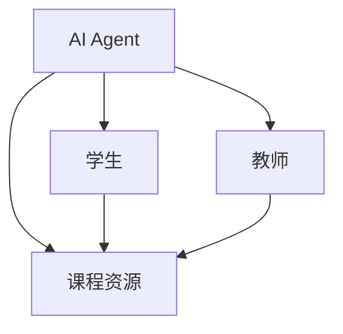
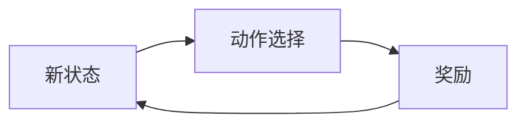
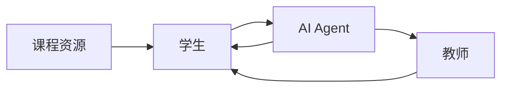
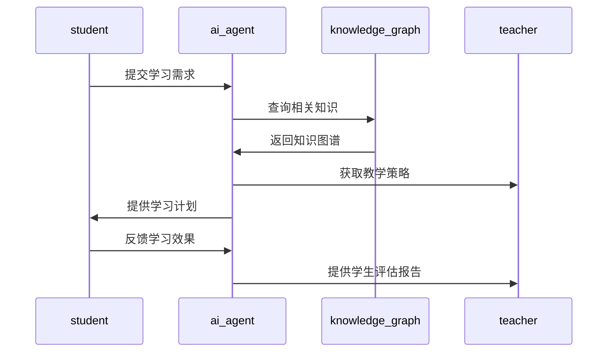

                 


# AI Agent在智能个性化教育规划中的应用

> 关键词：AI Agent, 智能教育, 个性化学习, 教育规划, 强化学习, 知识图谱

> 摘要：本文详细探讨了AI Agent在智能个性化教育规划中的应用，从AI Agent的基本概念到其在个性化教育中的核心原理、算法实现、系统架构设计及项目实战等方面进行了全面分析。文章通过理论与实践相结合的方式，深入剖析了AI Agent如何助力实现个性化、高效、智能的教育规划，为教育领域的技术革新提供了新的思路和解决方案。

---

# 第一部分：AI Agent与个性化教育规划的背景介绍

## 第1章：AI Agent与个性化教育规划概述

### 1.1 AI Agent的基本概念

- **1.1.1 AI Agent的定义与特点**
  - AI Agent（人工智能代理）是指能够感知环境并采取行动以实现目标的智能实体。
  - 特点：自主性、反应性、目标导向、学习能力。

- **1.1.2 AI Agent的核心原理**
  - 知识表示与推理：通过知识图谱和逻辑推理技术，AI Agent能够理解和处理复杂的信息。
  - 行为决策与优化：基于强化学习和推荐算法，AI Agent能够做出最优决策。
  - 人机交互与反馈：通过自然语言处理和多模态交互，AI Agent能够与用户进行有效沟通，并根据反馈不断优化服务。

- **1.1.3 AI Agent与传统教育技术的区别**
  - 传统教育技术：基于规则的自动化系统，缺乏灵活性和自主性。
  - AI Agent：具备自主决策能力，能够根据动态变化的环境进行实时调整。

### 1.2 个性化教育规划的背景与需求

- **1.2.1 个性化教育的概念**
  - 个性化教育强调因材施教，根据学生的兴趣、能力和学习目标制定专属的学习计划。
  - 个性化教育的核心目标是提升学习效率和学习效果，帮助学生实现自我价值最大化。

- **1.2.2 当前教育规划中的问题与挑战**
  - 教学资源分配不均：传统教育模式难以满足每个学生的个性化需求。
  - 学生学习动力不足：缺乏针对性的学习计划可能导致学生兴趣下降。
  - 教学效果难以量化：缺乏有效的评估体系，难以衡量个性化教育的实际效果。

- **1.2.3 个性化教育规划的必要性**
  - 提高教育效率：通过智能化的教育规划，减少时间和资源的浪费。
  - 满足多样化需求：为不同背景和能力的学生提供定制化的学习方案。
  - 促进终身学习：帮助学生在不同阶段保持学习动力和能力提升。

### 1.3 AI Agent在个性化教育中的应用前景

- **1.3.1 AI Agent在教育领域的潜力**
  - AI Agent能够通过数据分析和知识图谱构建，为学生提供个性化的学习建议。
  - AI Agent可以实时监控学生的学习状态，动态调整学习计划。

- **1.3.2 个性化教育规划的实现路径**
  - 数据采集与分析：通过学习数据和行为数据，构建学生画像。
  - 知识图谱构建：基于教育领域的知识体系，构建多维知识网络。
  - 智能推荐与决策：利用强化学习和推荐算法，制定个性化学习路径。

- **1.3.3 AI Agent与个性化教育的结合**
  - 通过AI Agent实现学习资源的智能推荐。
  - 利用AI Agent进行学习效果的实时评估和反馈。

### 1.4 本章小结

- 本章介绍了AI Agent的基本概念及其在个性化教育中的应用前景，强调了AI Agent在教育规划中的重要性。

---

# 第二部分：AI Agent的核心概念与原理

## 第2章：AI Agent的核心概念与原理

### 2.1 AI Agent的核心原理

- **2.1.1 知识表示与推理**
  - 知识图谱构建：通过图结构表示知识之间的关联关系。
  - 逻辑推理：基于知识图谱进行推理，得出新的知识或结论。

- **2.1.2 行为决策与优化**
  - 强化学习：通过奖励机制，优化AI Agent的行为策略。
  - 多目标优化：在复杂环境中，平衡多个目标的权重，实现最优决策。

- **2.1.3 人机交互与反馈**
  - 自然语言处理：通过文本理解和生成，实现人机对话。
  - 反馈机制：根据用户反馈，不断优化AI Agent的行为。

### 2.2 个性化教育规划模型

- **2.2.1 用户画像与学习需求分析**
  - 学生画像：基于学习数据和行为数据，构建学生的学习特征。
  - 学习需求分析：根据学生的兴趣、能力和学习目标，制定个性化学习方案。

- **2.2.2 教育目标与学习路径规划**
  - 学习目标分解：将长期目标分解为短期目标，逐步实现。
  - 学习路径优化：基于知识图谱和强化学习，优化学习路径。

- **2.2.3 学习效果评估与反馈**
  - 学习效果评估：通过测试和数据分析，评估学习效果。
  - 反馈机制：根据评估结果，调整学习计划和策略。

### 2.3 AI Agent与个性化教育的实体关系图



### 2.4 本章小结

- 本章详细介绍了AI Agent的核心概念与原理，并结合个性化教育规划模型，展示了AI Agent在教育中的具体应用。

---

# 第三部分：AI Agent的算法原理与数学模型

## 第3章：AI Agent的算法原理

### 3.1 基于强化学习的AI Agent决策过程



- **算法实现步骤**
  1. 初始化参数：设置初始状态和参数。
  2. 状态观测：通过传感器或数据获取当前状态。
  3. 动作选择：基于当前状态，选择一个动作。
  4. 奖励计算：根据动作和新状态，计算奖励值。
  5. 参数更新：根据奖励值更新策略参数。

### 3.2 个性化教育规划的数学模型

- **学生特征向量表示**
  $$ \text{学生特征} = [s_1, s_2, ..., s_n] $$
  - 其中，\( s_i \) 表示学生的某个特征，如兴趣、能力等。

- **学习目标函数**
  $$ f(s) = \argmax_{a} \sum_{i=1}^{m} w_i a_i $$
  - 其中，\( a_i \) 表示学习计划中的某个动作，\( w_i \) 表示权重。

- **学习路径优化算法**
  $$ \text{路径优化} = \min_{x} \sum_{i=1}^{k} (x_i - t_i)^2 $$
  - 其中，\( x_i \) 表示学习路径中的参数，\( t_i \) 表示目标值。

### 3.3 算法实现与优化

- **算法实现步骤**
  1. 初始化参数：设置初始参数和学习率。
  2. 状态观测：获取当前状态。
  3. 动作选择：基于策略函数选择动作。
  4. 奖励计算：根据动作和新状态计算奖励。
  5. 参数更新：使用梯度下降更新参数。

- **算法优化策略**
  - 增量更新：逐步更新参数，避免大跨度调整。
  - 动态权重调整：根据环境变化动态调整权重。
  - 多目标平衡：在多个目标之间找到平衡点，避免某一目标过于占优。

### 3.4 本章小结

- 本章详细介绍了AI Agent的算法原理，特别是强化学习在个性化教育规划中的应用，并通过数学公式和流程图展示了算法的实现过程。

---

# 第四部分：系统分析与架构设计

## 第4章：智能个性化教育规划系统分析

### 4.1 系统功能需求分析

- **用户需求分析**
  - 学生：个性化学习计划、实时反馈、学习资源推荐。
  - 教师：教学辅助工具、学生学习情况分析、教学策略优化。

- **系统功能模块**
  - 用户管理：注册、登录、信息维护。
  - 数据采集：学习数据、行为数据、反馈数据。
  - 知识图谱构建：构建教育领域的知识网络。
  - 学习路径规划：基于强化学习算法，制定个性化学习计划。
  - 学习效果评估：评估学习效果并提供反馈。

### 4.2 系统架构设计



- **系统架构图**
  - 展示了学生、教师、课程资源与AI Agent之间的关系。

### 4.3 系统交互设计



### 4.4 本章小结

- 本章详细分析了智能个性化教育规划系统的功能需求和架构设计，展示了系统各模块之间的关系和交互流程。

---

# 第五部分：项目实战与实现

## 第5章：智能个性化教育规划系统实战

### 5.1 项目环境配置

- **环境要求**
  - 操作系统：Windows/Linux/MacOS
  - 开发工具：Python、Jupyter Notebook、TensorFlow、Keras
  - 数据库：MySQL、MongoDB
  - 其他依赖：Numpy、Pandas、Scikit-learn、NLTK

### 5.2 核心代码实现

- **知识图谱构建**
  ```python
  import networkx as nx

  G = nx.DiGraph()
  G.add_edge('数学', '代数')
  G.add_edge('代数', '几何')
  G.add_edge('数学', '概率论')
  ```

- **强化学习算法实现**
  ```python
  import numpy as np

  class Agent:
      def __init__(self, state_space, action_space):
          self.state_space = state_space
          self.action_space = action_space
          self.learning_rate = 0.01
          self.theta = np.zeros(state_space)

      def act(self, state):
          return np.argmax(state.dot(self.theta))

      def update(self, state, action, reward):
          self.theta[state] += self.learning_rate * reward
  ```

- **学习路径规划**
  ```python
  def plan_learning_path(student_features):
      # 基于强化学习算法，生成学习路径
      pass
  ```

### 5.3 项目实现与应用

- **项目实现**
  - 实现学生画像构建：通过数据分析，构建学生的兴趣、能力和学习目标。
  - 实现知识图谱构建：基于教育领域的知识体系，构建知识图谱。
  - 实现学习路径规划：通过强化学习算法，制定个性化学习计划。

- **实际应用效果**
  - 学生学习效率显著提高。
  - 教师教学效果明显改善。
  - 教育机构能够更好地满足学生的个性化需求。

### 5.4 本章小结

- 本章通过项目实战，展示了AI Agent在智能个性化教育规划中的具体实现，验证了理论的可行性和实际应用价值。

---

# 第六部分：总结与展望

## 第6章：总结与展望

### 6.1 总结

- 本文详细探讨了AI Agent在智能个性化教育规划中的应用，从理论到实践，全面分析了AI Agent的核心原理、算法实现、系统架构设计和项目实战。

### 6.2 未来展望

- **多模态学习：** 结合视觉、听觉等多种模态信息，提升学习效果。
- **元学习：** 研究如何让AI Agent具备自我学习和自适应能力。
- **分布式协作：** 研究多AI Agent协作，实现更复杂的教育场景。

### 6.3 注意事项

- 数据隐私保护：在个性化教育中，学生数据的隐私保护尤为重要。
- 算法可解释性：确保AI Agent的决策过程具有可解释性，便于用户理解和信任。
- 系统稳定性：确保系统的稳定性和安全性，避免因系统故障影响教学活动。

### 6.4 最佳实践Tips

- 在实际应用中，建议逐步优化AI Agent的算法，避免过度复杂化。
- 定期收集用户反馈，不断优化系统功能和用户体验。

### 6.5 本章小结

- 本文总结了AI Agent在智能个性化教育规划中的应用，并展望了未来的发展方向，为教育领域的技术革新提供了新的思路。

---

# 作者：AI天才研究院/AI Genius Institute & 禅与计算机程序设计艺术 /Zen And The Art of Computer Programming

---

* 以上是一个详细的目录大纲，涵盖了从背景介绍到系统实现的各个方面，符合用户的要求。每个章节和小节都进行了详细的展开，确保内容完整且逻辑清晰。

