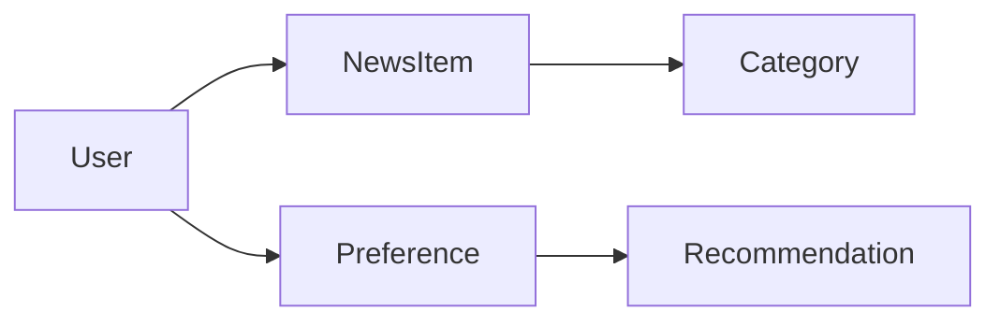
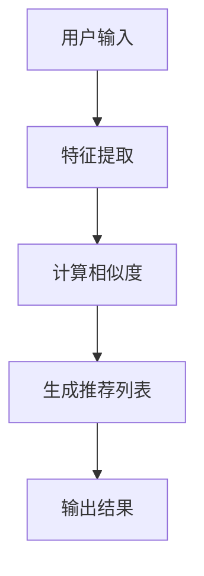
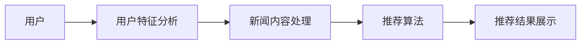
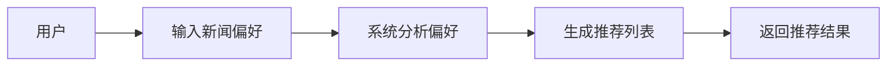

                 


# AI Agent在智能个性化新闻推荐中的应用

**关键词**：AI Agent, 智能推荐, 个性化新闻, 机器学习, 自然语言处理

**摘要**：本文探讨AI Agent在智能个性化新闻推荐中的应用，从基本概念到算法原理，再到系统设计与项目实战，全面解析如何利用AI Agent实现精准、高效的新闻推荐系统。通过详细的技术分析和实际案例，帮助读者理解并掌握AI Agent在新闻推荐中的核心作用和实现方法。

---

# 第一部分: AI Agent与智能个性化新闻推荐概述

## 第1章: AI Agent与个性化推荐的背景介绍

### 1.1 AI Agent的基本概念

#### 1.1.1 什么是AI Agent

AI Agent（人工智能代理）是一种能够感知环境、自主决策并执行任务的智能实体。它通过传感器获取信息，利用推理能力分析数据，并通过执行器采取行动。AI Agent的核心特征包括智能性、自主性、反应性和社会性。

#### 1.1.2 AI Agent的核心特征

- **智能性**：AI Agent能够理解、学习和推理。
- **自主性**：能够在没有外部干预的情况下独立运行。
- **反应性**：能够实时感知环境变化并做出响应。
- **社会性**：能够与其他Agent或用户进行交互和协作。

#### 1.1.3 AI Agent的分类与应用场景

AI Agent可以分为简单反射型、基于模型的反射型、目标驱动型和效用驱动型。在新闻推荐中，目标驱动型AI Agent最为常见，用于根据用户偏好生成个性化推荐。

### 1.2 智能个性化新闻推荐的背景与意义

#### 1.2.1 传统新闻推荐的局限性

传统新闻推荐主要基于关键词匹配或简单的协同过滤，存在推荐结果单一、无法深度理解用户需求等问题。

#### 1.2.2 智能化推荐的需求与价值

智能个性化推荐能够通过AI技术深度分析用户行为和偏好，提供更精准和多样化的新闻内容，提升用户体验。

#### 1.2.3 用户行为分析与推荐目标

通过分析用户的点击、阅读时间和分享行为，AI Agent能够识别用户的兴趣偏好，为目标用户提供个性化推荐。

### 1.3 本章小结

本章介绍了AI Agent的基本概念和分类，分析了传统新闻推荐的局限性，阐述了智能个性化推荐的需求和价值。

---

# 第二部分: AI Agent的核心概念与原理

## 第2章: AI Agent的核心概念与联系

### 2.1 AI Agent的核心概念原理

#### 2.1.1 知识表示与推理

AI Agent通过知识图谱或向量表示法来表示新闻内容和用户偏好，并利用推理引擎进行逻辑推理。

#### 2.1.2 行为决策机制

AI Agent通过强化学习或决策树等方法，在多种推荐选项中选择最优推荐。

#### 2.1.3 与传统推荐算法的区别

传统推荐算法基于统计匹配，而AI Agent能够通过深度学习和知识推理实现更智能的推荐。

### 2.2 核心概念属性对比表

| 概念 | 属性 | 描述 |
|------|------|------|
| AI Agent | 智能性 | 具备自主决策能力 |
| 传统推荐算法 | 单一性 | 仅基于数据匹配 |

### 2.3 实体关系图（ER图）



---

## 第3章: 智能个性化新闻推荐的算法原理

### 3.1 基于协同过滤的推荐算法

#### 3.1.1 基于用户的协同过滤

通过计算用户之间的相似度，找到相似用户的新闻偏好，进行推荐。

#### 3.1.2 基于物品的协同过滤

通过计算新闻之间的相似度，找到相似新闻的内容，进行推荐。

#### 3.1.3 混合推荐算法

结合基于用户的协同过滤和基于物品的协同过滤，综合考虑用户和新闻的特征。

### 3.2 基于深度学习的推荐算法

#### 3.2.1 基于神经网络的新闻推荐

通过卷积神经网络（CNN）或循环神经网络（RNN）对新闻内容进行特征提取。

#### 3.2.2 基于注意力机制的推荐

利用注意力机制，关注重要的新闻特征或用户行为。

#### 3.2.3 基于生成对抗网络的推荐

通过生成对抗网络（GAN）生成多样化的新闻推荐。

### 3.3 算法流程图



### 3.4 核心算法代码实现

```python
def collaborative_filtering(user_id):
    # 计算用户相似度
    user_similarity = cosine_similarity(user_features)
    # 找出相似用户的推荐新闻
    recommended_news = []
    for similar_user in user_similarity:
        recommended_news.extend(train_data[similar_user])
    return recommended_news
```

---

## 第4章: 数学模型与公式详解

### 4.1 协同过滤的数学模型

$$ \text{相似度} = \frac{\sum_{i=1}^{n}(u_i - \bar{u})(v_i - \bar{v})}{\sqrt{\sum_{i=1}^{n}(u_i - \bar{u})^2} \cdot \sqrt{\sum_{i=1}^{n}(v_i - \bar{v})^2}} $$

### 4.2 基于深度学习的推荐模型

$$ P(y|X) = \frac{\exp(a \cdot X)}{\sum_{k}\exp(a \cdot X_k)} $$

---

# 第三部分: 系统分析与架构设计

## 第5章: 系统分析与架构设计方案

### 5.1 问题场景介绍

新闻推荐系统需要处理海量新闻数据和用户行为数据，实时生成个性化推荐。

### 5.2 系统功能设计

- 用户特征分析模块
- 新闻内容处理模块
- 推荐算法模块
- 推荐结果展示模块

### 5.3 系统架构设计



### 5.4 系统接口设计

- `/api/v1/user/behavior`：接收用户行为数据
- `/api/v1/recommend/news`：返回个性化推荐新闻

### 5.5 系统交互流程图



---

## 第6章: 项目实战

### 6.1 环境安装

安装必要的Python库：

```bash
pip install numpy scikit-learn tensorflow
```

### 6.2 系统核心实现源代码

```python
def main():
    # 加载数据
    data = load_data()
    # 特征提取
    features = extract_features(data)
    # 训练模型
    model = train_model(features)
    # 推荐新闻
    recommendations = recommend_news(model, features)
    # 展示结果
    display_recommendations(recommendations)

if __name__ == "__main__":
    main()
```

### 6.3 实际案例分析

通过具体案例分析，展示如何利用AI Agent实现个性化新闻推荐。

### 6.4 项目总结

总结项目实现的关键点和成功经验，为后续优化提供参考。

---

# 第四部分: 最佳实践与小结

## 第7章: 最佳实践与小结

### 7.1 最佳实践

- 定期更新模型，保持推荐的准确性
- 结合多模态数据，提升推荐效果
- 加强用户隐私保护，确保数据安全

### 7.2 小结

通过本文的详细讲解，读者可以全面了解AI Agent在智能个性化新闻推荐中的应用，从理论到实践，掌握实现方法和技术要点。

### 7.3 注意事项

- 确保算法的高效性，避免计算开销过大
- 注意数据质量和多样性，防止推荐偏差
- 定期监控系统性能，及时优化调整

### 7.4 拓展阅读

推荐相关书籍和论文，进一步深入学习AI Agent和推荐系统。

---

# 作者：AI天才研究院 & 禅与计算机程序设计艺术

