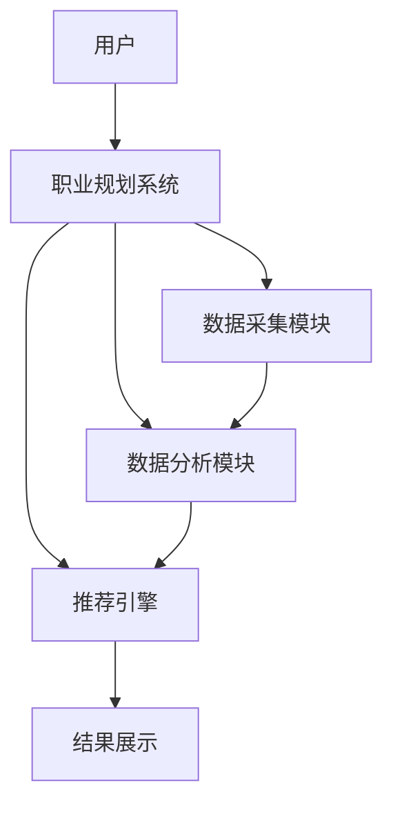
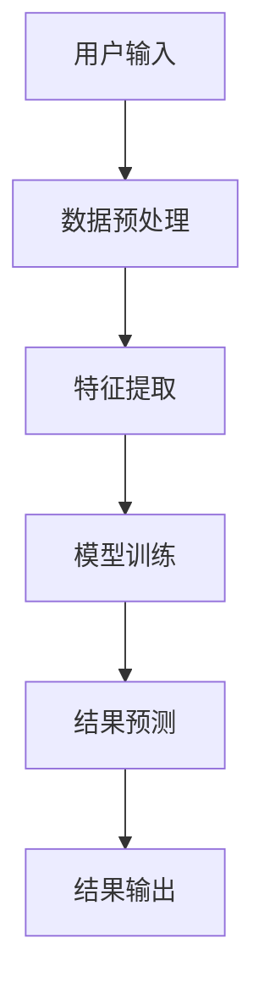
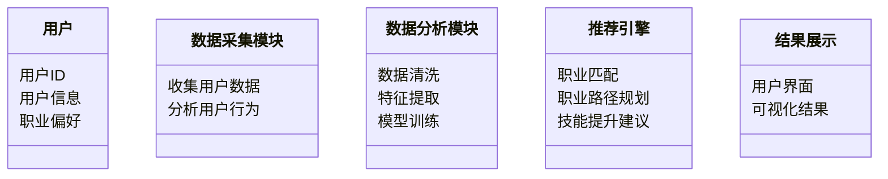
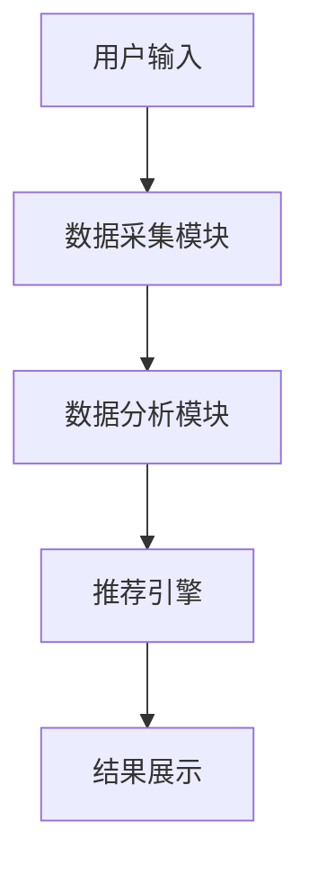
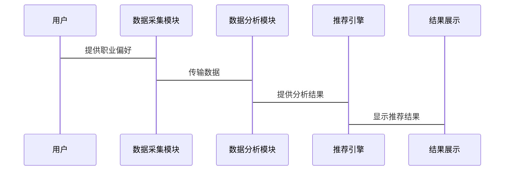

                 


# AI Agent在智能个性化职业规划中的应用

## 关键词：
AI Agent，智能职业规划，个性化推荐，机器学习，数据分析

## 摘要：
随着人工智能技术的快速发展，AI Agent（人工智能代理）在职业规划领域的应用越来越受到关注。本文详细探讨了AI Agent在智能个性化职业规划中的应用，从理论基础到实际应用，系统地分析了AI Agent的核心概念、算法原理、系统架构以及项目实战。通过案例分析和代码实现，展示了如何利用AI Agent帮助用户实现个性化的职业规划，包括职业匹配、路径规划和技能提升等关键环节。文章最后总结了AI Agent在职业规划中的优势与挑战，并提出了未来的发展方向。

---

# 第一部分: AI Agent与智能个性化职业规划概述

## 第1章: AI Agent的基本概念与应用背景

### 1.1 AI Agent的定义与核心特征

#### 1.1.1 AI Agent的定义
AI Agent（人工智能代理）是一种能够感知环境、自主决策并执行任务的智能实体。它通过数据采集、分析和推理，能够为用户提供个性化的服务或解决方案。AI Agent的核心在于其智能性，它能够根据用户的输入和环境反馈动态调整其行为。

#### 1.1.2 AI Agent的核心特征
- **自主性**：AI Agent能够自主决策，无需人工干预。
- **反应性**：能够实时感知环境并做出反应。
- **学习性**：通过机器学习算法不断优化自身模型。
- **适应性**：能够适应不同的用户需求和环境变化。

#### 1.1.3 AI Agent与传统算法的区别
AI Agent不仅是一个算法，更是一个具备感知和决策能力的系统。传统算法通常需要明确的输入和输出规则，而AI Agent能够通过自我学习和推理，发现隐藏在数据中的规律。

### 1.2 智能个性化职业规划的背景与需求

#### 1.2.1 当前职业规划的痛点
传统的职业规划方式通常依赖于人工咨询或简单的问卷调查，难以满足用户的个性化需求。用户的职业选择受到多种因素的影响，包括兴趣、能力、市场需求等，而传统的规划方法往往无法全面考虑这些因素。

#### 1.2.2 智能化职业规划的需求
随着大数据和人工智能技术的发展，用户对个性化职业规划的需求日益增长。智能化的职业规划系统能够根据用户的个性化需求，提供精准的职业匹配和职业路径规划。

#### 1.2.3 AI Agent在职业规划中的优势
AI Agent能够通过大数据分析和机器学习算法，帮助用户发现潜在的职业机会，并提供个性化的建议。与传统方法相比，AI Agent能够更高效、更准确地满足用户的职业规划需求。

### 1.3 AI Agent在职业规划中的应用场景

#### 1.3.1 职业匹配与推荐
AI Agent可以通过分析用户的职业兴趣、技能和市场需求，推荐最适合的职业方向。

#### 1.3.2 职业路径规划
AI Agent能够根据用户的职业目标和当前状态，制定个性化的职业发展路径。

#### 1.3.3 职业技能提升建议
AI Agent可以根据市场需求和用户技能水平，提供针对性的技能提升建议。

---

## 第2章: AI Agent的核心概念与原理

### 2.1 AI Agent的实体关系分析



### 2.2 AI Agent的算法原理



### 2.3 AI Agent的数学模型与公式

#### 2.3.1 基于概率的推荐公式
$$ P(C|U) = \frac{P(U|C) \cdot P(C)}{P(U)} $$
其中：
- \( P(C|U) \) 表示用户 \( U \) 对职业 \( C \) 的概率
- \( P(U|C) \) 表示职业 \( C \) 对用户 \( U \) 的概率
- \( P(C) \) 表示职业 \( C \) 的先验概率
- \( P(U) \) 表示用户 \( U \) 的先验概率

#### 2.3.2 基于机器学习的模型
$$ y = f(x) $$
其中：
- \( x \) 表示输入特征
- \( y \) 表示输出结果
- \( f \) 表示训练好的模型函数

---

## 第3章: AI Agent在职业规划中的系统架构

### 3.1 系统功能设计



### 3.2 系统架构设计



### 3.3 系统接口设计



---

## 第4章: AI Agent在职业规划中的项目实战

### 4.1 环境安装与数据准备

```bash
# 安装依赖
pip install numpy pandas scikit-learn
```

### 4.2 系统核心实现源代码

```python
import numpy as np
import pandas as pd
from sklearn.model_selection import train_test_split
from sklearn.metrics import accuracy_score

# 示例数据集
data = pd.DataFrame({
    '职业': ['程序员', '数据分析师', '项目经理', 'UI设计师'],
    '兴趣': ['编程', '数据分析', '管理', '设计'],
    '技能': ['Python', 'SQL', '项目管理', 'Photoshop']
})

# 划分训练集和测试集
X = data[['兴趣', '技能']]
y = data['职业']
X_train, X_test, y_train, y_test = train_test_split(X, y, test_size=0.2)

# 训练模型（示例）
from sklearn.tree import DecisionTreeClassifier
model = DecisionTreeClassifier()
model.fit(X_train, y_train)

# 预测结果
y_pred = model.predict(X_test)
print(accuracy_score(y_test, y_pred))
```

### 4.3 代码应用解读与分析
上述代码展示了如何利用机器学习模型进行职业推荐。数据集包括用户的兴趣和技能，模型通过训练可以预测用户适合的职业。accuracy_score用于评估模型的准确率。

### 4.4 实际案例分析
假设用户兴趣是“编程”，技能是“Python”，模型预测其职业为“程序员”。这表明模型能够根据用户提供的信息，准确推荐适合的职业。

---

## 第5章: 总结与最佳实践

### 5.1 小结
本文详细探讨了AI Agent在智能个性化职业规划中的应用，从理论基础到实际应用，系统地分析了AI Agent的核心概念、算法原理、系统架构以及项目实战。

### 5.2 注意事项
在实际应用中，需要注意数据隐私和模型的泛化能力。同时，模型的训练需要充分考虑用户的职业需求和市场变化。

### 5.3 拓展阅读
建议读者进一步学习机器学习和自然语言处理技术，以更好地理解AI Agent在职业规划中的应用。

---

# 作者：
**AI天才研究院/AI Genius Institute**  
**禅与计算机程序设计艺术 /Zen And The Art of Computer Programming**

