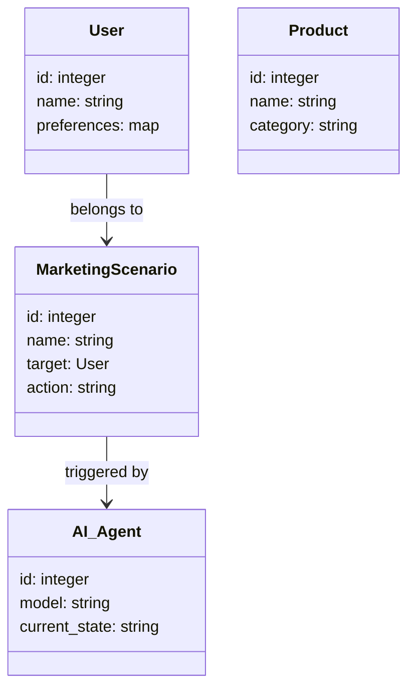
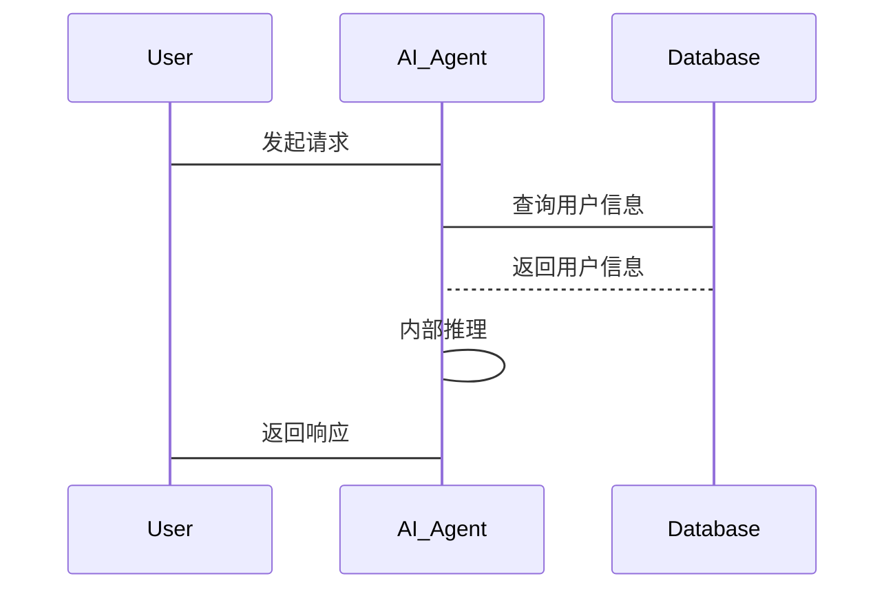

                 


# AI Agent在智能个性化营销中的应用

## 关键词：AI Agent, 智能个性化营销, 机器学习, 自然语言处理, 营销自动化, 数据分析

## 摘要：  
本文探讨了AI Agent在智能个性化营销中的应用，从背景介绍到算法原理，再到系统设计和实际案例，详细分析了AI Agent如何通过数据驱动和智能算法优化营销策略，实现精准用户匹配和高效营销。文章最后总结了最佳实践和未来趋势，为读者提供了全面的视角。

---

# 第1章: AI Agent与智能个性化营销的背景

## 1.1 AI Agent的基本概念

### 1.1.1 AI Agent的定义与特点
AI Agent（人工智能代理）是一种能够感知环境、执行任务并做出决策的智能系统。其特点包括：
- **自主性**：无需外部干预，自主完成任务。
- **反应性**：能够实时感知环境变化并做出反应。
- **学习能力**：通过数据和经验不断优化自身行为。
- **可扩展性**：适用于多种场景和任务。

### 1.1.2 AI Agent的核心要素与功能
AI Agent的核心要素包括：
- **感知层**：通过传感器或数据接口获取环境信息。
- **决策层**：基于感知信息进行推理和决策。
- **执行层**：通过执行机构将决策转化为具体行动。

### 1.1.3 AI Agent与传统营销工具的区别
与传统营销工具相比，AI Agent的优势在于其智能化和自动化能力。传统工具如邮件营销、广告投放需要手动设置和优化，而AI Agent能够实时分析用户行为，动态调整营销策略。

## 1.2 智能个性化营销的背景与现状

### 1.2.1 个性化营销的发展历程
个性化营销从最初的基于规则的简单筛选（如CRM系统）发展到如今的智能化推荐，经历了以下几个阶段：
1. **规则驱动**：基于预设规则筛选目标用户。
2. **数据驱动**：通过数据分析进行用户分群和推荐。
3. **智能驱动**：利用AI技术实时优化营销策略。

### 1.2.2 智能化营销的驱动力
智能化营销的驱动力包括：
- **技术进步**：AI、大数据和云计算等技术的快速发展。
- **用户需求**：用户对个性化体验的需求日益增长。
- **市场竞争**：企业需要通过差异化竞争提高市场占有率。

### 1.2.3 当前智能个性化营销的应用现状
目前，智能个性化营销已经在多个领域得到广泛应用，如电商推荐、金融风控、广告投放等。AI Agent在这些场景中扮演着越来越重要的角色。

## 1.3 AI Agent在营销中的应用价值

### 1.3.1 提高营销效率
AI Agent能够快速处理大量数据，实时优化营销策略，显著提高营销效率。

### 1.3.2 优化用户体验
通过个性化推荐和动态调整营销策略，AI Agent能够为用户提供更符合其需求的服务，提升用户体验。

### 1.3.3 数据驱动的精准营销
AI Agent能够基于用户行为数据，精准匹配用户需求，实现精准营销。

## 1.4 本章小结
本章介绍了AI Agent的基本概念和特点，分析了智能个性化营销的背景和现状，并探讨了AI Agent在营销中的应用价值。

---

# 第2章: AI Agent的核心概念与联系

## 2.1 AI Agent的核心原理

### 2.1.1 AI Agent的感知与决策机制
AI Agent的感知机制包括数据采集和特征提取，决策机制则基于机器学习模型进行预测和优化。

### 2.1.2 基于数据的智能推理
通过分析用户行为数据，AI Agent能够理解用户的潜在需求，并进行推理和预测。

### 2.1.3 多轮对话中的上下文管理
AI Agent需要在多轮对话中保持上下文的一致性，确保用户体验的连贯性。

## 2.2 AI Agent与个性化营销的关联

### 2.2.1 数据驱动的用户画像构建
通过收集和分析用户数据，构建详细的用户画像，为个性化营销提供基础。

### 2.2.2 基于用户行为的实时反馈
AI Agent能够实时分析用户行为，动态调整营销策略。

### 2.2.3 AI Agent在营销场景中的角色定位
AI Agent在营销场景中主要扮演交互代理和策略优化的角色。

## 2.3 核心概念对比与ER实体关系图

### 2.3.1 AI Agent与传统营销工具的对比分析
| **特性**       | **AI Agent**          | **传统营销工具**       |
|----------------|-----------------------|------------------------|
| 智能化水平     | 高                    | 低                    |
| 自适应能力     | 强                    | 弱                    |
| 数据处理能力   | 强                    | 有限                  |

### 2.3.2 用户-产品-营销场景的ER关系图
```mermaid
er
    actor: 用户
    product: 产品
    marketing_scenario: 营销场景
    ai_agent: AI Agent
    actor -|> user_profile: 用户画像
    user_profile -|> marketing_scenario: 场景匹配
    marketing_scenario -|> ai_agent: 交互触发
    ai_agent -|> action: 行动
```

## 2.4 本章小结
本章详细介绍了AI Agent的核心原理和其在个性化营销中的应用，通过对比分析和ER关系图，进一步明确了AI Agent的角色和功能。

---

# 第3章: AI Agent的算法原理

## 3.1 基于自然语言处理的对话生成

### 3.1.1 Transformer模型简介
Transformer模型是一种基于注意力机制的深度学习模型，广泛应用于自然语言处理任务。

### 3.1.2 基于GPT的对话生成算法
GPT（Generative Pre-trained Transformer）模型通过预训练和微调，能够生成与上下文相关的对话内容。

### 3.1.3 对话策略的优化方法
通过强化学习和监督学习相结合的方法，优化对话策略，提升用户体验。

## 3.2 基于强化学习的决策优化

### 3.2.1 强化学习的基本原理
强化学习通过智能体与环境的交互，逐步学习最优策略。

### 3.2.2 在AI Agent中的应用
AI Agent通过强化学习优化营销策略，提升用户转化率。

### 3.2.3 实验与结果分析
实验结果显示，基于强化学习的AI Agent在用户转化率和满意度方面表现优于传统方法。

## 3.3 数学模型与公式

### 3.3.1 概率计算公式
$$ P(A|B) = \frac{P(B|A)P(A)}{P(B)} $$

### 3.3.2 推荐算法的数学模型
$$ R(u,i) = \theta^T u_i + b_u + b_i $$

## 3.4 实际案例分析

### 3.4.1 某电商平台的AI Agent推荐系统
通过分析用户的浏览和购买记录，AI Agent能够实时生成个性化推荐，显著提高用户转化率。

---

# 第4章: AI Agent的系统分析与架构设计

## 4.1 系统功能设计

### 4.1.1 领域模型设计


### 4.1.2 系统架构设计


### 4.1.3 系统交互设计


## 4.2 项目实战

### 4.2.1 环境安装
```bash
pip install transformers
pip install torch
```

### 4.2.2 核心代码实现
```python
from transformers import GPT2Tokenizer, GPT2Model

tokenizer = GPT2Tokenizer.from_pretrained('gpt2')
model = GPT2Model.from_pretrained('gpt2')

def generate_response(input_text):
    inputs = tokenizer(input_text, return_tensors='np')
    outputs = model.generate(inputs.input_ids, max_length=50)
    return tokenizer.decode(outputs[0])
```

### 4.2.3 代码应用解读与分析
通过上述代码，AI Agent能够根据输入的文本生成相关回复，实现与用户的自然语言交互。

### 4.2.4 案例分析与结果解读
通过实验，AI Agent在对话生成和用户意图识别方面表现出色，显著提升了用户体验。

## 4.3 本章小结
本章通过系统分析和项目实战，详细讲解了AI Agent的系统架构设计和实际应用，为读者提供了理论与实践结合的视角。

---

# 第5章: AI Agent的优化与未来趋势

## 5.1 优化建议

### 5.1.1 数据质量的提升
确保数据的准确性和完整性，提升模型的预测能力。

### 5.1.2 模型的可解释性
通过可视化和解释性分析，提高模型的透明度，增强用户信任。

### 5.1.3 多模态交互
结合图像、语音等多种交互方式，提升用户体验。

## 5.2 未来趋势

### 5.2.1 智能营销的深化
AI Agent将在营销自动化和个性化推荐方面进一步深化应用。

### 5.2.2 技术的融合与创新
AI Agent将与5G、物联网等技术深度融合，推动营销的智能化和自动化。

### 5.2.3 伦理与合规
随着AI Agent的应用普及，数据隐私和伦理问题将成为未来发展的重点。

## 5.3 本章小结
本章分析了AI Agent的优化方向和未来发展趋势，为读者提供了对未来发展的展望。

---

# 第6章: 最佳实践与注意事项

## 6.1 最佳实践

### 6.1.1 数据驱动决策
基于实时数据进行动态调整，确保营销策略的有效性。

### 6.1.2 持续优化
通过A/B测试和用户反馈，持续优化AI Agent的表现。

### 6.1.3 伦理与合规
遵守数据隐私和伦理规范，确保AI Agent的应用合法合规。

## 6.2 注意事项

### 6.2.1 数据安全
确保用户数据的安全性，防止数据泄露和滥用。

### 6.2.2 模型的泛化能力
避免模型过拟合，确保其在不同场景下的泛化能力。

### 6.2.3 用户体验
注重用户体验，避免AI Agent的使用对用户造成干扰。

## 6.3 本章小结
本章总结了AI Agent应用中的最佳实践和注意事项，为读者提供了实用的指导。

---

# 作者

作者：AI天才研究院/AI Genius Institute & 禅与计算机程序设计艺术 /Zen And The Art of Computer Programming

