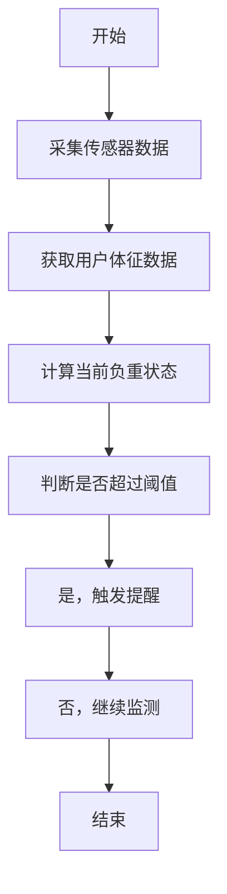
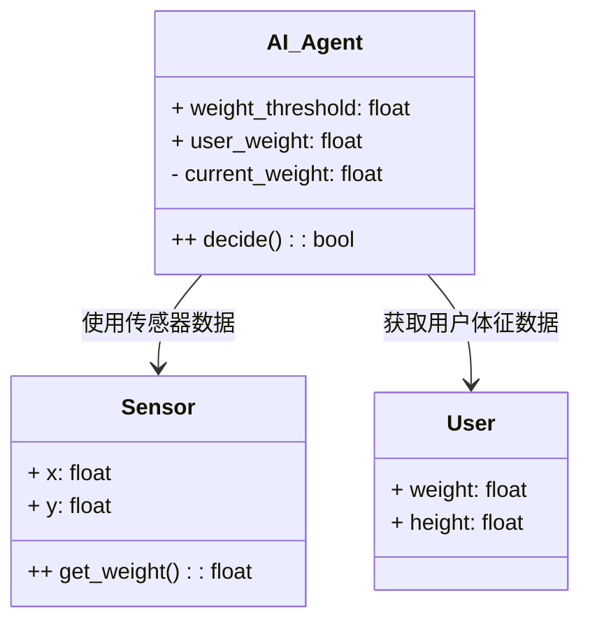

                 


# AI Agent在智能书包中的负重平衡提醒

> 关键词：AI Agent，智能书包，负重平衡，多传感器融合，动态提醒

> 摘要：本文探讨了如何通过AI Agent技术实现智能书包的负重平衡提醒功能。文章从问题背景出发，分析了书包过重对学生健康的潜在危害，提出了基于AI Agent的解决方案。通过多传感器融合技术，AI Agent能够实时监测书包的重量分布，并根据用户的个性化需求动态调整提醒策略。文章详细介绍了AI Agent的核心原理、算法实现、系统架构设计以及项目实战，为智能书包的设计提供了理论与实践的双重指导。

---

## 第1章：背景介绍

### 1.1 问题背景

#### 1.1.1 学生书包过重的现状与危害
书包是学生日常学习生活中不可或缺的工具，但过重的书包却对学生身体健康造成潜在危害。根据世界卫生组织的研究，长时间背负过重的书包可能导致青少年出现脊柱侧弯、肩颈疼痛等问题。尤其是在学校课程不断增加的背景下，学生书包的重量问题日益受到关注。

#### 1.1.2 负重平衡提醒的必要性
传统的书包设计缺乏智能化的负重监测功能，学生和家长难以实时了解书包的重量分布情况。AI Agent作为一种智能化的代理技术，能够通过传感器实时采集书包的重量数据，并结合用户的行为习惯，动态调整提醒策略，从而帮助学生避免因书包过重而引发的健康问题。

#### 1.1.3 AI Agent在智能书包中的应用潜力
AI Agent（人工智能代理）是一种能够感知环境、自主决策并执行任务的智能系统。通过将AI Agent应用于智能书包，可以实现以下功能：
- 实时监测书包的重量分布。
- 根据用户的个性化需求，动态调整提醒策略。
- 提供科学的负重建议，帮助学生保持良好的身体状态。

### 1.2 问题描述

#### 1.2.1 书包负重的定义与测量
书包的负重是指书包内物品的总重量。负重的测量需要考虑以下因素：
- 书包的重量分布：书包的重心位置会影响人体的负担分布。
- 用户的体重和身高：不同体型的学生对书包负重的承受能力不同。
- 使用场景：书包的负重在不同场景（如步行、跑步、久坐）下的表现不同。

#### 1.2.2 负重平衡的数学模型
负重平衡的数学模型可以表示为：
$$
\text{平衡状态} = f(\text{重量分布}, \text{用户体征}, \text{使用场景})
$$
其中，$f$ 是一个综合函数，用于评估书包的负重是否处于平衡状态。

#### 1.2.3 用户需求与痛点分析
用户的核心需求包括：
- 实时监测书包的重量分布。
- 根据个人身体条件获得个性化的负重建议。
- 获取及时的提醒信息，避免因书包过重引发健康问题。

### 1.3 问题解决思路

#### 1.3.1 AI Agent的核心作用
AI Agent在智能书包中的作用主要体现在以下几个方面：
- 数据采集：通过传感器实时采集书包的重量分布数据。
- 数据分析：结合用户的体征数据和使用场景，评估书包的负重状态。
- 决策与提醒：根据分析结果，动态调整提醒策略。

#### 1.3.2 多传感器融合技术的应用
为了实现对书包负重的精准监测，需要将多种传感器（如加速度传感器、压力传感器）融合在一起，以获取全面的重量分布数据。

#### 1.3.3 个性化提醒策略的设计
个性化提醒策略的核心在于根据用户的体征和使用场景，动态调整提醒阈值。例如，对于身高较矮的学生，系统可以降低提醒阈值，以减少脊柱压力。

### 1.4 边界与外延

#### 1.4.1 系统功能边界
- 数据采集：仅采集书包的重量分布数据。
- 状态分析：仅分析书包的负重状态。
- 提醒推送：仅在负重超过阈值时触发提醒。

#### 1.4.2 与现有智能设备的关联
AI Agent可以通过与智能手机、智能手表等设备联动，实现提醒信息的多渠道推送。

#### 1.4.3 未来扩展方向
- 引入更多传感器（如心率传感器）进行健康监测。
- 实现书包的智能调节功能（如自动调整重心）。

### 1.5 概念结构与核心要素

#### 1.5.1 智能书包的组成要素
智能书包的组成要素包括：
- 传感器模块：用于采集书包的重量分布数据。
- AI Agent模块：用于数据分析与决策。
- 用户交互界面：用于显示提醒信息。

#### 1.5.2 AI Agent的功能模块
AI Agent的功能模块包括：
- 感知模块：负责采集和解析传感器数据。
- 决策模块：负责分析数据并生成决策。
- 执行模块：负责触发提醒或其他操作。

#### 1.5.3 负重平衡提醒的逻辑框架
负重平衡提醒的逻辑框架可以表示为：
$$
\text{数据采集} \rightarrow \text{数据分析} \rightarrow \text{决策生成} \rightarrow \text{提醒推送}
$$

---

## 第2章：核心概念与联系

### 2.1 AI Agent的核心概念

#### 2.1.1 AI Agent的基本原理
AI Agent的核心原理是通过传感器采集数据，利用算法进行分析和决策，并通过执行模块完成任务。AI Agent的感知、决策与执行模块是实现负重平衡提醒的关键。

#### 2.1.2 AI Agent与传统提醒方式的对比
下表展示了AI Agent与传统提醒方式在功能、灵活性和智能化程度上的对比：

| 对比维度 | 传统提醒方式 | AI Agent |
|----------|--------------|----------|
| 功能     | 单一提醒     | 动态调整  |
| 灵活性    | 较低         | 较高     |
| 智能化程度 | 无           | 高       |

---

#### 2.1.3 AI Agent的感知、决策与执行模块
- **感知模块**：负责采集书包的重量分布数据。
- **决策模块**：负责分析数据并生成提醒策略。
- **执行模块**：负责触发提醒或其他操作。

#### 2.1.4 概念属性特征对比表
下表展示了AI Agent在智能书包中的核心属性特征：

| 属性   | 描述                                   |
|--------|--------------------------------------|
| 感知能力 | 能够实时采集书包的重量分布数据       |
| 决策能力 | 能够根据数据动态调整提醒策略         |
| 执行能力 | 能够通过传感器或用户界面触发提醒     |

---

## 第3章：算法原理

### 3.1 基于规则的决策算法

#### 3.1.1 算法原理
基于规则的决策算法是一种简单但有效的算法，适用于书包负重的动态提醒场景。该算法通过预设的规则，根据传感器数据和用户体征数据，动态调整提醒阈值。

#### 3.1.2 算法流程图
下图展示了基于规则的决策算法的流程图：



---

#### 3.1.3 算法实现
以下是基于规则的决策算法的Python代码实现：

```python
class AI_Agent:
    def __init__(self, weight_threshold=10, user_weight=50):
        self.weight_threshold = weight_threshold  # 提醒阈值（单位：kg）
        self.user_weight = user_weight            # 用户体重（单位：kg）

    def get_current_weight(self):
        # 采集传感器数据，返回当前书包重量（单位：kg）
        return 8.5  # 示例数据

    def decide(self):
        current_weight = self.get_current_weight()
        # 根据用户体重调整阈值
        adjusted_threshold = self.weight_threshold + (self.user_weight * 0.1)
        if current_weight > adjusted_threshold:
            return True  # 需要提醒
        else:
            return False  # 无需提醒

# 示例用法
agent = AI_Agent(user_weight=60)
should_remind = agent.decide()
print("是否需要提醒：", should_remind)
```

#### 3.1.4 数学模型与公式
基于规则的决策算法的数学模型可以表示为：
$$
\text{adjusted\_threshold} = \text{weight\_threshold} + (\text{user\_weight} \times 0.1)
$$
其中，$\text{weight\_threshold}$ 是提醒阈值，$\text{user\_weight}$ 是用户体重。

---

## 第4章：系统分析与架构设计

### 4.1 系统功能设计

#### 4.1.1 系统功能模块
智能书包的负重平衡提醒系统主要包括以下功能模块：
- 数据采集模块：负责采集书包的重量分布数据。
- 数据分析模块：负责分析数据并生成提醒策略。
- 提醒模块：负责触发提醒或其他操作。

#### 4.1.2 系统功能类图
下图展示了系统的功能类图：



---

## 第5章：项目实战

### 5.1 环境配置

#### 5.1.1 Python环境安装
需要安装以下Python库：
- `numpy`：用于数据处理
- `pandas`：用于数据存储
- `mermaid`：用于流程图绘制

安装命令：
```bash
pip install numpy pandas mermaid
```

---

#### 5.1.2 系统核心实现
以下是AI Agent的核心代码实现：

```python
import numpy as np
import pandas as pd

class AI_Agent:
    def __init__(self, weight_threshold=10, user_weight=50):
        self.weight_threshold = weight_threshold
        self.user_weight = user_weight

    def get_current_weight(self):
        # 模拟传感器数据
        return np.random.uniform(8, 12)  # 随机生成当前重量

    def decide(self):
        current_weight = self.get_current_weight()
        adjusted_threshold = self.weight_threshold + (self.user_weight * 0.1)
        return current_weight > adjusted_threshold

# 示例用法
agent = AI_Agent(user_weight=60)
should_remind = agent.decide()
print("是否需要提醒：", should_remind)
```

---

#### 5.1.3 代码应用解读与分析
上述代码实现了一个简单的AI Agent，能够根据用户体重和传感器数据动态调整提醒阈值。在实际应用中，可以进一步优化算法，引入更多传感器数据（如加速度数据）以提高准确性。

---

## 第6章：最佳实践与总结

### 6.1 最佳实践

#### 6.1.1 传感器选择
选择高精度的传感器，确保数据采集的准确性。

#### 6.1.2 算法优化
引入机器学习算法（如随机森林、神经网络）进行更复杂的分析和预测。

#### 6.1.3 用户反馈
定期收集用户的反馈，优化提醒策略和用户界面。

---

### 6.2 项目小结

#### 6.2.1 核心成果
- 实现了一个基于AI Agent的负重平衡提醒系统。
- 提供了实时的重量监测和个性化的提醒服务。

#### 6.2.2 经验与教训
- 数据采集的准确性对系统的性能影响重大。
- 用户界面的设计需要兼顾易用性和美观性。

---

## 作者信息

作者：AI天才研究院/AI Genius Institute & 禅与计算机程序设计艺术/Zen And The Art of Computer Programming

---

通过以上思考和分析，我们逐步构建了一个基于AI Agent的智能书包负重平衡提醒系统。从背景介绍到系统实现，再到项目实战，本文为读者提供了从理论到实践的全面指导。希望本文能够为智能书包的设计和优化提供有益的参考。

