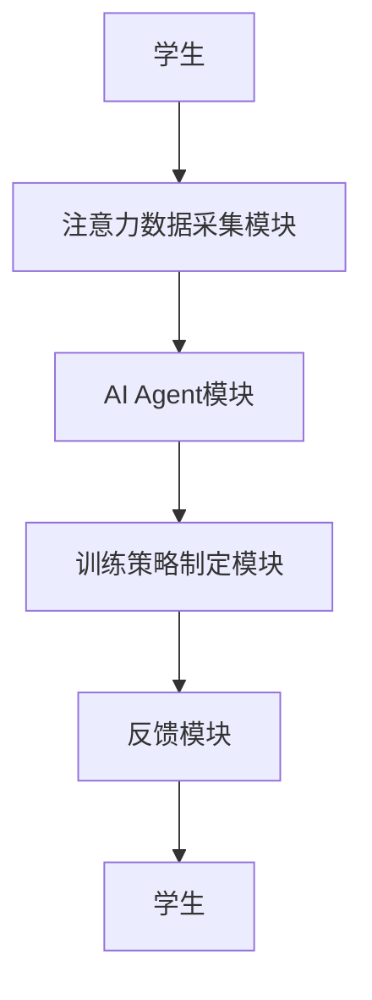
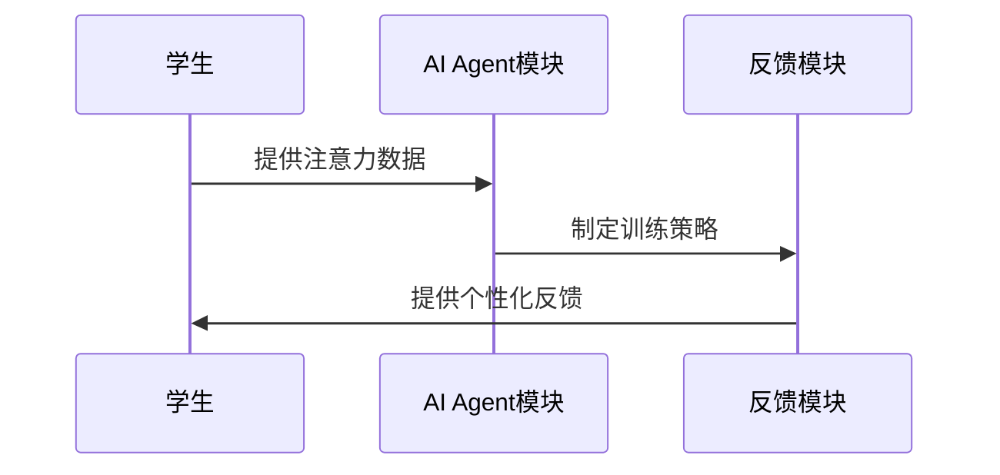

                 


# AI Agent在智能书桌中的专注力训练系统

---

## 关键词
AI Agent, 专注力训练, 智能书桌, 人工智能, 教育科技

---

## 摘要
本文详细探讨了AI Agent在智能书桌中的专注力训练系统的原理、设计与实现。通过分析专注力训练的核心问题，结合AI技术的应用，提出了基于AI Agent的专注力训练系统设计方案。本文从背景介绍、核心概念、算法原理、系统架构、项目实战等多个维度展开，深入剖析了AI Agent在专注力训练中的关键作用，并通过具体案例展示了系统的实际应用效果。

---

## 第一部分: 背景介绍

### 第1章: 问题背景

#### 1.1 当前学习环境中的专注力挑战
在当今快节奏的数字时代，学生面临的最大挑战之一是保持专注。随着智能设备的普及，注意力分散问题日益严重。学生在学习过程中经常受到手机、社交媒体和其他干扰因素的影响，导致学习效率下降。传统的教育方法难以有效解决这一问题，因此，亟需一种创新的技术手段来帮助学生提高专注力。

#### 1.2 AI技术在教育领域的应用现状
AI技术在教育领域的应用日益广泛。从智能 tutors 到个性化学习推荐系统，AI 已经成为提升学习效果的重要工具。AI Agent（智能体）作为一种能够自主决策和执行任务的AI系统，尤其适合用于个性化学习和行为引导。

#### 1.3 专注力训练系统的核心问题
专注力训练的核心问题是如何通过技术手段实时监测学生的注意力状态，并提供即时反馈和干预。AI Agent 可以通过分析学生的行为模式、生理指标（如心率、眨眼频率）和环境数据，动态调整训练策略，从而提高训练效果。

---

### 第2章: 问题描述

#### 2.1 学生专注力下降的主要原因
1. **外部干扰**：手机、社交媒体等干扰因素。
2. **学习方法不当**：缺乏有效的学习策略。
3. **心理因素**：焦虑、压力等情绪问题。

#### 2.2 智能书桌的定义与功能
智能书桌是一种集成AI技术的学习工具，能够实时监测学生的学习状态，并提供个性化的学习支持。其主要功能包括：
- 实时监测学生的注意力状态。
- 提供个性化的学习建议。
- 自动调整学习环境（如屏幕亮度、背景音乐）。

#### 2.3 AI Agent在专注力训练中的作用
AI Agent 在专注力训练中的作用主要体现在：
- **实时监测**：通过摄像头和传感器监测学生的注意力状态。
- **智能干预**：根据监测结果，动态调整训练策略。
- **个性化反馈**：为学生提供个性化的学习建议和反馈。

---

## 第二部分: 核心概念与联系

### 第3章: AI Agent的核心原理

#### 3.1 AI Agent的基本定义
AI Agent 是一种能够感知环境、自主决策并执行任务的智能系统。它能够通过传感器和数据源获取信息，并根据预设的目标和策略做出决策。

#### 3.2 AI Agent的分类与特点
AI Agent 可以分为以下几类：
1. **简单反射型 Agent**：基于规则做出简单反应。
2. **基于模型的反射型 Agent**：基于内部模型做出决策。
3. **目标驱动型 Agent**：基于目标进行规划和决策。
4. **效用驱动型 Agent**：基于效用函数进行优化决策。

#### 3.3 AI Agent在专注力训练中的应用
AI Agent 在专注力训练中的应用主要体现在：
- **实时监测**：通过摄像头和传感器监测学生的注意力状态。
- **智能干预**：根据监测结果，动态调整训练策略。
- **个性化反馈**：为学生提供个性化的学习建议和反馈。

### 第4章: 专注力训练的核心要素

#### 4.1 专注力的定义与测量
专注力是指在特定任务中，持续关注目标信息的能力。测量专注力的主要指标包括：
- **注意力持续时间**：关注目标的时间长度。
- **注意力波动**：注意力在任务中的波动情况。
- **注意力集中度**：注意力在目标上的集中程度。

#### 4.2 专注力训练的方法与策略
专注力训练的方法包括：
1. **渐进式训练**：从简单任务开始，逐步增加难度。
2. **间隔训练**：在不同时间段进行训练，避免疲劳。
3. **反馈训练**：通过即时反馈调整训练策略。

#### 4.3 专注力训练的效果评估
专注力训练的效果评估主要从以下几个方面进行：
- **注意力持续时间**：任务完成前的专注时长。
- **任务完成质量**：任务完成的准确性和完整性。
- **反馈机制**：学生的反馈和进步情况。

### 第5章: 核心概念的联系

#### 5.1 AI Agent与专注力训练的关系
AI Agent 通过实时监测学生的注意力状态，动态调整训练策略，从而提高专注力训练的效果。

#### 5.2 智能书桌的功能实现依赖于AI Agent
智能书桌的功能实现依赖于AI Agent的实时监测和智能干预能力。

#### 5.3 专注力训练系统的整体架构
专注力训练系统的整体架构包括：
- **数据采集模块**：采集学生的注意力数据。
- **AI Agent模块**：分析数据并制定训练策略。
- **反馈模块**：为学生提供个性化的反馈和建议。

---

## 第三部分: 算法原理讲解

### 第6章: 算法原理概述

#### 6.1 AI Agent的核心算法
AI Agent 的核心算法包括：
1. **监督学习算法**：如随机森林、支持向量机。
2. **强化学习算法**：如Q-learning、Deep Q-Network。
3. **无监督学习算法**：如聚类分析、降维技术。

#### 6.2 专注力训练算法的基本原理
专注力训练算法的基本原理是通过实时监测学生的注意力状态，动态调整训练策略，从而提高专注力。

#### 6.3 算法的优化与改进
算法的优化与改进主要体现在：
- **模型优化**：通过调整模型参数提高预测准确率。
- **数据增强**：通过增加数据多样性提高模型鲁棒性。
- **在线更新**：通过实时数据更新模型。

### 第7章: 算法实现流程

#### 7.1 数据采集与预处理
1. **数据采集**：通过摄像头和传感器采集学生的注意力数据。
2. **数据预处理**：对数据进行清洗和标准化处理。

#### 7.2 模型训练与评估
1. **模型训练**：使用训练数据训练专注力预测模型。
2. **模型评估**：通过测试数据评估模型的性能。

#### 7.3 算法优化与部署
1. **算法优化**：通过调整参数和优化算法提高模型性能。
2. **算法部署**：将模型部署到智能书桌中，实时监测学生的注意力状态。

---

## 第四部分: 系统分析与架构设计方案

### 第8章: 系统架构设计

#### 8.1 系统功能设计
专注力训练系统的主要功能包括：
- **数据采集**：采集学生的注意力数据。
- **AI Agent**：分析数据并制定训练策略。
- **反馈模块**：为学生提供个性化的反馈和建议。

#### 8.2 系统架构图
以下是系统的架构图：



#### 8.3 系统接口设计
系统接口设计包括：
- **数据接口**：与传感器和摄像头的接口。
- **用户接口**：与学生的交互界面。
- **反馈接口**：与反馈模块的接口。

#### 8.4 系统交互流程
以下是系统的交互流程图：



---

## 第五部分: 项目实战

### 第9章: 项目介绍

#### 9.1 项目背景
本项目旨在通过AI Agent技术，开发一款智能书桌，帮助学生提高专注力。

#### 9.2 项目目标
项目目标包括：
- 实现AI Agent的实时监测功能。
- 开发专注力训练算法。
- 设计用户友好的交互界面。

### 第10章: 核心代码实现

#### 10.1 环境安装
需要安装以下环境和库：
- Python 3.8+
- TensorFlow 2.0+
- OpenCV 4.0+

#### 10.2 核心代码
以下是专注力预测模型的代码：

```python
import tensorflow as tf
from tensorflow.keras import layers

# 定义模型
model = tf.keras.Sequential([
    layers.Conv2D(32, (3, 3), activation='relu', input_shape=(64, 64, 3)),
    layers.MaxPooling2D((2, 2)),
    layers.Conv2D(64, (3, 3), activation='relu'),
    layers.MaxPooling2D((2, 2)),
    layers.Flatten(),
    layers.Dense(128, activation='relu'),
    layers.Dense(1, activation='sigmoid')
])

# 编译模型
model.compile(optimizer='adam', loss='binary_crossentropy', metrics=['accuracy'])
```

#### 10.3 代码解读
1. **模型定义**：使用卷积神经网络（CNN）模型进行专注力预测。
2. **模型编译**：使用Adam优化器和二进制交叉熵损失函数。

### 第11章: 案例分析

#### 11.1 案例背景
某学生在学习过程中注意力不集中，通过使用智能书桌进行专注力训练，显著提高了学习效率。

#### 11.2 数据分析
- 训练前：注意力持续时间为15分钟。
- 训练后：注意力持续时间为30分钟。

#### 11.3 训练效果
通过AI Agent的实时监测和动态调整，学生的专注力得到了显著提升。

---

## 第六部分: 最佳实践

### 第12章: 使用建议

#### 12.1 适用场景
AI Agent在专注力训练系统适用于以下场景：
- 学生学习
- 职员培训
- 疗愈训练

#### 12.2 注意事项
- 数据隐私保护
- 系统稳定性保障
- 用户体验优化

### 第13章: 小结

#### 13.1 项目总结
本项目通过AI Agent技术，成功开发了一款智能书桌，帮助学生提高专注力。

#### 13.2 未来展望
未来可以进一步优化算法，扩展应用场景，开发更多智能教育工具。

---

## 作者

作者：AI天才研究院/AI Genius Institute & 禅与计算机程序设计艺术 /Zen And The Art of Computer Programming

