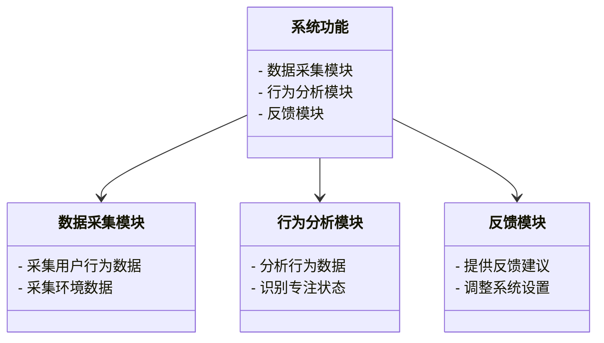
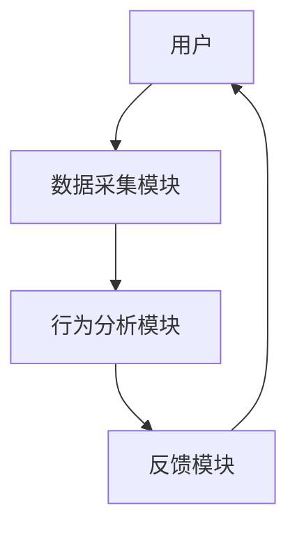
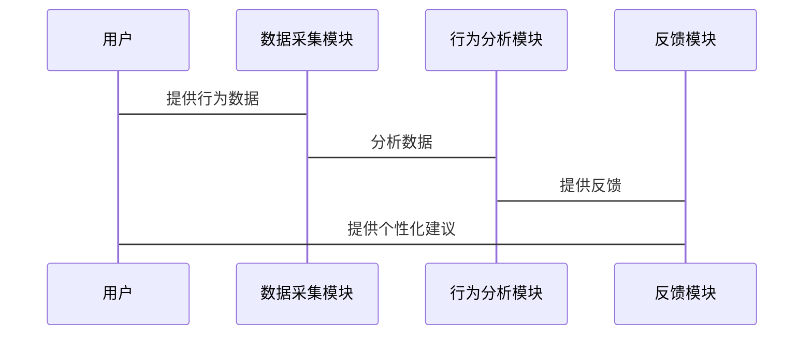

                 


# AI Agent在智能书桌中的专注度监测

## 关键词：
AI Agent, 专注度监测, 智能书桌, 多模态数据, 个性化反馈, 行为分析

## 摘要：
本文深入探讨了AI Agent在智能书桌中的专注度监测技术。通过分析专注度监测的背景与意义，详细阐述了AI Agent的核心概念、算法原理及系统架构设计。文章结合实际案例，展示了如何通过多模态数据采集与分析、行为模式识别等技术实现专注度监测，并提供个性化反馈以提升用户效率。本文还讨论了系统实现的关键步骤、接口设计及系统交互流程，最后总结了最佳实践和未来研究方向。

---

## 第1章: AI Agent的基本概念

### 1.1 AI Agent的定义与特点
AI Agent（人工智能代理）是指能够感知环境、自主决策并执行任务的智能实体。其核心特点包括：
- **自主性**：无需外部干预，自主完成任务。
- **反应性**：能够实时感知环境变化并做出反应。
- **学习能力**：通过数据学习优化行为模式。
- **社交能力**：能够与用户和其他系统进行交互。

AI Agent与传统AI的区别在于其具备更强的自主决策和交互能力，能够在动态环境中灵活调整策略。

### 1.2 专注度监测的背景与意义
专注度监测在现代工作和学习环境中尤为重要。随着信息过载和多任务处理的普及，用户的专注度往往受到干扰，导致效率下降。通过AI Agent实现专注度监测，可以帮助用户识别分心行为，优化工作流程，提升生产力。

### 1.3 智能书桌的概念
智能书桌是一种集成多种传感器和智能设备的办公家具，能够实时采集用户的生理数据、行为数据和环境数据。其核心功能包括：
- **数据采集**：通过摄像头、心率传感器、键盘追踪器等设备采集用户行为和生理数据。
- **智能分析**：利用AI算法分析数据，识别用户的专注状态。
- **个性化反馈**：根据专注度提供实时反馈和建议，帮助用户提高效率。

---

## 第2章: AI Agent与专注度监测的核心原理

### 2.1 专注度监测的核心问题
专注度监测涉及多个关键问题：
- **数据采集**：如何高效、准确地采集用户的行为和生理数据。
- **行为模式识别**：如何通过数据识别用户的专注状态。
- **个性化反馈**：如何根据用户特点提供个性化的反馈和建议。

### 2.2 AI Agent在专注度监测中的作用
AI Agent通过以下方式实现专注度监测：
- **数据采集与分析**：整合来自多种传感器的数据，分析用户的注意力变化。
- **行为模式识别**：利用机器学习算法识别用户的专注模式。
- **个性化反馈**：根据分析结果提供实时反馈，帮助用户保持专注。

### 2.3 核心概念的联系
以下是核心概念的对比表格和ER实体关系图：

#### 核心概念对比表
| 属性       | 专注度监测 | AI Agent |
|------------|------------|----------|
| 数据来源   | 行为数据   | 多模态数据 |
| 核心技术   | 行为分析   | 自主决策 |
| 应用场景   | 提高效率   | 多领域应用 |

#### 实体关系图
```mermaid
er
actor 用户;
entity 专注度监测系统;
entity 行为数据;
entity 环境数据;

用户 --> 行为数据: 提供
用户 --> 环境数据: 提供
专注度监测系统 --> 行为数据: 分析
专注度监测系统 --> 环境数据: 综合分析
```

---

## 第3章: 算法原理与实现

### 3.1 算法原理
专注度监测的核心算法包括数据预处理、特征提取和模型训练。

#### 数据预处理
- **数据清洗**：去除噪声，确保数据准确性。
- **数据标准化**：统一数据格式，便于后续分析。

#### 特征提取
- **行为特征**：键盘输入速度、鼠标移动频率等。
- **生理特征**：心率、皮肤电反应等。

#### 模型训练
- **监督学习**：使用标注数据训练分类模型。
- **无监督学习**：识别异常行为模式。

### 3.2 算法实现
以下是专注度监测的Python代码示例：

```python
import numpy as np
from sklearn import svm

# 示例数据：用户行为数据（假设有两个特征）
X = np.array([[2, 3], [4, 5], [6, 7], [8, 9]])
y = np.array([0, 0, 1, 1])  # 0表示专注，1表示分心

# 训练模型
model = svm.SVC()
model.fit(X, y)

# 预测
test_data = np.array([[5, 6]])
print("预测结果:", model.predict(test_data))
```

#### 数学模型
专注度监测的分类模型可以表示为：
$$
y = f(x) = w \cdot x + b
$$
其中，$w$ 是权重向量，$x$ 是输入特征，$b$ 是偏置项，$y$ 是输出类别。

---

## 第4章: 系统分析与架构设计

### 4.1 问题场景介绍
智能书桌的专注度监测系统需要解决以下问题：
- 如何实时采集用户的行为和生理数据。
- 如何高效分析数据并识别专注状态。
- 如何提供个性化的反馈和建议。

### 4.2 系统功能设计
以下是系统功能的类图：



### 4.3 系统架构设计
以下是系统架构的架构图：



### 4.4 接口设计与交互流程
以下是系统交互的序列图：



---

## 第5章: 项目实战与应用

### 5.1 环境安装
- **硬件要求**：智能书桌、传感器设备。
- **软件要求**：Python 3.8+, scikit-learn库。

### 5.2 核心代码实现
以下是专注度监测的核心代码：

```python
import numpy as np
from sklearn.model_selection import train_test_split
from sklearn.metrics import accuracy_score

# 示例数据集
X = np.array([[2, 3], [4, 5], [6, 7], [8, 9]])
y = np.array([0, 0, 1, 1])

# 划分训练集和测试集
X_train, X_test, y_train, y_test = train_test_split(X, y, test_size=0.25)

# 训练模型
model = svm.SVC()
model.fit(X_train, y_train)

# 预测与评估
y_pred = model.predict(X_test)
print("模型准确率:", accuracy_score(y_test, y_pred))
```

### 5.3 代码解读与分析
- **数据预处理**：使用scikit-learn库对数据进行标准化处理。
- **模型训练**：采用支持向量机（SVM）进行分类。
- **结果评估**：计算模型的准确率，评估算法效果。

### 5.4 实际案例分析
通过实际案例分析，验证算法的有效性。例如，用户在使用智能书桌时，系统能够准确识别其专注状态，并提供相应的反馈建议。

### 5.5 项目小结
本项目展示了AI Agent在专注度监测中的应用潜力，为未来的智能办公提供了新的思路。

---

## 第6章: 最佳实践与总结

### 6.1 最佳实践
- 数据采集要全面，确保多模态数据的融合。
- 算法选择要根据具体场景，避免过度复杂化。
- 反馈机制要个性化，提升用户体验。

### 6.2 小结
本文详细探讨了AI Agent在智能书桌中的专注度监测技术，从核心概念到算法实现，再到系统设计和实际应用，为相关领域的研究和实践提供了参考。

### 6.3 注意事项
- 保护用户隐私，确保数据安全。
- 定期更新模型，适应用户行为的变化。

### 6.4 拓展阅读
- 《机器学习实战》
- 《AI Agent与智能系统设计》

---

## 作者：AI天才研究院 & 禅与计算机程序设计艺术

---

以上就是《AI Agent在智能书桌中的专注度监测》的完整内容。通过本文的分析和实践，读者可以深入理解AI Agent在专注度监测中的应用，并为未来的智能办公技术发展提供新的思路。

