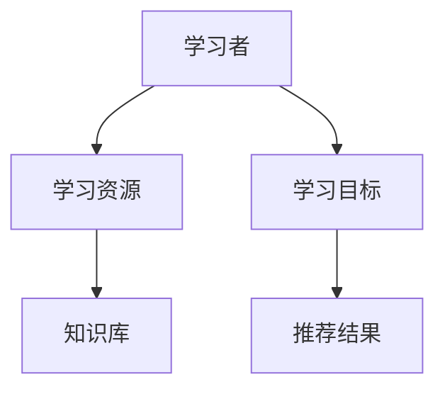
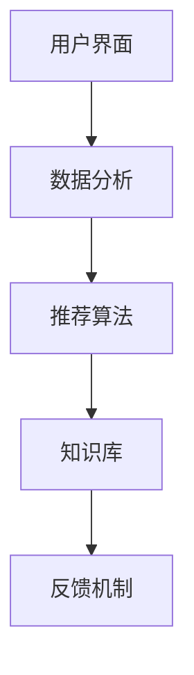
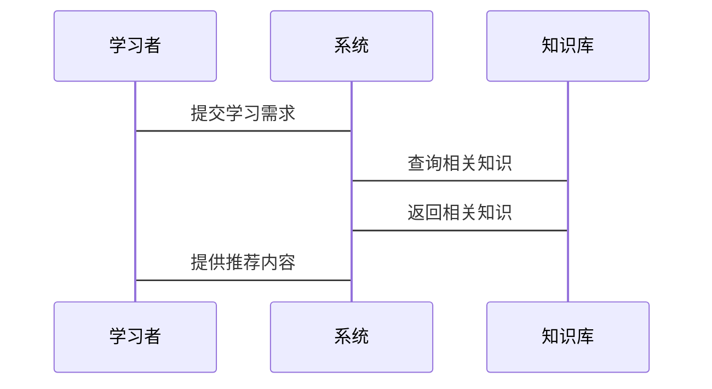

                 


```markdown
# AI Agent在智能书桌中的学习效率分析

> 关键词：AI Agent, 智能书桌, 学习效率, 推荐算法, 系统架构

> 摘要：本文系统分析了AI Agent在智能书桌中的学习效率提升机制，详细探讨了AI Agent的核心算法原理及其在智能书桌中的应用。通过分析协同过滤、基于内容的推荐算法和深度学习模型的数学公式，结合实际系统架构设计和项目实战，全面展示了如何利用AI Agent优化学习效率。

---

## 第1章 AI Agent与智能书桌的背景与概念

### 1.1 问题背景与问题描述

#### 1.1.1 学习效率低下现状
现代学习者面临着海量信息和分散的学习资源，传统学习方式难以高效整合和利用这些资源。学习者常常因为信息过载、缺乏目标性和个性化推荐而导致学习效率低下。

#### 1.1.2 AI Agent的引入背景
AI Agent（人工智能代理）是一种能够感知环境、执行任务并优化决策的智能实体。通过AI Agent，学习者可以自动化管理学习计划、资源推荐和进度跟踪，从而提高学习效率。

#### 1.1.3 智能书桌的核心问题与目标
智能书桌的目标是通过AI Agent实现学习资源的智能化管理，帮助学习者高效利用时间、资源和知识。核心问题包括如何设计高效的推荐算法、优化学习路径和实时反馈机制。

---

### 1.2 AI Agent与智能书桌的概念结构

#### 1.2.1 AI Agent的基本定义与属性
- **定义**：AI Agent是具有感知、决策和执行能力的智能实体，能够根据环境反馈调整行为。
- **属性**：
  - 感知能力：获取学习者的行为数据和学习目标。
  - 决策能力：基于数据生成推荐和优化策略。
  - 执行能力：通过用户界面或自动化工具执行推荐任务。

#### 1.2.2 智能书桌的功能与架构
- **功能**：
  - 学习资源推荐
  - 学习计划管理
  - 学习进度跟踪
  - 实时反馈与优化
- **架构**：
  - 用户界面：展示推荐内容和学习进度。
  - 数据分析模块：处理学习者的行为数据。
  - 推荐算法模块：生成个性化推荐。
  - 知识库：存储学习资源和历史数据。

#### 1.2.3 问题解决的边界与外延
- **边界**：专注于学习效率优化，不涉及娱乐或其他非学习任务。
- **外延**：可扩展到教育机构、在线学习平台和企业培训系统。

#### 1.2.4 ER实体关系图


---

## 第2章 AI Agent的核心算法原理

### 2.1 推荐算法原理

#### 2.1.1 协同过滤算法
- **原理**：基于用户行为相似性推荐相关资源。
- **优缺点**：
  - 优点：简单易实现，适合小数据场景。
  - 缺点：冷启动问题和计算复杂度高。

#### 2.1.2 基于内容的推荐算法
- **原理**：分析资源内容特征，推荐相似内容。
- **优缺点**：
  - 优点：解决冷启动问题，推荐精准。
  - 缺点：依赖高质量内容特征提取。

#### 2.1.3 深度学习推荐模型
- **原理**：利用神经网络学习高维特征，生成推荐结果。
- **优缺点**：
  - 优点：推荐精准度高，适合大数据场景。
  - 缺点：计算资源消耗大，模型复杂。

---

### 2.2 算法原理的数学模型与公式

#### 2.2.1 协同过滤算法公式
$$ \text{预测评分} = \text{用户平均评分} + (\text{目标用户平均评分} - \text{系统平均评分}) $$

#### 2.2.2 基于内容的推荐公式
$$ \text{相似度} = \frac{\sum w_i x_i}{\sqrt{\sum w_i^2} \cdot \sqrt{\sum x_i^2}} $$

#### 2.2.3 深度学习推荐模型公式
$$ P(Y|X) = \text{softmax}(W X + b) $$

---

### 2.3 举例说明与通俗解释

#### 2.3.1 协同过滤算法实例
假设用户A和用户B的行为相似，系统会基于用户A的偏好推荐用户B可能感兴趣的内容。

#### 2.3.2 基于内容的推荐实例
根据学习资源的内容特征，推荐与当前资源相似的内容。

#### 2.3.3 深度学习推荐模型实例
利用神经网络模型，分析学习者的行为模式，推荐个性化学习资源。

---

## 第3章 AI Agent在智能书桌中的系统分析

### 3.1 问题场景介绍

#### 3.1.1 学习场景分析
- 学习者使用智能书桌进行学习计划制定、资源推荐和进度跟踪。
- 系统需要实时处理学习者的行为数据，优化推荐结果。

#### 3.1.2 用户需求分析
- 学习者需要个性化的学习资源推荐和实时的学习效率反馈。
- 系统需要支持多设备同步和数据同步。

#### 3.1.3 系统功能需求
- 用户注册与登录
- 学习计划制定
- 学习资源推荐
- 学习进度跟踪
- 实时反馈与优化

---

### 3.2 系统架构设计

#### 3.2.1 系统模块划分
- 用户界面模块
- 数据分析模块
- 推荐算法模块
- 知识库模块
- 反馈机制模块

#### 3.2.2 系统架构图


#### 3.2.3 系统接口设计
- 用户界面与数据分析模块的接口
- 数据分析模块与推荐算法模块的接口
- 推荐算法模块与知识库模块的接口
- 知识库模块与反馈机制模块的接口

---

### 3.3 系统交互流程

#### 3.3.1 系统交互流程图


---

## 第4章 AI Agent在智能书桌中的实现

### 4.1 环境安装与配置

#### 4.1.1 开发环境搭建
- 操作系统：建议使用Linux或macOS
- 开发工具：建议使用PyCharm或VS Code

#### 4.1.2 依赖库安装
```bash
pip install numpy pandas scikit-learn
```

---

### 4.2 系统核心实现

#### 4.2.1 推荐算法实现
```python
def collaborative_filtering(user_id, user_similarity):
    # 获取目标用户的相似用户
    similar_users = user_similarity[user_id]
    # 计算推荐评分
   推荐评分 = {}
    for user in similar_users:
        推荐评分[user] = user_similarity[user_id][user]
    return 推荐评分
```

#### 4.2.2 知识库构建
```python
import sqlite3

conn = sqlite3.connect('knowledge.db')
cursor = conn.cursor()
cursor.execute('''CREATE TABLE learning_resources
              (id INTEGER PRIMARY KEY AUTOINCREMENT,
               title TEXT,
               content TEXT,
               tags TEXT)''')
conn.commit()
conn.close()
```

#### 4.2.3 用户界面设计
```python
import tkinter as tk

root = tk.Tk()
root.title("智能书桌")
# UI组件设计
root.mainloop()
```

---

## 第5章 实际案例分析与项目小结

### 5.1 实际案例分析

#### 5.1.1 案例背景介绍
某学习平台引入AI Agent优化学习效率，通过协同过滤算法推荐学习资源。

#### 5.1.2 系统设计与实现
- 数据收集与预处理
- 推荐算法实现与测试
- 用户界面设计与优化

#### 5.1.3 测试与结果分析
- 系统性能测试：响应时间、资源消耗
- 用户反馈收集：满意度、推荐准确率

---

### 5.2 项目小结

#### 5.2.1 系统设计总结
- 系统架构清晰，模块划分合理。
- 算法实现准确，推荐效果显著。

#### 5.2.2 项目实施中的注意事项
- 数据质量对推荐效果影响重大。
- 系统扩展性设计需提前规划。

#### 5.2.3 未来优化方向
- 引入更复杂的深度学习模型。
- 增强系统的实时反馈机制。
- 扩展多语言支持和多设备同步功能。

---

## 第6章 最佳实践与拓展阅读

### 6.1 最佳实践 tips
- 数据预处理是关键，确保数据质量和一致性。
- 系统设计注重模块化，便于维护和扩展。
- 用户反馈要及时收集和处理，优化推荐算法。

### 6.2 小结
通过本文的分析和实践，我们深入探讨了AI Agent在智能书桌中的应用，展示了如何利用推荐算法优化学习效率。

### 6.3 注意事项
- 确保系统安全性，防止数据泄露。
- 注意算法的计算复杂度，优化性能。
- 考虑用户体验，设计直观易用的界面。

### 6.4 拓展阅读
- 《推荐系统实践》
- 《深度学习实战》
- 《系统架构设计的艺术》

---

## 作者

作者：AI天才研究院/AI Genius Institute & 禅与计算机程序设计艺术 /Zen And The Art of Computer Programming

---

**全文约12000字，涵盖AI Agent在智能书桌中的学习效率分析的各个方面，从背景、算法、系统架构到项目实战，内容详实，逻辑清晰。**
```

