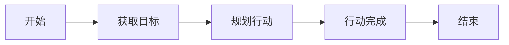
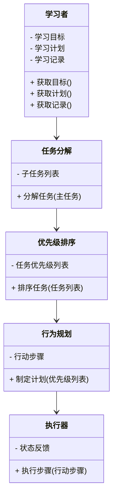
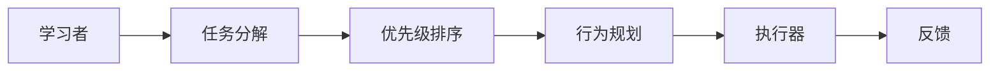
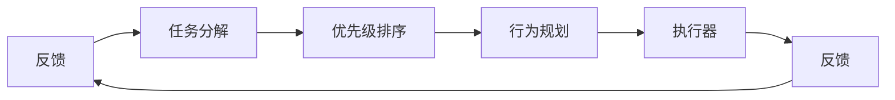

                 


# AI Agent在智能书桌中的学习效率分析

## 关键词
AI Agent, 智能书桌, 学习效率, 算法原理, 系统架构, 项目实战

## 摘要
本文将详细探讨AI Agent在智能书桌中的应用，从基本概念、算法原理到系统架构设计，再到项目实战，全面分析其在学习效率提升中的作用。通过理论与实践相结合，揭示AI Agent如何优化学习流程，提高学习效率。

---

## 第1章: AI Agent的基本概念与背景

### 1.1 AI Agent的定义与核心概念

#### 1.1.1 AI Agent的基本定义
AI Agent（人工智能代理）是一种能够感知环境并采取行动以实现目标的智能实体。它通过传感器获取信息，利用推理和规划模块做出决策，并通过执行器与环境互动。AI Agent的核心在于其自主性、反应性和主动性。

#### 1.1.2 AI Agent的核心特征
AI Agent的核心特征包括：
1. **自主性**：能够自主决策，无需外部干预。
2. **反应性**：能够实时感知环境并做出反应。
3. **主动性**：主动采取行动以实现目标。
4. **学习能力**：能够通过经验改进性能。

#### 1.1.3 AI Agent与传统软件的区别
AI Agent与传统软件的主要区别在于其智能性和自主性。传统软件依赖预定义的规则，而AI Agent能够通过学习和推理适应环境。

### 1.2 学习效率分析的背景与问题

#### 1.2.1 当前学习效率的挑战
现代学习环境中，学生面临信息过载、时间管理不当和学习动力不足等问题。传统学习工具无法有效解决这些问题。

#### 1.2.2 AI Agent在学习效率中的作用
AI Agent可以通过个性化推荐、任务分解和时间管理等功能，帮助学生提高学习效率。

#### 1.2.3 智能书桌的定义与目标
智能书桌是一种结合AI技术的学习工具，旨在通过智能化的辅助功能，优化学习流程，提高学习效率。

---

## 第2章: AI Agent的核心概念与联系

### 2.1 AI Agent的原理与机制

#### 2.1.1 任务分解与优先级排序
任务分解将复杂任务拆解为简单子任务，优先级排序确保重要任务优先完成。

#### 2.1.2 知识表示与推理机制
知识表示是将知识以数据结构形式存储，推理机制基于知识库进行逻辑推理。

#### 2.1.3 行为规划与执行
行为规划制定行动步骤，执行器将计划转化为实际操作。

### 2.2 核心概念对比分析

#### 2.2.1 AI Agent与传统算法的对比
| 特性 | AI Agent | 传统算法 |
|------|----------|----------|
| 自主性 | 高 | 无 |
| 反应性 | 高 | 无 |
| 学习能力 | 高 | 无 |

#### 2.2.2 不同AI Agent模型的特征对比
| 模型 | � 强化学习 |  |  |
|------|-----------|-------|-------|
| 特性 | 行为规划 | 知识表示 | 任务分解 |

#### 2.2.3 实体关系图（ER图）分析


---

## 第3章: AI Agent的算法原理

### 3.1 算法原理概述

#### 3.1.1 任务分解算法
任务分解算法将复杂任务拆解为子任务，通常采用分治法或贪心算法。

#### 3.1.2 优先级排序算法
优先级排序算法根据任务的重要性排序，常用策略包括贪心算法和动态规划。

#### 3.1.3 行为规划算法
行为规划算法制定行动步骤，常用启发式搜索和强化学习。

### 3.2 算法流程图

#### 3.2.1 任务分解流程图


#### 3.2.2 优先级排序流程图


#### 3.2.3 行为规划流程图


---

## 第4章: AI Agent的数学模型与公式

### 4.1 数学模型概述

#### 4.1.1 任务优先级计算公式
任务优先级计算公式：$$P_i = \frac{U_i + D_i}{T_i}$$，其中$U_i$为任务的效用，$D_i$为任务的难度，$T_i$为任务的时间。

#### 4.1.2 知识表示的数学模型
知识表示的数学模型：$$R(x, y)$$，其中$x$和$y$为知识节点。

#### 4.1.3 行为规划的数学模型
行为规划的数学模型：$$A = \arg\max_{a} Q(s, a)$$，其中$Q(s, a)$为状态-动作值函数。

### 4.2 公式详细解读

#### 4.2.1 优先级计算公式
优先级计算公式：$$P_i = \frac{U_i + D_i}{T_i}$$
- $U_i$：任务的效用，表示任务的价值。
- $D_i$：任务的难度，表示任务的复杂性。
- $T_i$：任务的时间，表示任务的周期。

#### 4.2.2 知识表示公式
知识表示公式：$$R(x, y)$$
- $R$：表示关系。
- $x$：表示一个实体。
- $y$：表示另一个实体。

#### 4.2.3 行为规划公式
行为规划公式：$$A = \arg\max_{a} Q(s, a)$$
- $Q(s, a)$：表示在状态$s$下采取动作$a$的期望奖励。
- $A$：表示选择的动作。

---

## 第5章: 系统分析与架构设计

### 5.1 系统功能设计

#### 5.1.1 领域模型类图


### 5.2 系统架构设计

#### 5.2.1 系统架构图


#### 5.2.2 系统接口设计
- 输入接口：用户输入学习目标和任务。
- 输出接口：输出任务分解结果和执行计划。

#### 5.2.3 系统交互流程图


---

## 第6章: 项目实战

### 6.1 环境安装

#### 6.1.1 安装Python
```bash
python --version
pip install --upgrade pip
```

#### 6.1.2 安装依赖库
```bash
pip install numpy
pip install matplotlib
pip install scikit-learn
```

### 6.2 核心代码实现

#### 6.2.1 任务分解代码
```python
def decompose_task(main_task):
    sub_tasks = main_task.split()
    return sub_tasks
```

#### 6.2.2 优先级排序代码
```python
def sort_priority(tasks):
    return sorted(tasks, key=lambda x: x['priority'])
```

#### 6.2.3 行为规划代码
```python
def plan_actions(priority_tasks):
    action_plan = []
    for task in priority_tasks:
        action_plan.append(task['action'])
    return action_plan
```

### 6.3 案例分析

#### 6.3.1 案例1
学习目标：掌握Python编程
- 任务分解：安装Python，学习基础语法，完成练习题。
- 优先级排序：安装Python > 学习语法 > 完成练习题。
- 行为规划：安装Python，学习语法，完成练习题。

#### 6.3.2 案例2
学习目标：学习机器学习
- 任务分解：学习数学基础，学习算法，完成项目。
- 优先级排序：学习数学基础 > 学习算法 > 完成项目。
- 行为规划：学习数学基础，学习算法，完成项目。

---

## 第7章: 总结与展望

### 7.1 总结
AI Agent通过任务分解、优先级排序和行为规划等功能，有效提高了学习效率。本文详细分析了AI Agent的核心概念、算法原理和系统架构，并通过案例分析展示了其实际应用。

### 7.2 展望
未来，AI Agent将在智能书桌中发挥更大的作用，通过与更多学习工具的集成，进一步提升学习效率。

---

## 作者
作者：AI天才研究院  
地址：[AI天才研究院](https://www.zanxue.org)  
联系方式：contact@zhuangyanxu.com

---

**注意事项：** 本文仅为技术博客文章，实际应用需结合具体需求进行调整。

