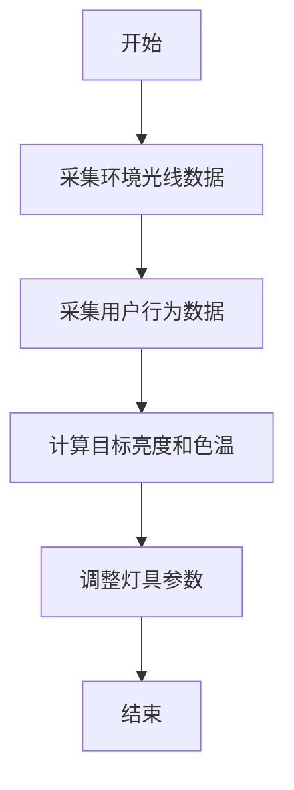
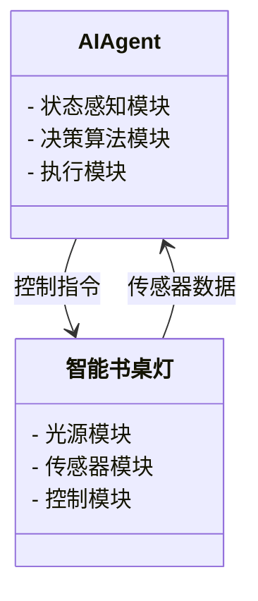
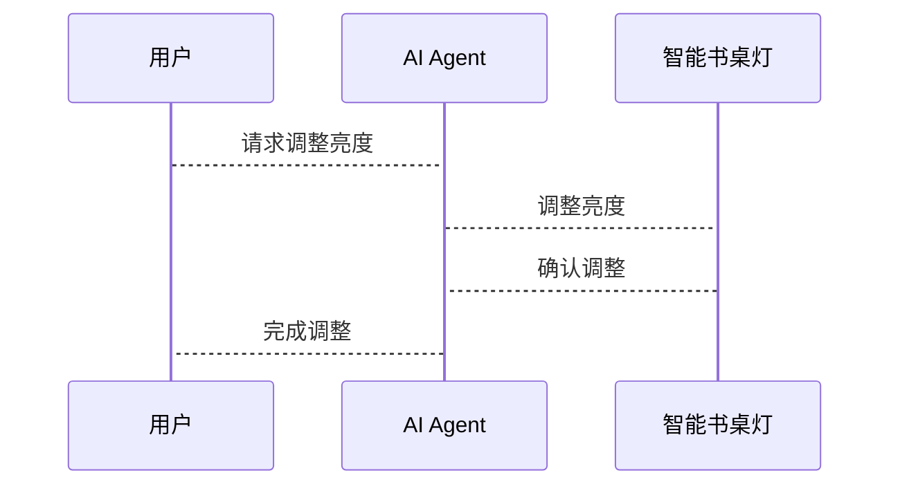

                 


# AI Agent在智能书桌灯中的照明优化

> 关键词：AI Agent，智能书桌灯，照明优化，环境感知，自适应调节

> 摘要：本文探讨了AI Agent在智能书桌灯中的应用，重点分析了基于AI的照明优化算法及其在智能书桌灯中的实现。文章详细阐述了AI Agent的基本概念、算法原理、系统架构设计以及实际项目实现，为智能照明领域的技术研究提供了理论和实践参考。

---

# 第一部分: AI Agent与智能书桌灯的背景与概念

# 第1章: AI Agent与智能书桌灯的背景介绍

## 1.1 AI Agent的基本概念
### 1.1.1 AI Agent的定义与特点
AI Agent（人工智能代理）是指能够感知环境、自主决策并执行任务的智能实体。它通过传感器获取信息，利用算法进行分析和决策，并通过执行器与环境交互。AI Agent的核心特点包括：
- **自主性**：能够独立运行，无需人工干预。
- **反应性**：能够实时感知环境并做出反应。
- **主动性**：能够主动采取行动以实现目标。

### 1.1.2 AI Agent的核心要素与功能
AI Agent的功能模块通常包括：
1. **感知模块**：负责采集环境数据，如光线强度、色温、用户行为等。
2. **决策模块**：基于感知数据，利用算法进行推理和决策。
3. **执行模块**：根据决策结果，通过执行器（如灯具）进行操作。

### 1.1.3 AI Agent与传统自动化系统的区别
与传统自动化系统相比，AI Agent具有更强的自主性和适应性，能够根据动态环境和用户需求进行实时调整。

---

## 1.2 智能书桌灯的发展趋势
### 1.2.1 传统书桌灯的功能局限性
传统书桌灯通常只能通过手动调节亮度和色温，无法根据环境变化和用户需求自动优化。

### 1.2.2 智能化照明的市场需求
随着人们对健康和舒适度的关注增加，智能化照明设备市场需求快速增长。智能书桌灯可以通过传感器和AI算法实现动态调节。

### 1.2.3 AI技术在智能照明中的应用前景
AI技术的引入使得智能书桌灯能够更加智能化，例如：
- 根据环境光线和用户行为自动调节亮度和色温。
- 通过学习用户的习惯优化照明方案。

---

## 1.3 问题背景与目标
### 1.3.1 照明对人眼健康的影响
不当的照明环境可能导致眼睛疲劳、视力下降等问题。通过AI优化照明可以有效减少这些负面影响。

### 1.3.2 环境光线变化对视觉舒适度的影响
光线强度和色温的变化会影响用户的视觉体验。AI Agent可以通过实时感知环境光线，动态调整照明参数以提供最佳舒适度。

### 1.3.3 用户需求与照明优化的目标
用户需求包括：
- 提高工作效率。
- 保护眼睛健康。
- 提升舒适度。
- 节能减排。

---

## 1.4 本章小结
本章介绍了AI Agent的基本概念和智能书桌灯的发展趋势，阐述了AI技术在智能照明中的应用前景，并提出了照明优化的目标。

---

# 第2章: AI Agent在智能书桌灯中的核心概念

## 2.1 AI Agent的基本原理
### 2.1.1 AI Agent的工作流程
AI Agent的工作流程包括：
1. **感知环境**：通过传感器采集环境数据。
2. **分析数据**：利用算法对数据进行分析和推理。
3. **决策与规划**：根据分析结果制定行动方案。
4. **执行操作**：通过执行器实现目标。

### 2.1.2 基于感知的数据采集与分析
AI Agent需要采集的环境数据包括：
- **光线强度**：环境光照亮度。
- **色温**：环境光线的色温。
- **用户行为**：用户的活动状态和位置。

### 2.1.3 自适应调节算法
AI Agent的核心是自适应调节算法，能够根据环境和用户需求动态调整照明参数。

---

## 2.2 智能书桌灯的照明优化目标
### 2.2.1 照明强度的动态调节
根据环境光线变化和用户需求，动态调整照明亮度。

### 2.2.2 照明色温的智能优化
根据用户的活动状态和环境光线变化，自动调节色温以提供最佳视觉体验。

### 2.2.3 用户行为与环境光线的协同优化
通过分析用户行为和环境光线，实现照明参数的协同优化。

---

## 2.3 核心概念与联系
### 2.3.1 AI Agent与智能书桌灯的实体关系图
```mermaid
entityDiagram {
  class AI Agent {
    - 状态感知模块
    - 决策算法模块
    - 执行模块
  }
  class 智能书桌灯 {
    - 光源模块
    - 传感器模块
    - 控制模块
  }
  AI Agent --> 智能书桌灯: 控制指令
  智能书桌灯 --> AI Agent: 传感器数据
}
```

---

## 2.4 本章小结
本章详细介绍了AI Agent的基本原理及其在智能书桌灯中的应用，重点阐述了自适应调节算法和照明优化目标。

---

# 第3章: AI Agent的算法原理与数学模型

## 3.1 算法原理
### 3.1.1 基于光照强度的调节算法
光照强度调节算法基于环境光线变化，动态调整书桌灯的亮度。

### 3.1.2 基于色温变化的优化算法
色温调节算法根据环境光线变化和用户需求，自动调整色温以提供最佳视觉体验。

### 3.1.3 用户行为与环境光线的协同优化算法
协同优化算法结合用户行为和环境光线变化，实现照明参数的动态优化。

---

## 3.2 算法流程图


---

## 3.3 算法数学模型
### 3.3.1 �照度计算公式
照度（ lux）计算公式：
$$ lux = I \times A \times L \times F $$

其中：
- $I$：光源强度
- $A$：光源与目标点的距离
- $L$：光源面积
- $F$：余弦系数

### 3.3.2 色温计算公式
色温（K）计算公式：
$$ color\_temperature = \frac{1000 \times V}{I} $$

其中：
- $V$：电压
- $I$：电流

---

## 3.4 本章小结
本章详细讲解了AI Agent在智能书桌灯中的算法原理，并通过数学模型和流程图展示了算法的实现过程。

---

# 第4章: 系统分析与架构设计方案

## 4.1 问题场景介绍
智能书桌灯需要在动态环境下优化照明参数，满足用户对舒适度和效率的需求。

## 4.2 项目介绍
本项目旨在开发一款基于AI Agent的智能书桌灯，实现动态调节亮度和色温。

## 4.3 系统功能设计
### 4.3.1 功能模块设计


---

## 4.4 系统架构设计
### 4.4.1 系统架构图


---

## 4.5 系统接口设计
### 4.5.1 系统接口
- **输入接口**：传感器数据采集接口。
- **输出接口**：灯具控制接口。

---

## 4.6 系统交互设计
### 4.6.1 交互流程图


---

## 4.7 本章小结
本章通过系统分析和架构设计，展示了AI Agent在智能书桌灯中的实现方案。

---

# 第5章: 项目实战

## 5.1 环境搭建
### 5.1.1 开发环境
- **硬件**：智能书桌灯、传感器、灯具。
- **软件**：Python开发环境、AI算法库。

---

## 5.2 系统核心实现
### 5.2.1 AI Agent实现
```python
class AI_Agent:
    def __init__(self):
        self.sensor_data = {}
        self.target_light = 0
        self.target_color_temp = 0

    def感知环境(self):
        # 获取传感器数据
        self.sensor_data = get_sensor_data()

    def 决策(self):
        # 根据传感器数据计算目标亮度和色温
        self.target_light = self.sensor_data['light'] + 10
        self.target_color_temp = self.sensor_data['color_temp'] + 500

    def 执行(self):
        # 调整灯具参数
        adjust_light(self.target_light)
        adjust_color_temp(self.target_color_temp)
```

### 5.2.2 灯具控制实现
```python
def adjust_light(target_light):
    # 调整亮度
    pass

def adjust_color_temp(target_color_temp):
    # 调整色温
    pass
```

---

## 5.3 代码应用解读与分析
### 5.3.1 代码实现
```python
# 示例代码
agent = AI_Agent()
agent.感知环境()
agent.决策()
agent.执行()
```

### 5.3.2 功能分析
- **感知环境**：获取环境光线和色温数据。
- **决策**：根据数据计算目标亮度和色温。
- **执行**：调整灯具参数。

---

## 5.4 案例分析与优化效果
### 5.4.1 案例分析
- **场景1**：环境光线较暗，AI Agent自动增加亮度。
- **场景2**：环境光线较亮，AI Agent自动降低亮度。

### 5.4.2 优化效果
- **提升舒适度**：动态调节亮度和色温，提供更舒适的视觉体验。
- **提高效率**：优化工作环境，提升工作效率。

---

## 5.5 本章小结
本章通过项目实战，详细讲解了AI Agent在智能书桌灯中的实现过程，并通过案例分析展示了优化效果。

---

# 第6章: 总结与展望

## 6.1 项目总结
本项目通过AI Agent实现了智能书桌灯的动态调节，显著提升了用户舒适度和工作效率。

## 6.2 优化建议
- **算法优化**：进一步优化AI算法，提升调节精度。
- **功能扩展**：增加更多智能化功能，如语音控制、远程调节。

## 6.3 注意事项
- **传感器精度**：确保传感器数据的准确性。
- **用户隐私**：保护用户数据隐私。

## 6.4 未来展望
随着AI技术的不断发展，智能书桌灯将更加智能化和个性化，为用户提供更优质的服务。

---

# 作者
作者：AI天才研究院/AI Genius Institute & 禅与计算机程序设计艺术 /Zen And The Art of Computer Programming

