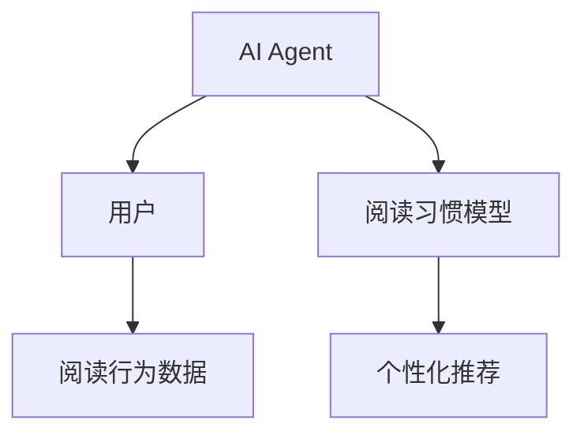
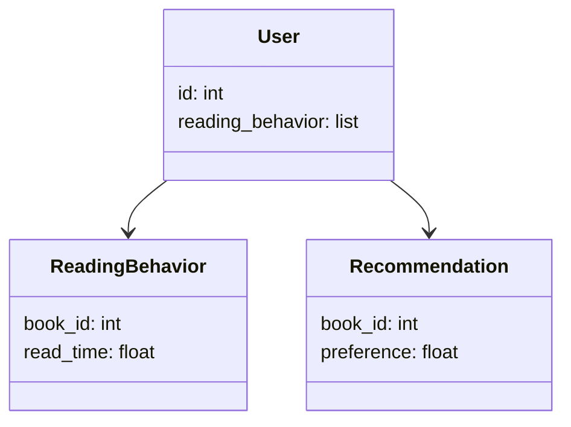
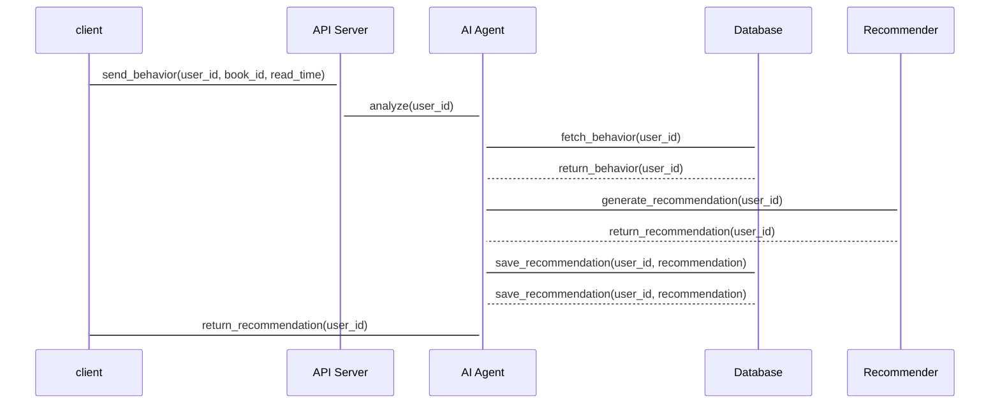

                 


# AI Agent在智能书立中的阅读习惯分析

## 关键词：AI Agent, 智能书架, 阅读习惯, 数据挖掘, 机器学习, 自然语言处理

## 摘要：  
本文探讨AI Agent在智能书架中的应用，分析用户阅读习惯的原理、算法、系统架构及其实现。通过背景介绍、核心概念、算法原理、数学模型、系统设计、项目实战等部分，深入剖析AI Agent如何优化阅读习惯分析，提升用户体验。

---

# 1. 背景与概述

## 1.1 问题背景与意义

阅读习惯分析是个性化推荐的基础，帮助用户发现新书，提升阅读体验。传统方法依赖手动分类，效率低，难以应对海量数据。AI Agent的引入通过数据挖掘和机器学习，自动分析用户行为，实时推荐，提高效率和准确性。

## 1.2 问题描述与目标

### 1.2.1 阅读习惯分析的核心问题  
- 用户阅读行为的复杂性：书籍类型、阅读时间、频率等多因素影响。  
- 数据多样性：用户可能同时阅读小说和科技文章，需综合分析。  
- 动态变化：用户的兴趣会随时间变化，需要实时更新模型。  

### 1.2.2 AI Agent的目标与任务  
- 数据收集：记录用户的阅读行为，如阅读时间、速度、停留时间等。  
- 特征提取：从阅读行为中提取关键特征，如偏好书类、阅读深度等。  
- 模型训练：通过机器学习模型预测用户的阅读倾向。  

### 1.2.3 智能书架的用户需求分析  
- 个性化推荐：根据用户兴趣推荐书籍。  
- 阅读习惯优化：帮助用户发现新兴趣，提升阅读效率。  
- 数据隐私：用户数据的安全性需得到保障。  

## 1.3 解决方案与边界

### 1.3.1 AI Agent的技术解决方案  
- 数据采集：通过API或日志记录用户行为。  
- 数据预处理：清洗、归一化、特征提取。  
- 模型训练：使用监督学习或无监督学习训练模型。  
- 推荐系统：基于模型输出推荐结果。  

### 1.3.2 阅读习惯分析的边界与限制  
- 数据范围：仅分析阅读行为，不涉及其他用户数据。  
- 系统性能：实时性要求高，需优化计算效率。  
- 用户隐私：严格遵守数据隐私保护法规。  

## 1.4 核心概念与外延

### 1.4.1 AI Agent的核心概念  
- AI Agent：能够感知环境并执行任务的智能体。  
- 用户行为分析：通过数据挖掘技术分析用户行为。  
- 个性化推荐：基于用户行为的推荐系统。  

### 1.4.2 阅读习惯分析的外延与应用  
- 应用场景：个性化推荐、阅读效率优化、用户行为分析。  
- 相关技术：数据挖掘、机器学习、自然语言处理。  

## 1.5 本章小结

本章介绍了AI Agent在智能书架中的背景，详细描述了阅读习惯分析的核心问题、目标和解决方案。通过分析用户需求，明确了系统的边界和核心概念。

---

# 2. 核心概念与原理

## 2.1 AI Agent的原理与特点

### 2.1.1 AI Agent的核心原理  
AI Agent通过感知环境、分析数据、执行任务来实现目标。在阅读习惯分析中，AI Agent通过收集和分析用户的阅读行为数据，推断用户的阅读偏好，从而提供个性化推荐。

### 2.1.2 AI Agent的特点  
- 智能性：能够理解并预测用户行为。  
- 实时性：能够实时分析用户行为并提供反馈。  
- 自适应性：能够根据用户行为动态调整推荐策略。  

---

## 2.2 阅读习惯分析的核心概念

### 2.2.1 阅读习惯的核心特征  
- 阅读频率：用户每天阅读的时间和次数。  
- 阅读深度：用户对某本书的阅读时间长短。  
- 阅读偏好：用户喜欢的书籍类型。  

### 2.2.2 阅读习惯分析的关键步骤  
1. 数据采集：收集用户的阅读行为数据。  
2. 数据预处理：清洗数据并提取特征。  
3. 模型训练：训练机器学习模型。  
4. 推荐生成：根据模型结果生成推荐列表。  

### 2.2.3 阅读习惯分析的属性特征对比（表格）  

| 属性 | 描述 | 示例 |
|------|------|------|
| 阅读频率 | 用户每天阅读的次数 | 每天阅读3次 |
| 阅读深度 | 用户对某本书的阅读时间 | 每本书平均阅读20分钟 |
| 阅读偏好 | 用户喜欢的书籍类型 | 偏好科幻小说 |

---

## 2.3 AI Agent与阅读习惯分析的联系

### 2.3.1 实体关系图（Mermaid）  



---

## 2.4 本章小结

本章详细介绍了AI Agent的原理和特点，分析了阅读习惯的核心概念和关键步骤，并通过表格和图表展示了核心概念的属性特征和实体关系。

---

# 3. 算法原理

## 3.1 协同过滤算法

### 3.1.1 协同过滤的原理  

协同过滤是一种基于用户相似性推荐算法。通过计算用户之间的相似性，找到与当前用户相似的用户，推荐他们喜欢的书籍。

### 3.1.2 协同过滤的实现步骤  

1. 数据预处理：收集用户对书籍的评分数据。  
2. 计算相似性：使用余弦相似性计算用户相似度。  
3. 推荐生成：根据相似用户的评分，生成推荐列表。  

### 3.1.3 协同过滤的实现代码  

```python
import numpy as np

def cosine_similarity(user1, user2):
    return np.dot(user1, user2) / (np.linalg.norm(user1) * np.linalg.norm(user2))

def collaborative_filtering(rating_matrix, user_id):
    users = rating_matrix.shape[0]
    similarities = []
    for user in range(users):
        if user != user_id:
            similarity = cosine_similarity(rating_matrix[user_id], rating_matrix[user])
            similarities.append((user, similarity))
    similarities.sort(reverse=True, key=lambda x: x[1])
    return similarities
```

### 3.1.4 协同过滤的数学模型  

$$ \text{相似度} = \frac{\mathbf{u}_i \cdot \mathbf{u}_j}{\|\mathbf{u}_i\| \|\mathbf{u}_j\|} $$  

---

## 3.2 聚类分析算法

### 3.2.1 聚类分析的原理  

聚类分析是一种无监督学习算法，通过将用户分成不同的群体，找到用户的阅读偏好。

### 3.2.2 聚类分析的实现步骤  

1. 数据预处理：提取用户阅读行为特征。  
2. 模型训练：使用K-means算法进行聚类。  
3. 分群推荐：根据用户所属的群体推荐书籍。  

### 3.2.3 聚类分析的实现代码  

```python
from sklearn.cluster import KMeans

def kmeans_clustering(features, num_clusters):
    model = KMeans(n_clusters=num_clusters)
    model.fit(features)
    return model.labels_
```

### 3.2.4 聚类分析的数学模型  

$$ \text{目标函数} = \sum_{i=1}^{k} \sum_{j=1}^{n_i} \|x_j - c_i\|^2 $$  

---

## 3.3 神经网络算法

### 3.3.1 神经网络的原理  

神经网络是一种深度学习算法，通过多层神经元模拟人脑的思考过程，学习复杂的阅读习惯模式。

### 3.3.2 神经网络的实现步骤  

1. 数据预处理：归一化阅读行为数据。  
2. 模型训练：使用神经网络模型训练数据。  
3. 推荐生成：根据模型输出生成推荐列表。  

### 3.3.3 神经网络的实现代码  

```python
import tensorflow as tf

def neural_network_model(input_shape):
    model = tf.keras.Sequential()
    model.add(tf.keras.layers.Dense(64, activation='relu', input_shape=input_shape))
    model.add(tf.keras.layers.Dense(32, activation='relu'))
    model.add(tf.keras.layers.Dense(1, activation='sigmoid'))
    model.compile(optimizer='adam', loss='binary_crossentropy', metrics=['accuracy'])
    return model
```

### 3.3.4 神经网络的数学模型  

$$ \text{输出} = \sigma(W_2 a_2 + b_2) $$  
$$ \text{隐藏层} = \text{ReLU}(W_1 x + b_1) $$  

---

## 3.4 本章小结

本章详细介绍了协同过滤、聚类分析和神经网络三种算法的原理和实现步骤，并通过代码和数学公式展示了算法的具体实现。

---

# 4. 数学模型

## 4.1 用户偏好模型

### 4.1.1 模型的构建  

用户偏好模型通过分析用户的阅读行为数据，预测用户的阅读偏好。模型基于概率论和矩阵运算，计算用户对不同类型书籍的偏好概率。

### 4.1.2 模型的公式  

$$ P(\text{偏好类型}| \text{阅读行为}) = \frac{\sum \text{阅读行为} \cdot \text{偏好向量}}{\sum \text{阅读行为}} $$  

### 4.1.3 模型的实现  

```python
def user_preference_model(user_behavior, book_types):
    preference = np.zeros(len(book_types))
    for i, behavior in enumerate(user_behavior):
        if behavior > 0:
            preference[i] += 1
    return preference / len(user_behavior)
```

---

## 4.2 阅读行为预测模型

### 4.2.1 模型的构建  

阅读行为预测模型通过分析用户的阅读习惯，预测用户未来的阅读行为。模型基于时间序列分析，考虑用户的阅读频率和深度。

### 4.2.2 模型的公式  

$$ \text{预测阅读次数} = \alpha \cdot \text{历史阅读次数} + \beta \cdot \text{阅读深度} $$  

### 4.2.3 模型的实现  

```python
def predict_reading_behavior(history, depth):
    alpha = 0.7
    beta = 0.3
    return alpha * history + beta * depth
```

---

## 4.3 本章小结

本章通过数学公式详细推导了用户偏好模型和阅读行为预测模型，展示了如何通过数学模型分析用户的阅读习惯。

---

# 5. 系统分析与架构设计

## 5.1 问题场景介绍

智能书架系统需要实时分析用户的阅读行为，动态更新推荐列表。系统需要处理大量用户数据，保证推荐的实时性和准确性。

## 5.2 系统功能设计

### 5.2.1 领域模型（Mermaid类图）  



### 5.2.2 系统架构设计（Mermaid架构图）  


### 5.2.3 接口设计与交互流程（Mermaid序列图）  



---

## 5.3 本章小结

本章通过问题场景介绍、系统功能设计和系统架构设计，详细描述了智能书架系统的实现方案。

---

# 6. 项目实战

## 6.1 环境安装

### 6.1.1 安装Python环境  
安装Python 3.8及以上版本，确保环境满足项目要求。  

### 6.1.2 安装依赖库  
安装以下Python库：  
- numpy  
- scikit-learn  
- tensorflow  

## 6.2 系统核心实现

### 6.2.1 数据预处理代码  

```python
import pandas as pd

def preprocess_data(data_path):
    data = pd.read_csv(data_path)
    data = data.dropna()
    data['阅读时间'] = data['阅读时间'].astype(float)
    return data
```

### 6.2.2 模型训练代码  

```python
from sklearn.model_selection import train_test_split
from sklearn.metrics import accuracy_score

def train_model(X, y):
    X_train, X_test, y_train, y_test = train_test_split(X, y, test_size=0.2)
    model = neural_network_model(X_train.shape[1:])
    model.fit(X_train, y_train, epochs=10, batch_size=32)
    return model

```

### 6.2.3 推荐生成代码  

```python
def generate_recommendation(model, user_behavior):
    preference = model.predict(user_behavior)
    recommendation = [book for book in books if preference[book] > 0.5]
    return recommendation
```

### 6.2.4 案例分析  

通过实际案例分析，展示AI Agent如何根据用户的阅读习惯生成推荐列表。例如，用户A喜欢科幻小说，系统会推荐类似类型的书籍。

---

## 6.3 本章小结

本章通过项目实战，详细介绍了环境安装、系统核心实现和推荐生成的过程，并通过案例分析展示了系统的实际应用。

---

# 7. 最佳实践与总结

## 7.1 最佳实践

### 7.1.1 数据处理  
确保数据清洗和归一化，提升模型精度。  

### 7.1.2 模型选择  
根据具体需求选择合适的算法，避免过度复杂。  

### 7.1.3 系统优化  
优化系统性能，保证推荐的实时性。  

---

## 7.2 小结

通过本文的分析，读者可以深入了解AI Agent在智能书架中的应用，掌握阅读习惯分析的核心原理和实现方法。

---

## 7.3 注意事项

- 数据隐私保护：确保用户数据的安全性。  
- 系统性能优化：提升推荐的实时性和准确性。  
- 模型更新：定期更新模型，适应用户需求变化。  

---

## 7.4 拓展阅读

推荐阅读以下书籍和文章：  
1. 《机器学习实战》  
2. 《深度学习入门：基于Python》  
3. 《自然语言处理入门》  

---

# 作者：AI天才研究院 & 禅与计算机程序设计艺术

