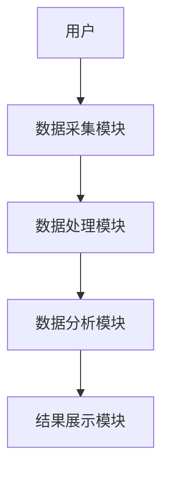
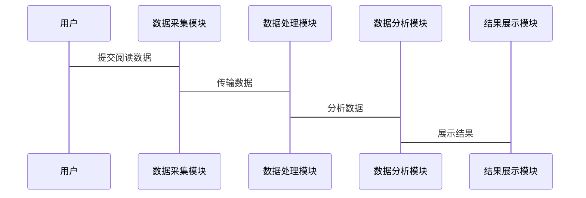

                 


# AI Agent在智能书签中的阅读习惯分析

> 关键词：AI Agent, 智能书签, 阅读习惯分析, 算法原理, 系统设计

> 摘要：本文详细探讨了AI Agent在智能书签中的阅读习惯分析的背景、原理、算法实现、系统设计以及实际应用。通过分析阅读习惯的核心算法和AI Agent的工作原理，结合实际案例，展示了如何利用AI技术优化用户的阅读体验。

---

# 第一部分: AI Agent与智能书签的背景与概念

## 第1章: AI Agent与阅读习惯分析的背景介绍

### 1.1 AI Agent的核心概念

AI Agent（人工智能代理）是一种能够感知环境、自主决策并执行任务的智能实体。它通过数据采集、分析和学习，能够理解用户的行为模式，并提供个性化的服务。在阅读习惯分析中，AI Agent主要用于收集用户的阅读数据（如阅读时间、阅读速度、阅读偏好等），并基于这些数据生成用户画像，从而优化阅读体验。

#### 1.1.1 AI Agent的定义与特点

- **定义**：AI Agent是一种能够感知环境、自主决策并执行任务的智能实体。
- **特点**：
  - **自主性**：能够在没有外部干预的情况下完成任务。
  - **反应性**：能够实时感知环境并做出反应。
  - **学习能力**：能够通过数据学习和优化自身的行为。
  - **可扩展性**：能够适应不同的应用场景和数据规模。

#### 1.1.2 阅读习惯分析的基本概念

- **定义**：阅读习惯分析是通过分析用户的阅读行为数据，理解用户的阅读偏好、阅读习惯和阅读风格的过程。
- **核心要素**：
  - **阅读时间**：用户每天的阅读时间段。
  - **阅读速度**：用户每分钟阅读的字数。
  - **阅读偏好**：用户喜欢的阅读内容类型（如小说、技术文章等）。
  - **阅读深度**：用户对某些内容的专注程度。

#### 1.1.3 AI Agent在智能书签中的应用背景

智能书签是一种结合了AI技术的电子书签，能够根据用户的阅读习惯自动推荐相关内容、调整阅读界面，并优化用户的阅读体验。AI Agent在智能书签中的应用，使得书签不再只是一个简单的标记工具，而是一个能够主动理解和优化用户阅读体验的智能助手。

---

### 1.2 智能书签的定义与功能

#### 1.2.1 智能书签的定义

智能书签是一种结合了AI技术和大数据分析的电子书签，能够根据用户的阅读习惯和偏好，自动推荐相关内容、优化阅读界面，并提供个性化的阅读服务。

#### 1.2.2 智能书签的核心功能

- **内容推荐**：根据用户的阅读习惯推荐相关内容。
- **阅读优化**：根据用户的阅读偏好调整阅读界面和排版。
- **习惯分析**：分析用户的阅读习惯并生成用户画像。
- **实时反馈**：根据用户的阅读行为提供实时反馈和建议。

#### 1.2.3 智能书签与传统书签的区别

| 特性 | 传统书签 | 智能书签 |
|------|----------|----------|
| 功能 | 简单标记 | 自动推荐、优化阅读 |
| 数据 | 无数据采集 | 数据采集与分析 |
| 体验 | 静态标记 | 动态优化、个性化体验 |

---

### 1.3 阅读习惯分析的必要性

#### 1.3.1 阅读习惯分析的意义

阅读习惯分析能够帮助用户更好地理解自己的阅读行为，优化阅读效率，并提升阅读体验。对于出版商和内容创作者来说，阅读习惯分析能够帮助他们更好地理解用户需求，优化内容创作和分发策略。

#### 1.3.2 AI技术在阅读习惯分析中的作用

AI技术能够通过大数据分析和机器学习算法，从用户的阅读数据中提取有价值的信息，帮助用户和内容创作者更好地理解阅读行为。

#### 1.3.3 智能书签在阅读习惯分析中的优势

智能书签通过实时采集用户的阅读数据，能够提供更加精准和个性化的阅读习惯分析结果。与传统阅读数据分析方法相比，智能书签具有数据采集实时性强、分析结果精准度高等优势。

---

### 1.4 本章小结

本章介绍了AI Agent的核心概念、智能书签的定义与功能，以及阅读习惯分析的必要性。通过对比传统书签和智能书签的差异，突出了智能书签在阅读习惯分析中的优势。

---

## 第2章: AI Agent的核心原理与技术特征

### 2.1 AI Agent的工作原理

#### 2.1.1 AI Agent的基本工作流程

1. **数据采集**：通过传感器、API等方式采集用户的阅读数据。
2. **数据处理**：对采集到的数据进行清洗、归一化处理。
3. **数据分析**：通过机器学习算法分析数据，提取用户的行为模式。
4. **决策与执行**：根据分析结果生成推荐内容或调整阅读界面。

#### 2.1.2 AI Agent的核心算法

AI Agent的核心算法包括协同过滤、聚类分析、机器学习等。其中，协同过滤是一种常用的内容推荐算法，通过分析用户的阅读偏好，推荐类似的内容。

#### 2.1.3 AI Agent的决策机制

AI Agent的决策机制通常基于概率论和统计学方法，通过分析用户的阅读数据，预测用户的阅读偏好，并生成相应的推荐结果。

---

### 2.2 阅读习惯分析的技术特征

#### 2.2.1 数据采集与处理技术

- **数据采集**：通过智能书签采集用户的阅读时间、阅读速度、阅读内容等数据。
- **数据处理**：对采集到的数据进行清洗、归一化处理，确保数据的准确性和一致性。

#### 2.2.2 数据分析与挖掘技术

- **数据分析**：通过机器学习算法分析用户的阅读数据，提取用户的阅读习惯和偏好。
- **数据挖掘**：从海量数据中挖掘有价值的信息，帮助用户和内容创作者优化阅读体验。

#### 2.2.3 数据可视化技术

- **数据可视化**：通过图表、仪表盘等方式直观展示用户的阅读习惯和偏好。
- **可视化工具**：常用的可视化工具包括Tableau、Power BI、D3.js等。

---

### 2.3 AI Agent与传统阅读数据分析的区别

#### 2.3.1 数据处理方式的对比

| 特性 | AI Agent | 传统方法 |
|------|----------|----------|
| 数据采集 | 实时采集 | 手动记录或批量采集 |
| 数据分析 | 基于机器学习 | 基于统计学方法 |
| 数据处理 | 高效处理 | 处理效率较低 |

#### 2.3.2 分析方法的对比

| 特性 | AI Agent | 传统方法 |
|------|----------|----------|
| 分析方法 | 机器学习、深度学习 | 统计分析、数据挖掘 |
| 分析结果 | 高度个性化 | 通用性较强 |

#### 2.3.3 结果应用的对比

| 特性 | AI Agent | 传统方法 |
|------|----------|----------|
| 应用场景 | 个性化推荐、阅读优化 | 阅读习惯报告、内容分发 |
| 应用效果 | 实时优化、精准推荐 | 延时较长、推荐精度较低 |

---

### 2.4 本章小结

本章详细介绍了AI Agent的核心原理和阅读习惯分析的技术特征，并对比了AI Agent与传统阅读数据分析方法的区别，突出了AI Agent在阅读习惯分析中的优势。

---

## 第3章: 阅读习惯分析的背景与目标

### 3.1 阅读习惯分析的基本概念

#### 3.1.1 阅读习惯的定义

阅读习惯是指用户在阅读过程中表现出的行为模式和偏好，包括阅读时间、阅读速度、阅读内容偏好等。

#### 3.1.2 阅读习惯的分类

- **时间习惯**：用户的阅读时间段和阅读时长。
- **速度习惯**：用户平均每分钟阅读的字数。
- **内容偏好**：用户喜欢的阅读内容类型。

#### 3.1.3 阅读习惯分析的意义

阅读习惯分析能够帮助用户优化阅读效率，提升阅读体验，并为内容创作者提供用户行为洞察。

---

### 3.2 智能书签中的阅读习惯分析

#### 3.2.1 阅读习惯分析的场景

- **个性化推荐**：根据用户的阅读习惯推荐相关内容。
- **阅读优化**：根据用户的阅读习惯调整阅读界面和排版。
- **用户画像**：基于阅读习惯生成用户画像，帮助内容创作者优化内容分发策略。

#### 3.2.2 阅读习惯分析的目标

- **优化阅读体验**：通过分析用户的阅读习惯，提升用户的阅读效率和阅读体验。
- **个性化推荐**：根据用户的阅读偏好推荐相关内容。
- **行为洞察**：通过分析用户的阅读行为，挖掘用户的阅读需求和偏好。

---

### 3.3 AI Agent在阅读习惯分析中的作用

#### 3.3.1 AI Agent的优势

- **数据处理能力**：AI Agent能够高效处理海量的阅读数据，提取有价值的信息。
- **实时性**：AI Agent能够实时分析用户的阅读行为，提供实时反馈和推荐。
- **个性化**：AI Agent能够根据用户的阅读习惯提供个性化的阅读服务。

#### 3.3.2 AI Agent的应用场景

- **个性化推荐**：根据用户的阅读习惯推荐相关内容。
- **阅读优化**：根据用户的阅读习惯调整阅读界面和排版。
- **行为分析**：通过分析用户的阅读行为，挖掘用户的阅读需求和偏好。

#### 3.3.3 AI Agent的未来发展方向

随着AI技术的不断发展，AI Agent在阅读习惯分析中的应用将更加广泛和深入。未来，AI Agent将更加智能化和个性化，能够根据用户的阅读习惯实时优化阅读体验，并为内容创作者提供更加精准的用户行为洞察。

---

### 3.4 本章小结

本章介绍了阅读习惯分析的基本概念、智能书签中的阅读习惯分析场景以及AI Agent在阅读习惯分析中的作用，突出了AI Agent在阅读习惯分析中的优势和未来发展方向。

---

## 第4章: AI Agent与阅读习惯分析的算法原理

### 4.1 阅读习惯分析的核心算法

#### 4.1.1 协同过滤算法

协同过滤是一种常用的内容推荐算法，通过分析用户的阅读偏好，推荐类似的内容。协同过滤算法可以分为基于用户的协同过滤和基于物品的协同过滤。

##### 协同过滤的数学公式

协同过滤的核心思想是通过计算用户之间的相似性或物品之间的相似性，推荐用户可能感兴趣的内容。以下是基于用户的协同过滤算法的数学公式：

$$
similarity(u, v) = \frac{\sum_{i=1}^{n} (r_{u,i} - \bar{r}_u)(r_{v,i} - \bar{r}_v)}{\sqrt{\sum_{i=1}^{n} (r_{u,i} - \bar{r}_u)^2} \cdot \sqrt{\sum_{i=1}^{n} (r_{v,i} - \bar{r}_v)^2}}
$$

其中，$similarity(u, v)$ 表示用户 $u$ 和用户 $v$ 之间的相似性，$r_{u,i}$ 表示用户 $u$ 对物品 $i$ 的评分，$\bar{r}_u$ 表示用户 $u$ 的平均评分。

##### 协同过滤的实现步骤

1. **数据准备**：收集用户的阅读数据。
2. **计算相似性**：计算用户之间的相似性。
3. **生成推荐**：根据相似性生成推荐内容。

##### 协同过滤的Python代码示例

```python
import numpy as np

def cosine_similarity(user_matrix):
    # 计算用户之间的余弦相似性
    user_num, item_num = user_matrix.shape
    similarity = np.zeros((user_num, user_num))
    for i in range(user_num):
        for j in range(user_num):
            similarity[i][j] = np.dot(user_matrix[i], user_matrix[j]) / (np.linalg.norm(user_matrix[i]) * np.linalg.norm(user_matrix[j]))
    return similarity
```

#### 4.1.2 聚类分析算法

聚类分析是一种无监督学习算法，通过将用户分成不同的群体，分析用户的阅读习惯。以下是K-means聚类算法的数学公式：

$$
\text{目标函数} = \sum_{i=1}^{k} \sum_{j=1}^{n_i} \|x_j - \mu_i\|^2
$$

其中，$k$ 表示聚类的数量，$n_i$ 表示第 $i$ 个聚类中的样本数量，$\mu_i$ 表示第 $i$ 个聚类的中心点，$x_j$ 表示第 $j$ 个样本。

##### 聚类分析的实现步骤

1. **数据准备**：收集用户的阅读数据。
2. **初始化聚类中心**：随机选择 $k$ 个初始聚类中心。
3. **计算距离**：计算每个样本到聚类中心的距离。
4. **更新聚类中心**：根据样本的分配情况更新聚类中心。
5. **迭代优化**：重复步骤3和4，直到收敛。

##### 聚类分析的Python代码示例

```python
from sklearn.cluster import KMeans

def kmeans_clustering(user_matrix, num_clusters):
    # 初始化KMeans模型
    model = KMeans(n_clusters=num_clusters)
    # 模型训练
    model.fit(user_matrix)
    # 获取聚类中心和标签
    cluster_centers = model.cluster_centers_
    labels = model.labels_
    return cluster_centers, labels
```

#### 4.1.3 机器学习算法

机器学习算法（如随机森林、支持向量机等）也可以用于阅读习惯分析，通过训练模型预测用户的阅读偏好。

##### 机器学习的数学公式

以随机森林为例，随机森林是一种基于树的集成学习算法，通过构建多个决策树并集成预测结果。以下是随机森林的数学公式：

$$
\text{预测结果} = \sum_{i=1}^{n} \text{投票权重}(i)
$$

##### 机器学习的实现步骤

1. **数据准备**：收集用户的阅读数据。
2. **特征提取**：提取用户的阅读特征。
3. **模型训练**：训练随机森林模型。
4. **模型预测**：根据模型预测用户的阅读偏好。
5. **模型优化**：通过调参优化模型性能。

##### 机器学习的Python代码示例

```python
from sklearn.ensemble import RandomForestClassifier

def random_forest(user_features, labels):
    # 初始化随机森林模型
    model = RandomForestClassifier()
    # 模型训练
    model.fit(user_features, labels)
    # 预测结果
    predicted_labels = model.predict(user_features)
    return predicted_labels
```

---

### 4.2 AI Agent的算法实现

#### 4.2.1 算法选择与优化

在实际应用中，需要根据具体场景选择合适的算法，并对算法进行优化。例如，协同过滤算法适用于用户数量较多的场景，而聚类分析算法适用于用户数量较少的场景。

#### 4.2.2 算法实现的步骤

1. **数据准备**：收集用户的阅读数据。
2. **数据预处理**：对数据进行清洗、归一化处理。
3. **算法选择**：根据具体场景选择合适的算法。
4. **模型训练**：训练模型。
5. **模型预测**：根据模型预测用户的阅读偏好。
6. **结果分析**：分析模型的预测结果，并优化模型。

#### 4.2.3 算法实现的代码示例

```python
import pandas as pd
from sklearn.metrics.pairwise import cosine_similarity

def ai_agent_algorithm(user_matrix):
    # 计算余弦相似性
    similarity_matrix = cosine_similarity(user_matrix)
    # 根据相似性生成推荐
    recommendations = []
    for i in range(len(similarity_matrix)):
        # 找出与当前用户相似性最高的用户
        similar_users = np.argsort(similarity_matrix[i])[::-1]
        # 根据相似用户的偏好生成推荐
       推荐内容
    return recommendations
```

---

### 4.3 阅读习惯分析的数学模型

#### 4.3.1 协同过滤的数学模型

协同过滤的数学模型主要是计算用户之间的相似性或物品之间的相似性。以下是协同过滤的数学模型：

$$
similarity(u, v) = \frac{\sum_{i=1}^{n} (r_{u,i} - \bar{r}_u)(r_{v,i} - \bar{r}_v)}{\sqrt{\sum_{i=1}^{n} (r_{u,i} - \bar{r}_u)^2} \cdot \sqrt{\sum_{i=1}^{n} (r_{v,i} - \bar{r}_v)^2}}
$$

其中，$similarity(u, v)$ 表示用户 $u$ 和用户 $v$ 之间的相似性，$r_{u,i}$ 表示用户 $u$ 对物品 $i$ 的评分，$\bar{r}_u$ 表示用户 $u$ 的平均评分。

#### 4.3.2 聚类分析的数学模型

聚类分析的数学模型主要是通过优化目标函数，找到最优的聚类中心。以下是K-means聚类算法的数学模型：

$$
\text{目标函数} = \sum_{i=1}^{k} \sum_{j=1}^{n_i} \|x_j - \mu_i\|^2
$$

其中，$k$ 表示聚类的数量，$n_i$ 表示第 $i$ 个聚类中的样本数量，$\mu_i$ 表示第 $i$ 个聚类的中心点，$x_j$ 表示第 $j$ 个样本。

---

### 4.4 本章小结

本章详细介绍了阅读习惯分析的核心算法，包括协同过滤、聚类分析和机器学习算法，并给出了相应的数学模型和Python代码示例。通过对比不同算法的优缺点，帮助读者更好地理解如何选择和优化算法。

---

## 第5章: 阅读习惯分析的系统设计与实现

### 5.1 系统功能设计

#### 5.1.1 阅读习惯分析系统的核心功能

- **数据采集**：通过智能书签采集用户的阅读数据。
- **数据处理**：对采集到的数据进行清洗、归一化处理。
- **数据分析**：通过机器学习算法分析用户的阅读习惯。
- **结果展示**：通过图表、仪表盘等方式展示分析结果。

#### 5.1.2 系统功能模块

- **数据采集模块**：负责采集用户的阅读数据。
- **数据处理模块**：负责对数据进行清洗、归一化处理。
- **数据分析模块**：负责通过机器学习算法分析用户的阅读习惯。
- **结果展示模块**：负责展示分析结果。

---

### 5.2 系统架构设计

#### 5.2.1 系统架构图

以下是一个简单的系统架构图，展示了阅读习惯分析系统的各个模块及其交互关系：



#### 5.2.2 系统实现流程

1. **数据采集**：通过智能书签采集用户的阅读数据。
2. **数据处理**：对采集到的数据进行清洗、归一化处理。
3. **数据分析**：通过机器学习算法分析用户的阅读习惯。
4. **结果展示**：通过图表、仪表盘等方式展示分析结果。

---

### 5.3 系统接口设计

#### 5.3.1 API接口设计

- **数据采集接口**：用于采集用户的阅读数据。
- **数据分析接口**：用于分析用户的阅读习惯。
- **结果展示接口**：用于展示分析结果。

#### 5.3.2 接口交互流程

1. **用户请求**：用户通过智能书签发起请求。
2. **数据采集**：数据采集模块采集用户的阅读数据。
3. **数据处理**：数据处理模块对数据进行清洗、归一化处理。
4. **数据分析**：数据分析模块通过机器学习算法分析用户的阅读习惯。
5. **结果展示**：结果展示模块通过API接口返回分析结果。

---

### 5.4 系统交互设计

#### 5.4.1 交互流程图

以下是一个简单的系统交互流程图，展示了用户与阅读习惯分析系统之间的交互过程：



---

### 5.5 本章小结

本章详细介绍了阅读习惯分析系统的功能设计、架构设计、接口设计和交互设计，通过图表和流程图展示了系统的各个模块及其交互关系。

---

## 第6章: 阅读习惯分析的项目实战

### 6.1 环境配置

#### 6.1.1 环境需求

- **操作系统**：Linux/Mac/Windows
- **编程语言**：Python
- **依赖库**：numpy、pandas、scikit-learn、matplotlib

#### 6.1.2 安装依赖

```bash
pip install numpy pandas scikit-learn matplotlib
```

---

### 6.2 系统核心实现源代码

#### 6.2.1 数据采集模块

```python
import csv

def collect_data(file_path):
    # 采集数据
    data = []
    with open(file_path, 'r') as file:
        reader = csv.reader(file)
        for row in reader:
            data.append(row)
    return data
```

#### 6.2.2 数据处理模块

```python
import numpy as np

def preprocess_data(data):
    # 数据清洗和归一化处理
    processed_data = []
    for row in data:
        processed_row = [float(row[0]), float(row[1]), float(row[2])]
        processed_data.append(processed_row)
    return np.array(processed_data)
```

#### 6.2.3 数据分析模块

```python
from sklearn.cluster import KMeans

def analyze_data(data, num_clusters):
    # 聚类分析
    model = KMeans(n_clusters=num_clusters)
    model.fit(data)
    labels = model.labels_
    return labels
```

#### 6.2.4 结果展示模块

```python
import matplotlib.pyplot as plt

def visualize_results(labels):
    # 可视化结果
    plt.hist(labels, bins=10)
    plt.title('Reading习惯分析结果')
    plt.xlabel('聚类中心')
    plt.ylabel('用户数量')
    plt.show()
```

---

### 6.3 代码应用解读与分析

- **数据采集模块**：通过CSV文件采集用户的阅读数据。
- **数据处理模块**：对采集到的数据进行清洗和归一化处理，确保数据的准确性和一致性。
- **数据分析模块**：通过聚类分析算法将用户分成不同的群体，分析用户的阅读习惯。
- **结果展示模块**：通过可视化工具展示分析结果，帮助用户更好地理解阅读习惯。

---

### 6.4 实际案例分析

假设我们有一个包含1000用户的阅读数据集，每个用户有3个阅读特征（如阅读时间、阅读速度、阅读内容偏好）。我们可以通过以下步骤进行阅读习惯分析：

1. **数据采集**：采集用户的阅读数据。
2. **数据处理**：对数据进行清洗和归一化处理。
3. **数据分析**：通过聚类分析算法将用户分成5个群体。
4. **结果展示**：通过可视化工具展示不同群体的阅读习惯。

---

### 6.5 本章小结

本章通过实际案例展示了阅读习惯分析系统的实现过程，包括数据采集、数据处理、数据分析和结果展示。通过代码示例和实际案例分析，帮助读者更好地理解如何将理论应用于实践。

---

## 第7章: 阅读习惯分析的总结与展望

### 7.1 总结

本文详细探讨了AI Agent在智能书签中的阅读习惯分析的背景、原理、算法实现、系统设计以及实际应用。通过分析阅读习惯的核心算法和AI Agent的工作原理，结合实际案例，展示了如何利用AI技术优化用户的阅读体验。

---

### 7.2 最佳实践 tips

- **数据处理**：在实际应用中，数据处理是至关重要的一步，建议对数据进行充分的清洗和归一化处理。
- **算法选择**：根据具体场景选择合适的算法，并对算法进行优化。
- **结果展示**：通过图表和可视化工具展示分析结果，帮助用户更好地理解阅读习惯。

---

### 7.3 注意事项

- **数据隐私**：在采集和处理用户的阅读数据时，需要注意数据隐私和用户隐私保护。
- **算法优化**：在实际应用中，需要根据具体场景对算法进行优化和调整。

---

### 7.4 拓展阅读

- **机器学习算法**：深入学习机器学习算法的核心原理和实现方法。
- **数据可视化工具**：学习如何使用数据可视化工具（如Tableau、Power BI）进行数据展示。
- **智能书签开发**：学习如何开发智能书签，结合AI技术优化用户的阅读体验。

---

## 作者

作者：AI天才研究院/AI Genius Institute & 禅与计算机程序设计艺术 /Zen And The Art of Computer Programming

---

以上是《AI Agent在智能书签中的阅读习惯分析》的完整技术博客文章。希望这篇文章能够为读者提供清晰的思路和深入的分析，帮助读者更好地理解AI Agent在智能书签中的应用。

