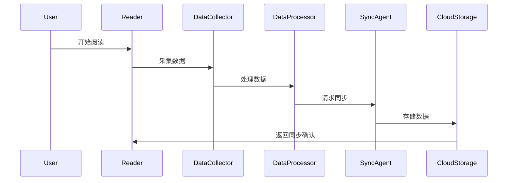

                 


# AI Agent在智能书签中的阅读进度同步

## 关键词：AI Agent, 智能书签, 阅读进度同步, 同步机制, 机器学习

## 摘要：AI Agent在智能书签中的阅读进度同步是一种结合人工智能与计算机技术的应用，旨在实现用户在不同设备或场景下的阅读进度无缝衔接。本文将从背景、原理、算法、系统架构、项目实战和最佳实践等多个方面详细探讨这一技术，帮助读者全面理解其实现与应用。

---

# 第1章: AI Agent与智能书签的背景介绍

## 1.1 AI Agent的基本概念
### 1.1.1 AI Agent的定义
AI Agent（人工智能代理）是一种能够感知环境、自主决策并执行任务的智能实体。它结合了机器学习、自然语言处理和推理能力，能够在复杂环境中完成特定目标。

### 1.1.2 AI Agent的核心特点
- **自主性**：能够在没有人工干预的情况下独立运行。
- **反应性**：能够根据环境反馈实时调整行为。
- **学习能力**：通过数据和经验不断优化性能。

### 1.1.3 AI Agent与传统软件代理的区别
| 特性 | AI Agent | 传统软件代理 |
|------|----------|--------------|
| 决策方式 | 基于机器学习 | 基于预设规则 |
| 自适应性 | 高 | 低 |
| 复杂性 | 高 | 较低 |

## 1.2 智能书签的发展现状
### 1.2.1 传统书签的局限性
传统书签仅能记录位置，无法同步多设备或提供个性化推荐。

### 1.2.2 智能书签的概念与优势
智能书签通过AI技术，能够记录阅读进度、推荐相关内容，并在多设备间同步。

### 1.2.3 智能书签的应用场景
- **多设备阅读**：在手机、平板、电脑间同步阅读进度。
- **个性化推荐**：基于阅读习惯推荐相关内容。
- **学习辅助**：帮助学习者跟踪学习进度。

## 1.3 阅读进度同步的问题背景
### 1.3.1 阅读进度同步的需求分析
用户希望在不同设备间无缝同步阅读进度，提升阅读体验。

### 1.3.2 当前阅读进度同步的痛点
- **数据孤岛**：不同平台间数据无法互通。
- **同步延迟**：传统同步机制效率低下。
- **个性化不足**：缺乏基于用户行为的智能同步。

### 1.3.3 AI Agent在阅读进度同步中的作用
AI Agent能够实时感知用户的阅读行为，智能调整同步策略，提升用户体验。

## 1.4 问题描述与解决思路
### 1.4.1 阅读进度同步的核心问题
如何实现跨设备、实时、智能的阅读进度同步。

### 1.4.2 AI Agent如何解决阅读进度同步问题
通过AI算法优化同步策略，实时调整同步频率和内容。

### 1.4.3 解决方案的边界与外延
- **边界**：仅限于阅读进度的同步，不涉及内容生成。
- **外延**：可扩展到其他类型数据的同步。

## 1.5 核心概念与联系
### 1.5.1 AI Agent与智能书签的关系
AI Agent作为智能书签的核心组件，负责处理数据同步和智能推荐。

### 1.5.2 阅读进度同步的实现机制
- **数据采集**：AI Agent实时采集用户的阅读行为数据。
- **数据处理**：对数据进行分析和压缩，减少传输数据量。
- **数据同步**：通过网络将数据同步到云端或目标设备。

### 1.5.3 核心概念的ER实体关系图
```mermaid
er
    actor: 用户
    book: 书籍
    bookmark: 书签
    progress: 阅读进度
    AI-Agent: AI代理
    actor --> bookmark: 创建书签
    bookmark --> progress: 记录进度
    AI-Agent --> progress: 同步进度
```

---

# 第2章: AI Agent的核心概念与原理

## 2.1 AI Agent的原理
### 2.1.1 AI Agent的感知模块
感知模块负责采集用户的阅读行为数据，如阅读时间、位置、速度等。

### 2.1.2 AI Agent的决策模块
基于感知数据，AI Agent通过机器学习算法（如决策树、强化学习）制定同步策略。

### 2.1.3 AI Agent的执行模块
根据决策结果，AI Agent执行同步操作，确保阅读进度实时更新。

## 2.2 AI Agent的同步机制
### 2.2.1 基于规则的同步
通过预设规则（如每隔10分钟同步一次）进行数据同步。

### 2.2.2 基于机器学习的同步
利用机器学习模型预测最优同步时间，减少延迟和资源消耗。

### 2.2.3 基于反馈的自适应同步
根据用户的反馈调整同步策略，提升用户体验。

## 2.3 同步机制的对比分析
| 机制 | 优点 | 缺点 |
|------|------|------|
| 基于规则 | 实现简单 | 无法适应复杂场景 |
| 基于机器学习 | 高效智能 | 实现复杂 |
| 基于反馈 | 用户体验好 | 需要大量反馈数据 |

## 2.4 同步机制的数学模型
同步策略的优化目标是最小化同步延迟，同时减少资源消耗。数学模型如下：

$$
\text{目标函数} = \min_{\theta} \left( \text{延迟} + \lambda \times \text{资源消耗} \right)
$$

其中，$\lambda$是调节参数，用于平衡延迟和资源消耗。

---

# 第3章: 系统分析与架构设计

## 3.1 系统功能设计
- **用户界面**：显示阅读进度、推荐内容。
- **数据采集**：采集用户的阅读行为。
- **数据处理**：压缩和加密数据。
- **同步模块**：实现数据同步。

## 3.2 系统架构设计
```mermaid
graph TD
    User --> Reader: 用户阅读行为
    Reader --> DataCollector: 数据采集
    DataCollector --> DataProcessor: 数据处理
    DataProcessor --> SyncAgent: 同步代理
    SyncAgent --> CloudStorage: 云端存储
    CloudStorage --> Reader: 数据同步
```

## 3.3 系统接口设计
- **数据采集接口**：`POST /api/reader/data`
- **数据处理接口**：`POST /api/processor/data`
- **同步接口**：`POST /api/sync`

## 3.4 系统交互流程图


---

# 第4章: 项目实战

## 4.1 环境安装
安装Python、AI框架（如TensorFlow）和相关库。

## 4.2 核心代码实现
```python
class SyncAgent:
    def __init__(self):
        self.cloud_storage = CloudStorage()
    
    def sync_progress(self, progress_data):
        # 压缩数据
        compressed_data = compress(progress_data)
        # 上传云端
        self.cloud_storage.upload(compressed_data)
        return "同步成功"
```

## 4.3 代码解读与分析
- **压缩数据**：减少传输数据量。
- **上传云端**：确保数据安全存储。

## 4.4 实际案例分析
通过案例分析，展示AI Agent如何优化同步策略。

## 4.5 项目小结
总结项目实现的关键点和经验教训。

---

# 第5章: 最佳实践与小结

## 5.1 小结
AI Agent在智能书签中的应用提升了阅读体验，但仍需进一步优化同步效率。

## 5.2 注意事项
- 确保数据安全。
- 优化算法性能。

## 5.3 拓展阅读
推荐相关技术书籍和论文，供读者深入研究。

---

# 作者：AI天才研究院/AI Genius Institute & 禅与计算机程序设计艺术 /Zen And The Art of Computer Programming

