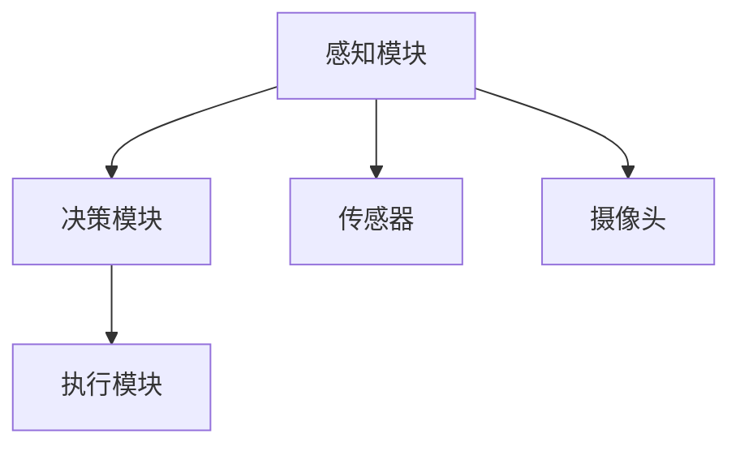

                 


# AI Agent在智能交通事故预防中的实践

## 关键词
AI Agent, 智能交通, 交通事故预防, 强化学习, 深度学习

## 摘要
AI Agent在智能交通事故预防中的应用日益重要，通过感知、决策和执行模块的协同工作，结合强化学习和深度学习等技术，能够有效减少交通事故的发生。本文详细探讨了AI Agent的核心概念、技术原理、系统架构设计以及实际项目案例，为智能交通系统的开发提供了理论支持和实践指导。

---

## 第1章：智能交通事故预防的背景与问题

### 1.1 交通事故的现状与挑战

#### 1.1.1 交通事故的全球现状
根据世界卫生组织的数据，每年约有135万人因交通事故死亡，超过5000万人受伤。交通事故不仅造成人员伤亡，还带来了巨大的经济损失。

#### 1.1.2 智能交通系统的发展趋势
随着城市化进程的加快，交通拥堵和事故频发成为全球性问题。智能交通系统（ITS）通过整合传感器、摄像头和AI技术，优化交通流量，减少事故发生率。

#### 1.1.3 AI Agent在交通领域的应用前景
AI Agent作为智能交通系统的核心组件，能够实时感知环境、做出决策并执行操作，显著提升交通事故预防能力。

### 1.2 问题背景与描述

#### 1.2.1 交通事故的主要原因
人为错误（如超速、酒驾）和环境因素（如恶劣天气）是交通事故的主要原因。AI Agent可以通过预测和干预减少这些因素的影响。

#### 1.2.2 智能交通管理的需求
传统交通管理系统依赖人工监控，效率低下。AI Agent能够实时处理大量数据，提供高效的管理解决方案。

#### 1.2.3 AI Agent在预防中的角色
AI Agent通过实时数据分析和决策，帮助驾驶员避免危险情况，优化交通流量，减少事故发生。

---

## 第2章：AI Agent的核心概念与技术

### 2.1 AI Agent的基本定义

#### 2.1.1 AI Agent的定义
AI Agent是一种智能实体，能够感知环境、自主决策并执行任务。在交通领域，AI Agent通常用于辅助驾驶或交通管理。

#### 2.1.2 AI Agent的分类
1. **自动驾驶AI Agent**：用于自动驾驶汽车，如特斯拉的Autopilot系统。
2. **交通管理系统AI Agent**：用于城市交通监控和优化，如智能信号灯控制系统。

#### 2.1.3 AI Agent与传统算法的区别
AI Agent具有自主性、反应性和目标导向性，能够适应动态变化的环境，而传统算法通常处理静态数据。

### 2.2 AI Agent在交通事故预防中的应用

#### 2.2.1 感知模块
AI Agent通过传感器和摄像头收集环境数据，如车道标志、车辆位置和交通信号灯状态。

#### 2.2.2 决策模块
基于感知数据，AI Agent使用算法做出驾驶决策，如变道、加速或减速。

#### 2.2.3 执行模块
根据决策结果，AI Agent控制车辆执行操作，如转向或刹车。

### 2.3 相关技术与工具

#### 2.3.1 机器学习
机器学习算法用于训练AI Agent识别模式和预测结果，如使用决策树和随机森林进行分类。

#### 2.3.2 深度学习
深度学习技术用于处理复杂的视觉数据，如使用卷积神经网络（CNN）进行目标检测。

#### 2.3.3 自然语言处理
自然语言处理用于分析交通相关的文本数据，如交通报告和指令。

---

## 第3章：AI Agent的感知与决策算法

### 3.1 感知算法

#### 3.1.1 目标检测
目标检测算法（如YOLO）用于识别道路上的车辆、行人和障碍物。

#### 3.1.2 语义分割
语义分割算法（如U-Net）用于将图像划分为不同语义部分，帮助AI Agent理解场景细节。

#### 3.1.3 传感器数据融合
将来自激光雷达、摄像头和雷达的数据进行融合，提高感知准确性。

### 3.2 决策算法

#### 3.2.1 强化学习
强化学习（如Q-Learning）用于训练AI Agent在动态环境中做出最优决策。

#### 3.2.2 状态转移模型
状态转移模型（如马尔可夫决策过程）用于预测不同状态下的行为后果。

#### 3.2.3 多目标优化
多目标优化算法（如遗传算法）用于在多个目标之间找到平衡，如同时考虑安全性和效率。

---

## 第4章：算法实现与优化

### 4.1 算法实现

#### 4.1.1 感知算法的实现
使用深度学习框架（如TensorFlow）实现目标检测和语义分割模型。

#### 4.1.2 决策算法的实现
通过强化学习框架（如OpenAI Gym）训练AI Agent的决策模型。

### 4.2 算法优化

#### 4.2.1 参数优化
使用超参数搜索（如随机搜索）优化模型性能。

#### 4.2.2 模型压缩
通过剪枝和量化技术减少模型大小，提高运行效率。

#### 4.2.3 并行计算
利用多线程和分布式计算加速算法训练和推理。

---

## 第5章：系统架构设计

### 5.1 系统模块划分

#### 5.1.1 感知模块
负责收集和处理环境数据，如摄像头和雷达数据。

#### 5.1.2 决策模块
基于感知数据生成驾驶决策，如转向和加速指令。

#### 5.1.3 执行模块
根据决策控制车辆执行操作，如方向盘转向和刹车。

### 5.2 系统架构图


---

## 第6章：系统接口与数据流设计

### 6.1 系统接口设计

#### 6.1.1 感知接口
定义传感器和摄像头的数据接口标准，如CAN总线协议。

#### 6.1.2 决策接口
定义决策模块与执行模块的通信接口，如ROS节点通信。

#### 6.1.3 执行接口
定义执行模块对车辆控制的接口，如CAN命令。

### 6.2 数据流设计

#### 6.2.1 数据输入流
从传感器和摄像头接收实时数据。

#### 6.2.2 数据处理流
在决策模块中处理数据并生成决策指令。

#### 6.2.3 数据输出流
将决策指令发送给执行模块，控制车辆操作。

---

## 第7章：项目实战与案例分析

### 7.1 项目环境搭建

#### 7.1.1 开发环境安装
安装Python、TensorFlow和ROS等开发工具。

#### 7.1.2 依赖库安装
安装OpenCV、NumPy和Pandas等常用库。

#### 7.1.3 数据集准备
收集和标注交通事故相关数据集，如KITTI数据集。

### 7.2 核心代码实现

#### 7.2.1 感知模块代码
使用YOLO算法实现目标检测：
```python
import tensorflow as tf
from tensorflow.keras import layers

model = tf.keras.Sequential([
    layers.Conv2D(32, (3,3), activation='relu', input_shape=(416, 416, 3)),
    layers.MaxPooling2D((2,2)),
    layers.Conv2D(64, (3,3), activation='relu'),
    layers.MaxPooling2D((2,2)),
    layers.Flatten(),
    layers.Dense(128, activation='relu'),
    layers.Dense(1, activation='sigmoid')
])
model.compile(optimizer='adam', loss='binary_crossentropy', metrics=['accuracy'])
model.fit(X_train, y_train, epochs=10, batch_size=32)
```

#### 7.2.2 决策模块代码
使用强化学习训练决策模型：
```python
import gym
env = gym.make('CartPole-v0')
env.seed(42)

from tensorflow.keras import layers
model = tf.keras.Sequential([
    layers.Dense(64, activation='relu', input_shape=(4,)),
    layers.Dense(1, activation='sigmoid')
])

optimizer = tf.keras.optimizers.Adam(learning_rate=0.001)
loss_fn = tf.keras.losses.binary_crossentropy

@tf.function
def train_step(states, actions, rewards):
    with tf.GradientTape() as tape:
        logits = model(states)
        loss = loss_fn(actions, logits)
    grads = tape.gradient(loss, model.trainable_weights)
    optimizer.apply_gradients(zip(grads, model.trainable_weights))
    return loss

for _ in range(1000):
    state = env.reset()
    while True:
        state = state.reshape((1, -1))
        action = model.predict(state)[0][0]
        next_state, reward, done, _ = env.step(action)
        train_step(state, [[action]], [reward])
        if done:
            break
```

### 7.3 案例分析与解读

#### 7.3.1 案例场景
分析AI Agent在雨天条件下预防交通事故的案例。

#### 7.3.2 案例分析
AI Agent通过感知雨天能见度较低，调整决策策略，降低车速并保持安全距离。

#### 7.3.3 代码应用解读
解释感知和决策模块在案例中的具体应用，如目标检测算法识别行人，决策算法调整驾驶策略。

---

## 第8章：系统优化与扩展

### 8.1 系统优化策略

#### 8.1.1 算法优化
通过模型压缩和并行计算提高算法效率。

#### 8.1.2 系统架构优化
采用分布式架构提升系统处理能力。

### 8.2 功能扩展

#### 8.2.1 多车协同
实现多辆AI Agent车辆协同工作，优化整体交通流量。

#### 8.2.2 人机交互
增强驾驶员与AI Agent的交互体验，如语音指令和手势控制。

---

## 第9章：总结与展望

### 9.1 小结
AI Agent通过感知、决策和执行模块的协同工作，显著提升了交通事故预防能力。

### 9.2 注意事项
在实际应用中，需考虑算法的实时性和系统的可靠性，确保安全性和稳定性。

### 9.3 未来研究方向
进一步研究AI Agent的多模态感知和人机协作，推动智能交通系统的普及和发展。

---

## 作者
作者：AI天才研究院/AI Genius Institute  
联系邮箱：contact@aigeniusinstitute.com  
官方网站：https://www.aigeniusinstitute.com  

---

以上为完整的技术博客文章结构和内容，涵盖了AI Agent在智能交通事故预防中的各个方面，从概念到实践，再到优化与扩展，为读者提供了全面的知识和实用的指导。

