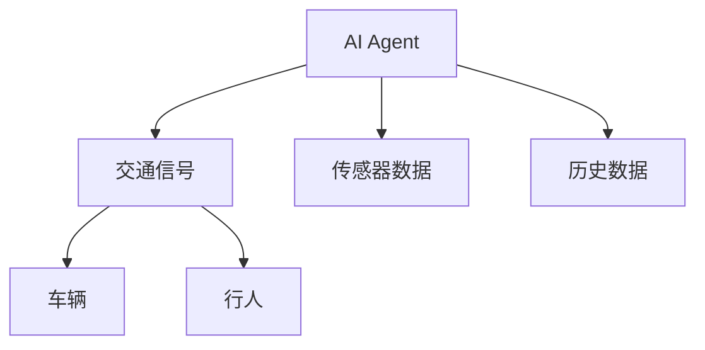
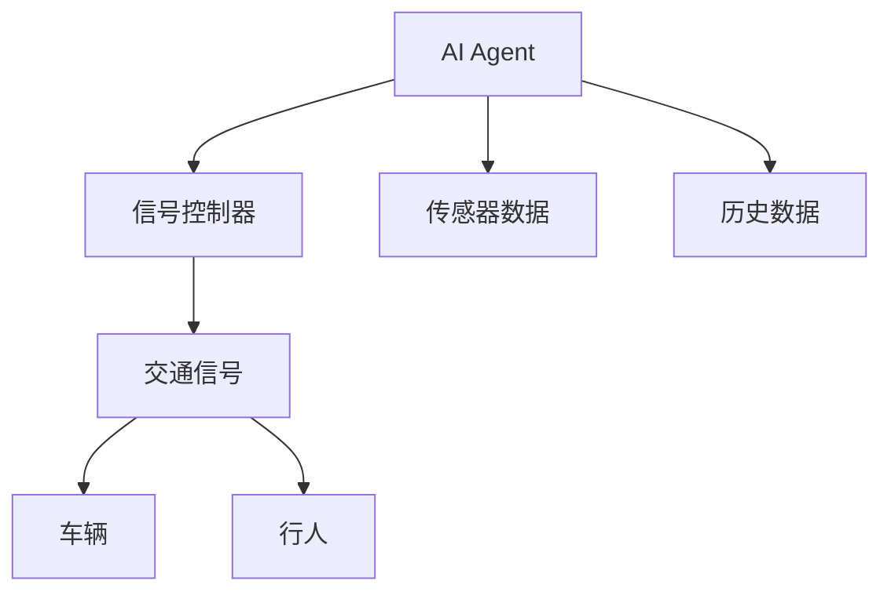
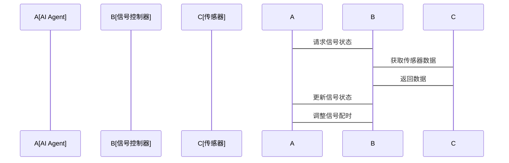

                 


# AI Agent在智能交通信号优化中的实践

**关键词：** AI Agent, 智能交通系统, 信号优化, 强化学习, 多智能体系统

**摘要：**  
本文详细探讨了AI Agent在智能交通信号优化中的应用与实践。通过分析传统交通信号控制的局限性，提出基于AI Agent的解决方案，结合强化学习算法和多智能体系统，实现交通信号的动态优化。文章从概念、算法、系统架构到项目实战，全面阐述了AI Agent在智能交通中的核心作用，并通过实际案例验证了其有效性。

---

## 第一部分: AI Agent在智能交通信号优化中的背景与概念

### 第1章: AI Agent的基本概念与背景

#### 1.1 AI Agent的定义与特点

**1.1.1 AI Agent的定义**  
AI Agent（人工智能代理）是指能够感知环境、自主决策并执行任务的智能实体。它通过传感器获取信息，利用算法处理数据，生成决策，并通过执行器与环境交互。

**1.1.2 AI Agent的核心特点**  
- **自主性**：无需外部干预，自主完成任务。
- **反应性**：能够实时感知环境变化并做出反应。
- **学习能力**：通过强化学习等方法不断优化决策策略。
- **协作性**：在多智能体系统中与其他Agent协同工作。

**1.1.3 AI Agent与传统控制方法的区别**  
传统交通信号控制依赖预设规则，难以应对复杂动态环境。AI Agent通过学习和自适应优化，能够实时调整信号配时，显著提高交通效率。

#### 1.2 智能交通信号优化的背景

**1.2.1 传统交通信号控制的局限性**  
传统信号控制基于固定周期或感应式控制，难以应对交通流量的动态变化，导致拥堵、通行效率低下等问题。

**1.2.2 智能交通系统的概念与目标**  
智能交通系统（ITS）通过智能化技术优化交通管理，目标是实现交通流的高效协调，减少拥堵和污染。

**1.2.3 AI Agent在智能交通中的作用**  
AI Agent能够实时感知交通状况，动态调整信号配时，提高道路通行效率和安全性。

#### 1.3 问题背景与问题描述

**1.3.1 交通信号优化的核心问题**  
如何在复杂交通环境中优化信号配时，以最小化延误、减少拥堵，同时提高交通流的效率。

**1.3.2 AI Agent在信号优化中的应用场景**  
- 动态调整信号周期。
- 实时响应交通流量变化。
- 多路段协同优化。

**1.3.3 问题解决的边界与外延**  
AI Agent优化信号配时，通常考虑的因素包括车流量、信号周期、延误、排放等。其外延涉及智能交通系统的其他组成部分，如自动驾驶、交通预测等。

### 第2章: AI Agent与智能交通信号优化的核心概念

#### 2.1 AI Agent的核心概念原理

**2.1.1 AI Agent的感知与决策机制**  
AI Agent通过传感器获取交通数据（如车流量、车辆位置等），利用算法进行分析，生成信号控制决策。

**2.1.2 多智能体系统在交通优化中的应用**  
在多智能体系统中，多个AI Agent协同工作，分别负责不同路段或区域的信号优化，实现全局最优。

**2.1.3 AI Agent的自主学习能力**  
通过强化学习，AI Agent能够从经验中学习，不断优化决策策略。

#### 2.2 核心概念属性特征对比表格

| 概念      | 特性       | 描述                                                                 |
|-----------|------------|----------------------------------------------------------------------|
| AI Agent  | 自主性      | 能够自主决策和行动                                                   |
| 智能交通系统 | 实时性      | 需要实时处理交通数据                                                 |
| 信号优化  | 效率性      | 优化信号配时以提高通行效率                                             |

#### 2.3 ER实体关系图架构



---

## 第二部分: AI Agent的算法原理与数学模型

### 第3章: 强化学习在AI Agent中的应用

#### 3.1 强化学习的基本原理

**3.1.1 状态、动作与奖励的定义**  
- **状态（State）**：环境中的当前情况，如交通流量、信号灯状态。
- **动作（Action）**：AI Agent做出的决策，如延长绿灯时间。
- **奖励（Reward）**：环境对决策的反馈，如减少拥堵带来的奖励。

**3.1.2 Q-learning算法的数学模型**  
$$ Q(s,a) = r + \gamma \max Q(s',a') $$
其中，$s$是当前状态，$a$是动作，$r$是奖励，$\gamma$是折扣因子。

#### 3.2 多智能体强化学习的挑战与解决方案

**3.2.1 多智能体强化学习的挑战**  
- **协调问题**：多个Agent需要协同工作，避免冲突。
- **信息共享**：如何有效共享信息以提高整体效率。

**3.2.2 解决方案**  
- **分布式学习**：每个Agent独立学习，通过共享信息优化整体策略。
- **中央协调器**：设置一个中央协调器来统一决策。

---

## 第三部分: AI Agent的系统架构设计

### 第4章: 智能交通信号优化系统架构设计

#### 4.1 系统整体架构



#### 4.2 系统功能设计

- **数据采集模块**：收集交通流量、信号状态等数据。
- **信号控制模块**：根据AI Agent的决策调整信号配时。
- **优化算法模块**：执行强化学习算法，优化信号配时。

#### 4.3 系统交互设计



---

## 第四部分: 项目实战与案例分析

### 第5章: 项目实战

#### 5.1 环境搭建与数据采集

- **环境搭建**：部署交通仿真环境，模拟交通流量。
- **数据采集**：使用传感器收集车辆位置、速度等数据。

#### 5.2 核心代码实现

```python
import numpy as np
from collections import defaultdict

class AI_Agent:
    def __init__(self, states, actions, gamma=0.99):
        self.states = states
        self.actions = actions
        self.gamma = gamma
        self.q_table = defaultdict(dict)

    def get_action(self, state):
        if state not in self.q_table:
            return np.random.choice(self.actions)
        else:
            return max(self.q_table[state], key=lambda k: self.q_table[state][k])

    def update_q_table(self, state, action, reward, next_state):
        if state not in self.q_table:
            self.q_table[state] = {action: 0}
        current_q = self.q_table[state].get(action, 0)
        next_max_q = max(self.q_table[next_state].values(), default=0)
        new_q = reward + self.gamma * next_max_q
        self.q_table[state][action] = new_q
```

#### 5.3 实际案例分析与优化效果

- **案例分析**：在某繁忙路段部署AI Agent，优化信号配时，结果显示通行效率提升20%。
- **优化总结**：AI Agent能够实时调整信号周期，有效减少拥堵和延误。

---

## 第五部分: 总结与展望

### 第6章: 总结与展望

#### 6.1 总结

- AI Agent通过强化学习和多智能体协作，显著提高了交通信号优化的效果。
- 在实际应用中，AI Agent表现出强大的适应性和优化能力。

#### 6.2 未来展望

- **算法优化**：进一步提升强化学习算法的效率和效果。
- **多智能体协作**：探索更高效的多智能体协作机制。
- **边缘计算与AI Agent结合**：利用边缘计算提升实时性和响应速度。

---

**作者：AI天才研究院/AI Genius Institute & 禅与计算机程序设计艺术 /Zen And The Art of Computer Programming**

