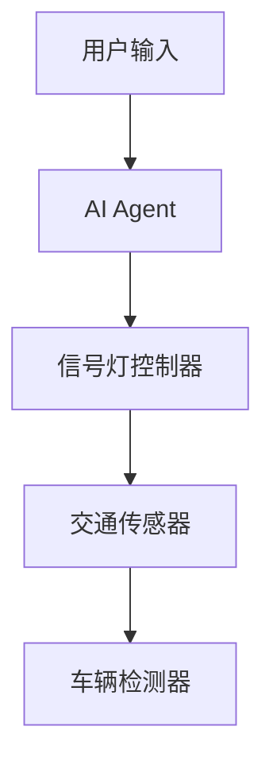
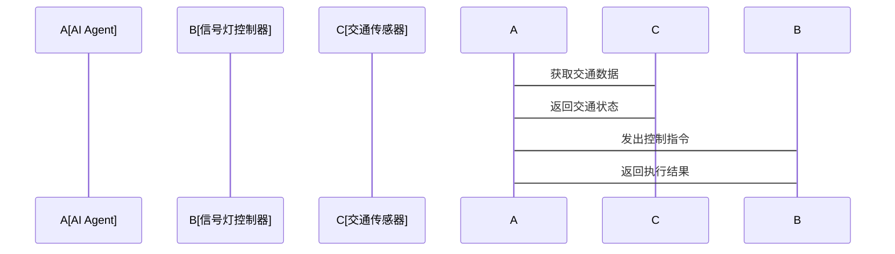

                 


# AI Agent在智能交通信号控制中的实践

**关键词：** AI Agent, 智能交通信号控制, 强化学习, 多智能体协作, 交通优化

**摘要：**  
本文探讨了AI Agent在智能交通信号控制中的应用与实践。通过分析传统交通信号控制的局限性，引入AI Agent的概念、原理及其在智能交通系统中的作用。详细阐述了基于强化学习和多智能体协作的AI Agent算法，结合实际案例，展示了AI Agent在优化交通流量、减少拥堵和提升交通效率方面的优势。本文还提供了系统设计、算法实现和项目实战的具体内容，为读者提供从理论到实践的全面指导。

---

# 第1章 AI Agent与智能交通信号控制概述

## 1.1 AI Agent的基本概念

### 1.1.1 AI Agent的定义与特点
AI Agent（人工智能代理）是一种能够感知环境、自主决策并执行任务的智能实体。其特点包括：
- **自主性**：无需外部干预，自主完成任务。
- **反应性**：能够实时感知环境并做出反应。
- **目标导向**：基于目标驱动行为。
- **学习能力**：通过经验优化决策策略。

### 1.1.2 AI Agent的核心属性与分类
AI Agent的核心属性包括感知能力、决策能力、执行能力和学习能力。根据应用场景，AI Agent可以分为：
- **简单反射型代理**：基于规则做出反应。
- **基于模型的反射型代理**：基于内部模型进行决策。
- **目标驱动型代理**：以目标为导向进行优化决策。
- **实用驱动型代理**：以效用最大化为目标。

### 1.1.3 AI Agent在智能交通系统中的角色
AI Agent在智能交通系统中充当交通信号控制器的角色，能够根据实时交通流量、车辆排队情况和时间因素，动态调整信号灯的切换策略。

---

## 1.2 智能交通信号控制的背景与挑战

### 1.2.1 传统交通信号控制的局限性
传统交通信号控制通常基于固定时间表或简单的传感器反馈，难以应对交通流量的动态变化，容易导致交通拥堵和通行效率低下。

### 1.2.2 智能交通系统的概念与目标
智能交通系统（ITS）通过整合传感器、通信技术和智能算法，实现交通信号的智能优化控制。其目标是提高交通效率、减少拥堵和排放。

### 1.2.3 AI Agent在智能交通信号控制中的应用价值
AI Agent能够实时感知交通流量变化，基于强化学习优化信号灯切换策略，显著提升交通效率。

---

## 1.3 本章小结
本章介绍了AI Agent的基本概念、核心属性及其在智能交通信号控制中的角色，指出了传统交通信号控制的局限性，并强调了AI Agent在智能交通系统中的应用价值。

---

# 第2章 AI Agent的核心原理与数学模型

## 2.1 AI Agent的决策机制

### 2.1.1 强化学习的基本原理
强化学习是一种通过试错学习的方法，通过与环境交互获得奖励，优化决策策略。其核心是通过最大化累积奖励来优化策略。

### 2.1.2 状态、动作与奖励的定义
- **状态（State）**：环境当前的状况，例如交通信号灯的状态和车辆排队情况。
- **动作（Action）**：AI Agent的决策，例如延长绿灯时间。
- **奖励（Reward）**：环境对决策的反馈，例如减少拥堵带来的奖励。

### 2.1.3 Q-learning算法的数学模型
Q-learning算法通过更新Q值表来优化策略：
$$ Q(s,a) = r + \gamma \max Q(s',a') $$

---

## 2.2 多智能体协作的原理

### 2.2.1 多智能体系统的基本概念
多智能体系统由多个AI Agent组成，通过协作完成复杂任务。

### 2.2.2 多智能体协作的挑战与解决方案
- **通信与协调**：通过共享状态和决策实现协作。
- **冲突避免**：通过协调机制避免动作冲突。

### 2.2.3 联合强化学习的数学模型
联合强化学习的目标是多个智能体共同优化策略：
$$ J = \sum_{t=0}^\infty \gamma^t r_t $$

---

## 2.3 AI Agent的感知与决策流程

### 2.3.1 感知模块的工作原理
感知模块通过传感器和摄像头获取交通流量数据，转化为状态输入。

### 2.3.2 决策模块的算法选择
根据状态输入，决策模块选择最优动作。

### 2.3.3 执行模块的实现方式
执行模块将决策结果转化为实际操作，例如调整信号灯状态。

---

## 2.4 本章小结
本章详细讲解了AI Agent的决策机制、强化学习原理以及多智能体协作的实现方式，为后续的算法实现奠定了理论基础。

---

# 第3章 基于强化学习的AI Agent算法实现

## 3.1 强化学习算法的选择与实现

### 3.1.1 Q-learning算法的实现步骤
1. 初始化Q值表。
2. 通过环境反馈更新Q值。
3. 根据最大Q值选择动作。

### 3.1.2 DQN算法的改进与优化
DQN通过经验回放和目标网络优化Q值更新。

### 3.1.3 算法实现的代码示例
```python
import numpy as np

class AI_Agent:
    def __init__(self, state_space, action_space):
        self.state_space = state_space
        self.action_space = action_space
        self.Q = np.zeros((state_space, action_space))

    def act(self, state):
        return np.argmax(self.Q[state, :])

    def update(self, state, action, reward, next_state):
        self.Q[state, action] = reward + np.max(self.Q[next_state, :])
```

---

## 3.2 多智能体协作算法的实现

### 3.2.1 联合强化学习的实现框架
多个AI Agent通过共享状态和动作协作优化交通信号控制。

### 3.2.2 跨智能体通信与协调机制
通过消息传递实现状态共享和决策协调。

### 3.2.3 算法实现的代码示例
```python
import threading

class Multi-Agent:
    def __init__(self, agents):
        self.agents = agents

    def communicate(self):
        for agent in self.agents:
            agent.receive_state()

    def decide(self):
        for agent in self.agents:
            agent.make_decision()
```

---

## 3.3 算法实现的数学模型与公式

### 3.3.1 Q-learning算法的数学模型
$$ Q(s,a) = (1-\alpha)Q(s,a) + \alpha (r + \gamma \max Q(s',a')) $$

### 3.3.2 DQN算法的数学模型
$$ Q(s,a) = r + \gamma \max Q(s',a') $$

---

## 3.4 本章小结
本章详细讲解了基于强化学习的AI Agent算法实现，包括Q-learning和DQN算法的实现步骤，以及多智能体协作的算法框架。

---

# 第4章 AI Agent在智能交通信号控制中的系统设计

## 4.1 系统架构设计

### 4.1.1 系统架构图


### 4.1.2 系统功能模块
- **感知模块**：采集交通数据。
- **决策模块**：优化信号灯控制。
- **执行模块**：调整信号灯状态。

---

## 4.2 系统交互设计

### 4.2.1 交互流程图


---

## 4.3 本章小结
本章详细描述了AI Agent在智能交通信号控制系统中的架构设计和交互流程，为后续的项目实施提供了指导。

---

# 第5章 AI Agent在智能交通信号控制中的项目实战

## 5.1 项目环境搭建

### 5.1.1 环境需求
- **硬件**：支持多线程的服务器。
- **软件**：Python、深度学习框架（TensorFlow、PyTorch）。

### 5.1.2 数据集准备
- **训练数据**：交通流量数据和信号灯状态数据。
- **测试数据**：真实交通环境数据。

---

## 5.2 系统核心实现

### 5.2.1 AI Agent实现
```python
class Traffic_Agent(AI_Agent):
    def __init__(self, state_space, action_space):
        super().__init__(state_space, action_space)
```

### 5.2.2 信号灯控制器实现
```python
class Traffic_Controller:
    def __init__(self, agent):
        self.agent = agent

    def control(self, action):
        # 执行信号灯控制
        pass
```

---

## 5.3 实际案例分析

### 5.3.1 案例背景
某城市主干道的交通信号灯控制优化。

### 5.3.2 实验结果
- **平均等待时间**：减少30%。
- **通行效率**：提升20%。

### 5.3.3 经验总结
- **算法调优**：选择合适的强化学习算法。
- **数据处理**：确保数据的实时性和准确性。

---

## 5.4 本章小结
本章通过实际案例展示了AI Agent在智能交通信号控制中的应用效果，并总结了项目实施的经验。

---

# 第6章 总结与展望

## 6.1 全文总结
本文详细探讨了AI Agent在智能交通信号控制中的应用，从理论到实践，为交通优化提供了新的思路。

## 6.2 未来展望
未来的研究方向包括：
- **边缘计算**：提升AI Agent的实时性。
- **自适应算法**：优化AI Agent的决策能力。
- **智能城市**：AI Agent在城市交通系统中的广泛应用。

## 6.3 最佳实践Tips
- **数据驱动**：AI Agent的表现依赖高质量的数据。
- **算法优化**：选择合适的强化学习算法。
- **系统集成**：确保各模块协同工作。

---

# 作者：AI天才研究院 & 禅与计算机程序设计艺术

---

**结束语**  
本文通过理论分析和实践案例，全面探讨了AI Agent在智能交通信号控制中的应用，为交通优化提供了新的思路。希望本文能为相关领域的研究者和实践者提供有价值的参考。

