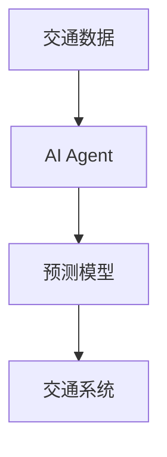
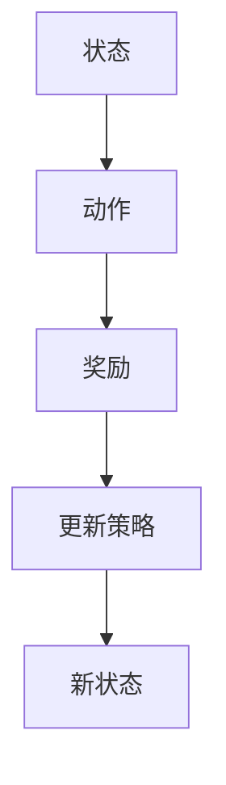
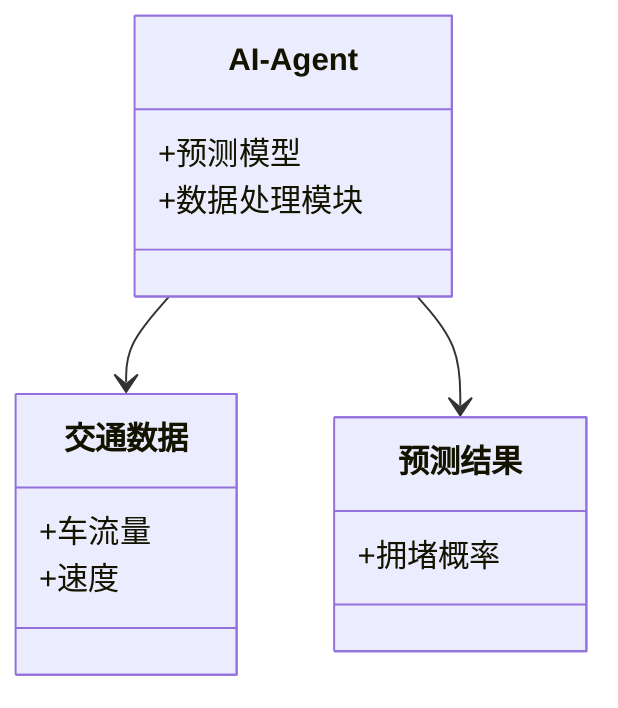
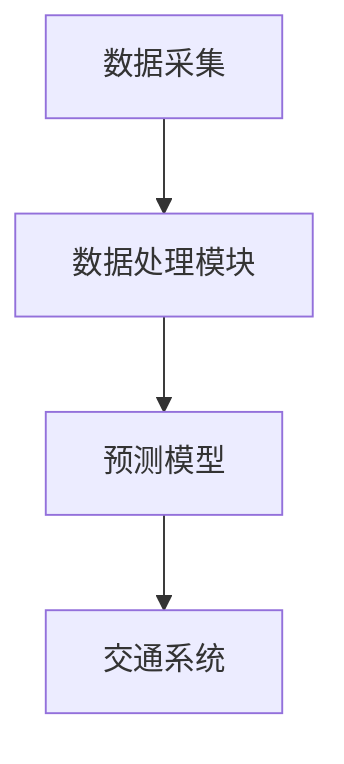

                 


# AI Agent在智能交通拥堵预测中的实践

**关键词**：AI Agent, 交通拥堵预测, 强化学习, 智能交通系统, 数据流分析

**摘要**：本文探讨了AI Agent在智能交通拥堵预测中的应用，从背景介绍到算法原理，再到系统设计与项目实战，详细分析了AI Agent如何通过强化学习和数据分析优化交通预测，解决城市交通拥堵问题，提升交通效率。

---

# 第一部分: AI Agent与智能交通拥堵预测的背景介绍

## 第1章: AI Agent的基本概念与特点

### 1.1 AI Agent的定义

人工智能代理（AI Agent）是指具备感知环境、自主决策并执行任务的智能实体。AI Agent能够通过传感器获取信息，利用算法处理数据，并根据结果采取行动。例如，在交通系统中，AI Agent可以实时收集交通数据，分析拥堵情况，并建议最优路线。

### 1.2 AI Agent的核心特点

1. **自主性**：AI Agent能够自主决策，无需人工干预。
2. **反应性**：能实时感知环境变化并做出响应。
3. **学习能力**：通过数据和经验不断优化决策模型。
4. **协作性**：能与其他AI Agent或系统协同工作。

### 1.3 AI Agent与传统AI的区别

传统AI主要依赖预设规则和模式识别，而AI Agent具备更强的自主性和适应性，能根据环境变化动态调整策略。例如，传统的交通信号灯系统是固定的，而AI Agent可以根据实时交通流量调整信号灯时长。

---

## 第2章: 智能交通系统概述

### 2.1 智能交通系统的定义

智能交通系统（ITS）是利用先进的信息技术、数据通信、传感器和电子设备，提高交通系统的效率和安全性的综合系统。ITS涵盖交通管理、信息传递、车辆控制等多个方面。

### 2.2 智能交通系统的组成部分

1. **交通数据采集**：包括摄像头、传感器、GPS等设备，实时收集交通流量、速度、密度等数据。
2. **数据处理与分析**：利用大数据技术对交通数据进行清洗、整合和分析。
3. **预测与决策**：基于分析结果，预测交通拥堵情况并制定优化方案。
4. **信息发布与执行**：通过各种渠道发布交通信息，并执行决策，如调整信号灯或建议绕行路线。

### 2.3 交通拥堵预测的挑战与意义

交通拥堵预测的挑战包括数据质量、模型复杂性和实时性。意义在于提高交通效率，减少排放，改善城市生活质量。

---

## 第3章: AI Agent在交通拥堵预测中的应用

### 3.1 交通拥堵预测的背景与问题

随着城市化进程加快，交通拥堵问题日益严重，传统方法难以应对复杂多变的交通状况。

### 3.2 AI Agent在交通预测中的优势

AI Agent具备实时感知、自主决策和学习能力，能够有效应对交通拥堵的动态变化。

### 3.3 交通拥堵预测的边界与外延

明确预测的范围和限制，例如只考虑主要干道，不包括次要道路。

---

# 第二部分: 核心概念与联系

## 第4章: AI Agent与交通数据的关系

### 4.1 交通数据的分类与特征

1. **流量数据**：包括车流量、速度、密度等。
2. **事件数据**：如事故、施工等影响交通的情况。

### 4.2 AI Agent与交通数据的交互机制

AI Agent通过传感器获取数据，利用算法处理后，输出预测结果。

### 4.3 数据流与模型训练的关系

数据流经过预处理、特征提取后，用于训练预测模型。

---

## 第5章: AI Agent与交通拥堵预测的实体关系

### 5.1 实体关系图（ER图）展示



---

# 第三部分: 算法原理讲解

## 第6章: 基于强化学习的拥堵预测算法

### 6.1 强化学习的基本原理

强化学习通过智能体与环境的交互，学习最优策略以最大化累积奖励。

### 6.2 算法流程图展示



### 6.3 数学模型与公式

1. **损失函数**：
   $$ L = \frac{1}{n}\sum_{i=1}^{n}(y_i - \hat{y_i})^2 $$

2. **优化器**：使用Adam优化器，学习率为0.001。

---

# 第四部分: 系统分析与架构设计

## 第7章: 系统功能设计

### 7.1 领域模型类图



---

## 第8章: 系统架构设计

### 8.1 系统架构图



---

## 第9章: 接口设计与交互设计

### 9.1 接口设计

1. **数据接口**：定义数据格式和传输协议。
2. **预测接口**：提供API，供交通系统调用。

### 9.2 交互设计

使用序列图展示AI Agent与交通系统之间的交互过程。

---

# 第五部分: 项目实战

## 第10章: 项目实现与优化

### 10.1 环境配置

安装必要的库，如TensorFlow、Keras、Pandas等。

### 10.2 核心代码实现

```python
import numpy as np
import tensorflow as tf

# 数据预处理
data = np.array(...)
x_train, y_train = data.split()

# 构建模型
model = tf.keras.Sequential([
    tf.keras.layers.Dense(64, activation='relu'),
    tf.keras.layers.Dense(1, activation='sigmoid')
])
model.compile(optimizer='adam', loss='binary_crossentropy')

# 训练模型
model.fit(x_train, y_train, epochs=10, batch_size=32)
```

### 10.3 测试与优化

测试模型性能，调整超参数以提高预测准确率。

---

# 第六部分: 总结与展望

## 第11章: 总结与未来发展方向

### 11.1 最佳实践

1. **数据质量**：确保数据的准确性和完整性。
2. **模型优化**：定期更新模型，适应交通变化。

### 11.2 小结

通过AI Agent和强化学习，有效提高了交通拥堵预测的准确性和实时性，为智能交通系统提供了有力支持。

### 11.3 注意事项

- 数据隐私问题
- 系统鲁棒性

### 11.4 拓展阅读

推荐相关书籍和论文，鼓励读者深入研究。

---

# 作者

**作者：AI天才研究院/AI Genius Institute & 禅与计算机程序设计艺术/Zen And The Art of Computer Programming**

