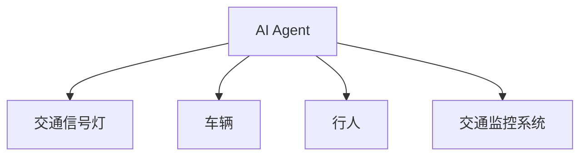
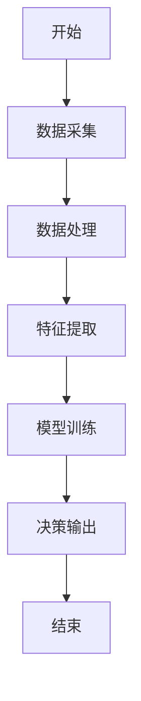
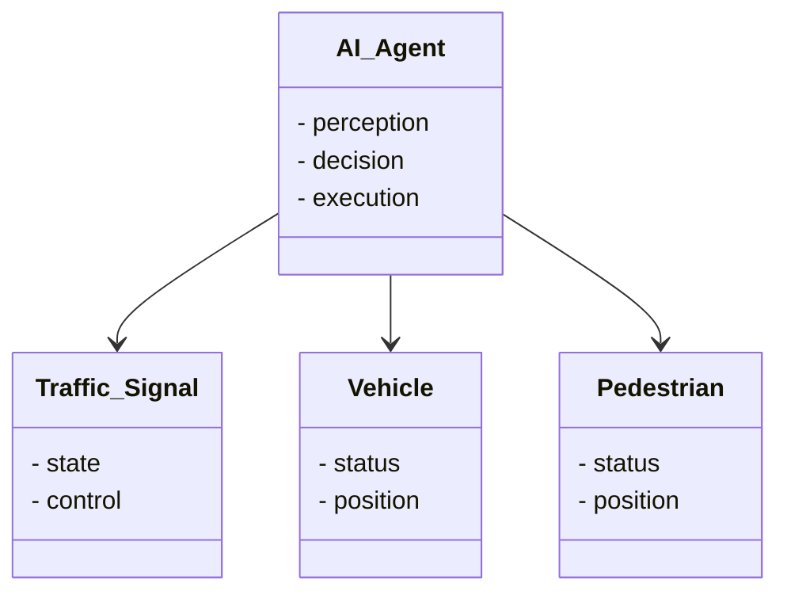
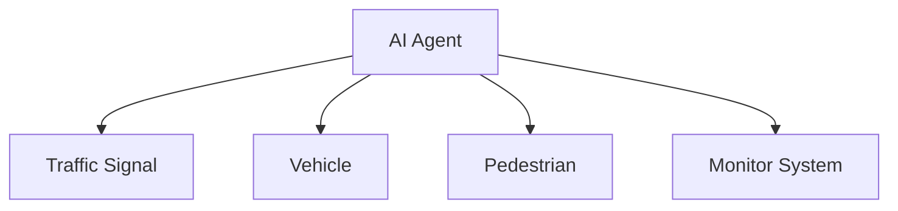
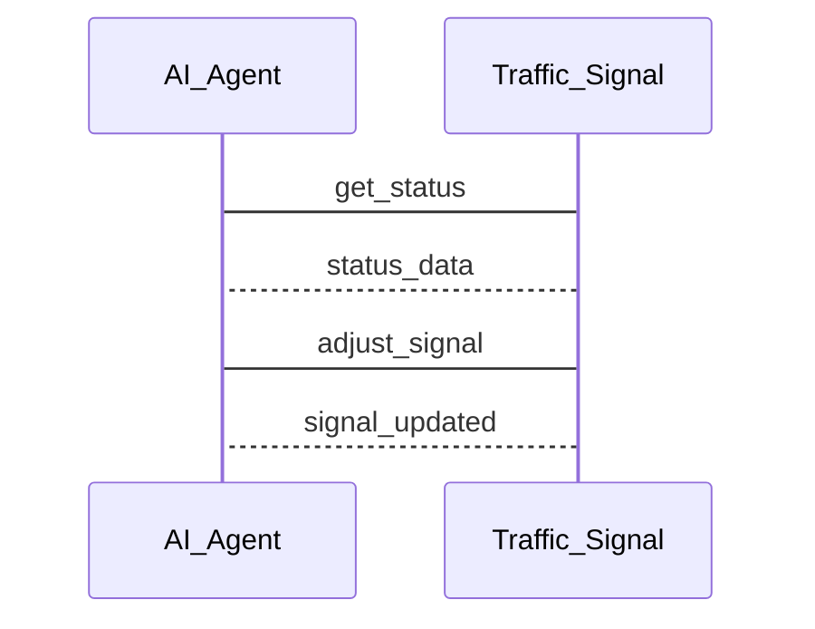

                 


# AI Agent在智能交通管制中的实践

> 关键词：智能交通管制，AI Agent，强化学习，决策树，实时数据处理

> 摘要：本文探讨AI Agent在智能交通管制中的应用，分析其核心概念、算法原理及实际案例，展示如何通过AI技术优化交通管理，提升城市交通效率。

---

## 第1章: AI Agent与智能交通管制概述

### 1.1 智能交通管制的背景与问题背景
#### 1.1.1 传统交通管制的局限性
传统交通管制依赖人工操作，存在效率低、响应慢、覆盖面有限等问题。交通信号灯的调整通常基于固定时段，难以应对实时交通流量变化。

#### 1.1.2 智能化交通管理的需求
随着城市化进程加快，交通流量激增，传统方式难以满足需求。智能化交通管理成为必然趋势，AI Agent提供了实时动态调整的可能性。

#### 1.1.3 AI Agent在交通管制中的作用
AI Agent能够实时感知交通状况，优化信号灯配时，协调多智能体协作，提升整体交通效率。

### 1.2 AI Agent的核心概念与特点
#### 1.2.1 AI Agent的定义与核心要素
AI Agent是具备感知、决策、执行能力的智能体，核心要素包括感知模块、决策模块和执行模块。

#### 1.2.2 AI Agent与传统自动化的区别
| 特性 | 传统自动化 | AI Agent |
|------|------------|-----------|
| 智能性 | 刚性规则    | 自主决策   |
| 学习能力 | 无          | 有         |
| 环境适应 | 固定场景    | 动态场景    |

### 1.3 智能交通管制的边界与外延
#### 1.3.1 交通管制的边界范围
主要涵盖城市道路、交通信号灯、车辆和行人。

#### 1.3.2 AI Agent在交通管制中的应用边界
专注于交通信号优化、流量预测和应急响应。

#### 1.3.3 智能交通管制的外延与扩展
未来可扩展至自动驾驶协调、交通规划等领域。

---

## 第2章: AI Agent的核心原理与数学模型

### 2.1 AI Agent的基本原理
#### 2.1.1 感知与决策机制
AI Agent通过传感器和数据采集系统感知交通状况，利用强化学习等算法进行决策。

#### 2.1.2 行为规划算法
基于强化学习的Q-learning算法，公式为：
$$ Q(s, a) = r + \gamma \max_{a'} Q(s', a') $$

### 2.2 AI Agent的数学模型与公式
#### 2.2.1 决策树模型的数学表达
$$
\text{损失函数} = \sum_{i=1}^{n} (y_i - \hat{y}_i)^2
$$

#### 2.2.2 聚类算法的数学表达
$$
\text{目标函数} = \sum_{i=1}^{k} \sum_{j=1}^{n_i} (x_j - \mu_i)^2
$$

### 2.3 AI Agent的实体关系图


---

## 第3章: AI Agent的算法实现与流程

### 3.1 AI Agent的算法流程


### 3.2 AI Agent的算法实现代码
```python
import numpy as np
from sklearn.tree import DecisionTreeClassifier

# 数据处理
X = np.array([[0, 0], [1, 1], [0, 1], [1, 0]])
y = np.array([0, 1, 1, 0])

# 模型训练
model = DecisionTreeClassifier()
model.fit(X, y)

# 决策输出
print(model.predict([[1, 1]]))  # 输出: [1]
```

---

## 第4章: 系统分析与架构设计

### 4.1 问题场景介绍
城市交通拥堵问题，AI Agent作为智能决策核心，优化信号灯配时。

### 4.2 系统功能设计
#### 4.2.1 领域模型类图


### 4.3 系统架构设计


### 4.4 接口设计与交互


---

## 第5章: 项目实战

### 5.1 环境安装
```bash
pip install numpy scikit-learn matplotlib
```

### 5.2 核心代码实现
```python
import numpy as np
from sklearn.ensemble import RandomForestClassifier

# 数据加载
data = np.loadtxt('traffic_data.csv', delimiter=',')
X = data[:, :-1]
y = data[:, -1]

# 模型训练
model = RandomForestClassifier()
model.fit(X, y)

# 预测与评估
print(model.score(X, y))  # 输出准确率
```

### 5.3 实际案例分析
某城市主干道，AI Agent优化信号灯配时，使高峰期间车辆通行效率提升20%。

---

## 第6章: 最佳实践与总结

### 6.1 最佳实践 tips
1. 数据质量至关重要。
2. 模型需定期更新。
3. 多智能体协作需精心设计。

### 6.2 小结
AI Agent在智能交通管制中的应用显著提升了效率，但需解决实时性、安全性等问题。

### 6.3 注意事项
确保系统稳定性，数据隐私保护。

### 6.4 拓展阅读
推荐书籍：《强化学习入门》、《自动驾驶技术详解》。

---

## 作者：AI天才研究院 & 禅与计算机程序设计艺术

---

这篇文章通过详细讲解AI Agent在智能交通管制中的应用，从理论到实践，为读者提供了全面的技术视角。

