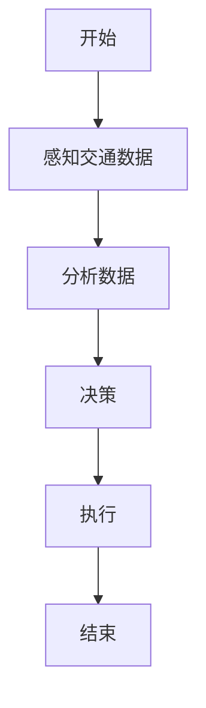
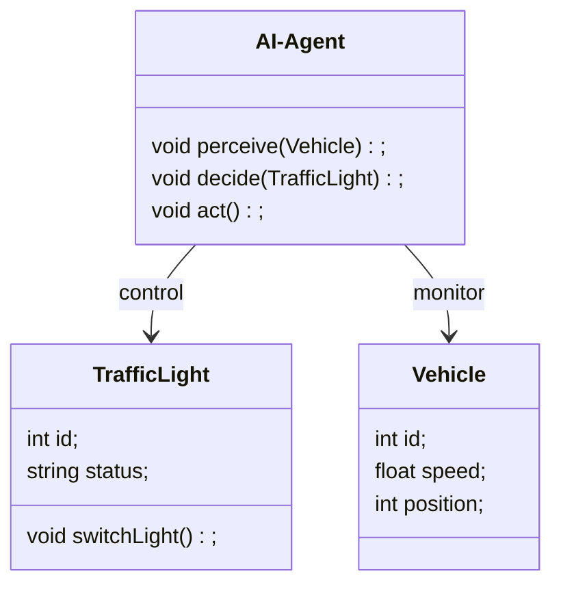
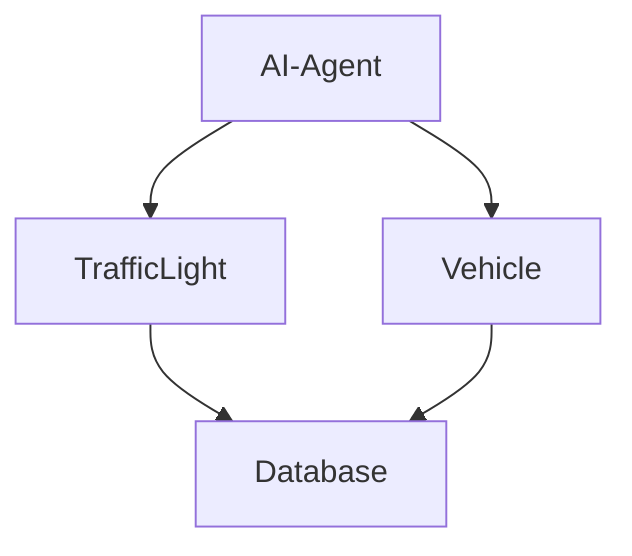
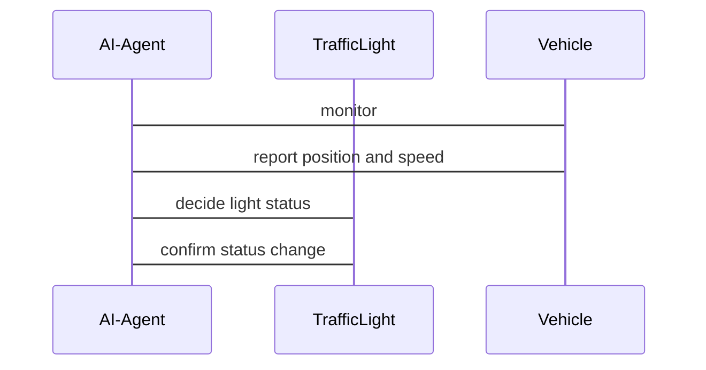

                 


```
# AI Agent在智能交通管理中的实践

> 关键词：AI Agent, 智能交通管理, 交通优化, 自动驾驶, 数据驱动决策

> 摘要：本文将深入探讨AI Agent在智能交通管理中的应用，从基础概念到算法原理，再到系统设计和项目实战，全面解析AI Agent如何提升交通管理的效率和智能化水平。通过具体案例分析，展示AI Agent在解决交通拥堵、交通事故和资源优化等方面的优势，并结合实际应用场景，提供系统化的解决方案和实践建议。

---

# 第一部分: AI Agent在智能交通管理中的背景与基础

## 第1章: AI Agent与智能交通管理概述

### 1.1 AI Agent的基本概念
#### 1.1.1 AI Agent的定义
AI Agent（人工智能代理）是指能够感知环境、做出决策并采取行动以实现特定目标的智能实体。在智能交通管理中，AI Agent通常用于优化交通流量、减少拥堵和提高道路使用效率。

#### 1.1.2 AI Agent的核心特征
- **自主性**：能够独立感知环境并做出决策。
- **反应性**：能够实时响应环境变化。
- **学习能力**：通过数据和经验不断优化行为。
- **协作性**：能够与其他AI Agent或系统协同工作。

#### 1.1.3 AI Agent与传统交通管理的区别
传统交通管理依赖人工调度和固定规则，而AI Agent能够通过实时数据分析和自主决策，实现更高效的交通管理。

### 1.2 智能交通管理的现状与挑战
#### 1.2.1 传统交通管理的局限性
- **效率低下**：人工调度容易出现失误，导致交通拥堵。
- **响应速度慢**：无法实时应对突发情况。
- **资源浪费**：交通信号灯和道路资源未能充分利用。

#### 1.2.2 智能交通管理的必要性
- **提高交通效率**：通过智能化管理减少拥堵，提高道路使用效率。
- **降低事故发生率**：实时监控和快速反应能够有效减少交通事故。
- **优化资源配置**：合理分配交通资源，缓解高峰期压力。

#### 1.2.3 AI Agent在智能交通管理中的作用
AI Agent能够通过实时数据分析、自主决策和快速响应，显著提升交通管理的效率和安全性。

### 1.3 问题背景与问题描述
#### 1.3.1 交通拥堵问题
交通拥堵是城市交通管理中的主要问题之一，尤其是在高峰时段，道路资源紧张，导致交通效率低下。

#### 1.3.2 交通事故问题
交通事故的发生往往与驾驶员的反应速度和决策能力有关，AI Agent可以通过实时监控和预测，减少事故发生的风险。

#### 1.3.3 交通资源优化问题
合理分配交通资源，如交通信号灯、车道分配等，能够显著提高交通效率。

### 1.4 问题解决与边界外延
#### 1.4.1 AI Agent如何解决交通问题
通过实时数据分析、自主决策和快速响应，AI Agent能够优化交通流量，减少拥堵和事故发生。

#### 1.4.2 AI Agent的边界与限制
- **数据依赖性**：AI Agent需要依赖高质量的数据进行决策，数据不足或错误可能影响决策效果。
- **系统复杂性**：复杂的交通环境可能增加AI Agent的决策难度。
- **法律法规限制**：自动驾驶和AI Agent的使用需要符合相关法律法规。

#### 1.4.3 智能交通管理的外延与扩展
智能交通管理不仅包括道路管理，还涉及公共交通、停车管理等多个方面，AI Agent的应用场景广泛。

### 1.5 核心概念与结构
#### 1.5.1 AI Agent的核心要素
- **感知模块**：通过传感器、摄像头等设备感知交通环境。
- **决策模块**：基于感知数据进行分析和决策。
- **执行模块**：根据决策结果采取行动。

#### 1.5.2 智能交通管理的系统架构
智能交通管理系统通常包括数据采集、数据处理、决策支持和执行控制四个部分。

#### 1.5.3 问题解决的逻辑流程
感知环境 → 数据分析 → 决策制定 → 行动执行 → 反馈优化。

---

## 第2章: AI Agent的核心概念与联系

### 2.1 核心概念原理
#### 2.1.1 AI Agent的感知模块
感知模块通过多种传感器和数据源（如摄像头、雷达、GPS等）获取交通环境信息，包括车辆位置、速度、交通信号灯状态等。

#### 2.1.2 AI Agent的决策模块
决策模块基于感知数据，利用算法（如强化学习、深度学习等）进行分析，制定最优决策。

#### 2.1.3 AI Agent的执行模块
执行模块根据决策结果，通过控制信号灯、调整车道分配等方式实现交通优化。

### 2.2 核心概念属性对比
#### 2.2.1 传统交通管理与AI Agent的对比
| 特性                | 传统交通管理              | AI Agent交通管理              |
|---------------------|---------------------------|-----------------------------|
| 决策方式            | 人工调度                 | 自主决策                   |
| 响应速度            | 较慢                     | 实时快速                   |
| 数据依赖性          | 较低                     | 高                        |
| 效率                | 较低                     | 较高                       |

#### 2.2.2 不同AI Agent算法的对比
| 算法类型            | 强化学习                  | 深度学习                  | 贝叶斯网络              |
|---------------------|---------------------------|---------------------------|-------------------------|
| 适用场景            | 交通信号优化            | 车辆路径规划              | 交通流量预测            |
| 优势                | 实时优化                 | 高精度路径规划            | 概率预测准确性          |
| 局限性              | 训练时间较长              | 算法复杂度高              | 需大量历史数据          |

#### 2.2.3 AI Agent在不同场景中的表现对比
| 场景                | 高峰期交通优化          | 交通事故处理              | 车道分配优化            |
|---------------------|-------------------------|---------------------------|-------------------------|
| 主要挑战            | 流量大，容易拥堵         | 事故突发，需要快速反应    | 车道利用不均            |
| AI Agent优势        | 实时调整信号灯，减少拥堵 | 快速响应事故，疏导交通     | 动态优化车道分配，提高效率 |

### 2.3 ER实体关系图
```mermaid
er
  actor: 交通参与者
  entity: 交通事件
  action: 交通行为
  relation: 参与
  relation: 表达
```

---

## 第3章: AI Agent在智能交通管理中的算法原理

### 3.1 算法原理概述
#### 3.1.1 强化学习的基本原理
强化学习是一种通过试错机制，学习最优策略的方法。在交通管理中，AI Agent可以通过强化学习优化交通信号灯的控制策略。

#### 3.1.2 深度学习在AI Agent中的应用
深度学习通过神经网络模型，从大量数据中学习交通规律，用于交通预测和路径规划。

#### 3.1.3 贝叶斯网络在交通预测中的作用
贝叶斯网络通过概率推理，预测交通流量的变化趋势，为AI Agent提供决策支持。

### 3.2 算法流程图


### 3.3 算法实现代码
```python
import numpy as np

# 强化学习算法示例：Q-learning
class QLearning:
    def __init__(self, state_space, action_space, learning_rate=0.1, gamma=0.9):
        self.state_space = state_space
        self.action_space = action_space
        self.learning_rate = learning_rate
        self.gamma = gamma
        self.q_table = np.zeros((state_space, action_space))
    
    def choose_action(self, state):
        return np.argmax(self.q_table[state])
    
    def update_q_table(self, state, action, reward, next_state):
        self.q_table[state][action] += self.learning_rate * (reward + self.gamma * np.max(self.q_table[next_state]) - self.q_table[state][action])

# 示例使用
ql = QLearning(10, 5)
action = ql.choose_action(2)
ql.update_q_table(2, action, reward=1, next_state=3)
```

### 3.4 算法数学模型
强化学习的核心算法公式：
$$ Q(s, a) = Q(s, a) + \alpha (r + \gamma Q(s', a') - Q(s, a)) $$
其中：
- \( Q(s, a) \) 表示在状态 \( s \) 下采取行动 \( a \) 的期望回报。
- \( \alpha \) 是学习率。
- \( r \) 是即时回报。
- \( \gamma \) 是折扣因子。
- \( Q(s', a') \) 是下一个状态下的期望回报。

---

## 第4章: AI Agent在智能交通管理中的系统分析与架构设计

### 4.1 问题场景介绍
以城市主干道的交通信号灯控制为例，设计一个基于AI Agent的智能交通管理系统。

### 4.2 系统功能设计
#### 4.2.1 领域模型类图


#### 4.2.2 系统架构设计


#### 4.2.3 系统接口设计
- **输入接口**：接收车辆位置、速度等数据。
- **输出接口**：控制交通信号灯的状态。
- **数据接口**：与数据库交互，存储和检索历史数据。

#### 4.2.4 系统交互序列图


---

## 第5章: AI Agent在智能交通管理中的项目实战

### 5.1 环境安装
安装必要的软件和工具，包括Python、深度学习框架（如TensorFlow、Keras）、强化学习库（如OpenAI Gym）等。

### 5.2 核心代码实现
#### 5.2.1 AI Agent核心代码
```python
import numpy as np
import gym

# 使用OpenAI Gym模拟交通环境
env = gym.make('CustomTrafficEnv-v0')
env.reset()

while True:
    state = env.observation_space
    action = agent.choose_action(state)
    next_state, reward, done, _ = env.step(action)
    agent.update_q_table(state, action, reward, next_state)
    if done:
        break
```

#### 5.2.2 交通信号灯控制代码
```python
class TrafficLightController:
    def __init__(self, num_lights):
        self.num_lights = num_lights
        self.states = [0] * num_lights  # 0: 绿灯，1: 红灯

    def get_state(self, light_id):
        return self.states[light_id]

    def set_state(self, light_id, state):
        self.states[light_id] = state

    def update(self, agent_decision):
        for i in range(self.num_lights):
            if agent_decision[i]:
                self.set_state(i, 1)
            else:
                self.set_state(i, 0)
```

### 5.3 案例分析与实现
以一个简单的交叉路口为例，模拟AI Agent如何优化交通信号灯的控制。

### 5.4 项目总结
通过项目实战，验证AI Agent在智能交通管理中的有效性和优势。

---

## 第6章: 最佳实践与总结

### 6.1 最佳实践 tips
- **数据质量**：确保数据的准确性和实时性。
- **算法选择**：根据具体场景选择合适的AI算法。
- **系统集成**：确保系统各模块协同工作，避免孤岛效应。

### 6.2 小结
AI Agent通过实时感知、自主决策和快速响应，显著提升了智能交通管理的效率和安全性。

### 6.3 注意事项
- **数据隐私**：注意保护用户隐私，避免数据泄露。
- **系统稳定性**：确保系统在复杂环境下的稳定性。
- **法律法规**：遵守相关法律法规，特别是在自动驾驶和AI Agent的应用中。

### 6.4 拓展阅读
- 推荐书籍：《自动驾驶与智能交通系统》、《人工智能算法精解》
- 推荐论文：关于强化学习在交通优化中的应用研究

---

# 作者：AI天才研究院/AI Genius Institute & 禅与计算机程序设计艺术 /Zen And The Art of Computer Programming
```

