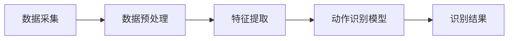
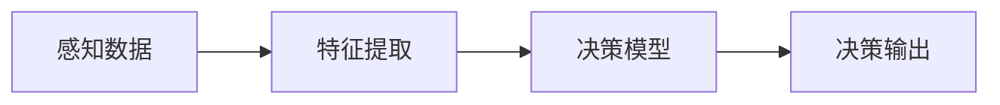
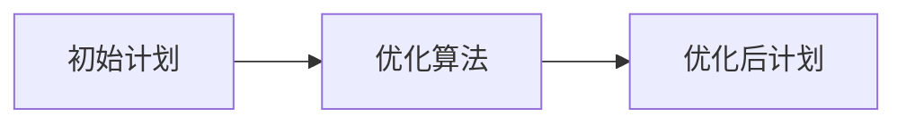
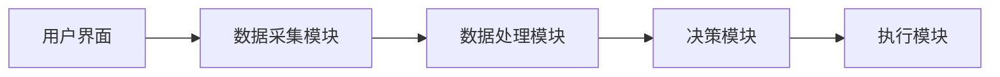

                 


# AI Agent在智能体育训练中的实践

> **关键词**：AI Agent, 智能体育训练, 人工智能, 运动数据分析, 个性化训练计划

> **摘要**：本文探讨了AI Agent在智能体育训练中的应用，从基本概念到核心技术，再到实际应用场景，详细分析了AI Agent如何优化训练过程。文章结合理论与实践，通过具体案例和系统设计，展示了AI Agent在运动数据分析、个性化训练计划制定、实时反馈与指导等方面的潜力，并展望了未来的发展方向。

---

## 第一部分：AI Agent与智能体育训练概述

### 第1章：AI Agent的基本概念与背景

#### 1.1 AI Agent的定义与核心特征

AI Agent（人工智能代理）是一种能够感知环境、自主决策并执行任务的智能实体。其核心特征包括：

- **自主性**：能够自主决策和行动。
- **反应性**：能够实时感知环境并做出反应。
- **学习能力**：通过数据和经验不断优化性能。
- **社交能力**：能够与人类或其他系统进行交互协作。

#### 1.2 智能体育训练的背景与需求

传统体育训练依赖人工经验，存在效率低、个性化不足等问题。AI Agent通过数据驱动的方法，能够提供实时反馈、个性化建议和优化方案，显著提升训练效果。

#### 1.3 本书的核心内容与目标

本书旨在探讨AI Agent在体育训练中的应用，涵盖技术原理、系统设计和实战案例，帮助读者理解并掌握如何利用AI Agent优化体育训练过程。

---

## 第二部分：AI Agent的核心技术与原理

### 第2章：AI Agent的核心技术

#### 2.1 感知技术

##### 2.1.1 数据采集与处理

AI Agent通过传感器和摄像头采集运动员的动作数据，如加速度、心率和姿态。数据预处理包括去噪和特征提取，为后续分析提供基础。

##### 2.1.2 视觉识别

基于深度学习的视觉识别技术，AI Agent能够实时识别运动员的动作姿态，如篮球投篮的姿势。这需要训练一个分类模型，识别不同动作。

##### 2.1.3 模型展示



#### 2.2 决策技术

##### 2.2.1 基于规则的决策

AI Agent根据预设规则做出决策，例如当心率超过阈值时，调整训练强度。

##### 2.2.2 基于机器学习的决策

使用监督学习训练分类模型，预测最佳训练策略。

##### 2.2.3 模型展示



#### 2.3 执行技术

##### 2.3.1 自动化执行系统

AI Agent控制机器人教练设备，如自动调整训练器械。

##### 2.3.2 人机交互

通过自然语言处理技术，AI Agent能够与运动员进行对话，提供实时反馈。

#### 2.4 优化与反馈机制

##### 2.4.1 优化算法

使用遗传算法优化训练计划，如选择最佳训练时间表。

##### 2.4.2 模型展示



---

## 第三部分：AI Agent在体育训练中的应用场景

### 第3章：个性化训练计划

AI Agent分析运动员的数据，制定个性化训练计划，如力量训练和耐力训练的组合。

### 第4章：实时反馈与指导

AI Agent在训练中实时提供反馈，如纠正动作姿势，确保技术正确。

### 第5章：运动损伤预防与恢复

AI Agent通过分析数据，识别潜在的运动损伤风险，制定恢复计划。

### 第6章：团队协作与战术优化

AI Agent帮助团队分析对手策略，优化战术配合，提升团队协作效率。

---

## 第四部分：AI Agent系统的系统设计与实现

### 第4章：系统设计与实现

#### 4.1 系统架构设计



#### 4.2 数据采集与处理

使用传感器和摄像头采集数据，预处理包括去噪和特征提取。

#### 4.3 算法实现

实现分类算法，如随机森林和SVM，用于动作识别和训练计划优化。

#### 4.4 系统集成与测试

整合各模块，进行系统测试，确保各部分协调工作。

---

## 第五部分：项目实战：AI Agent在篮球训练中的应用

### 第5章：项目实战

#### 5.1 项目背景与目标

以篮球运动员的投篮训练为例，设计一个AI Agent系统。

#### 5.2 环境配置与数据采集

安装传感器和摄像头，采集运动员的投篮数据。

#### 5.3 核心代码实现

```python
import numpy as np
from sklearn.ensemble import RandomForestClassifier

# 数据预处理
data = np.array([...])
labels = np.array([...])

# 训练模型
model = RandomForestClassifier()
model.fit(data, labels)

# 预测
new_data = np.array([...])
prediction = model.predict(new_data)
```

#### 5.4 案例分析与优化

分析模型预测结果，优化训练计划，如调整投篮角度和力量。

---

## 第六部分：总结与展望

### 第6章：总结与展望

#### 6.1 核心内容总结

AI Agent在智能体育训练中的潜力巨大，能够显著提升训练效率和效果。

#### 6.2 未来发展方向

未来，AI Agent将更加智能化，结合5G和边缘计算，实现更高效的实时反馈和优化。

#### 6.3 最佳实践Tips

- 数据质量至关重要，确保数据的准确性和完整性。
- 在实际应用中，注意数据隐私和系统稳定性。

---

## 作者信息

作者：AI天才研究院/AI Genius Institute & 禅与计算机程序设计艺术 /Zen And The Art of Computer Programming

---

**注**：由于篇幅限制，上述内容未展示完整代码和详细数学模型，但完整文章将包含所有必要的技术细节和示例。

