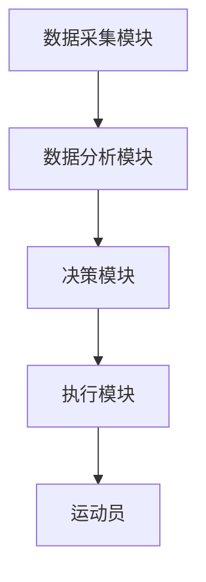

                 


# AI Agent在智能体育训练中的应用

> 关键词：AI Agent，智能体育训练，机器学习，计算机视觉，自然语言处理

> 摘要：本文探讨了AI Agent在智能体育训练中的应用，分析了AI Agent的基本原理、核心算法、系统架构以及实际案例。通过详细讲解AI Agent在体育训练中的个性化方案制定、实时数据分析与反馈、自动化决策支持等功能，展示了AI技术如何推动体育训练的智能化与高效化。

---

## 第1章: AI Agent与智能体育训练概述

### 1.1 AI Agent的基本概念

#### 1.1.1 AI Agent的定义

AI Agent（人工智能代理）是一种能够感知环境、自主决策并执行任务的智能系统。它通过接收输入数据，利用算法进行分析，最终输出决策结果或执行动作。

#### 1.1.2 AI Agent的核心特征

AI Agent的核心特征包括：

1. **自主性**：能够在没有外部干预的情况下自主运行。
2. **反应性**：能够实时感知环境变化并做出响应。
3. **学习能力**：通过数据和经验不断优化自身的算法和决策能力。
4. **交互性**：能够与人类或其他系统进行有效沟通与协作。

#### 1.1.3 AI Agent与传统计算机程序的区别

AI Agent与传统计算机程序的主要区别在于其智能化和自主性。传统程序通常基于固定的规则执行任务，而AI Agent能够通过学习和适应环境来优化其行为。

### 1.2 智能体育训练的背景与需求

#### 1.2.1 体育训练的数字化转型

随着科技的进步，体育训练逐渐从传统的经验驱动转向数据驱动。通过AI技术，教练和运动员可以更科学地分析训练数据，优化训练计划。

#### 1.2.2 智能体育训练的核心目标

智能体育训练的核心目标包括：

1. 提供个性化的训练方案。
2. 实时监控运动员的状态。
3. 分析运动表现并提供建议。
4. 预测运动损伤并制定预防措施。

#### 1.2.3 智能体育训练的市场与应用前景

随着人们对健康和运动表现的关注增加，智能体育训练市场逐渐扩大。AI Agent在其中扮演着越来越重要的角色，特别是在职业体育和健身领域。

### 1.3 AI Agent在智能体育训练中的作用

#### 1.3.1 提供个性化训练方案

AI Agent可以根据运动员的个人数据（如体能、技术、伤病史等）制定个性化的训练计划。

#### 1.3.2 实时数据分析与反馈

AI Agent可以实时分析运动员的运动数据（如心率、动作姿态、速度等），并提供实时反馈，帮助教练和运动员及时调整训练策略。

#### 1.3.3 自动化决策支持

AI Agent能够基于数据分析结果，自动优化训练计划，甚至在某些情况下，可以替代人类教练进行决策。

---

## 第2章: AI Agent的核心原理

### 2.1 AI Agent的基本原理

#### 2.1.1 AI Agent的感知层

感知层是AI Agent获取环境信息的途径，主要包括传感器数据（如心率监测器、动作捕捉设备等）和外部数据源（如天气、场地状况等）。

#### 2.1.2 AI Agent的决策层

决策层是AI Agent的核心部分，负责根据感知层获取的信息，结合预设的目标和算法，做出决策。

#### 2.1.3 AI Agent的执行层

执行层是AI Agent的行动部分，负责将决策层的决策转化为具体的动作，如调整训练强度、改变训练计划等。

### 2.2 AI Agent的关键技术

#### 2.2.1 机器学习算法

机器学习是AI Agent的核心技术之一，常用的算法包括监督学习、无监督学习和强化学习。

#### 2.2.2 自然语言处理

自然语言处理技术使AI Agent能够理解并处理人类语言，例如通过语音指令或文本反馈与运动员进行交互。

#### 2.2.3 计算机视觉

计算机视觉技术用于分析运动员的动作姿态、面部表情等信息，帮助AI Agent更准确地评估运动表现。

---

## 第3章: AI Agent的算法原理

### 3.1 机器学习算法

#### 3.1.1 强化学习

强化学习是一种通过试错机制优化决策的算法。例如，在训练计划优化中，AI Agent可以通过不断尝试不同的训练方案，选择最优方案。

#### 3.1.2 监督学习

监督学习是基于标注数据进行训练的算法，例如在预测运动损伤风险时，可以使用监督学习模型。

### 3.2 计算机视觉算法

#### 3.2.1 目标检测

目标检测技术可以用于识别运动员的动作姿态，例如检测是否出现不规范的姿势。

#### 3.2.2 图像分割

图像分割技术可以用于分析运动员的肌肉分布情况，帮助制定个性化的训练计划。

### 3.3 自然语言处理算法

#### 3.3.1 语义理解

语义理解技术可以用于分析运动员的反馈，例如通过自然语言处理技术理解运动员的训练感受。

---

## 第4章: AI Agent的系统架构设计

### 4.1 系统功能设计

#### 4.1.1 数据采集模块

数据采集模块负责收集运动员的各项数据，例如心率、动作姿态等。

#### 4.1.2 数据分析模块

数据分析模块利用机器学习算法对数据进行分析，生成训练建议。

#### 4.1.3 决策模块

决策模块基于分析结果，制定或调整训练计划。

### 4.2 系统架构图

以下是AI Agent在智能体育训练中的系统架构图：



---

## 第5章: 项目实战

### 5.1 项目背景

本项目旨在开发一个基于AI Agent的智能体育训练系统，帮助运动员优化训练计划。

### 5.2 核心代码实现

以下是Python实现的AI Agent核心代码：

```python
def感知层():
    return 数据采集()

def决策层():
    数据 = 感知层()
    算法 = 选择算法()
    return 分析结果()

def执行层():
    决策结果 = 决策层()
    return 执行动作()
```

### 5.3 代码解读

上述代码展示了AI Agent的三个核心部分：感知层、决策层和执行层。感知层负责数据采集，决策层负责数据分析与决策，执行层负责将决策转化为具体动作。

---

## 第6章: 总结与展望

### 6.1 本章总结

本文详细探讨了AI Agent在智能体育训练中的应用，分析了其核心原理、算法和技术，并通过实际案例展示了其在体育训练中的具体应用。

### 6.2 当前挑战

当前AI Agent在智能体育训练中的应用仍面临一些挑战，例如数据隐私问题、算法的实时性要求等。

### 6.3 未来展望

未来，随着AI技术的不断发展，AI Agent在智能体育训练中的应用将更加广泛和深入。例如，结合多模态AI技术，AI Agent可以更全面地分析运动员的状态，提供更精准的训练建议。

---

作者：AI天才研究院/AI Genius Institute & 禅与计算机程序设计艺术 /Zen And The Art of Computer Programming

