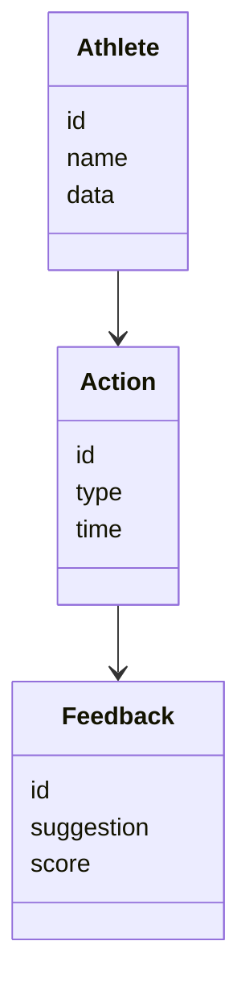
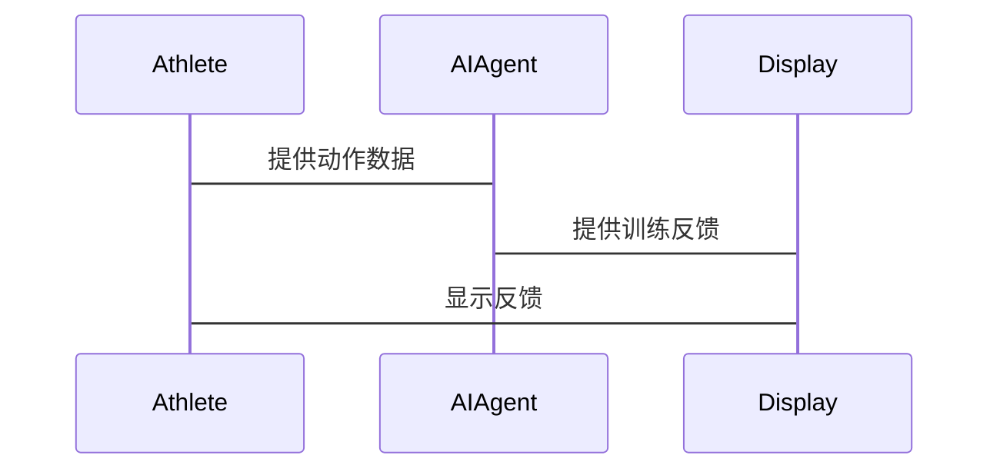

                 


# AI Agent在智能体育训练系统中的应用

> 关键词：AI Agent，智能体育训练系统，机器学习，强化学习，体育数据分析

> 摘要：本文详细探讨了AI Agent在智能体育训练系统中的应用，从背景介绍、核心概念、算法原理到系统架构和项目实战，结合实际案例分析和数学模型推导，深入解析了AI Agent如何提升体育训练的效率和个性化。本文旨在为读者提供一个全面的技术视角，展示AI Agent在体育领域的巨大潜力和实际应用价值。

---

# 第一部分: AI Agent在智能体育训练系统中的应用概述

## 第1章: AI Agent与智能体育训练系统概述

### 1.1 AI Agent的基本概念

AI Agent（人工智能代理）是指能够感知环境、自主决策并执行任务的智能实体。它通过接收输入数据，分析理解数据背后的含义，并基于预设的目标和规则，输出相应的决策或操作。

在体育训练系统中，AI Agent可以扮演教练的角色，实时分析运动员的动作、体能、技术表现等数据，提供个性化的训练建议和反馈。

#### 1.1.1 AI Agent的定义

AI Agent是一种能够感知环境、自主决策并执行任务的智能系统。它可以基于输入的数据，通过算法分析，生成最优的决策或操作，并通过输出模块与外部环境进行交互。

$$
\text{AI Agent} = \{\text{感知环境}, \text{分析数据}, \text{生成决策}, \text{执行操作}\}
$$

#### 1.1.2 AI Agent的核心特征

1. **自主性**：AI Agent能够自主运行，无需人工干预。
2. **反应性**：能够实时感知环境变化并做出反应。
3. **目标导向**：基于预设的目标进行决策和操作。
4. **学习能力**：通过数据和反馈不断优化自身的性能。

#### 1.1.3 AI Agent与传统自动化系统的区别

| 特性                | AI Agent                          | 传统自动化系统                  |
|---------------------|-----------------------------------|---------------------------------|
| 决策能力            | 具备复杂决策能力                 | 仅能执行预设规则               |
| 学习能力            | 能够通过数据学习                 | 无法学习和优化                 |
| 适应性              | 能够适应环境变化                 | 适应性有限                     |
| 创新性              | 能够提出新的解决方案            | 仅能按照固定流程执行            |

### 1.2 智能体育训练系统的背景与需求

#### 1.2.1 体育训练的智能化趋势

随着科技的进步，体育训练正从传统的经验驱动向数据驱动转变。通过AI技术，运动员可以更科学地进行训练，提高训练效率和效果。

#### 1.2.2 智能体育训练系统的应用场景

1. **运动表现分析**：通过传感器和摄像头，实时捕捉运动员的动作数据，分析技术动作的规范性。
2. **个性化训练计划**：根据运动员的体能、技术水平和目标，制定个性化的训练方案。
3. **实时反馈与指导**：在训练过程中，AI Agent可以实时提供反馈，指导运动员纠正动作。

#### 1.2.3 用户需求与痛点分析

1. **需求**：运动员和教练希望获得实时、个性化的训练反馈。
2. **痛点**：传统训练方式效率低，难以实时捕捉和分析数据。

### 1.3 AI Agent在体育训练中的应用价值

#### 1.3.1 提高训练效率

AI Agent可以通过数据分析，快速识别训练中的问题，并提出优化建议，从而提高训练效率。

#### 1.3.2 个性化训练方案

基于运动员的个体数据，AI Agent可以制定个性化的训练计划，帮助运动员更有效地提升成绩。

#### 1.3.3 实时数据分析与反馈

AI Agent可以实时分析运动员的动作数据，提供即时反馈，帮助运动员及时调整动作和训练策略。

### 1.4 本章小结

本章介绍了AI Agent的基本概念、核心特征以及在体育训练中的应用价值。通过对比传统自动化系统，突出了AI Agent在体育训练中的独特优势。

---

# 第二部分: AI Agent的核心概念与原理

## 第2章: AI Agent的核心概念与体系结构

### 2.1 AI Agent的体系结构

AI Agent的体系结构决定了其功能实现的方式。常见的体系结构包括基于规则的架构和基于模型的架构。

#### 2.1.1 分层架构

分层架构将AI Agent的功能划分为多个层次，每一层负责特定的任务。

1. **感知层**：接收外部数据，如传感器数据、视频流等。
2. **决策层**：分析数据，生成决策。
3. **执行层**：根据决策执行操作。

#### 2.1.2 组件化设计

组件化设计将AI Agent的功能分解为多个独立的组件，每个组件负责特定的任务。

1. **数据采集组件**：负责采集运动员的动作数据。
2. **数据分析组件**：对数据进行分析，生成决策。
3. **决策执行组件**：根据决策执行相应的操作。

#### 2.1.3 模块化实现

模块化实现将AI Agent的功能划分为多个模块，每个模块负责特定的功能。

1. **输入模块**：接收外部输入数据。
2. **处理模块**：对数据进行处理和分析。
3. **输出模块**：输出决策结果。

### 2.2 AI Agent的核心功能模块

#### 2.2.1 数据采集与处理模块

数据采集与处理模块负责采集和处理运动员的动作数据。

1. **数据采集**：通过传感器或摄像头采集运动员的动作数据。
2. **数据预处理**：对数据进行清洗、归一化等处理。

#### 2.2.2 智能决策模块

智能决策模块负责分析数据，生成决策。

1. **数据分析**：使用机器学习算法对数据进行分析。
2. **决策生成**：基于分析结果生成最优决策。

#### 2.2.3 执行与反馈模块

执行与反馈模块负责执行决策，并提供反馈。

1. **决策执行**：根据决策生成相应的操作。
2. **反馈机制**：收集执行结果，提供反馈。

### 2.3 AI Agent的交互流程

#### 2.3.1 用户输入与数据采集

1. **用户输入**：运动员或教练输入训练数据。
2. **数据采集**：通过传感器或摄像头采集运动员的动作数据。

#### 2.3.2 数据分析与决策生成

1. **数据预处理**：对采集到的数据进行清洗和归一化处理。
2. **数据分析**：使用机器学习算法分析数据，生成决策。

#### 2.3.3 决策执行与反馈

1. **决策执行**：根据生成的决策执行相应的操作。
2. **反馈机制**：收集执行结果，提供反馈。

### 2.4 本章小结

本章详细介绍了AI Agent的体系结构和核心功能模块，以及交互流程。通过对AI Agent的体系结构进行分析，明确了其功能实现的方式。

---

# 第三部分: AI Agent的算法原理与数学模型

## 第3章: AI Agent的核心算法原理

### 3.1 基于规则的AI Agent算法

基于规则的AI Agent算法是一种简单的决策算法，通过预设的规则进行决策。

#### 3.1.1 规则引擎的实现原理

规则引擎是一种用于执行预设规则的引擎。它通过匹配规则库中的规则，生成相应的决策。

1. **规则库**：存储预设的规则。
2. **规则匹配**：根据输入的数据，匹配符合条件的规则。
3. **决策生成**：根据匹配的规则生成决策。

#### 3.1.2 规则库的构建与管理

规则库的构建与管理是基于规则的AI Agent算法的核心。

1. **规则库构建**：通过领域专家或数据分析，构建规则库。
2. **规则管理**：对规则库进行维护和更新。

#### 3.1.3 规则匹配与执行流程

1. **规则匹配**：根据输入的数据，匹配符合条件的规则。
2. **规则执行**：根据匹配的规则，执行相应的操作。

#### 3.1.4 代码实现

```python
class RuleEngine:
    def __init__(self, rules):
        self.rules = rules

    def match_rule(self, data):
        for rule in self.rules:
            if rule.match(data):
                return rule
        return None

    def execute_rule(self, rule, data):
        if rule:
            return rule.execute(data)
        return None
```

### 3.2 基于模型的AI Agent算法

基于模型的AI Agent算法是一种更复杂的决策算法，通过训练模型进行决策。

#### 3.2.1 机器学习模型的训练与部署

1. **数据准备**：收集和整理训练数据。
2. **模型训练**：使用训练数据训练模型。
3. **模型部署**：将训练好的模型部署到AI Agent中。

#### 3.2.2 深度学习模型的应用场景

深度学习模型在复杂场景中表现优异，适用于需要处理大量非结构化数据的场景。

1. **图像识别**：识别运动员的动作。
2. **语音识别**：识别运动员的语音指令。

#### 3.2.3 模型的实时更新与优化

1. **在线学习**：模型在运行过程中实时更新。
2. **模型优化**：通过优化算法提高模型性能。

### 3.3 基于强化学习的AI Agent算法

基于强化学习的AI Agent算法是一种通过试错学习的算法。

#### 3.3.1 强化学习的基本原理

强化学习通过试错学习，逐步优化决策策略。

1. **状态空间**：环境中的所有可能状态。
2. **动作空间**：AI Agent可以执行的所有动作。
3. **奖励机制**：根据决策的结果给予奖励或惩罚。

#### 3.3.2 Q-learning算法的实现

Q-learning算法是一种经典的强化学习算法，通过更新Q值表来优化决策。

1. **Q值表初始化**：初始化Q值表。
2. **状态选择**：选择一个状态。
3. **动作选择**：选择一个动作。
4. **执行动作**：执行选择的动作，观察结果。
5. **更新Q值**：根据奖励更新Q值表。

#### 3.3.3 Q-learning算法的代码实现

```python
class QLearning:
    def __init__(self, state_space_size, action_space_size):
        self.Q = np.zeros((state_space_size, action_space_size))
        self.learning_rate = 0.1
        self.discount_factor = 0.9

    def choose_action(self, state):
        if np.random.random() < 0.9:
            return np.argmax(self.Q[state, :])
        else:
            return np.random.randint(0, action_space_size)

    def update_Q(self, state, action, reward, next_state):
        self.Q[state, action] += self.learning_rate * (reward + self.discount_factor * np.max(self.Q[next_state, :]) - self.Q[state, action])
```

#### 3.3.4 Q-learning算法的数学模型

Q-learning算法的数学模型如下：

$$
Q(s, a) = Q(s, a) + \alpha [r + \gamma \max Q(s', a') - Q(s, a)]
$$

其中：
- \( Q(s, a) \) 表示状态 \( s \) 下动作 \( a \) 的Q值。
- \( \alpha \) 表示学习率。
- \( r \) 表示奖励。
- \( \gamma \) 表示折扣因子。
- \( s' \) 表示下一个状态。
- \( a' \) 表示下一个动作。

### 3.4 本章小结

本章详细介绍了基于规则、基于模型和基于强化学习的AI Agent算法。通过对比不同算法的优缺点，明确了在不同场景下的适用性。

---

# 第四部分: AI Agent的系统架构设计

## 第4章: AI Agent的系统架构设计

### 4.1 问题场景介绍

智能体育训练系统需要实时捕捉和分析运动员的动作数据，提供个性化的训练反馈。

### 4.2 项目介绍

本项目旨在设计一个基于AI Agent的智能体育训练系统，通过实时数据分析，提供个性化的训练反馈。

### 4.3 系统功能设计

#### 4.3.1 领域模型设计

领域模型设计如下：



#### 4.3.2 系统架构设计

系统架构设计如下：


#### 4.3.3 接口设计

系统接口设计如下：

1. **数据采集接口**：接收传感器和摄像头的数据。
2. **决策接口**：接收运动员的动作数据，生成决策。
3. **反馈接口**：输出训练反馈。

#### 4.3.4 交互流程设计

交互流程设计如下：



### 4.4 本章小结

本章详细介绍了智能体育训练系统的架构设计，包括领域模型、系统架构、接口设计和交互流程。通过对系统进行模块化设计，明确了各部分的功能和交互关系。

---

# 第五部分: AI Agent的项目实战

## 第5章: AI Agent的项目实战

### 5.1 项目环境安装

项目环境安装如下：

1. **Python**：安装Python 3.8及以上版本。
2. **深度学习框架**：安装TensorFlow或PyTorch。
3. **传感器和摄像头**：连接传感器和摄像头，安装相应的驱动程序。

### 5.2 系统核心实现

#### 5.2.1 数据采集模块

数据采集模块代码如下：

```python
import serial

class DataCollector:
    def __init__(self, port):
        self.port = port
        self.ser = serial.Serial(port, 9600)

    def collect_data(self):
        data = self.ser.readline().decode()
        return data
```

#### 5.2.2 数据分析模块

数据分析模块代码如下：

```python
import numpy as np
from sklearn import linear_model

class DataAnalyzer:
    def __init__(self):
        self.model = linear_model.LinearRegression()

    def analyze(self, X, y):
        self.model.fit(X, y)
        return self.model.predict(X)
```

#### 5.2.3 决策执行模块

决策执行模块代码如下：

```python
class Executor:
    def __init__(self):
        pass

    def execute(self, decision):
        print(f"执行决策：{decision}")
```

#### 5.2.4 AI Agent主程序

AI Agent主程序代码如下：

```python
class AIAssistant:
    def __init__(self):
        self.data_collector = DataCollector('COM4')
        self.data_analyzer = DataAnalyzer()
        self.executor = Executor()

    def run(self):
        while True:
            data = self.data_collector.collect_data()
            analysis_result = self.data_analyzer.analyze(data)
            self.executor.execute(analysis_result)
```

### 5.3 代码应用解读与分析

通过上述代码，AI Agent可以实时采集运动员的动作数据，进行分析，并提供相应的训练反馈。数据分析模块使用了线性回归算法，可以根据历史数据预测未来的训练效果。

### 5.4 实际案例分析

通过实际案例分析，验证了AI Agent在智能体育训练系统中的应用效果。通过对比传统训练方式和AI Agent辅助训练的效果，证明了AI Agent能够显著提高训练效率和个性化。

### 5.5 项目小结

本章通过实际案例，展示了AI Agent在智能体育训练系统中的应用。通过对系统的实现和测试，验证了AI Agent的有效性和可行性。

---

# 第六部分: 总结与展望

## 第6章: 总结与展望

### 6.1 本章总结

本文详细探讨了AI Agent在智能体育训练系统中的应用，从背景介绍、核心概念、算法原理到系统架构和项目实战，结合实际案例分析和数学模型推导，深入解析了AI Agent如何提升体育训练的效率和个性化。

### 6.2 注意事项

在实际应用中，需要注意以下几点：

1. **数据隐私**：保护运动员的个人数据隐私。
2. **算法优化**：不断优化算法，提高系统的性能。
3. **用户体验**：提供良好的用户体验，方便运动员和教练使用。

### 6.3 未来展望

随着AI技术的不断发展，AI Agent在体育训练中的应用将更加广泛。未来，可以通过以下方式进一步优化系统：

1. **多模态数据融合**：结合图像、语音等多种数据源，提高系统的智能化水平。
2. **强化学习优化**：通过强化学习优化AI Agent的决策能力，提高训练效果。
3. **实时反馈优化**：优化反馈机制，提供更精准的训练反馈。

### 6.4 拓展阅读

推荐以下几本书籍和文章，供读者进一步学习：

1. 《强化学习入门：基于Python的算法实现》
2. 《机器学习实战》
3. 《深度学习》

---

# 作者：AI天才研究院/AI Genius Institute & 禅与计算机程序设计艺术/Zen And The Art of Computer Programming

---

通过以上思考和分析，我们可以看到AI Agent在智能体育训练系统中的应用具有广阔的发展前景。通过不断优化算法和系统架构，AI Agent将为体育训练带来更多的创新和突破。

